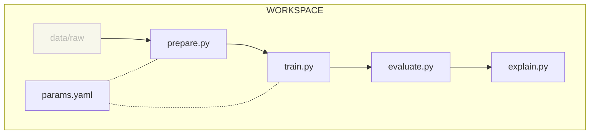

# Explain

## Chapter 2



| **File**                | **Description**                                   | **Input**                                       | **Output**                                                      |
| ----------------------- | ------------------------------------------------- | ----------------------------------------------- | --------------------------------------------------------------- |
| `src/explain.py`        | Explain the ML model                              | The model to explain                            | The results of the model explanation in `explanation` directory |

#### Move the explain step to its own file

The `src/explain.py` script will explain the ML model using GRAD-CAM.

```py title="src/explain.py"
import sys
from pathlib import Path

import matplotlib.pyplot as plt
import numpy as np
import tensorflow as tf


def make_gradcam_heatmap(img: np.ndarray, grad_model: tf.keras.Model) -> np.ndarray:
    """
    Generate Grad-CAM heatmap from image

    Learn more about Grad-CAM here: https://keras.io/examples/vision/grad_cam/
    """
    # Resize and convert the image
    img = np.expand_dims(img, axis=0)
    input_w = grad_model.input_shape[1]
    input_h = grad_model.input_shape[2]
    img = tf.image.resize(img, (input_w, input_h))
    grayscale = grad_model.input_shape[3] == 1
    if grayscale:
        img = tf.image.rgb_to_grayscale(img)

    with tf.GradientTape() as tape:
        last_conv_layer_output, preds = grad_model(img)
        pred_index = tf.argmax(preds[0])
        class_channel = preds[:, pred_index]

    grads = tape.gradient(class_channel, last_conv_layer_output)

    pooled_grads = tf.reduce_mean(grads, axis=(0, 1, 2))

    last_conv_layer_output = last_conv_layer_output[0]
    heatmap = last_conv_layer_output @ pooled_grads[..., tf.newaxis]
    heatmap = tf.squeeze(heatmap)

    heatmap = tf.maximum(heatmap, 0) / tf.math.reduce_max(heatmap)
    return heatmap.numpy()


def get_gradcam_plot(model: tf.keras.Model, data_folder: Path) -> plt.Figure:
    """Plot the Grad-CAM heatmap"""
    last_conv_layer = list(filter(lambda x: "conv" in x.name, model.layers))[-1]
    grad_model = tf.keras.models.Model(
        model.inputs, [last_conv_layer.output, model.output]
    )

    classes = sorted(filter(lambda p: p.is_dir(), data_folder.glob("*")))

    fig = plt.figure(figsize=(11, 16), tight_layout=True)
    for i, class_path in enumerate(classes):
        img_path = list(sorted(class_path.glob("*")))[0]
        img_fn = img_path.name
        img = tf.keras.preprocessing.image.load_img(img_path)
        img = tf.keras.preprocessing.image.img_to_array(img)

        heatmap = make_gradcam_heatmap(img, grad_model)
        heatmap = np.uint8(255 * heatmap)

        # Create an image with RGB colorized heatmap
        jet = plt.get_cmap("jet")
        jet_colors = jet(np.arange(256))[:, :3]
        jet_heatmap = jet_colors[heatmap]

        jet_heatmap = tf.keras.utils.array_to_img(jet_heatmap)
        jet_heatmap = jet_heatmap.resize((img.shape[1], img.shape[0]))
        jet_heatmap = tf.keras.utils.img_to_array(jet_heatmap)

        plt.subplot(6, 4, i * 2 + 1)
        plt.imshow(img / 255)
        plt.axis("off")
        plt.title(img_fn)

        plt.subplot(6, 4, i * 2 + 2)
        plt.imshow(jet_heatmap / 255)
        plt.axis("off")
        plt.title(img_fn + " (Grad-CAM)")

    return fig


def main() -> None:
    if len(sys.argv) != 3:
        print("Arguments error. Usage:\n")
        print("\tpython3 evaluate.py <model-folder> <raw-dataset-folder>\n")
        exit(1)

    model_folder = Path(sys.argv[1])
    raw_dataset_folder = Path(sys.argv[2])
    evaluation_folder = Path("evaluation")
    plots_folder = Path("plots")

    # Load model
    model = tf.keras.models.load_model(model_folder)

    # Create folders
    (evaluation_folder / plots_folder).mkdir(parents=True, exist_ok=True)

    # Save Grad-CAM plot
    fig = get_gradcam_plot(model, raw_dataset_folder)
    fig.savefig(evaluation_folder / plots_folder / "grad_cam.png")

    print(f"\nExplain files saved at {evaluation_folder.absolute()}")


if __name__ == "__main__":
    main()
```

```sh title="Execute the following command(s) in a terminal"
# Prepare the dataset
python3 src/prepare.py data/raw data/prepared

# Train the model with the train dataset and save it
python3 src/train.py data/prepared model

# Evaluate the model performances
python3 src/evaluate.py model data/prepared

# Explain the model
python3 src/explain.py model data/raw
```

Here, the following should be noted:

- the `explain.py` script generated a GRAD-CAM heatmap to explain the model

## Chapter 4

#### `explain` stage

Run the following command to create a new stage called _explain_ that performs an explanation through GRAD-CAM.

```sh title="Execute the following command(s) in a terminal"
dvc stage add -n explain \
-d src/explain.py -d model -d data/raw \
-o explanation/plots/metrics \
--plots explanation/plots/grad_cam.png \
python src/explain.py model data/raw
```

This stage has the `src/explain.py` file, `model` and `data/raw` directory
as dependencies.
If any of these files change, DVC will run the command
`python src/explain.py model data/raw`
when using `dvc repro`.

The outputs of this command are stored in the `evaluation/plots/metrics/plots/grad_cam.png` file.

Explore the `dvc.yaml` file to understand how the pipeline is updated.
