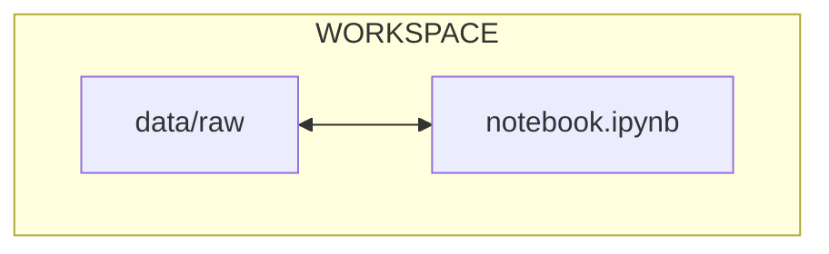

# Chapter 1.1 - Run a simple ML experiment with Jupyter Notebook

## Introduction

As a recent addition to the ML team, your objective is to contribute to the
development of a model capable of **visually identifying planets or moons**
within our solar system from images.

The data scientists of your team have been actively collaborating on a Jupyter
Notebook, which they have readily shared with you. The dataset they have
gathered comprises approximately 1,650 images capturing 11 distinct planets and
moons. Each celestial body is represented by around 150 images, each taken from
a unique angle.

The training process is as follows:

- Preprocess the dataset
- Split the dataset into training and validation sets
- Train a model to classify the celestial bodies images using the training set
- Evaluate the model's performance using metrics, training history, predictions
  preview and a confusion matrix.

Your primary objective is to enhance the team's workflow by implementing MLOps
tools, documenting the procedures, tracking changes, and ensuring the model is
accessible to others.

In this chapter, you will learn how to:

1. Set up the project directory
2. Acquire the notebook
3. Obtain the dataset
4. Create a [:simple-python: Python](../tools.md) environment to run the
   experiment
5. Launch the experiment locally for the first time

The following diagram illustrates the control flow of the experiment at the end
of this chapter:



Let's get started!

## Steps

### Set up the project directory

As a new team member, set up a project directory on your computer for this
_ground breaking_ ML experiment. This directory will serve as your working
directory for this first chapter:

```sh title="Execute the following command(s) in a terminal"
# Create the working directory
mkdir mlops-guide-jupyter-notebook

# Switch to the working directory
cd mlops-guide-jupyter-notebook
```

### Download the notebook

Your colleague provided you the following URL to download an archive containing
the Jupyter Notebook for this machine learning experiment:

```sh title="Execute the following command(s) in a terminal"
# Download the archive containing the Jupyter Notebook
curl -L -o jupyter-notebook.zip https://github.com/swiss-ai-center/a-guide-to-mlops/archive/refs/heads/jupyter-notebook.zip
```

Unzip the Jupyter Notebook into your working directory:

```sh title="Execute the following command(s) in a terminal"
# Extract the Jupyter Notebook
unzip jupyter-notebook.zip

# Move the subdirectory files to the working directory
mv a-guide-to-mlops-jupyter-notebook/* .

# Remove the archive and the directory
rm -r jupyter-notebook.zip a-guide-to-mlops-jupyter-notebook
```

### Download and set up the dataset

Your colleague provided you the following URL to download an archive containing
the dataset for this machine learning experiment:

```sh title="Execute the following command(s) in a terminal"
# Download the archive containing the dataset
curl -L -o data.zip https://github.com/swiss-ai-center/a-guide-to-mlops/archive/refs/heads/data.zip
```

This archive must be decompressed and its contents be moved in the `data`
directory in the working directory of the experiment:

```sh title="Execute the following command(s) in a terminal"
# Extract the dataset
unzip data.zip

# Move the `data.xml` file to the working directory
mv a-guide-to-mlops-data/ data/

# Remove the archive and the directory
rm data.zip
```

### Explore the notebook and dataset

Examine the notebook and the dataset to get a better understanding of their
contents.

Your working directory should now look like this:

```yaml hl_lines="2-5"
.
├── data # (1)!
│   ├── raw # (2)!
│   │   └── ...
│   └── README.md
├── README.md
├── notebook.ipynb
└── requirements.txt
```

1. This, and all its sub-directory, is new.
2. The `raw` directory include the unprocessed dataset images.

### Create the virtual environment

Create the virtual environment and install necessary dependencies in your
working directory:

??? tip "Not familiar with virtual environments? Read this!"

    **What are virtual environments?**

    Python **virtual environments** are essential tools for managing dependencies
    and isolating project environments. They allow developers to create separate,
    self-contained environments for different projects, ensuring that each project
    has its own set of dependencies **without interfering** with one another.

    This is particularly important when working on multiple projects with different
    versions of libraries or packages.

    **How do virtual environments work?**

    Virtual environments work by creating a local directory that contains a Python
    interpreter and a copy of the desired Python packages. When activated, the
    virtual environment modifies the system's PATH variable to prioritize the
    interpreter and packages within the local directory.

    This ensures that when running Python commands, the system uses the specific
    interpreter and packages from the virtual environment, effectively isolating the
    project from the global Python installation for clean project separation and by
    extension stability and reproducibility.

=== ":simple-python: Using pip"

    ```sh title="Execute the following command(s) in a terminal"
    # Create the virtual environment
    python3.13 -m venv .venv

    # Activate the virtual environment
    source .venv/bin/activate

    # Install the dependencies
    pip install -r requirements.txt

    # Install the CPU-only version of PyTorch
    pip install torch torchvision \
        --index-url https://download.pytorch.org/whl/cpu
    ```

=== ":simple-uv: Using uv"

    ```sh title="Execute the following command(s) in a terminal"
    # Create the virtual environment
    uv venv --python 3.13

    # Activate the virtual environment
    source .venv/bin/activate

    # Install the dependencies
    uv pip install -r requirements.txt

    # Install the CPU-only version of PyTorch
    uv pip install torch torchvision \
        --index-url https://download.pytorch.org/whl/cpu
    ```

!!! info "CPU-only PyTorch"

    The notebook uses Keras with a PyTorch backend. The experiment in this tutorial
    is small and runs fine on a CPU, so the instructions above install the smaller
    CPU-only wheel of PyTorch.

    In a real-world experiment, you would likely want to install the GPU-enabled
    version of PyTorch with CUDA acceleration to speed up training.

### Run the experiment

Awesome! You now have everything you need to run the experiment: the notebook
and the dataset are in place, the virtual environment is ready; and you're ready
to run the experiment for the first time.

Launch the notebook:

```sh title="Execute the following command(s) in a terminal"
# Launch the experiment
jupyter-lab notebook.ipynb
```

A browser window should open with the Jupyter Notebook at
<http://localhost:8888/lab/tree/notebook.ipynb>.

You may notice all the previous outputs from the notebook might still be
present. This is because the notebook was not cleared before being shared with
you. This can be useful to see the results of previous runs.

In most cases, however, it can also be a source of confusion. This is one of the
limitations of the Jupyter Notebook, which make them not always easy to share
with others.

For the time being, execute each step of the notebook to train the model and
evaluate its performance. Previous outputs will be overwritten.

Ensure the experiment runs without errors. Once done, you can close the browser
window. Shut down the Jupyter server by pressing ++ctrl+c++ in the terminal,
followed with ++y++ and ++enter++.

Exit the virtual environment with the following command:

```sh title="Execute the following command(s) in a terminal"
# Exit the virtual environment
deactivate
```

The Jupyter notebook serves as a valuable tool for consolidating an entire
experiment into a single file, facilitating data visualization, and enabling the
presentation of results. However, it does have severe limitations such as being
challenging to share with others due to a lack of versioning capabilities,
difficulty in reproducing the experiment, and the potential for data leaks and
confusion from previous outputs.

In the next chapter you will see how to address these issues.

## Summary

Congratulations! You have successfully reproduced the experiment on your
machine.

In this chapter, you have:

1. Created the working directory
2. Acquired the codebase
3. Obtained the dataset
4. Set up a Python environment to run the experiment
5. Executed the experiment locally for the first time

After running the notebook, you may have noticed that it requires manual
downloads and that the steps are not documented.

!!! abstract "Take away"

    - **Jupyter Notebooks are great for exploration but limited for production**:
      While notebooks combine code, visualization, and documentation in one place,
      they lack proper versioning, can be difficult to share cleanly, and may leak
      data through cached outputs.
    - **Manual setup processes don't scale**: Downloading datasets and notebooks
      manually, along with undocumented setup steps, creates barriers to collaboration
      and reproducibility.
    - **Environment setup is foundational**: Creating isolated Python virtual
      environments ensures dependencies are managed properly and experiments can be
      reproduced consistently.
    - **Understanding your experiment structure is the first step**: Before
      optimizing workflows, you need to understand the complete flow: data
      preparation, model training, and evaluation.

## State of the MLOps process

The notebook runs, but the workflow still relies on manual steps and
undocumented assumptions. These are signs of a broader set of issues you will
address in this part:

- [ ] Notebook can be run but is not adequate for production
- [ ] Codebase and dataset are not versioned
- [ ] Model steps rely on verbal communication and may be undocumented
- [ ] Changes to model are not easily visualized

The next chapters will turn the notebook into a reproducible, versioned machine
learning pipeline.

## Sources

Highly inspired by:

- [_Planets and Moons Dataset - AI in Space_ - kaggle.com](https://www.kaggle.com/datasets/emirhanai/planets-and-moons-dataset-ai-in-space)
  community prediction competition.
