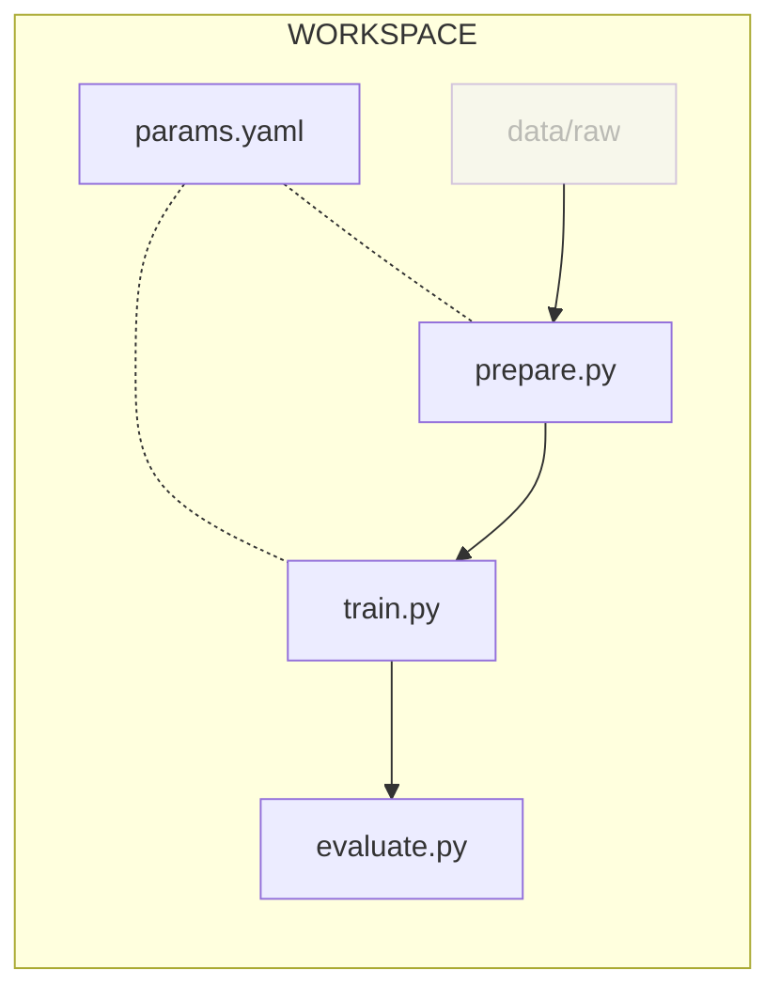

# Chapter 1.2 - Adapt and move the Jupyter Notebook to Python scripts

## Introduction

Jupyter Notebooks provide an interactive environment where code can be executed
and results can be visualized. They combine code, text explanations,
visualizations, and media in a single document, making it a flexible tool to
document a ML experiment.

However, they have severe limitations, such as challenges with reproducibility,
scalability, experiment tracking, and standardization. Integrating Jupyter
Notebooks into [:simple-python: Python](../tools.md) scripts suitable for
running ML experiments in a more modular and reproducible manner can help
address these issues and enhance the overall ML development process.

[:simple-python: pip](../tools.md) is the standard package manager for Python.
It is used to install and manage dependencies in a Python environment.

In this chapter, you will learn how to:

1. Set up a Python environment using pip
2. Adapt the content of the Jupyter Notebook into Python scripts
3. Launch the experiment locally

The following diagram illustrates the control flow of the experiment at the end
of this chapter:



Let's get started!

## Steps

### Set up a new project directory

For the rest of the guide, you will work in a new directory. This will allow you
to use the Jupyter Notebook directory as a reference.

Start by ensuring you have left the virtual environment created in the previous
chapter:

```sh title="Execute the following command(s) in a terminal"
# Deactivate the virtual environment
deactivate
```

Next, exit from the current directory and create a new one:

```sh title="Execute the following command(s) in a terminal"
# Move back to the root directory
cd ..

# Create the new working directory
mkdir mlops-guide

# Switch to the new working directory
cd mlops-guide
```

### Set up the dataset

You will use the same dataset as in the previous chapter. Copy the `data` folder
from the previous chapter to your new directory:

```sh title="Execute the following command(s) in a terminal"
# Copy the data folder from the previous chapter
cp -r ../mlops-guide-jupyter-notebook/data .
```

### Set up a Python environment

Firstly, create the virtual environment:

=== ":simple-python: Using pip"

    ```sh title="Execute the following command(s) in a terminal"
    # Create the environment
    python3.13 -m venv .venv

    # Activate the environment
    source .venv/bin/activate
    ```

=== ":simple-uv: Using uv"

    ```sh title="Execute the following command(s) in a terminal"
    # Create the environment
    uv venv --python 3.13

    # Activate the environment
    source .venv/bin/activate
    ```

Create a `requirements.txt` file to list the dependencies:

```txt title="requirements.txt"
--extra-index-url https://download.pytorch.org/whl/cpu
torch==2.12.1+cpu
torchvision==0.27.1+cpu
keras==3.15.0
matplotlib==3.11.0
pyyaml==6.0.3
scikit-learn==1.9.0
```

The first line adds the PyTorch CPU-only package index as an extra source. This
tells `pip` and `uv` to look at PyPI first, but to also check the PyTorch index
for packages that are not available on PyPI. Because `torch` and `torchvision`
are published as CPU-specific wheels on that index, they resolve to the smaller
CPU-only versions (`+cpu`) instead of the default CUDA wheels.

Install the dependencies:

=== ":simple-python: Using pip"

    ```sh title="Execute the following command(s) in a terminal"
    # Install the dependencies
    pip install -r requirements.txt
    ```

=== ":simple-uv: Using uv"

    ```sh title="Execute the following command(s) in a terminal"
    # Install the dependencies
    uv pip install -r requirements.txt
    ```

Create a freeze file to list the dependencies with their versions to ensure that
transitive dependencies are also listed. This will help with reproducibility:

??? tip "Not familiar with freezing dependencies? Read this!"

    When working on Python projects, managing dependencies is crucial for
    maintaining a stable and reproducible development environment.

    **Understanding requirements.txt**

    The requirements.txt file is a commonly used approach to specify project
    dependencies. It lists all the high-level dependencies required for your
    project, including their specific versions. Each line in the file typically
    follows the format: `package_name==version`.

    **Freezing dependencies**

    Freezing dependencies refers to fixing the versions of all transitive
    dependencies, ensuring that the same versions are installed consistently across
    different environments. This is crucial for reproducibility, as it guarantees
    that everyone working on the project has the exact same dependencies.

    **Separating high-level and transitive dependencies**

    To better control and manage your project's dependencies, it's beneficial to
    separate high-level dependencies from transitive dependencies. This approach
    allows for clearer identification of the core functionality packages and their
    required versions, ensuring a more focused and stable development environment.

    * `requirements.txt`: This file contains the high-level dependencies explicitly
      required by your project. It should include packages necessary for your
      project's core functionality while excluding packages that are indirectly
      required by other dependencies. By isolating the high-level dependencies, you
      maintain a clear distinction between the essential packages and the ones brought
      in transitively.

    * `requirements-freeze.txt`: This file includes all the transitive dependencies
      required by the high-level dependencies. It ensures that all the packages needed
      for the project, including their versions, are recorded in a separate file. This
      separation allows for a more flexible and controlled approach when updating
      transitive dependencies while maintaining the reproducibility of your project.

    **How to update dependencies**

    When updating dependencies, it is essential to primarily modify the high-level
    `requirements.txt` file with the desired versions or new packages. Then,
    generate an updated `requirements-freeze.txt` file to capture the updated
    transitive dependencies accurately.

    **Conclusion**

    Prioritizing stability and reproducibility in your project's dependency
    management is crucial for minimizing compatibility issues, avoiding unexpected
    bugs, and ensuring a smooth and reliable development process.

    By using separate requirements files for high-level and transitive dependencies,
    you gain better visibility and control over the dependencies required by your
    project. This approach promotes a stable and reproducible development
    environment while allowing you to update specific packages and their versions
    when needed. By following these practices, you can ensure the long-term success
    of your Python projects.

=== ":simple-python: Using pip"

    ```sh title="Execute the following command(s) in a terminal"
    # Freeze the dependencies
    pip freeze --local --all > requirements-freeze.txt
    ```

    - The `--local` flag ensures that if a virtualenv has global access, it will not
      output globally-installed packages.
    - The `--all` flag ensures that it does not skip these packages in the output:
      `setuptools`, `wheel`, `pip`, `distribute`.

=== ":simple-uv: Using uv"

    ```sh title="Execute the following command(s) in a terminal"
    # Freeze the dependencies
    uv pip freeze > requirements-freeze.txt
    ```

!!! warning "Add the PyTorch CPU index to the freeze file"

    `pip freeze` and `uv pip freeze` do not preserve the `--extra-index-url` line.
    Without it, installing from `requirements-freeze.txt` may pull the larger CUDA
    wheels or fail to find the pinned CPU-only versions. After freezing, add the
    PyTorch CPU index back at the top of `requirements-freeze.txt`:

    ```txt title="requirements-freeze.txt"
    --extra-index-url https://download.pytorch.org/whl/cpu
    ...
    ```

### Split the Jupyter Notebook into scripts

You will split the Jupyter Notebook in a codebase made of separate Python
scripts with well defined role. These scripts will be able to be called on the
command line, making it ideal for automation tasks.

The following table describes the files that you will create in this codebase:

| **File**                | **Description**                                   | **Input**                                       | **Output**                                                      |
| ----------------------- | ------------------------------------------------- | ----------------------------------------------- | --------------------------------------------------------------- |
| `params.yaml`           | The parameters to run the ML experiment           | -                                               | -                                                               |
| `src/prepare.py`        | Prepare the dataset to run the ML experiment      | The dataset to prepare in `data/raw` directory  | The prepared data in `data/prepared` directory                  |
| `src/train.py`          | Train the ML model                                | The prepared dataset                            | The model trained with the dataset                              |
| `src/evaluate.py`       | Evaluate the ML model using scikit-learn          | The model to evaluate                           | The results of the model evaluation in `evaluation` directory   |
| `src/utils/seed.py`     | Util function to fix the seed                     | -                                               | -                                                               |

#### Move the parameters to its own file

Let's split the parameters to run the ML experiment with in a distinct file:

```yaml title="params.yaml"
prepare:
  seed: 77
  split: 0.2
  image_size: [32, 32]
  grayscale: True

train:
  seed: 77
  lr: 0.0001
  epochs: 5
  conv_size: 32
  dense_size: 64
  output_classes: 11
```

#### Move the preparation step to its own file

The `src/prepare.py` script will prepare the dataset. It loads the raw images,
splits them into a training set and a validation set, copies the images into
`data/prepared`, and saves a preview plot and the class labels.

Let's take this opportunity to refactor the code to make it more modular and
explicit using functions:

```py title="src/prepare.py"
import json
import shutil
import sys
from pathlib import Path
from typing import List

import matplotlib.pyplot as plt import torch import yaml from torch.utils.data
import random_split from torchvision import datasets, transforms

from utils.seed import set_seed

def get_preview_plot(loader, labels: List[str]) -> plt.Figure:
    """Plot a preview of the prepared dataset""" fig = plt.figure(figsize=(10, 5),
    tight_layout=True) for images, label_idxs in loader:
        for i in range(min(10, len(images))):
            plt.subplot(2, 5, i + 1) plt.imshow(images[i].squeeze().numpy(), cmap="gray")
            plt.title(labels[label_idxs[i].item()]) plt.axis("off")
        break

    return fig

def save_split(
    subset, split_name: str, prepared_dataset_folder: Path, labels: List[str]
) -> None:
    """Copy a dataset split to the prepared folder"""
    split_folder = prepared_dataset _folder / split_name
    split_folder.mkdir(parents=True, exist_ok=True)

    for idx in subset.indices:
        path,
        label_idx = subset.dataset.samples[idx] path = Path(path) dest = split_folder /
        labels[label_idx] / path.name dest.parent.mkdir(parents=True, exist_ok=True)
        shutil.copy(path, dest)

def main() -> None:

    if len(sys.argv) != 3:
        print("Arguments error. Usage:\n") print("\tpython3 prepare.py
        <raw-dataset-folder> <prepared-dataset-folder>\n") exit(1)

    # Load parameters
    prepare_params = yaml.safe_load(open("params.yaml"))["prepare"]

    raw_dataset_folder = Path(sys.argv[1]) prepared_dataset_folder =
    Path(sys.argv[2]) seed = prepare_params["seed"] split = prepare_params["split"]
    image_size = tuple(prepare_params["image
    _size"]) grayscale = prepare_params["grayscale"]

    # Set seed for reproducibility
    set_seed(seed)

    # Read data
    transform = transforms.Compose(
        [
            transforms.Grayscale(num_output_channels=1) if grayscale else
            transforms.Identity(), transforms.Resize(image_size), transforms.ToTensor(),
        ]
    ) full_dataset = datasets.ImageFolder(raw_dataset
    _folder, transform=transform) labels = full_dataset.classes

    val_size = int(split * len(full_dataset)) train_size = len(full_dataset) -
    val_size ds_train, ds_val = random_split(
        full_dataset, [train_size,
        val_size], generator=torch.Generator().manual_seed(seed),
    )

    if not prepared_dataset_folder.exists():
        prepared_dataset_folder.mkdir(parents=True)

    # Save the preview plot
    preview_loader = torch.utils.data.DataLoader(ds_train,
    batch_size=32, shuffle=True) preview_plot = get_preview_plot(preview
    _loader, labels) preview_plot.savefig(prepared _dataset_folder / "preview.png")

    # Save the prepared dataset
    save_split(ds_train, "train", prepared_dataset_folder, labels)
    save_split(ds_val, "val", prepared_dataset_folder, labels)

    with open(prepared_dataset_folder / "labels.json", "w") as f:
        json.dump(labels, f)

    print(f"\nDataset saved at {prepared_dataset_folder.absolute()}")

if __name__ == "__main__":
    main()
```

#### Move the train step to its own file

The `src/train.py` script will train the ML model. Let's take this opportunity
to refactor the code to make it more modular and explicit using functions:

```py title="src/train.py"
import os
import sys
from pathlib import Path
from typing import Tuple

import numpy as np
import torch
import yaml
from torch.utils.data import DataLoader
from torchvision import datasets, transforms

os.environ["KERAS_BACKEND"] = "torch"
import keras

from utils.seed import set_seed

def get_model(
    image_shape: Tuple[int, int, int],
    conv_size: int,
    dense_size: int,
    output_classes: int,
) -> keras.Model:
    """Create a simple CNN model"""
    model = keras.Sequential(
        [
            keras.layers.Input(shape=image_shape),
            keras.layers.Conv2D(
                conv_size, (3, 3), activation="relu", data_format="channels _first"
            ),
            keras.layers.MaxPooling2D((3, 3), data_format="channels_first"),
            keras.layers.Flatten(),
            keras.layers.Dense(dense_size, activation="relu"),
            keras.layers.Dense(output_classes),
        ]
    )
    return model

def main() -> None:
    if len(sys.argv) != 3:
        print("Arguments error. Usage:\n")
        print("\tpython3 train.py <prepared-dataset-folder> <model-folder>\n")
        exit(1)

    # Load parameters
    prepare_params = yaml.safe_load(open("params.yaml"))["prepare"]
    train_params = yaml.safe_load(open("params.yaml"))["train"]

    prepared_dataset_folder = Path(sys.argv[1])
    model_folder = Path(sys.argv[2])

    image_size = tuple(prepare_params["image_size"])
    grayscale = prepare_params["grayscale"]
    image_shape = (1 if grayscale else 3, *image_size)

    seed = train_params["seed"]
    lr = train_params["lr"]
    epochs = train_params["epochs"]
    conv_size = train_params["conv_size"]
    dense_size = train_params["dense_size"]
    output_classes = train_params["output_classes"]

    # Set seed for reproducibility
    set_seed(seed)

    # Load data
    transform = transforms.Compose(
        [
            transforms.Grayscale(num_output_channels=1)
            if grayscale
            else transforms.Identity(),
            transforms.Resize(image_size),
            transforms.ToTensor(),
        ]
    )
    ds_train = datasets.ImageFolder(
        prepared_dataset_folder / "train", transform=transform
    )
    ds_val = datasets.ImageFolder(prepared_dataset _folder / "val",
    transform=transform)

    train_loader = DataLoader(ds_train, batch_size=32, shuffle=True)
    val_loader = DataLoader(ds_val, batch_size=32, shuffle=False)

    # Define the model
    model = get_model(image_shape, conv_size, dense_size, output_classes)
    model.compile(
        optimizer=keras.optimizers.Adam(lr),
        loss=keras.losses.SparseCategoricalCrossentropy(from_logits=True),
        metrics=[keras.metrics.SparseCategoricalAccuracy(name="acc")],
    )
    model.summary()

    # Train the model
    history = model.fit(
        train_loader,
        epochs=epochs,
        validation_data=val_loader,
    )

    # Save the model
    model_folder.mkdir(parents=True, exist_ok=True)
    model_path = model_folder.absolute() / "model.keras"
    model.save(model_path)
    # Save the model history
    np.save(model_folder.absolute() / "history.npy", history.history)

    print(f"\nModel saved at {model_folder.absolute()}")

if __name__ == "__main__":
    main()
```

#### Move the evaluate step to its own file

The `src/evaluate.py` script will evaluate the ML model using scikit-learn.
Let's take this opportunity to refactor the code to make it more modular and
explicit using functions:

```py title="src/evaluate.py"
import json
import os
import sys
from pathlib import Path
from typing import List

import matplotlib.pyplot as plt
import numpy as np
import torch
import yaml
from sklearn.metrics import (
    accuracy_score,
    confusion_matrix,
    f1_score,
    precision_score,
    recall_score,
)
from torch.utils.data import DataLoader
from torchvision import datasets, transforms

os.environ["KERAS_BACKEND"] = "torch"
import keras

def get_training_plot(model_history: dict) -> plt.Figure:
    """Plot the training and validation loss"""
    epochs = range(1, len(model_history["loss"]) + 1)

    fig = plt.figure(figsize=(10, 4))
    plt.plot(epochs, model_history["loss"], label="Training loss")
    plt.plot(epochs, model_history["val_loss"], label="Validation loss")
    plt.xticks(epochs)
    plt.title("Training and validation loss")
    plt.xlabel("Epochs")
    plt.ylabel("Loss")
    plt.legend()
    plt.grid(True)

    return fig

def get_pred_preview _plot(model: keras.Model, ds_val, labels: List[str]) ->
plt.Figure:
    """Plot a preview of the predictions"""
    fig, axes = plt.subplots(2, 5, figsize=(10, 5), tight_layout=True)

    sample_size = min(10, len(ds_val))
    sample_idxs = np.random.choice(len(ds_val), size=sample_size, replace=False)
    images, label_idxs = zip(*(ds_val[i] for i in sample_idxs))
    images = torch.stack(images)
    label_idxs = np.array(label_idxs)
    pred_idxs = np.argmax(model.predict(images, verbose=0), axis=1)

    for ax, image, true_idx, pred_idx in zip(
        axes.ravel(), images, label_idxs, pred_idxs
    ):
        ax.imshow(image.squeeze(), cmap="gray")
        ax.set_title(f"True: {labels[true_idx]}\nPred: {labels[pred_idx]}")
        ax.set_xticks([])
        ax.set_yticks([])

        border_color = "lime" if true_idx == pred_idx else "red"
        for spine in ax.spines.values():
            spine.set_edgecolor(border_color)
            spine.set_linewidth(4)

    # Hide any unused subplots
    for i in range(sample_size, 10):
        axes.ravel()[i].axis("off")

    return fig

def get_confusion_matrix_plot(
    model: keras.Model, val_loader, labels: List[str]
) -> plt.Figure:
    """Plot the confusion matrix"""
    y_true = []
    y_pred = []

    for images, label_idxs in val_loader:
        logits = model.predict(images, verbose=0)
        y_true.extend(label_idxs.numpy())
        y_pred.extend(np.argmax(logits, axis=1))

    y_true = np.array(y_true)
    y_pred = np.array(y_pred)

    conf_matrix = confusion_matrix(y_true, y_pred, normalize="true")

    fig = plt.figure(figsize=(6, 6), tight_layout=True)
    plt.imshow(conf_matrix, cmap="Blues")

    # Plot cell values
    for i in range(len(labels)):
        for j in range(len(labels)):
            value = conf_matrix[i, j]
            if np.isclose(value, 0.0):
                color = "lightgray"
            elif value > 0.5:
                color = "white"
            else:
                color = "black"
            plt.text(
                j,
                i,
                f"{value:.2f}",
                ha="center",
                va="center",
                color=color,
                fontsize=8,
            )

    plt.colorbar()
    plt.xticks(range(len(labels)), labels, rotation=90)
    plt.yticks(range(len(labels)), labels)
    plt.xlabel("Predicted label")
    plt.ylabel("True label")
    plt.title("Confusion matrix")

    return fig

def get_predictions(model: keras.Model, val_loader) -> tuple[np.ndarray,
np.ndarray]:
    """Return true and predicted labels for the validation set"""
    y_true = []
    y_pred = []

    for images, label_idxs in val_loader:
        logits = model.predict(images, verbose=0)
        y_true.extend(label_idxs.numpy())
        y_pred.extend(np.argmax(logits, axis=1))

    return np.array(y_true), np.array(y_pred)

def main() -> None:
    if len(sys.argv) != 3:
        print("Arguments error. Usage:\n")
        print("\tpython3 evaluate.py <model-folder> <prepared-dataset-folder>\n")
        exit(1)

    model_folder = Path(sys.argv[1])
    prepared_dataset_folder = Path(sys.argv[2])
    evaluation_folder = Path("evaluation")
    plots_folder = Path("plots")

    # Create folders
    (evaluation_folder / plots_folder).mkdir(parents=True, exist_ok=True)

    # Load parameters
    prepare_params = yaml.safe_load(open("params.yaml"))["prepare"]
    image_size = tuple(prepare_params["image_size"])
    grayscale = prepare_params["grayscale"]

    # Load files
    transform = transforms.Compose(
        [
            transforms.Grayscale(num_output_channels=1)
            if grayscale
            else transforms.Identity(),
            transforms.Resize(image_size),
            transforms.ToTensor(),
        ]
    )
    ds_val = datasets.ImageFolder(prepared_dataset _folder / "val",
    transform=transform)
    val_loader = DataLoader(ds_val, batch_size=32, shuffle=False)

    labels = None
    with open(prepared_dataset_folder / "labels.json") as f:
        labels = json.load(f)

    # Load model
    model_path = model_folder.absolute() / "model.keras"
    model = keras.models.load_model(model_path)
    model_history = np.load(
        model_folder.absolute() / "history.npy", allow_pickle=True
    ).item()

    # Log metrics
    val_loss, val_acc = model.evaluate(val_loader)
    y_true, y_pred = get_predictions(model, val_loader)

    metrics = {
        "val_loss": val_loss,
        "val_acc": val_acc,
        "precision": precision_score(y_true, y_pred, average="macro", zero_division=0),
        "recall": recall_score(y_true, y_pred, average="macro", zero_division=0),
        "f1_score": f1_score(y_true, y_pred, average="macro", zero_division=0),
    }

    print(f"Validation loss: {metrics['val_loss']:.2f}")
    print(f"Validation accuracy: {metrics['val_acc'] * 100:.2f}%")
    print(f"Precision: {metrics['precision']:.2f}")
    print(f"Recall:    {metrics['recall']:.2f}")
    print(f"F1 score:  {metrics['f1_score']:.2f}")

    with open(evaluation_folder / "metrics.json", "w") as f:
        json.dump(metrics, f)

    # Save training history plot
    fig = get_training_plot(model_history)
    fig.savefig(evaluation_folder / plots_folder / "training_history.png")

    # Save predictions preview plot
    fig = get_pred_preview_plot(model, ds_val, labels)
    fig.savefig(evaluation_folder / plots_folder / "pred_preview.png")

    # Save confusion matrix plot
    fig = get_confusion_matrix_plot(model, val_loader, labels)
    fig.savefig(evaluation_folder / plots_folder / "confusion_matrix.png")

    print(
        f"\nEvaluation metrics and plot files saved at {evaluation_folder.absolute()}"
    )

if __name__ == "__main__":
    main()
```

#### Create the seed helper function

Finally, add a module for utils:

```sh title="Execute the following command(s) in a terminal"
# Create the utils module
mkdir src/utils

# Create the __init__.py file to make the utils module a package
touch src/utils/__init__.py
```

In this module, include `src/utils/seed.py` to handle the fixing of the seed
parameters. This ensure the results are reproducible:

??? tip "Understanding when to fix random seeds"

    Fixed seeds enable **reproducibility** by eliminating randomness, making them
    essential for comparing model changes fairly during development. However, they
    can hide **variance** in model performance.

    **When to fix seeds**: Development iterations, CI/CD pipelines, and debugging
    require fixed seeds to ensure performance differences reflect your changes, not
    random variation.

    **When NOT to fix seeds**: Final model evaluation should reflect real-world
    variability. Consider training with multiple seeds and reporting mean/std of
    metrics to assess model stability. Production training may or may not use fixed
    seeds depending on requirements.

    **Best practice**: Keep seeds as configurable parameters (as in `params.yaml`)
    rather than hardcoding them. This guide uses fixed seeds for reproducible
    experiments, but final evaluation should quantify variance across multiple runs.

```py title="src/utils/seed.py"
import os
import random

import numpy as np
import torch

os.environ["KERAS_BACKEND"] = "torch"
import keras

def set_seed(seed: int) -> None:
    os.environ["PYTHONHASHSEED"] = str(seed)
    random.seed(seed)
    np.random.seed(seed)
    torch.manual_seed(seed)
    torch.cuda.manual_seed_all(seed)

    keras.utils.set_random_seed(seed)
    torch.backends.cudnn.deterministic = True
    torch.backends.cudnn.benchmark = False
```

### Create a `README.md` file

Finally, create a `README.md` file at the root of the project to describe the
repository. Feel free to use the following template. As you progress though this
guide, you can add your notes in the `## Notes` section:

```md title="README.md"
# MLOps - Celestial Body Classification

This repository contains the code from
[A guide to MLOps](https://mlops.swiss-ai-center.ch/).

## Notes
<!-- Enter your notes below -->
```

### Check the results

Your working directory should now look like this:

```yaml hl_lines="6-16"
.
├── data
│   ├── raw
│   │   └── ...
│   └── README.md
├── params.yaml # (1)!
├── README.md # (2)!
├── requirements-freeze.txt # (3)!
├── requirements.txt # (4)!
└── src # (5)!
    ├── evaluate.py
    ├── prepare.py
    ├── train.py
    └── utils
        ├── __init__.py
        └── seed.py
```

1. This is new.
2. This is new.
3. This is new.
4. This is new.
5. This, and all its sub-directory, is new.

### Run the experiment

Awesome! You now have everything you need to run the experiment: the codebase
and the dataset are in place, the new virtual environment is set up, and you are
ready to run the experiment using scripts for the first time.

You can now follow these steps to reproduce the experiment:

```sh title="Execute the following command(s) in a terminal"
# Prepare the dataset
python3.13 src/prepare.py data/raw data/prepared

# Train the model with the training set and save it
python3.13 src/train.py data/prepared model

# Evaluate the model performance
python3.13 src/evaluate.py model data/prepared
```

The experiment will take some time to run. Once it is done, you will find the
results in the `data/prepared`, `model`, and `evaluation` directories.

### Check the results

Your working directory should now be similar to this:

```yaml hl_lines="3-9 13-21"
.
├── data
│   ├── prepared # (1)!
│   │   ├── labels.json
│   │   ├── preview.png
│   │   ├── train
│   │   │   └── ...
│   │   └── val
│   │       └── ...
│   ├── raw
│   │   └── ...
│   └── README.md
├── evaluation # (2)!
│   ├── metrics.json
│   └── plots
│       ├── confusion_matrix.png
│       ├── pred_preview.png
│       └── training_history.png
├── model # (3)!
│   ├── history.npy
│   └── model.keras
├── params.yaml
├── README.md
├── requirements-freeze.txt
├── requirements.txt
└── src
    ├── evaluate.py
    ├── prepare.py
    ├── train.py
    └── utils
        ├── __init__.py
        └── seed.py
```

1. This, and all its sub-directory, is new.
2. This, and all its sub-directory, is new.
3. This is new.

Here, the following should be noted:

- the `prepare.py` script created the `data/prepared` directory and divided the
  dataset into a training set and a validation set
- the `train.py` script created the `model` directory and trained the model with
  the prepared data.
- the `evaluate.py` script created the `evaluation` directory and generated some
  plots and metrics to evaluate the model

Take some time to get familiar with the scripts and the results.

## Summary

Congratulations! You have successfully reproduced the experiment on your
machine, this time using a modular approach that can be put into production.

In this chapter, you have:

1. Set up a Python virtual environment
2. Adapted the content of the Jupyter Notebook into Python scripts
3. Launched the experiment locally

You fixed some of the previous issues:

- [x] Notebook has been transformed into scripts for production

!!! abstract "Take away"

    - **Modular Python scripts enable production-ready ML workflows**: Converting
      notebooks to separate `prepare.py`, `train.py`, and `evaluate.py` scripts
      creates clear separation of concerns and makes code easier to test, maintain,
      and integrate into automated pipelines.
    - **Parameters should be externalized**: Using a `params.yaml` file to store
      configuration separates logic from configuration, making it easy to experiment
      with different hyperparameters without modifying code.
    - **Dependency management requires two levels**: `requirements.txt` tracks
      high-level dependencies you explicitly need, while `requirements-freeze.txt`
      captures all transitive dependencies with exact versions for reproducibility.
    - **Command-line interfaces make automation possible**: Scripts that accept
      arguments and can be run from the terminal integrate seamlessly with scheduling
      tools, CI/CD pipelines, and orchestration systems.
    - **Fixed seeds enable reproducibility but hide variance**: Using fixed seeds
      during development ensures fair comparison of model changes, while final
      evaluation should use multiple seeds to assess real-world model stability.

## State of the MLOps process

- [x] Notebook has been transformed into scripts for production
- [ ] Codebase and dataset are not versioned
- [ ] Model steps rely on verbal communication and may be undocumented
- [ ] Changes to model are not easily visualized

Continue to the next chapters to address the remaining items.

## Sources

Highly inspired by:

- [_Get Started: Data Pipelines_ - dvc.org](https://dvc.org/doc/start/data-management/data-pipelines)
