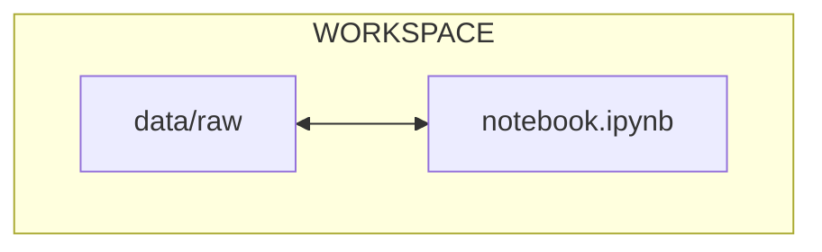

# Chapter 1 - Run a simple ML experiment with Jupyter Notebook

## Introduction

As a recent addition to the ML team, your objective is to contribute to the
development of a model capable of **visually identifying planets or moons**
within our solar system from images.

The data scientists of your team have been actively collaborating on a Jupyter
Notebook, which they have readily shared with you. The dataset they have
gathered comprises approximately 1,650 images capturing 11 distinct planets and
moons. Each celestial body is represented by around 150 images, each taken from
a unique angle.

The training process is as follows:

- Preprocess the dataset
- Split the celestial bodies into training/testing datasets
- Train a model to classify the celestial bodies using the training dataset
- Evaluate the model's performance using metrics, training history, predictions
  preview and a confusion matrix.

Your primary objective is to enhance the team's workflow by implementing MLOps
tools, documenting the procedures, tracking changes, and ensuring the model is
accessible to others.

In this chapter, you will learn how to:

1. Set up the project directory
2. Acquire the notebook
3. Obtain the dataset
4. Create a Python environment to run the experiment
5. Launch the experiment locally for the first time

The following diagram illustrates control flow of the experiment at the end of
this chapter:



Let's get started!

## Steps

### Set up the project directory

As a new team member, set up a project directory on your computer for this
ground breaking ML experiment. This directory will serve as your working
directory for this first chapter.

```sh title="Execute the following command(s) in a terminal"
# Create the working directory
mkdir a-guide-to-mlops-jupyter-notebook

# Switch to the working directory
cd a-guide-to-mlops-jupyter-notebook
```

### Download the notebook

Your colleague provided you the following URL to download an archive containing
the Jupyter Notebook for this machine learning experiment.

```sh title="Execute the following command(s) in a terminal"
# Download the archive containing the Jupyter Notebook
wget https://github.com/csia-pme/a-guide-to-mlops/archive/refs/heads/jupyter-notebook.zip -O jupyter-notebook.zip
```

Unzip the Jupyter Notebook into your working directory.

```sh title="Execute the following command(s) in a terminal"
# Extract the Jupyter Notebook
unzip jupyter-notebook.zip

# Move the subdirectory files to the working directory
mv a-guide-to-mlops-jupyter-notebook/* .

# Remove the archive and the directory
rm -r jupyter-notebook.zip a-guide-to-mlops-jupyter-notebook
```

### Download and set up the dataset

Your colleague provided you the following URL to download an archive containing
the dataset for this machine learning experiment.

```sh title="Execute the following command(s) in a terminal"
# Download the archive containing the dataset
wget https://github.com/csia-pme/a-guide-to-mlops/archive/refs/heads/data.zip -O data.zip
```

This archive must be decompressed and its contents be moved in the `data`
directory in the working directory of the experiment.

```sh title="Execute the following command(s) in a terminal"
# Extract the dataset
unzip data.zip

# Move the `data.xml` file to the working directory
mv a-guide-to-mlops-data/ data/

# Remove the archive and the directory
rm data.zip
```

### Explore the notebook and dataset

Examine the notebook and the dataset to get a better understanding of their
contents.

Your working directory should now look like this:

```yaml hl_lines="2-5"
.
├── data # (1)!
│   ├── raw # (2)!
│   │   └── ...
│   └── README.md
├── README.md
├── notebook.ipynb
└── requirements.txt
```

1. This, and all its sub-directory, is new.
2. The `raw` directory include the unprocessed dataset images.

### Create the virtual environment

Create the virtual environment and install necessary dependencies in your
working directory.

```sh title="Execute the following command(s) in a terminal"
# Create the virtual environment
python3 -m venv .venv

# Activate the virtual environment
source .venv/bin/activate

# Install the requirements
pip install --requirement requirements.txt
```

### Run the experiment

Awesome! You now have everything you need to run the experiment: the notebook
and the dataset are in place, the virtual environment is ready; and you're ready
to run the experiment for the first time.

Launch the notebook.

```sh title="Execute the following command(s) in a terminal"
# Launch the experiment
jupyter-lab notebook.ipynb
```

A browser window should open with the Jupyter Notebook.

You may notice all the previous outputs from the notebook are still present.
This is because the notebook was not cleared before being shared with you. This
can be useful to see the results of previous runs.

In most cases however, it can also be a source of confusion and clutter. This is
one of the limitations of the Jupyter Notebook, which make them not always easy
to share with others.

For the time being, execute each step of the notebook to train the model and
evaluate its performance. Previous outputs will be overwritten.

Ensure the experiment runs without errors. Once done, you can close the browser
window. Shut down the Jupyter server by pressing ++ctrl+c++ in the terminal,
followed with ++y++ and ++enter++.

Exit the virtual environment with the following command.

```sh title="Execute the following command(s) in a terminal"
# Exit the virtual environment
deactivate
```

The Jupyter notebook serves as a valuable tool for consolidating an entire
experiment into a single file, facilitating data visualization, and enabling the
presentation of results. However, it does have severe limitations such as being
challenging to share with others due to a lack of versioning capabilities,
difficulty in reproducing the experiment, and the potential for clutter and data
leaks from previous outputs.

In the next chapter we will see how to address these shortcomings.

## Summary

Congratulations! You have successfully reproduced the experiment on your
machine.

In this chapter, you have:

1. Created the working directory
2. Acquired the codebase
3. Obtained the dataset
4. Set up a Python environment to run the experiment
5. Executed the experiment locally for the first time

However, you may have identified the following areas for improvement:

- [ ] Notebook still needs manual download
- [ ] Dataset still needs manual download and placement
- [ ] Steps to run the experiment were not documented

In the next chapters, you will enhance the workflow to fix those issues.

## State of the MLOps process

- [ ] Notebook can be run but is not adequate for production
- [ ] Codebase and dataset are not versioned
- [ ] Model steps rely on verbal communication and may be undocumented
- [ ] Changes to model are not easily visualized
- [ ] Dataset requires manual download and placement
- [ ] Codebase requires manual download and setup
- [ ] Experiment may not be reproducible on other machines
- [ ] CI/CD pipeline does not report the results of the experiment
- [ ] Changes to model are not thoroughly reviewed and discussed before
      integration
- [ ] Model may have required artifacts that are forgotten or omitted in
      saved/loaded state
- [ ] Model cannot be easily used from outside of the experiment context
- [ ] Model is not deployed on a public endpoint I can use everywhere
- [ ] Model cannot be trained on hardware other than the local machine

You will address these issues in the next chapters for improved efficiency and
collaboration. Continue the guide to learn how.

## Sources

Highly inspired by:

- [_Planets and Moons Dataset - AI in Space_ - kaggle.com](https://www.kaggle.com/datasets/emirhanai/planets-and-moons-dataset-ai-in-space)
  community prediction competition.
