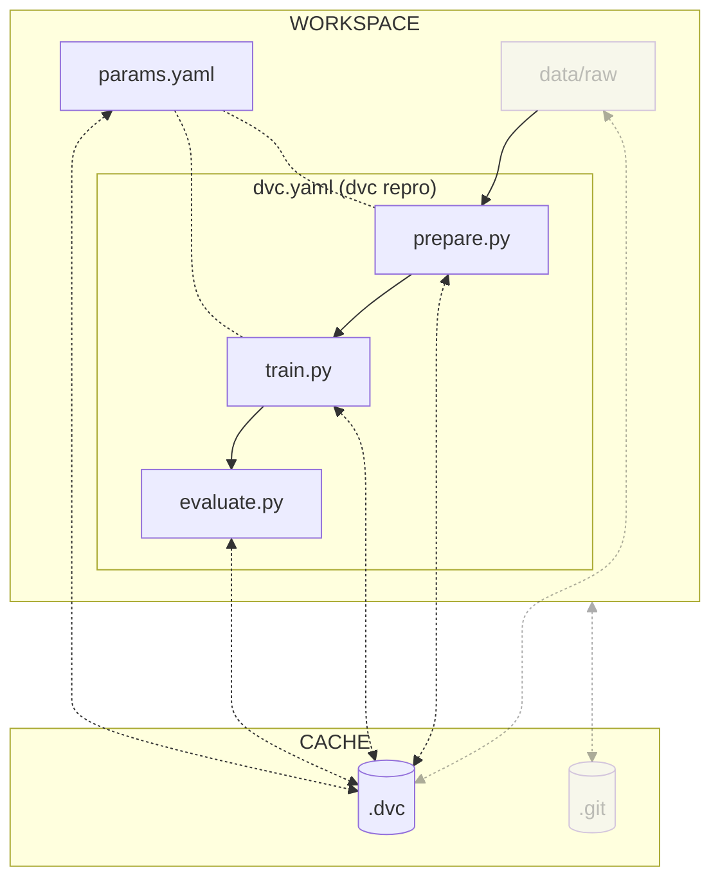

# Chapter 1.4 - Reproduce the ML experiment with DVC

## Introduction

A key component of [:simple-dvc: DVC](../tools.md) is the concept of "stages".
Stages are essentially commands that produce a result, whether that be a file or
directory. The beauty of DVC is that these stages are executed only when the
dependencies they rely on have changed. This way, you don't have to waste time
re-running unnecessary steps.

By using DVC stages to create a pipeline, you can execute all of your
experiment's steps by simply running the `dvc repro` command. As a result, DVC
will only execute stages that must be ran, making it easy to reproduce the
experiment and track the effects of changes.

In this chapter, you will learn how to:

1. Remove custom rules from the gitignore file
2. Set up DVC pipeline stages:
    - Prepare
    - Train
    - Evaluate
3. Visualize the pipeline
4. Execute the pipeline
5. Push the changes to DVC and Git

The following diagram illustrates the control flow of the experiment at the end
of this chapter:



As a reminder, the current steps to run the experiment are as follow:

```sh title="Execute the following command(s) in a terminal"
# Prepare the dataset
python3.12 src/prepare.py data/raw data/prepared

# Train the model with the train dataset and save it
python3.12 src/train.py data/prepared model

# Evaluate the model performances
python3.12 src/evaluate.py model data/prepared
```

Let's get started!

## Steps

### Remove custom rules from the gitignore file

As seen in the previous chapter, DVC can update gitignore files.

As you will define the entire experiment pipeline with DVC, you can safely
remove all the custom rules from the main gitignore file so DVC can manage them
for you. At the end of this chapter, DVC should have updated all the gitignore
files.

Replace all the actual content of the gitignore file with the following to
remove your experiment data. The required files to be ignored will then be added
by DVC:

```sh title=".gitignore"
## Python
.venv/

# Byte-compiled / optimized / DLL files
__pycache__/

## DVC

# DVC will add new files after this line
```

!!! info

    If using macOS, you might want to ignore `.DS_Store` files as well to avoid
    pushing Apple's metadata files to your repository.

Check the differences with Git to validate the changes:

```sh title="Execute the following command(s) in a terminal"
# Show the differences with Git
git diff .gitignore
```

The output should be similar to this:

```diff
diff --git a/.gitignore b/.gitignore
index 1c13140..2492093 100644
--- a/.gitignore
+++ b/.gitignore
@@ -1,15 +1,9 @@
-# Data used to train the models
-data/raw/
-data/prepared/
-
-# Evaluation results
-evaluation/
-
-# The models
-model/
-
 ## Python
 .venv/

 # Byte-compiled / optimized / DLL files
 __pycache__/
+
+## DVC
+
+# DVC will add new files after this line
```

### Setup the DVC pipeline stages

A DVC pipeline is a set of stages that are executed in a specific order based on
the dependencies between the stages (deps and outs). The `dvc repro` command
executes the pipeline to reproduce the experiment.

In the following sections, each step of the experiment will be converted into a
stage of a DVC pipeline. The `dvc stage add` command creates a new stage in the
pipeline. This stage will be added to the `dvc.yaml` file that describes the
pipeline. This file can also be edited manually.

The `dvc stage add` accepts some options:

- `-n` specifies the name of the stage
- `-p` specifies the parameters of the stage (referenced in the `params.yaml`
  file)
- `-d` specifies the dependencies of the stage
- `-o` specifies the outputs of the stage (cached by DVC)
- `--metrics` specifies the metrics of the stage (cached by DVC)
- `--plots` specifies the plots of the stage (cached by DVC)

As parameters are an important part of the experiment, they are versioned in a
`params.yaml` file. DVC keeps track of these parameters and of the corresponding
results.

Dependencies and outputs are files or directories that are used or produced by
the stage. If any of these files change, DVC will re-run the command of the
stage when using `dvc repro`.

#### Prepare stage

Run the following command to add a new stage called _prepare_ that prepares the
dataset:

```sh title="Execute the following command(s) in a terminal"
dvc stage add -n prepare \
    -p prepare \
    -d src/prepare.py -d src/utils/seed.py -d data/raw \
    -o data/prepared \
    python3.12 src/prepare.py data/raw data/prepared
```

The values of the parameters is `prepare` which includes all the `prepare`
parameters referenced in the `params.yaml` file.

This stage has the `src/prepare.py`, the `src/utils/seed.py` and `data/raw`
files as dependencies. If any of these files change, DVC will run the command
`python3.12 src/prepare.py data/raw data/prepared` when using `dvc repro`.

The output of this command is stored in the `data/prepared` directory.

Take some time to explore the `dvc.yaml` file and to understand how the pipeline
is updated.

#### Train stage

Run the following command to create a new stage called _train_ that trains the
model:

```sh title="Execute the following command(s) in a terminal"
dvc stage add -n train \
    -p train \
    -d src/train.py -d src/utils/seed.py -d data/prepared \
    -o model \
    python3.12 src/train.py data/prepared model
```

The values of the parameters is `train` which includes all the `train`
parameters referenced in the `params.yaml` file.

This stage has the `src/train.py`, the `src/utils/seed.py` and `data/prepared`
files as dependencies. If any of these files change, DVC will run the command
`python3.12 src/evaluate.py data/prepared model` when using `dvc repro`.

The output of this command is stored in the `model` directory.

Explore the `dvc.yaml` file to understand how the pipeline is updated.

#### Evaluate stage

Run the following command to create a new stage called _evaluate_ that evaluates
the model:

```sh title="Execute the following command(s) in a terminal"
dvc stage add -n evaluate \
    -d src/evaluate.py -d model \
    --metrics evaluation/metrics.json \
    --plots evaluation/plots/confusion_matrix.png \
    --plots evaluation/plots/pred_preview.png \
    --plots evaluation/plots/training_history.png \
    python3.12 src/evaluate.py model data/prepared
```

This stage has the `src/evaluate.py` file and then `model` folder as
dependencies. If any of these files change, DVC will run the command
`python3.12 src/evaluate.py model data/prepared` when using `dvc repro`.

The script writes the model's metrics to `evaluation/metrics.json`, the
`confusion_matrix` to `evaluation/plots/confusion_matrix.png`, the
`pred_preview` to `evaluation/plots/pred_preview.png` and the
`training_history.png` to `evaluation/plots/training_history.png`.

Explore the `dvc.yaml` file to understand how the pipeline is updated.

#### Summary of the DVC pipeline

The pipeline is now entirely defined. You can explore the `dvc.yaml` file to see
all the stages and their dependencies.

Notice that DVC also updated the main gitignore file with the model, as it is an
output of the `train` stage:

```sh title=".gitignore" hl_lines="10"
## Python
.venv/

# Byte-compiled / optimized / DLL files
__pycache__/

## DVC

# DVC will add new files after this line
/model
```

!!! info

    If using macOS, you might want to ignore `.DS_Store` files as well to avoid
    pushing Apple's metadata files to your repository.

### Visualize the pipeline

You can visualize the pipeline to check the stages that will be performed:

```sh title="Execute the following command(s) in a terminal"
# Display the Directed Acyclic Graph of the pipeline
dvc dag
```

```text
+--------------+
| data/raw.dvc |
+--------------+
        *
        *
        *
  +---------+
  | prepare |
  +---------+
        *
        *
        *
    +-------+
    | train |
    +-------+
        *
        *
        *
  +----------+
  | evaluate |
  +----------+
```

If any dependencies/outputs change, the affected stages will be re-executed.

### Execute the pipeline

Now that the pipeline has been defined, you can execute it and reproduce the
experiment:

```sh title="Execute the following command(s) in a terminal"
# Execute only the required pipeline stages
dvc repro
```

!!! tip

    You can force the execution of the entire pipeline with the command
    `dvc repro --force`.

The first execution will generate a `dvc.lock` file that contains the
information about the pipeline and the outputs of the stages.

Try to run the command again and notice that DVC will not re-execute the stages:

```text
'data/raw.dvc' didn't change, skipping
Stage 'prepare' didn't change, skipping
Stage 'train' didn't change, skipping
Stage 'evaluate' didn't change, skipping
Data and pipelines are up to date.
```

### Check the changes

Check the changes with Git to ensure all wanted files are here:

```sh title="Execute the following command(s) in a terminal"
# Add all the files
git add .

# Check the changes
git status
```

The output of the `git status` command should be similar to this.

```text
On branch main
Changes to be committed:
  (use "git restore --staged <file>..." to unstage)
    modified:   .gitignore
    modified:   data/.gitignore
    new file:   dvc.lock
    new file:   dvc.yaml
    new file:   evaluation/.gitignore
    new file:   evaluation/plots/.gitignore
```

### Commit the changes

Commit the changes to the local Git repository:

```sh title="Execute the following command(s) in a terminal"
# Commit the changes
git commit -m "Use DVC to save the commands of my ML experiment"
```

This chapter is done, you can check the summary.

## Summary

Congratulations! You have defined a pipeline and know how to reproduce your
experiment.

In this chapter, you have successfully:

1. Removed custom rules from the main gitignore file
2. Set up three DVC pipeline stages
    - Prepare
    - Train
    - Evaluate
3. Visualized the pipeline
4. Executed the pipeline
5. Committed the changes

You fixed some of the previous issues:

- [x] The steps used to create the model are documented and can be reproduced.

However, you might have identified the following areas for improvement:

- [ ] How can I ensure my changes helps to improve the model?
- [ ] How can I ensure my model still can be run on someone's computer?

In the next chapters, you will enhance the workflow to fix these issues.

You can now safely continue to the next chapter.

## State of the MLOps process

- [x] Notebook has been transformed into scripts for production
- [x] Codebase and dataset are versioned
- [x] Steps used to create the model are documented and can be re-executed
- [ ] Changes to model are not easily visualized
- [ ] Codebase requires manual download and setup
- [ ] Dataset requires manual download and placement
- [ ] Experiment may not be reproducible on other machines
- [ ] CI/CD pipeline does not report the results of the experiment
- [ ] Changes to model are not thoroughly reviewed and discussed before
      integration
- [ ] Model may have required artifacts that are forgotten or omitted in
      saved/loaded state
- [ ] Model cannot be easily used from outside of the experiment context
- [ ] Model requires manual publication to the artifact registry
- [ ] Model is not accessible on the Internet and cannot be used anywhere
- [ ] Model requires manual deployment on the cluster
- [ ] Model cannot be trained on hardware other than the local machine
- [ ] Model cannot be trained on custom hardware for specific use-cases

You will address these issues in the next chapters for improved efficiency and
collaboration. Continue the guide to learn how.

## Sources

Highly inspired by:

- [_Get Started: Data Pipelines_ - dvc.org](https://dvc.org/doc/start/data-management/data-pipelines)
- [_plots_ - dvc.org](https://dvc.org/doc/command-reference/plots)
