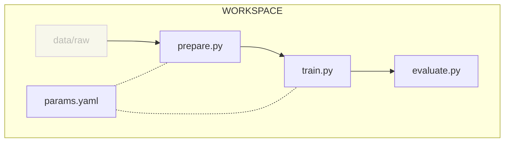

# Chapter 2: Adapt and move the Jupyter Notebook to Python scripts

??? info "You want to take over from this chapter? Collapse this section and follow the instructions below."

    !!! warning

        It might be easier to start from the previous chapter(s). Only follow this
        section if you are confortable with the content of the previous chapter(s).

    Set up the project directory

    ```sh title="Execute the following command(s) in a terminal"
    # Create the working directory
    mkdir a-guide-to-mlops-jupyter-notebook

    # Switch to the working directory
    cd a-guide-to-mlops-jupyter-notebook
    ```

    Get the required files for this chapter.

    ```sh title="Execute the following command(s) in a terminal"
    # Clone the repository
    git clone \
        --no-checkout \
        --depth=1 \
        --filter=tree:0 \
        https://github.com/csia-pme/a-guide-to-mlops.git

    # Move to the cloned repository
    cd a-guide-to-mlops

    # Get the files for this chapter
    git sparse-checkout set --no-cone docs/part-1-local-training-and-model-evaluation/chapter-1-run-a-simple-ml-experiment-with-jupyter-notebook

    # Clone the files locally
    git checkout

    # Move back to the root directory
    cd ..

    # Copy the chapter files to the working directory
    cp -r a-guide-to-mlops/docs/part-1-local-training-and-model-evaluation/chapter-1-run-a-simple-ml-experiment-with-jupyter-notebook/* .

    # Delete the cloned repository
    rm -rf a-guide-to-mlops
    ```

    Set up the environment.

    ```sh title="Execute the following command(s) in a terminal"
    # Create the virtual environment
    python3 -m venv .venv

    # Activate the virtual environment
    source .venv/bin/activate

    # Install the requirements
    pip install --requirement requirements.txt
    ```

## Introduction

Jupyter Notebooks provide an interactive environment where code can be executed
and results can be visualized. They combine code, text explanations,
visualizations, and media in a single document, making it a flexible tool to
document a ML experiment.

However, they have severe limitations, such as challenges with reproducibility,
scalability, experiment tracking, and standardization. Integrating Jupyter
Notebooks into Python scripts suitable for running ML experiments in a more
modular and reproducible manner can help address these shortcomings and enhance
the overall ML development process.

[pip](https://pip.pypa.io/) is the standard package manager for Python. It is
used to install and manage dependencies in a Python environment.

In this chapter, you will learn how to:

1. Set up a Python environment using [pip](https://pip.pypa.io/)
2. Adapt the content of the Jupyter Notebook into Python scripts
3. Launch the experiment locally

The following diagram illustrates control flow of the experiment at the end of
this chapter:



Let's get started!

## Steps

### Set up a new project directory

For the rest of the guide, you will work in a new directory. This will allow you
to use the Jupyter Notebook directory as a reference.

Start by ensuring you have left the virtual environment created in the previous
chapter.

```sh title="Execute the following command(s) in a terminal"
# Deactivate the virtual environment
deactivate
```

Next, exit from the current directory and create a new one.

```sh title="Execute the following command(s) in a terminal"
# Move back to the root directory
cd ..

# Create the new working directory
mkdir a-guide-to-mlops

# Switch to the new working directory
cd a-guide-to-mlops
```

### Set up the dataset

You will use the same dataset as in the previous chapter. Copy the `data` folder
from the previous chapter to your new directory.

```sh title="Execute the following command(s) in a terminal"
# Copy the data folder from the previous chapter
cp -r ../a-guide-to-mlops-jupyter-notebook/data .
```

### Set up a Python environment

Firstly, create the virtual environment.

??? tip "Not familiar with virtual environments? Read this!"

    **What are virtual environments?**

    Python **virtual environments** are essential tools for managing dependencies
    and isolating project environments. They allow developers to create separate,
    self-contained environments for different projects, ensuring that each project
    has its own set of dependencies **without interfering** with one another.

    This is particularly important when working on multiple projects with different
    versions of libraries or packages.

    **How do virtual environments work?**

    Virtual environments work by creating a local directory that contains a Python
    interpreter and a copy of the desired Python packages. When activated, the
    virtual environment modifies the system's PATH variable to prioritize the
    interpreter and packages within the local directory.

    This ensures that when running Python commands, the system uses the specific
    interpreter and packages from the virtual environment, effectively isolating the
    project from the global Python installation.

    **How to manage virtual environments?**

    - Create a virtual environment: `#!sh python -m venv .venv`
    - Activate the virtual environment: `#!sh source .venv/bin/activate`
    - Deactivate the virtual environment: `#!sh deactivate`

```sh title="Execute the following command(s) in a terminal"
# Create the environment
python3 -m venv .venv

# Activate the environment
source .venv/bin/activate
```

Create a `requirements.txt` file to list the dependencies.

```txt title="requirements.txt"
tensorflow==2.12.0
matplotlib==3.7.1
pyyaml==6.0
```

Install the dependencies.

```sh title="Execute the following command(s) in a terminal"
# Install the requirements
pip install --requirement requirements.txt
```

Create a freeze file to list the dependencies with their versions.

```sh title="Execute the following command(s) in a terminal"
pip freeze --local --all > requirements-freeze.txt
```

We freeze the dependencies to ensure that transitive dependencies are also
listed. This will help with reproducibility.

- The `--local` flag ensures that if a virtualenv has global access, it will not
  output globally-installed packages.
- The `--all` flag ensures that it does not skip these packages in the output:
  `setuptools`, `wheel`, `pip`, `distribute`.

### Split the Jupyter Notebook into scripts

You will split the Jupyter Notebook in a codebase made of separate Python
scripts with well defined role. These scripts will be able to be called on the
command line, making it ideal for automation tasks.

The following table describes the files that you will create in this codebase.

| **File**                | **Description**                                   | **Input**                                       | **Output**                                                      |
| ----------------------- | ------------------------------------------------- | ----------------------------------------------- | --------------------------------------------------------------- |
| `params.yaml`           | The parameters to run the ML experiment           | -                                               | -                                                               |
| `src/prepare.py`        | Prepare the dataset to run the ML experiment      | The dataset to prepare in `data/raw` directory  | The prepared data in `data/prepared` directory                  |
| `src/train.py`          | Train the ML model                                | The prepared dataset                            | The model trained with the dataset                              |
| `src/evaluate.py`       | Evaluate the ML model using scikit-learn          | The model to evaluate                           | The results of the model evaluation in `evaluation` directory   |
| `src/utils/seed.py`     | Util function to fix the seed                     | -                                               | -                                                               |

#### Move the parameters to its own file

Let's split the parameters to run the ML experiment with in a distinct file.

```yaml title="params.yaml"
prepare:
  seed: 77
  split: 0.2
  image_size: [32, 32]
  grayscale: True

train:
  seed: 77
  lr: 0.0001
  epochs: 5
  conv_size: 32
  dense_size: 64
  output_classes: 11
```

#### Move the preparation step to its own file

The `src/prepare.py` script will prepare the dataset.

```py title="src/prepare.py"
import json
import sys
from pathlib import Path
from typing import List

import matplotlib.pyplot as plt
import tensorflow as tf
import yaml

from utils.seed import set_seed


def get_preview_plot(ds: tf.data.Dataset, labels: List[str]) -> plt.Figure:
    """Plot a preview of the prepared dataset"""
    fig = plt.figure(figsize=(10, 5), tight_layout=True)
    for images, label_idxs in ds.take(1):
        for i in range(10):
            plt.subplot(2, 5, i + 1)
            plt.imshow(images[i].numpy().astype("uint8"), cmap="gray")
            plt.title(labels[label_idxs[i].numpy()])
            plt.axis("off")

    return fig


def main() -> None:
    if len(sys.argv) != 3:
        print("Arguments error. Usage:\n")
        print("\tpython3 prepare.py <raw-dataset-folder> <prepared-dataset-folder>\n")
        exit(1)

    # Load parameters
    prepare_params = yaml.safe_load(open("params.yaml"))["prepare"]

    raw_dataset_folder = Path(sys.argv[1])
    prepared_dataset_folder = Path(sys.argv[2])
    seed = prepare_params["seed"]
    split = prepare_params["split"]
    image_size = prepare_params["image_size"]
    grayscale = prepare_params["grayscale"]

    # Set seed for reproducibility
    set_seed(seed)

    # Read data
    ds_train, ds_test = tf.keras.utils.image_dataset_from_directory(
        raw_dataset_folder,
        labels="inferred",
        label_mode="int",
        color_mode="grayscale" if grayscale else "rgb",
        batch_size=32,
        image_size=image_size,
        shuffle=True,
        seed=seed,
        validation_split=split,
        subset="both",
    )
    labels = ds_train.class_names

    if not prepared_dataset_folder.exists():
        prepared_dataset_folder.mkdir(parents=True)

    # Save the preview plot
    preview_plot = get_preview_plot(ds_train, labels)
    preview_plot.savefig(prepared_dataset_folder / "preview.png")

    # Normalize the data
    normalization_layer = tf.keras.layers.experimental.preprocessing.Rescaling(
        1.0 / 255
    )
    ds_train = ds_train.map(lambda x, y: (normalization_layer(x), y))
    ds_test = ds_test.map(lambda x, y: (normalization_layer(x), y))

    # Save the prepared dataset
    with open(prepared_dataset_folder / "labels.json", "w") as f:
        json.dump(labels, f)
    tf.data.Dataset.save(ds_train, str(prepared_dataset_folder / "train"))
    tf.data.Dataset.save(ds_test, str(prepared_dataset_folder / "test"))

    print(f"\nDataset saved at {prepared_dataset_folder.absolute()}")


if __name__ == "__main__":
    main()
```

#### Move the train step to its own file

The `src/train.py` script will train the ML model.

```py title="src/train.py"
import sys
from pathlib import Path
from typing import Tuple

import numpy as np
import tensorflow as tf
import yaml

from utils.seed import set_seed


def get_model(
    image_shape: Tuple[int, int, int],
    conv_size: int,
    dense_size: int,
    output_classes: int,
) -> tf.keras.Model:
    """Create a simple CNN model"""
    model = tf.keras.models.Sequential(
        [
            tf.keras.layers.Conv2D(
                conv_size, (3, 3), activation="relu", input_shape=image_shape
            ),
            tf.keras.layers.MaxPooling2D((3, 3)),
            tf.keras.layers.Flatten(),
            tf.keras.layers.Dense(dense_size, activation="relu"),
            tf.keras.layers.Dense(output_classes),
        ]
    )
    return model


def main() -> None:
    if len(sys.argv) != 3:
        print("Arguments error. Usage:\n")
        print("\tpython3 train.py <prepared-dataset-folder> <model-folder>\n")
        exit(1)

    # Load parameters
    prepare_params = yaml.safe_load(open("params.yaml"))["prepare"]
    train_params = yaml.safe_load(open("params.yaml"))["train"]

    prepared_dataset_folder = Path(sys.argv[1])
    model_folder = Path(sys.argv[2])

    image_size = prepare_params["image_size"]
    grayscale = prepare_params["grayscale"]
    image_shape = (*image_size, 1 if grayscale else 3)

    seed = train_params["seed"]
    lr = train_params["lr"]
    epochs = train_params["epochs"]
    conv_size = train_params["conv_size"]
    dense_size = train_params["dense_size"]
    output_classes = train_params["output_classes"]

    # Set seed for reproducibility
    set_seed(seed)

    # Load data
    ds_train = tf.data.Dataset.load(str(prepared_dataset_folder / "train"))
    ds_test = tf.data.Dataset.load(str(prepared_dataset_folder / "test"))

    # Define the model
    model = get_model(image_shape, conv_size, dense_size, output_classes)
    model.compile(
        optimizer=tf.keras.optimizers.Adam(lr),
        loss=tf.keras.losses.SparseCategoricalCrossentropy(from_logits=True),
        metrics=[tf.keras.metrics.SparseCategoricalAccuracy()],
    )
    model.summary()

    # Train the model
    model.fit(
        ds_train,
        epochs=epochs,
        validation_data=ds_test,
    )

    # Save the model
    model_folder.mkdir(parents=True, exist_ok=True)
    model.save(str(model_folder))
    # Save the model history
    np.save(model_folder / "history.npy", model.history.history)

    print(f"\nModel saved at {model_folder.absolute()}")


if __name__ == "__main__":
    main()
```

#### Move the evaluate step to its own file

The `src/evaluate.py` script will evaluate the ML model using DVC.

```py title="src/evaluate.py"
import json
import sys
from pathlib import Path
from typing import List

import matplotlib.pyplot as plt
import numpy as np
import tensorflow as tf


def get_training_plot(model_history: dict) -> plt.Figure:
    """Plot the training and validation loss"""
    epochs = range(1, len(model_history["loss"]) + 1)

    fig = plt.figure(figsize=(10, 4))
    plt.plot(epochs, model_history["loss"], label="Training loss")
    plt.plot(epochs, model_history["val_loss"], label="Validation loss")
    plt.xticks(epochs)
    plt.title("Training and validation loss")
    plt.xlabel("Epochs")
    plt.ylabel("Loss")
    plt.legend()
    plt.grid(True)

    return fig


def get_pred_preview_plot(
    model: tf.keras.Model, ds_test: tf.data.Dataset, labels: List[str]
) -> plt.Figure:
    """Plot a preview of the predictions"""
    fig = plt.figure(figsize=(10, 5), tight_layout=True)
    for images, label_idxs in ds_test.take(1):
        preds = model.predict(images)
        for i in range(10):
            plt.subplot(2, 5, i + 1)
            img = (images[i].numpy() * 255).astype("uint8")
            # Convert image to rgb if grayscale
            if img.shape[-1] == 1:
                img = np.squeeze(img, axis=-1)
                img = np.stack((img,) * 3, axis=-1)
            true_label = labels[label_idxs[i].numpy()]
            pred_label = labels[np.argmax(preds[i])]
            # Add red border if the prediction is wrong else add green border
            img = np.pad(img, pad_width=((1, 1), (1, 1), (0, 0)))
            if true_label != pred_label:
                img[0, :, 0] = 255  # Top border
                img[-1, :, 0] = 255  # Bottom border
                img[:, 0, 0] = 255  # Left border
                img[:, -1, 0] = 255  # Right border
            else:
                img[0, :, 1] = 255
                img[-1, :, 1] = 255
                img[:, 0, 1] = 255
                img[:, -1, 1] = 255

            plt.imshow(img)
            plt.title(f"True: {true_label}\n" f"Pred: {pred_label}")
            plt.axis("off")

    return fig


def get_confusion_matrix_plot(
    model: tf.keras.Model, ds_test: tf.data.Dataset, labels: List[str]
) -> plt.Figure:
    """Plot the confusion matrix"""
    fig = plt.figure(figsize=(6, 6), tight_layout=True)
    preds = model.predict(ds_test)

    conf_matrix = tf.math.confusion_matrix(
        labels=tf.concat([y for _, y in ds_test], axis=0),
        predictions=tf.argmax(preds, axis=1),
        num_classes=len(labels),
    )

    # Plot the confusion matrix
    conf_matrix = conf_matrix / tf.reduce_sum(conf_matrix, axis=1)
    plt.imshow(conf_matrix, cmap="Blues")

    # Plot cell values
    for i in range(len(labels)):
        for j in range(len(labels)):
            value = conf_matrix[i, j].numpy()
            if value == 0:
                color = "lightgray"
            elif value > 0.5:
                color = "white"
            else:
                color = "black"
            plt.text(
                j,
                i,
                f"{value:.2f}",
                ha="center",
                va="center",
                color=color,
                fontsize=8,
            )

    plt.colorbar()
    plt.xticks(range(len(labels)), labels, rotation=90)
    plt.yticks(range(len(labels)), labels)
    plt.xlabel("Predicted label")
    plt.ylabel("True label")
    plt.title("Confusion matrix")

    return fig


def main() -> None:
    if len(sys.argv) != 3:
        print("Arguments error. Usage:\n")
        print("\tpython3 evaluate.py <model-folder> <prepared-dataset-folder>\n")
        exit(1)

    model_folder = Path(sys.argv[1])
    prepared_dataset_folder = Path(sys.argv[2])
    evaluation_folder = Path("evaluation")
    plots_folder = Path("plots")

    # Create folders
    (evaluation_folder / plots_folder).mkdir(parents=True, exist_ok=True)

    # Load files
    ds_test = tf.data.Dataset.load(str(prepared_dataset_folder / "test"))
    labels = None
    with open(prepared_dataset_folder / "labels.json") as f:
        labels = json.load(f)

    # Load model
    model = tf.keras.models.load_model(model_folder)
    model_history = np.load(model_folder / "history.npy", allow_pickle=True).item()

    # Log metrics
    val_loss, val_acc = model.evaluate(ds_test)
    print(f"Validation loss: {val_loss:.2f}")
    print(f"Validation accuracy: {val_acc * 100:.2f}%")
    with open(evaluation_folder / "metrics.json", "w") as f:
        json.dump({"val_loss": val_loss, "val_acc": val_acc}, f)

    # Save training history plot
    fig = get_training_plot(model_history)
    fig.savefig(evaluation_folder / plots_folder / "training_history.png")

    # Save predictions preview plot
    fig = get_pred_preview_plot(model, ds_test, labels)
    fig.savefig(evaluation_folder / plots_folder / "pred_preview.png")

    # Save confusion matrix plot
    fig = get_confusion_matrix_plot(model, ds_test, labels)
    fig.savefig(evaluation_folder / plots_folder / "confusion_matrix.png")

    print(
        f"\nEvaluation metrics and plot files saved at {evaluation_folder.absolute()}"
    )


if __name__ == "__main__":
    main()
```

#### Create the seed helper function

Finally, add a module for utils.

```sh title="Execute the following command(s) in a terminal"
# Create the utils module
mkdir src/utils

# Create the __init__.py file to make the utils module a package
touch src/utils/__init__.py
```

In this module, include `src/utils/seed.py` to handle the fixing of the seed
parameters. This ensure the results are reproducible.

```py title="src/utils/seed.py"
import os
import random

import numpy as np
import tensorflow as tf


def set_seed(seed: int) -> None:
    os.environ["PYTHONHASHSEED"] = str(seed)
    random.seed(seed)
    np.random.seed(seed)

    os.environ["TF_DETERMINISTIC_OPS"] = "1"
    os.environ["TF_CUDNN_DETERMINISTIC"] = "1"

    tf.random.set_seed(seed)
    tf.config.threading.set_inter_op_parallelism_threads(1)
    tf.config.threading.set_intra_op_parallelism_threads(1)
```

### Create `README.md`

Finally, create a `README.md` file at the root of the project to describe the
repository. Feel free to use the following template. As you progress though this
guide, you can add your notes in the `## Notes` section.

```md title="README.md"
# MLOps - Planet Classification

[A Guide to MLOps](https://csia-pme.github.io/a-guide-to-mlops/)

## Usage

The code is divided in 4 scripts:
- `python3 src/prepare.py <raw-dataset-folder> <prepared-dataset-folder>`: prepare the dataset for training
- `python3 src/train.py <prepared-dataset-folder> <model-folder>`: train the model
- `python3 src/evaluate.py <model-folder> <prepared-dataset-folder>`: evaluate the model
- `python3 src/explain.py <model-folder> <raw-dataset-folder>`: explain the model

## Notes
<!-- Enter you notes below -->
```

### Make usage of the scripts in the Jupyter Notebook

_Work in progress._

[//]: # "TODO: Update the notebook to use the scripts and the parameters file as well in a hybrid approach: Notebook to visualize the data and results and scripts to run the experiment."

### Check the results

Your working directory should now look like this:

```yaml hl_lines="6-16"
.
├── data
│   ├── raw
│   │   └── ...
│   └── README.md
├── src # (1)!
│   ├── utils
│   │   ├── __init__.py
│   │   └── seed.py
│   ├── evaluate.py
│   ├── prepare.py
│   └── train.py
├── params.yaml # (2)!
├── requirements-freeze.txt # (3)!
├── requirements.txt # (4)!
└── README.md # (5)!
```

1. This, and all its sub-directory, is new.
2. This is new.
3. This is new.
4. This is new.

### Run the experiment

Awesome! You now have everything you need to run the experiment: the codebase
and the dataset are in place, the new virtual environment is set up, and you are
ready to run the experiment using scripts for the first time.

You can now follow these steps to reproduce the experiment.

```sh title="Execute the following command(s) in a terminal"
# Prepare the dataset
python3 src/prepare.py data/raw data/prepared

# Train the model with the train dataset and save it
python3 src/train.py data/prepared model

# Evaluate the model performance
python3 src/evaluate.py model data/prepared
```

### Check the results

Your working directory should now be similar to this:

```yaml hl_lines="3-9 13-20"
.
├── data
│   ├── prepared # (1)!
│   │   ├── test
│   │   │   └── ...
│   │   ├── train
│   │   │   └── ...
│   │   ├── labels.json
│   │   └── preview.png
│   ├── raw
│   │   └── ...
│   └── README.md
├── evaluation # (2)!
│   ├── plots
│   │   ├── confusion_matrix.png
│   │   ├── pred_preview.png
│   │   └── training_history.png
│   └── metrics.json
├── model # (4)!
│   └── ...
├── src
│   ├── utils
│   │   ├── __init__.py
│   │   └── seed.py
│   ├── evaluate.py
│   ├── prepare.py
│   └── train.py
├── params.yaml
├── requirements-freeze.txt
├── requirements.txt
└── README.md
```

1. This, and all its sub-directory, is new.
2. This, and all its sub-directory, is new.
3. This is new.
4. This is new.

Here, the following should be noted:

- the `prepare.py` script created the `data/prepared` directory and divided the
  dataset into a training set and a test set
- the `train.py` script created the `model` directory and trained the model with
  the prepared data.
- the `evaluate.py` script created the `evaluation` directory and generated some
  plots and metrics to evaluate the model

Take some time to get familiar with the scripts and the results.

## Summary

Congratulations! You have successfully reproduced the experiment on your
machine, this time using a modular approach that can be put into production.

In this chapter, you have:

1. Set up a Python environment using `pip` and `virtualenv`
2. Adapted the content of the Jupyter Notebook into Python scripts
3. Launched the experiment locally

However, you may have identified the following areas for improvement:

- [ ] Codebase is not versioned
- [ ] Dataset still needs manual download and placement
- [ ] Steps to run the experiment were not documented
- [ ] Codebase is not easily sharable
- [ ] Dataset is not easily sharable

In the next chapters, you will enhance the workflow to fix those issues.

You can now safely continue to the next chapter.

## State of the MLOps process

- [x] Notebook has been transformed into scripts for production
- [ ] Codebase and dataset are not versioned
- [ ] Model steps rely on verbal communication and may be undocumented
- [ ] Changes to model are not easily visualized
- [ ] Dataset requires manual download and placement
- [ ] Codebase requires manual download and setup
- [ ] Experiment may not be reproducible on other machines
- [ ] Changes to model are not thoroughly reviewed and discussed before
      integration
- [ ] Model may have required artifacts that are forgotten or omitted in
      saved/loaded state
- [ ] Model cannot be easily used from outside of the experiment context
- [ ] Model cannot be deployed on and accessed from a Kubernetes cluster
- [ ] Model cannot be trained on hardware other than the local machine

You will address these issues in the next chapters for improved efficiency and
collaboration. Continue the guide to learn how.

## Sources

Highly inspired by:

- [_Get Started: Data Pipelines_ - dvc.org](https://dvc.org/doc/start/data-management/data-pipelines)
- [_How to get stable results with TensorFlow, setting random seed_ - stackoverflow.com](https://stackoverflow.com/questions/36288235/how-to-get-stable-results-with-tensorflow-setting-random-seed)
