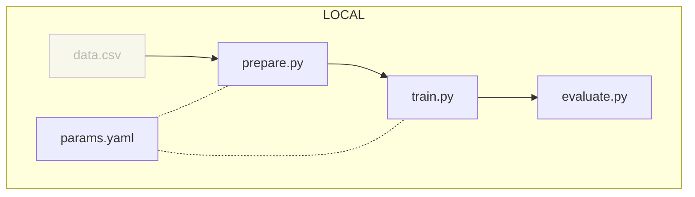
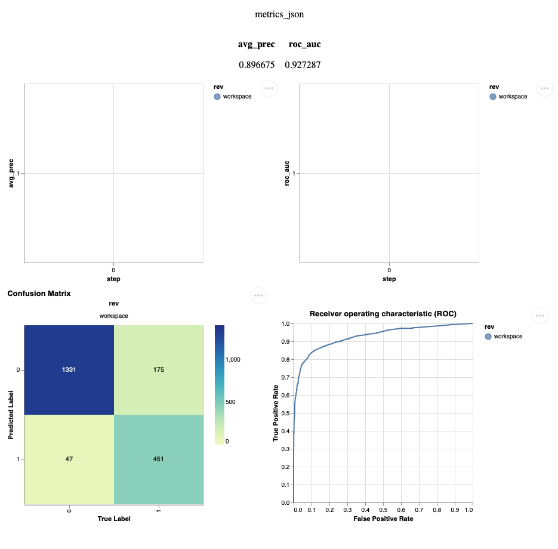

# Chapter 2: Adapt and move the Jupyter Notebook to Python scripts

??? info "You want to take over from this chapter? Collapse this section and follow the instructions below."

    !!! warning

        It might be easier to start from the previous chapter(s). Only follow this section if you are confortable with the content of the previous chapter(s).

    Get the required files for this chapter.

    ```sh title="Execute the following command(s) in a terminal"
    # Clone the repository
    git clone \
        --no-checkout \
        --depth=1 \
        --filter=tree:0 \
        https://github.com/csia-pme/a-guide-to-mlops.git

    # Move to the cloned repository
    cd a-guide-to-mlops

    # Get the files for this chapter
    git sparse-checkout set --no-cone docs/the-guide/chapter-1-run-a-simple-ml-experiment

    # Clone the files locally
    git checkout

    # Move back to the root directory
    cd ..

    # Copy the chapter files to the working directory
    cp -r a-guide-to-mlops/docs/the-guide/chapter-1-run-a-simple-ml-experiment/* .

    # Delete the cloned repository
    rm -r a-guide-to-mlops
    ```

    Set up the environment.

    TODO FOR EACH CHAPTER

## Introduction

Jupyter Notebooks provide an interactive environment where code can be executed
and results can be visualized. They combine code, text explanations,
visualizations, and media in a single document, making it a flexible tool to
document a ML experiment.

However, they have severe limitations, such as challenges with reproducibility,
scalability, experiment tracking, and standardization. Integrating Jupyter
Notebooks into Python scripts suitable for running ML experiments in a more
modular and reproducible manner can help address these shortcomings and enhance
the overall ML development process.

pip is the standard package manager for Python. It is used to install and manage dependencies in a Python environment.

Yet, pip is not the best tool to manage Python dependencies. It is not user-friendly and it is not suitable for reproducibility and collaboration.

If you have a look at the `requirements.txt` file, you might notice the following issues:

- Which version of Python is required?
- Which version of the dependencies are required?
- Which dependencies are main dependencies and which are dependencies of dependencies?
- Where to install the dependencies (on my system, in a virtual environment)?
- How to ensure reproducibility?

This is why you will use [Poetry](https://python-poetry.org/) to manage Python dependencies.

Poetry is a tool to manage Python dependencies. It is a more robust and user-friendly alternative to pip. It is also more suitable for reproducibility and collaboration by creating a lock file that can be used to recreate the exact same environment on another machine.

For example, freezing the version of a dependency in a `requirements.txt` file is not enough to ensure reproducibility. The `requirements.txt` file only specifies the version of the dependency at the time of installation. If dependencies of the dependency are updated, the version of the dependency might change without you knowing it. This is why Poetry creates a lock file that contains the exact version of all the dependencies and their dependencies.

In this chapter, you will learn how to:

1. Set up a standardized Python environment using [Poetry](https://python-poetry.org/)
2. Adapt the content of the Jupyter Notebook into Python scripts
3. Launch the experiment locally



Let's get started!

## Steps

### Move from pip to Poetry

Start by ensuring you have left the virtual environment created in the previous chapter.

```sh title="Execute the following command(s) in a terminal"
# Deactivate the virtual environment
deactivate
```

Remove the virtual environment and the `requirements.txt` file.

```sh title="Execute the following command(s) in a terminal"
# Remove the virtual environment
rm -r .venv

# Remove the requirements.txt file
rm requirements.txt
```

Initialize Poetry at the root of the directory.

```sh title="Execute the following command(s) in a terminal"
poetry init --no-interaction
```

This will create the `pyproject.toml` file that should look like this:

```toml title="pyproject.toml"
[tool.poetry]
name = "my-working-directory"
version = "0.1.0"
description = ""
authors = ["Your Name <you@example.com>"]
readme = "README.md"

[tool.poetry.dependencies]
python = "^3.11"


[build-system]
requires = ["poetry-core"]
build-backend = "poetry.core.masonry.api"
```

Open a Poetry shell. This will automatically create and activate a virtual environment.

```sh title="Execute the following command(s) in a terminal"
# Open a Poetry shell in a new virtual environment
poetry shell
```

Install all the dependencies in the virtual environment.

```sh title="Execute the following command(s) in a terminal"
poetry add jupyterlab pandas matplotlib scikit-learn seaborn
```

This will install the dependencies in the virtual environment and update the `pyproject.toml` file.

```toml title="pyproject.toml"
[tool.poetry]
name = "my-working-directory"
version = "0.1.0"
description = ""
authors = ["Your Name <you@example.com>"]
readme = "README.md"

[tool.poetry.dependencies]
python = "^3.11"
jupyterlab = "^4.0.2"
pandas = "^2.0.2"
matplotlib = "^3.7.1"
scikit-learn = "^1.2.2"
seaborn = "^0.12.2"


[build-system]
requires = ["poetry-core"]
build-backend = "poetry.core.masonry.api"
```

A second `poetry.lock` file is also created. This file contains the exact version of all the dependencies and their dependencies.

```toml title="poetry.lock"
# This file is automatically @generated by Poetry 1.4.2 and should not be changed by hand.

[[package]]
name = "anyio"
version = "3.7.0"
description = "High level compatibility layer for multiple asynchronous event loop implementations"
category = "main"
optional = false
python-versions = ">=3.7"
files = [
    {file = "anyio-3.7.0-py3-none-any.whl", hash = "sha256:eddca883c4175f14df8aedce21054bfca3adb70ffe76a9f607aef9d7fa2ea7f0"},
    {file = "anyio-3.7.0.tar.gz", hash = "sha256:275d9973793619a5374e1c89a4f4ad3f4b0a5510a2b5b939444bee8f4c4d37ce"},
]

[package.dependencies]
idna = ">=2.8"
sniffio = ">=1.1"

[package.extras]
doc = ["Sphinx (>=6.1.0)", "packaging", "sphinx-autodoc-typehints (>=1.2.0)", "sphinx-rtd-theme", "sphinxcontrib-jquery"]
test = ["anyio[trio]", "coverage[toml] (>=4.5)", "hypothesis (>=4.0)", "mock (>=4)", "psutil (>=5.9)", "pytest (>=7.0)", "pytest-mock (>=3.6.1)", "trustme", "uvloop (>=0.17)"]
trio = ["trio (<0.22)"]

[[package]]
name = "appnope"
version = "0.1.3"
description = "Disable App Nap on macOS >= 10.9"
category = "main"
optional = false
# ... and so on
```

To exit the Poetry shell, simply type `exit`.

```sh title="Execute the following command(s) in a terminal"
# Exit the Poetry shell
exit
```

Now that Poetry is set up, accessing the virtual environment is now easier. Simply type `poetry shell` to open a Poetry shell in the virtual environment.

Installing dependencies is also easier. Simply type `poetry add <dependency>` to install a dependency in the virtual environment and update the `pyproject.toml` and `poetry.lock` files.

When accessing the virtual environment, you can also install all the dependencies listed in the `pyproject.toml` file by typing `poetry install`.

Once access to the virtual environment is no longer needed, simply type `exit` to exit the Poetry shell.

Dependencies are cleary listed in the `pyproject.toml` file and the `poetry.lock` file ensures reproducibility.

### Split the Jupyter Notebook into scripts

You will split the Jupyter Notebook in a codebase made of separate Python scripts with
well defined role. These scripts will be able to be called on the command line,
making it ideal for automation tasks.

The following table describes the files that you will create in this codebase.

| **File**                | **Description**                                   | **Input**                             | **Output**                                                    |
| ----------------------- | ------------------------------------------------- | ------------------------------------- | ------------------------------------------------------------- |
| `src/prepare.py`        | Prepare the dataset to run the ML experiment      | The dataset to prepare as an CSV file | The prepared data in `data/prepared` directory                |
| `src/train.py`          | Train the ML model                                | The prepared dataset                  | The model trained with the dataset                            |
| `src/evaluate.py`       | Evaluate the ML model using DVC                   | The model to evaluate                 | The results of the model evaluation in `evaluation` directory |
| `params.yaml`           | The parameters to run the ML experiment           | -                                     | -                                                             |

#### Move the parameters to its own file

Let's split the parameters to run the ML experiment with in a distinct file.

```yaml title="params.yaml"
# TODO
```

#### Move the preparation step to its own file

The `src/prepare.py` script will prepare the dataset.

```py title="src/prepare.py"
# TODO
```

#### Move the featurize step to its own file

TODO: Do you still need this section in the new version?

The `src/featurize.py` script will extract the features from the dataset.

```py title="src/featurization.py"
# TODO
```

#### Move the train step to its own file

The `src/train.py` script will train the ML model.

```py title="src/train.py"
# TODO
```

#### Move the evaluate step to its own file

The `src/evaluate.py` script will evaluate the ML model using DVC.

```py title="src/evaluate.py"
# TODO
```

### Make usage of the scripts in the Jupyter Notebook

TODO: Update the notebook to use the scripts and the parameters file as well in a hybrid approach: Notebook to visualize the data and results and scripts to run the experiment.

### Check the results

Your working directory should now look like this:

TODO: Update the tree

```yaml hl_lines="2-10"
.
├── data
│   ├── data.csv
│   └── README.md
├── notebook.ipynb
├── src # (1)!
│   ├── evaluate.py
│   ├── prepare.py
│   └── train.py
├── params.yaml # (2)!
├── poetry.lock # (3)!
└── pyproject.toml # (4)!
```

1. This, and all its sub-directory, is new.
2. This is new.
3. This is new.
4. This is new.

### Run the experiment

Awesome! You now have everything you need to run the experiment: the codebase and
the dataset are in place, the new virtual environment is set up, and you are ready to run the experiment for the first
time.

Access the virtual environment.

```sh title="Execute the following command(s) in a terminal"
# Activate the virtual environment
poetry shell

# Install the dependencies in a virtual environment
poetry install
```

You can now follow these steps to reproduce the experiment.

```sh title="Execute the following command(s) in a terminal"
# Prepare the dataset
python src/prepare.py data/data.xml

# Train the model with the train dataset and save it
python src/train.py data/train.csv model.pkl

# Evaluate the model performances - see below note
python src/evaluate.py model.pkl data/test.csv
```

### Check the results

Your working directory should now be similar to this:

TODO: Update the tree

```yaml hl_lines="3-8 11-22 29"
.
├── data
│   ├── features # (1)!
│   │   ├── test.pkl
│   │   └── train.pkl
│   ├── prepared # (2)!
│   │   ├── test.tsv
│   │   └── train.tsv
│   ├── README.md
│   └── data.xml
├── evaluation # (3)!
│   ├── plots
│   │   ├── metrics
│   │   │   ├── avg_prec.tsv
│   │   │   └── roc_auc.tsv
│   │   ├── sklearn
│   │   │   ├── confusion_matrix.json
│   │   │   └── roc.json
│   │   ├── importance.png
│   │   └── prc.json
│   ├── metrics.json
│   └── report.html
├── src
│   ├── evaluate.py
│   ├── featurization.py
│   ├── prepare.py
│   └── train.py
├── README.md
├── model.pkl # (4)!
├── params.yaml
├── poetry.lock
└── pyproject.toml
```

1. This, and all its sub-directory, is new.
2. This, and all its sub-directory, is new.
3. This, and all its sub-directory, is new.
4. This is new.

Here, the following should be noted:

- the `prepare.py` script created the `data/prepared` directory and divided the
dataset into a training set and a test set
- the `train.py` script created the `model.pkl` file and trained the model with
the extracted features
- the `evaluate.py` script created the `evaluation` directory and generated some
plots and metrics to evaluate the model

Take some time to get familiar with the scripts and the results.

Running the `evaluate.py` also generates a report at `evaluation/report.html` with the metrics and plots.

Here is a preview of the report:

{ loading=lazy }

## Summary

Congratulations! You have successfully reproduced the experiment on your machine,
this time using a modular approach that can be put into production.

In this chapter, you have:

1. Set up a standardized Python environment using Poetry
2. Adapted the content of the Jupyter Notebook into Python scripts
3. Launched the experiment locally

However, you may have identified the following areas for improvement:

- ❌ Codebase is not versioned
- ❌ Dataset still needs manual download and placement
- ❌ Steps to run the experiment were not documented
- ❌ Codebase is not easily sharable
- ❌ Dataset is not easily sharable

In the next chapters, you will enhance the workflow to fix those issues.

You can now safely continue to the next chapter.

## State of the MLOps process

- ✅ Notebook has been transformed into scripts for production
- ❌ Codebase and dataset are not versioned
- ❌ Model steps rely on verbal communication and may be undocumented
- ❌ Changes to model are not easily visualized
- ❌ Dataset requires manual download and placement
- ❌ Codebase requires manual download and setup
- ❌ Experiment may not be reproducible on other machines
- ❌ Changes to model are not thoroughly reviewed and discussed before integration
- ❌ Model may have required artifacts that are forgotten or omitted in saved/loaded state
- ❌ Model cannot be easily used from outside of the experiment context

You will address these issues in the next chapters for improved efficiency and
collaboration. Continue the guide to learn how.

## Sources
