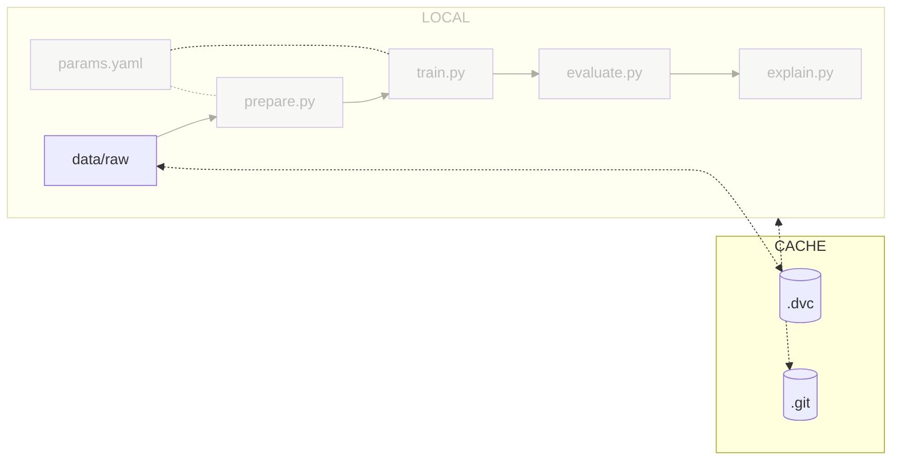

# Chapter 3: Initialize Git and DVC for local training

## Introduction

Now that you have a good understanding of the experiment, it's time to
streamline the code and data sharing process. To enable efficient tracking of
code changes and ensure reproducibility, we will create a Git repository.

However, when it comes to managing large files, Git has some limitations.
Although Git LFS is an option for handling large files in Git repositories, it
may not be the most efficient solution.

This is the reason we will use [DVC](../../tools#dvc),
a version control system specifically designed for efficient data management
that seamlessly integrates with Git. DVC utilizes chunking to efficiently store
large files and track their changes.

In this chapter, you will learn how to:

1. Set up a new [Git](../../tools#git)
repository
2. Initialize Git in your project directory
3. Verify Git tracking for your files
4. Exclude experiment results, data, models and Python environment files from
Git commits
5. Commit your changes to the Git repository
6. Install DVC
7. Initialize and configure DVC
8. Update the `.gitignore` file and add the experiment data to DVC
9. Push the data files to DVC
10. Commit the metadata files to Git

The following diagram illustrates control flow of the experiment at the end of
this chapter:



Later, we will streamline the code sharing process by setting up remote Git and
DVC repositories to enable easy collaboration with the rest of the team.

## Steps

### Create a new Git repository

#### Initialize Git in your working directory

Use the following commands to set up a local Git repository in your working
directory.

```sh title="Execute the following command(s) in a terminal"
# Initialize Git in your working directory with `main` as the initial branch
git init --initial-branch=main
```

#### Check if Git tracks your files

Initialize Git in your working directory. Verify available files for committing
with these commands.

```sh title="Execute the following command(s) in a terminal"
# Check the changes
git status
```

The output should be similar to this.

```
On branch main

No commits yet

Untracked files:
(use "git add <file>..." to include in what will be committed)
    data/
    evaluation/
    model/
    params.yaml
    poetry.lock
    pyproject.toml
    src/
```

As you can see, no files have been added to Git yet.

#### Create a .gitignore file

Create a `.gitignore` file to exclude data, models, and Python environment to
improve repository size and clone time. The data and models will be managed by
DVC in the next chapters. Keep the model's evaluation as it doesn't take much
space and you can have a history of the improvements made to your model.
Additionally, this will help to ensure that the repository size and clone time
remain optimized.

```sh title=".gitignore"
# Data used to train the models
data/

# Artifacts
evaluation/

# The models
model/

## Python

# Byte-compiled / optimized / DLL files
__pycache__/
```

!!! info

    If using macOS, you might want to ignore `.DS_Store` files as well to avoid pushing Apple's metadata files to your repository.

#### Check the changes


Check the changes with Git to ensure all wanted files are here.

```sh title="Execute the following command(s) in a terminal"
# Add all the available files
git add .

# Check the changes
git status
```

The output of the `git status` command should be similar to this.

```
On branch main

No commits yet

Changes to be committed:
(use "git rm --cached <file>..." to unstage)
    new file:   .gitignore
    new file:   params.yaml
    new file:   poetry.lock
    new file:   pyproject.toml
    new file:   src/evaluate.py
    new file:   src/explain.py
    new file:   src/prepare.py
    new file:   src/train.py
    new file:   src/utils/seed.py
```

#### Commit the changes

Commit the changes to Git.

```sh title="Execute the following command(s) in a terminal"
# Commit the changes
git commit -m "My first ML experiment shared on Git"
```

### Create a DVC repository

#### Install DVC

Install the main `dvc` package.

```sh title="Execute the following command(s) in a terminal"
poetry add "dvc==3.2.1"
```

Check the differences with Git to validate the changes.

```sh title="Execute the following command(s) in a terminal"
# Show the differences with Git
git diff pyproject.toml
```

The output should be similar to this.

```diff
diff --git a/pyproject.toml b/pyproject.toml
index cc65f8e..eceb001 100644
--- a/pyproject.toml
+++ b/pyproject.toml
@@ -11,6 +11,7 @@ python = ">=3.8,<3.12"
matplotlib = "3.7.1"
tensorflow = "2.12.0"
pyyaml = "^6.0"
+dvc = "^3.2.1"


[build-system]
```

#### Initialize DVC

Initialize DVC in the current project.

```sh title="Execute the following command(s) in a terminal"
# Initialize DVC in the working directory
dvc init
```

The `dvc init` command creates a `.dvc` directory in the working directory,
which serves as the configuration directory for DVC.


#### Update the .gitignore file and add the experiment data to DVC

With DVC now set up, you can begin adding files to it.

Try to add the experiment data. Spoiler: it will fail.

```sh title="Execute the following command(s) in a terminal"
# Try to add the experiment data to DVC
dvc add data/raw/
```

When executing this command, the following output occurs.

```sh
ERROR: bad DVC file name 'data/data.raw.dvc' is git-ignored.
```

You will have to update the `.gitignore` file so that DVC can create files in
the `data` directory. However, you still don't want the directories
`data/raw` and `data/prepared` to be added to Git.

Update the `.gitignore` file by changing `data/` to `data/raw/` and
`data/prepared/`.

```sh title=".gitignore" hl_lines="2-3"
# Data used to train the models
data/raw/
data/prepared/

# Artifacts
evaluation/

# The models
model/

## Python

# Byte-compiled / optimized / DLL files
__pycache__/
```

!!! info

    If using macOS, you might want to ignore `.DS_Store` files as well to avoid pushing Apple's metadata files to your repository.

Check the differences with Git to validate the changes.

```sh title="Execute the following command(s) in a terminal"
# Show the differences with Git
git diff .gitignore
```

The output should be similar to this.

```diff
diff --git a/.gitignore b/.gitignore
index be315d6..d65f97a 100644
--- a/.gitignore
+++ b/.gitignore
@@ -1,5 +1,6 @@
# Data used to train the models
-data
+data/raw/
+data/prepared/

# Artifacts
evaluation/
```

You can now add the experiment data to DVC without complain!

```sh title="Execute the following command(s) in a terminal"
# Add the experiment data to DVC
dvc add data/raw/
```

The output should be similar to this. You can safely ignore the warning.

```
To track the changes with git, run:

git add data/raw.dvc data/.gitignore

To enable auto staging, run:

dvc config core.autostage true
```

The effect of the `dvc add` command is to create a `data/data.raw.dvc` file and
a `data/.gitignore`. The `.dvc` file contains the metadata of the file that is
used by DVC to download and check the integrity of the files. The `.gitignore`
file is created to add the files in `data/raw` to be ignored by Git. The `.dvc`
files must be added to Git.

Various DVC commands will automatically try to update the `.gitignore` files. If a
`.gitignore` file is already present, it will be updated to include the newly
ignored files. You might need to update existing `.gitignore` files accordingly.


#### Check the changes

Check the changes with Git to ensure all wanted files are here.

```sh title="Execute the following command(s) in a terminal"
# Add all the files
git add .

# Check the changes
git status
```

The output of the `git status` command should be similar to this.

```
On branch main
Changes to be committed:
(use "git restore --staged <file>..." to unstage)
    new file:   .dvc/.gitignore
    new file:   .dvc/config
    new file:   .dvcignore
    modified:   .gitignore
    new file:   data/.gitignore
    new file:   data/README.md
    new file:   data/raw.dvc
    modified:   poetry.lock
    modified:   pyproject.toml
```

#### Commit the changes to Git

You can now commit the changes to Git so the data from DVC is tracked along code
changes as well.

```sh title="Execute the following command(s) in a terminal"
# Commit the changes
git commit -m "My ML experiment data is saved with DVC"
```

This chapter is done, you can check the summary.

## Summary

Congrats! You now have a dataset that can be used and shared among the team.

In this chapter, you have successfully:

1. Set up a new Git repository
2. Initialized Git in your project directory
3. Verified Git tracking for your files
4. Excluded experiment results, data, models and Python environment files from Git commits
4. Commited your changes to the Git repository
5. Installed DVC
6. Initialized DVC
7. Updated the `.gitignore` file and adding the experiment data to DVC
8. Commited the data files to DVC
9. Commited your changes to the Git repository

You fixed some of the previous issues:

- ✅ Data no longer needs manual download and is placed in the right directory.
- ✅ Codebase is versioned

You can now safely continue to the next chapter.

## State of the MLOps process

- ✅ Notebook has been transformed into scripts for production
- ✅ Codebase and dataset are versioned
- ❌ Model steps rely on verbal communication and may be undocumented
- ❌ Changes to model are not easily visualized
- ❌ Dataset requires manual download and placement
- ❌ Codebase requires manual download and setup
- ❌ Experiment may not be reproducible on other machines
- ❌ Changes to model are not thoroughly reviewed and discussed before integration
- ❌ Model may have required artifacts that are forgotten or omitted in saved/loaded state
- ❌ Model cannot be easily used from outside of the experiment context

You will address these issues in the next chapters for improved efficiency and
collaboration. Continue the guide to learn how.

## Sources

Highly inspired by:

* the [_Creating a new repository_ - docs.github.com](https://docs.github.com/en/repositories/creating-and-managing-repositories/creating-a-new-repository)
and the [_Create a project_ - docs.gitlab.com](https://docs.gitlab.com/ee/user/project/working_with_projects.html#create-a-project)
guides.
* the [_Get Started_ - dvc.org](https://dvc.org/doc/start) guide.
* the [_Get Started: Data Versioning_ -dvc.org](https://dvc.org/doc/start/data-management) guide.
