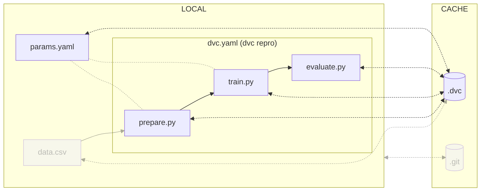

# Chapter 4: Reproduce the ML experiment with DVC

## Introduction

A key component of DVC is the concept of "stages". Stages are essentially
commands that produce a result, whether that be a file or directory. The beauty
of DVC is that these stages are executed only when the dependencies they rely on
have changed. This way, we don't have to waste time re-running unnecessary
steps.

By using DVC stages to create a pipeline, we can execute all of our experiment's
steps in a streamlined manner by simply running the `dvc repro` command. As a result, DVC
makes it easy to reproduce the experiment and track the effects of changes.

In this chapter, you will learn how to:

1. Remove custom rules from the `.gitignore` file
2. Set up four DVC pipeline stages:
- `prepare`
- `featurize`
- `train`
- `evaluate`
1. Visualize the pipeline
2. Execute the pipeline
3. Push the changes to DVC and Git

The following diagram illustrates control flow of the experiment at the end of
this chapter:



As a reminder, the current steps to run the experiment are as follow:

```sh title="Execute the following command(s) in a terminal"
# Prepare the dataset
python src/prepare.py data/data.xml

# Perform feature extraction
python src/featurization.py data/prepared data/features

# Train the model with the extracted features and save it
python src/train.py data/features model.pkl

# Evaluate the model performances
python src/evaluate.py model.pkl data/features
```

Let's get started!

## Steps


### Remove custom rules from the .gitignore file

As seen in the previous chapter, DVC can update `.gitignore` files.

As you will define the entire experiment pipeline with DVC, you can safely
remove all the custom rules from the main `.gitignore` file so DVC can manage
them for you. At the end of this chapter, DVC should have updated all the
`.gitignore` files.

Update the `.gitignore` file to remove your experiment data. The required files
to be ignored will then be added by DVC.

```sh title=".gitignore" hl_lines="6-8"
## Python

# Byte-compiled / optimized / DLL files
__pycache__/

## DVC

# DVC will add new files after this line
```

!!! info

    If using macOS, you might want to ignore `.DS_Store` files as well to avoid pushing Apple's metadata files to your repository.

Check the differences with Git to validate the changes.

```sh title="Execute the following command(s) in a terminal"
# Show the differences with Git
git diff .gitignore
```

The output should be similar to this:

```diff
diff --git a/.gitignore b/.gitignore
index d65f97a..554f913 100644
--- a/.gitignore
+++ b/.gitignore
@@ -1,14 +1,8 @@
-# Data used to train the models
-data/features
-data/prepared
-
-# Artifacts
-evaluation
-
-# The models
-*.pkl
-
## Python

# Byte-compiled / optimized / DLL files
__pycache__/
+
+## DVC
+
+# DVC will add new files after this line
```

### Setup the DVC pipeline stages

A DVC pipeline is a set of stages that are executed in a specific order based on the
dependencies between the stages (deps and outs). The `dvc repro` command
executes the pipeline to reproduce the experiment.

In the following sections, each step of the experiment will be converted into a stage of a DVC pipeline.
The `dvc stage add` command creates a new stage in the pipeline.
This stage will be added to the `dvc.yaml` file that describes the pipeline.
This file can also be edited manually.

The `dvc stage add` accepts some options:

- `-n` specifies the name of the stage
- `-p` specifies the parameters of the stage (referenced in the `params.yaml` file)
- `-d` specifies the dependencies of the stage
- `-o` specifies the outputs of the stage (cached by DVC)
- `--metrics` specifies the metrics of the stage (cached by DVC)
- `--plots` specifies the plots of the stage (cached by DVC)

As parameters are an important part of the experiment, they are versioned in a `params.yaml` file.
DVC keeps track of these parameters and of the corresponding results.

Dependencies and outputs are files or directories that are used or produced by the stage.
If any of these files change, DVC will re-run the command of the stage when using `dvc repro`.

#### `prepare` stage

Run the following command to add a new stage called _prepare_ that prepares the dataset.

```sh title="Execute the following command(s) in a terminal"
dvc stage add -n prepare \
-p prepare.seed,prepare.split \
-d src/prepare.py -d data/data.xml \
-o data/prepared \
python src/prepare.py data/data.xml
```

The values of the parameters `prepare.seed` and `prepare.split` are referenced in the `params.yaml` file.

This stage has the `src/prepare.py` and `data/data.xml` files as dependencies.
If any of these files change, DVC will run the command
`python src/prepare.py data/data.xml` when using `dvc repro`.

The output of this command is stored in the `data/prepared` directory.

Take some time to explore the `dvc.yaml` file and to understand how the pipeline is updated.

#### `featurize` stage

Run the following command to create a new stage called _featurize_ that performs the features extraction.

```sh title="Execute the following command(s) in a terminal"
dvc stage add -n featurize \
-p featurize.max_features,featurize.ngrams \
-d src/featurization.py -d data/prepared \
-o data/features/test.pkl -o data/features/train.pkl \
python src/featurization.py data/prepared data/features
```

The values of the parameters `featurize.max_features` and `featurize.ngrams` are referenced in the `params.yaml` file.

This stage has the `src/featurization.py` file and `data/prepared` directory as dependencies.
If any of these files change, DVC will run the command
`python src/featurization.py data/prepared data/features`
when using `dvc repro`.

The outputs of this command are stored in the `data/features/test.pkl` and
`data/features/train.pkl` files.

Explore the `dvc.yaml` file to understand how the pipeline is updated.

#### `train` stage

Run the following command to create a new stage called _train_ that trains the model.

```sh title="Execute the following command(s) in a terminal"
dvc stage add -n train \
-p train.seed,train.n_est,train.min_split \
-d src/train.py -d data/features \
-o model.pkl \
python src/train.py data/features model.pkl
```

The values of the parameters `train.seed`, `train.n_est` and `train.min_split` are referenced in the `params.yaml` file.

This stage has the `src/train.py` and `data/features` files as dependencies.
If any of these files change, DVC will run the command
`python src/train.py data/features model.pkl` when using `dvc repro`.

The output of this command is stored in the `model.pkl` file.

Explore the `dvc.yaml` file to understand how the pipeline is updated.

#### `evaluate` stage

Run the following command to create a new stage called _evaluate_ that evaluates the model.

```sh title="Execute the following command(s) in a terminal"
dvc stage add -n evaluate \
-d src/evaluate.py -d model.pkl \
-o evaluation/plots/metrics \
-o evaluation/report.html \
--metrics evaluation/metrics.json \
--plots evaluation/plots/prc.json \
--plots evaluation/plots/sklearn/roc.json \
--plots evaluation/plots/sklearn/confusion_matrix.json \
--plots evaluation/plots/importance.png \
python src/evaluate.py model.pkl data/features
```

This stage has the `src/evaluate.py` file and `model.pkl` file, and the `data/features` directory as dependencies.
If any of these files change, DVC will run the command
`python src/evaluate.py model.pkl data/features` when using `dvc repro`.

This command writes the model's metrics to `evaluation/metrics.json`. It writes
the `confusion_matrix` to `evaluation/plots/sklearn/confusion_matrix.json`, the
`precision_recall_curve` to `evaluation/plots/prc.json ` and the `roc_curve` to
`evaluation/plots/sklearn/roc.json` that will be used to create plots.
Here, `no-cache` prevents DVC from caching the metrics and plots.

DVC has the ability to generate images for the plots.
The following command are used to tune the axes of the plots.

```sh title="Execute the following command(s) in a terminal"
# Set the axes for the `precision_recall_curve`
dvc plots modify evaluation/plots/prc.json -x recall -y precision

# Set the axes for the `roc_curve`
dvc plots modify evaluation/plots/sklearn/roc.json -x fpr -y tpr

# Set the axes for the `confusion_matrix`
dvc plots modify evaluation/plots/sklearn/confusion_matrix.json -x actual -y predicted -t confusion
```

Explore the `dvc.yaml` file to understand how the pipeline is updated.

#### Summary of the DVC pipeline

The pipeline is now entirely defined. You can explore the `dvc.yaml` file to
see all the stages and their dependencies.

Notice that DVC also updated the main `.gitignore` file with the model, as it is an output of the
`train` stage.

```sh title=".gitignore" hl_lines="9"
## Python

# Byte-compiled / optimized / DLL files
__pycache__/

## DVC

# DVC will add new files after this line
/model.pkl
```

!!! info

    If using macOS, you might want to ignore `.DS_Store` files as well to avoid pushing Apple's metadata files to your repository.

### Visualize the pipeline

You can visualize the pipeline to check the stages that will be performed.

```sh title="Execute the following command(s) in a terminal"
# Display the Directed Acyclic Graph of the pipeline
dvc dag
```

```
+-------------------+
| data/data.xml.dvc |
+-------------------+
          *
          *
          *
     +---------+
     | prepare |
     +---------+
          *
          *
          *
    +-----------+
    | featurize |
    +-----------+
          *
          *
          *
      +-------+
      | train |
      +-------+
          *
          *
          *
    +----------+
    | evaluate |
    +----------+
```

If any dependencies/outputs change, the affected stages will be re-executed.

### Execute the pipeline

Now that the pipeline has been defined, you can execute it and reproduce the experiment.

```sh title="Execute the following command(s) in a terminal"
# Execute only the required pipeline stages
dvc repro
```

!!! tip

    You can force the execution of the entire pipeline with the command
    `dvc repro --force`.

### Check the changes

Check the changes with Git to ensure all wanted files are here.

```sh title="Execute the following command(s) in a terminal"
# Add all the files
git add .

# Check the changes
git status
```

The output of the `git status` command should be similar to this.

```
On branch main
Your branch is up to date with 'origin/main'.

Changes to be committed:
(use "git restore --staged <file>..." to unstage)
    modified:   .gitignore
    modified:   data/.gitignore
    new file:   data/features/.gitignore
    new file:   dvc.lock
    new file:   dvc.yaml
    new file:   evaluation/.gitignore
    new file:   evaluation/plots/.gitignore
    new file:   evaluation/plots/sklearn/.gitignore
```

### Commit the changes

Commit the changes to the local Git repository.

```sh title="Execute the following command(s) in a terminal"
# Commit the changes
git commit -m "My ML experiment commands are saved with DVC"
```

This chapter is done, you can check the summary.


## Summary

Congrats! You have defined a pipeline and know how to reproduce your experiment.

In this chapter, you have successfully:

1. Removed custom rules from the `.gitignore` file
2. Set up four DVC pipeline stages
- `prepare`
- `featurize`
- `train`
- `evaluate`
3. Visualized the pipeline
4. Executed the pipeline
5. Committed the changes

You fixed some of the previous issues:

- ✅ The steps used to create the model are documented and can be reproduced.

However, you might have identified the following areas for improvement:

- ❌ How can I ensure my changes helps to improve the model?
- ❌ How can I ensure my model still can be run on someone's computer?

In the next chapters, you will enhance the workflow to fix these issues.

You can now safely continue to the next chapter.

## State of the MLOps process

- ✅ Notebook has been transformed into scripts for production
- ✅ Codebase and dataset are versioned
- ✅ Steps used to create the model are documented and can be re-executed
- ❌ Changes to model are not easily visualized
- ❌ Dataset requires manual download and placement
- ❌ Codebase requires manual download and setup
- ❌ Experiment may not be reproducible on other machines
- ❌ Changes to model are not thoroughly reviewed and discussed before integration
- ❌ Model may have required artifacts that are forgotten or omitted in saved/loaded state
- ❌ Model cannot be easily used from outside of the experiment context

You will address these issues in the next chapters for improved efficiency and
collaboration. Continue the guide to learn how.

## Sources

Highly inspired by:

* the [_Get Started: Data Pipelines_ - dvc.org](https://dvc.org/doc/start/data-management/data-pipelines) guide.
