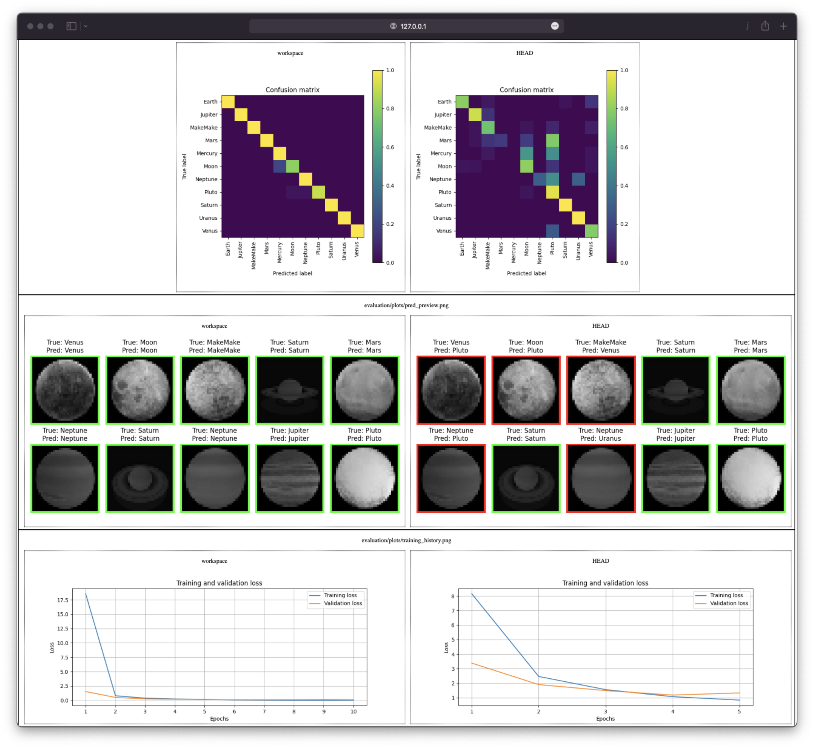

# Chapter 5: Track model evolution with DVC

??? info "You want to take over from this chapter? Collapse this section and follow the instructions below."

    _Work in progress._

    [//]: # "TODO"

## Introduction

In the previous chapter, you did set up a DVC pipeline to reproduce your
experiment.

Once this stage is created, you will be able to change our model's configuration,
evaluate the new configuration and compare its performance with the last
commited ones.

In this chapter, you will learn how to:

1. Update the parameters of the experiment
2. Reproduce the experiment
3. Visualize the changes made to the model

Let's get started!

## Steps

### Update the parameters of the experiment

Update your experiment with the following parameters by editing the
`params.yaml` file.

```yaml title="params.yaml" hl_lines="10"
prepare:
  seed: 77
  split: 0.2
  image_size: [32, 32]
  grayscale: True

train:
  seed: 77
  lr: 0.0001
  epochs: 10
  conv_size: 32
  dense_size: 64
  output_classes: 11
```

Check the differences with Git to validate the changes.

```sh title="Execute the following command(s) in a terminal"
# Show the differences with Git
git diff params.yaml
```

The output should be similar to this.

```diff
diff --git a/params.yaml b/params.yaml
index 5bb698e..6a6ff45 100644
--- a/params.yaml
+++ b/params.yaml
@@ -7,7 +7,7 @@ prepare:
 train:
   seed: 77
   lr: 0.0001
-  epochs: 5
+  epochs: 10
   conv_size: 32
   dense_size: 64
   output_classes: 11
```

Here, we simply changed the `epochs` parameter of the
`train` stage, which should slightly affect the model's performance.

### Reproduce the experiment

Let's discover if these changes are positive or not! To do so, you will need to
reproduce the experiment.

```sh title="Execute the following command(s) in a terminal"
# Run the experiment. DVC will automatically run all required stages
dvc repro
```

### Compare the two iterations

We will now use DVC to compare your changes with the last commited ones. For DVC,
`HEAD` refers to the last commit on the branch you are working on (at this
moment, the branch `main`), and `workspace` refers to the current state of your
working directory.

!!! note

    Remember? We did set the parameters, metrics and plots
    in the previous chapter: [Chapter 4: Reproduce the ML experiment with
    DVC](../chapter-4-reproduce-the-ml-experiment-with-dvc/index.md).

#### Compare the parameters difference

In order to compare the parameters, you will need to use the `dvc params diff`.
This command will compare the parameters that were set on `HEAD` and the ones in
your current `workspace`.

```sh title="Execute the following command(s) in a terminal"
# Compare the parameters' difference
dvc params diff
```

The output should look like this.

```
Path         Param         HEAD    workspace
params.yaml  train.epochs  5       10
```

DVC displays the differences between `HEAD` and `workspace`, so you can easily
compare the two iterations.

#### Compare the metrics difference

Similarly, you can use the `dvc metrics diff` command to compare the metrics
that were computed on `HEAD` and the ones that were computed in your current
`workspace`.

```sh title="Execute the following command(s) in a terminal"
# Compare the metrics' difference
dvc metrics diff
```

The output should look like this.

```
Path                     Metric    HEAD     workspace    Change
evaluation/metrics.json  val_acc   0.58879  0.74143      0.15265
evaluation/metrics.json  val_loss  1.89269  1.34434      -0.54835
```

Again, DVC shows you the differences, so you can easily compare the two
iterations. Here, you can see that the metrics have slightly improved.

#### Compare the plots difference

```sh title="Execute the following command(s) in a terminal"
# Create the report to display the plots
dvc plots diff --open
```

The effect of the `dvc plots diff` command is to create a `dvc_plots` directory
in the working directory. This directory contains a report to visualize the
plots in a browser.

As for the other commands, DVC shows you the differences so you can easily
compare the two iterations.

Here is a preview of the report:

{ loading=lazy }

#### Summary of the model evolutions

You should notice the improvements made to the model thanks to the DVC reports.
These improvements are small but illustrate the workflow. Try to tweak the
parameters to improve the model and play with the reports to see how your
model's performance changes.

#### Update the .gitignore file

The `dvc plots diff` creates a `dvc_plots` directory in the working directory.
This directory should be ignored by Git.

Add the `dvc_plots` directory to the `.gitignore` file.

```sh title=".gitignore" hl_lines="9-10"
## Python
.venv/

# Byte-compiled / optimized / DLL files
__pycache__/

## DVC

# DVC plots
dvc_plots

# DVC will add new files after this line
/model
```

!!! info

    If using macOS, you might want to ignore `.DS_Store` files as well to avoid pushing Apple's metadata files to your repository.

Check the differences with Git to validate the changes.

```sh title="Execute the following command(s) in a terminal"
# Show the differences with Git
git diff .gitignore
```

The output should be similar to this.

```diff
diff --git a/.gitignore b/.gitignore
index 8a2668e..cbfa93b 100644
--- a/.gitignore
+++ b/.gitignore
@@ -6,5 +6,8 @@ __pycache__/

 ## DVC

+# DVC plots
+dvc_plots
+
 # DVC will add new files after this line
 /model
```

### Check the changes

Check the changes with Git to ensure that all the necessary files are tracked.

```sh title="Execute the following command(s) in a terminal"
# Add all the files
git add .

# Check the changes
git status
```

The output should look like this.

```
On branch main
Changes to be committed:
  (use "git restore --staged <file>..." to unstage)
        modified:   .gitignore
        modified:   dvc.lock
        modified:   params.yaml
```

### Commit the changes

Commit the changes to the local Git repository.

```sh title="Execute the following command(s) in a terminal"
# Commit the changes
git commit -m "My ML experiment changes are tracked"
```

This chapter is done, you can check the summary.

## Summary

Congrats! You now have a simple way to compare the two iterations of your experiment.

In this chapter, you have successfully:

1. Updated the experiment parameters
2. Reproduced the experiment
3. Visualized the changes made to the experiment
4. Commited the changes

You fixed some of the previous issues:

- ✅ The changes done to a model can be visualized with parameters, metrics and
plots to identify differences between iterations

You have solid metrics to evaluate the changes before integrating your work in
the code codebase.

You can now safely continue to the next chapter.

## State of the MLOps process

- ✅ Notebook has been transformed into scripts for production
- ✅ Codebase and dataset are versioned
- ✅ Steps used to create the model are documented and can be re-executed
- ✅ Changes done to a model can be visualized with parameters, metrics and plots to identify
differences between iterations
- ❌ Dataset requires manual download and placement
- ❌ Codebase requires manual download and setup
- ❌ Experiment may not be reproducible on other machines
- ❌ Changes to model are not thoroughly reviewed and discussed before integration
- ❌ Model may have required artifacts that are forgotten or omitted in saved/loaded state
- ❌ Model cannot be easily used from outside of the experiment context
- ❌ Model cannot be deployed on and accessed from a Kubernetes cluster
- ❌ Model cannot be trained on hardware other than the local machine

## Sources

Highly inspired by:

- [_Get Started: Metrics, Parameters, and Plots_ - dvc.org](https://dvc.org/doc/start/data-management/metrics-parameters-plots)
