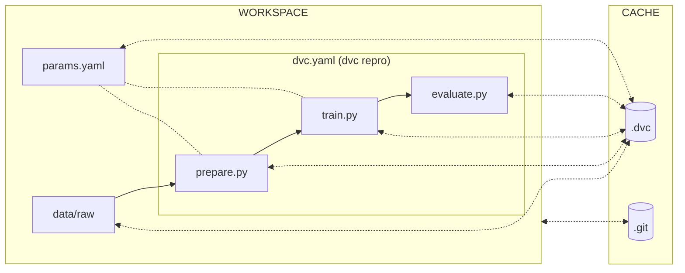

# Conclusion

Congratulations! You did it!

In this first part, you were able to run a simple ML experiment with Jupyter
Notebook, adapt and move the Jupyter Notebook to Python scripts, initialize Git
and DVC for local training, reproduce the ML experiment with DVC and track model
evolution with DVC.

The following diagram illustrates the bricks you set up at the end of this part.

Do not forget to [Clean up](./clean-up.md) if you want to stop here or continue
with
[Part 2 - Move to the cloud](../part-2-move-the-model-to-the-cloud/introduction.md)
of the MLOps guide!
