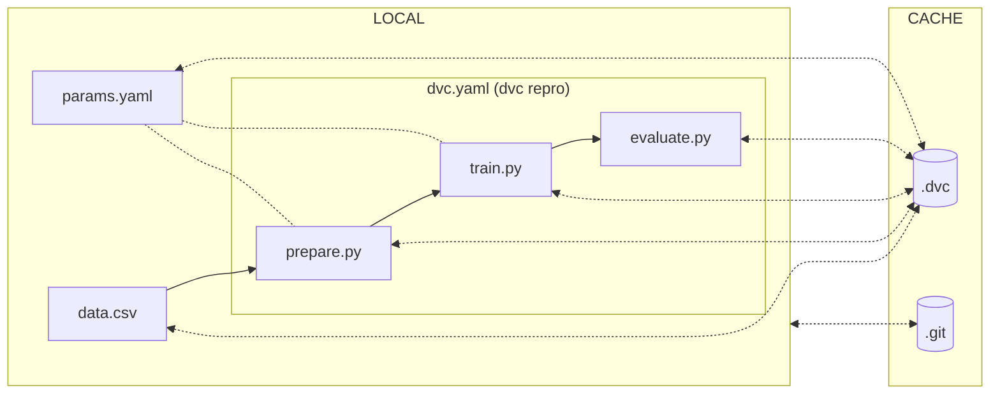

# Conclusion

```mermaid
flowchart LR
	dot_dvc[(.dvc)]
	dot_git[(.git)]
	data[data.csv] <-.-> dot_dvc
    localGraph <-....-> dot_git
	subgraph cacheGraph[CACHE]
		dot_dvc
		dot_git
	end
	subgraph localGraph[LOCAL]
		prepare[prepare.py] <-.-> dot_dvc
		train[train.py] <-.-> dot_dvc
		evaluate[evaluate.py] <-.-> dot_dvc
		data --> prepare
		subgraph dvcGraph["dvc.yaml (dvc repro)"]
			prepare --> train
			train --> evaluate
		end
        params[params.yaml] -.- prepare
        params -.- train
        params <-.-> dot_dvc
	end
```
