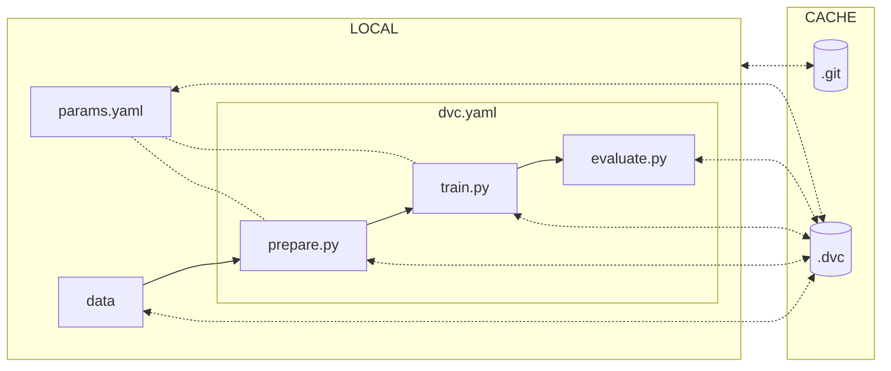

# Conclusion

```mermaid
flowchart LR
	789994[(".dvc")]
	429113[(".git")]
	980408["data"] <-.-> 789994
    356399 <-....-> 429113
	subgraph 438901["CACHE"]
		789994
		429113
	end
	subgraph 356399["LOCAL"]
		672354["prepare.py"] <-.-> 789994
		347464["train.py"] <-.-> 789994
		964259["evaluate.py"] <-.-> 789994
		980408 --> 672354
		subgraph 695374["dvc.yaml"]
			672354 --> 347464
			347464 --> 964259
		end
        238472["params.yaml"] -.- 672354
        238472 -.- 347464
        238472 <-.-> 789994
	end
```
