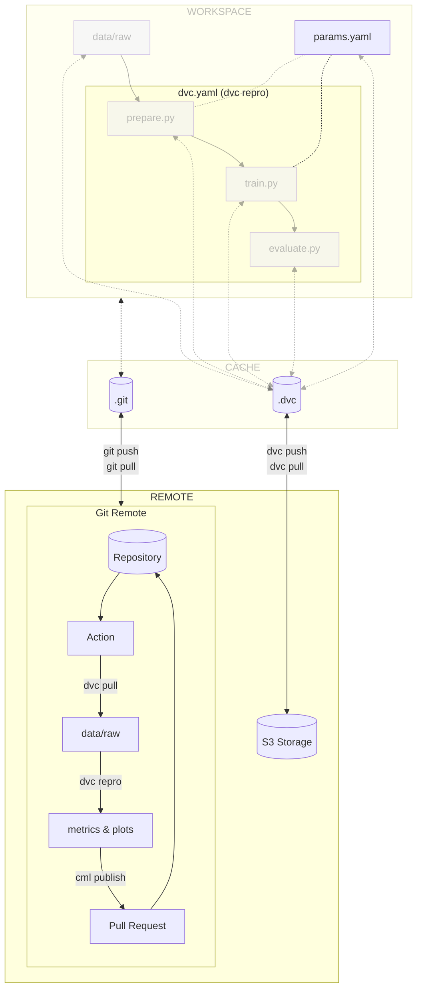

# Chapter 10 - Work efficiently and collaboratively with Git

## Introduction

The objective of this chapter is to work effectively and collaboratively on the
model with the help of [:simple-git: Git](../tools.md), [CML](../tools.md) and
the CI/CD pipeline.

This workflow allows collaborators to engage in online discussions, enabling
them to thoroughly review and deliberate on proposed changes before merging them
into the codebase.

In this chapter, you will learn how to:

1. Open an issue in your issue tracker
2. Create a new branch to add your changes
3. Check out the new branch
4. Commit and push experiment changes
5. Create a pull request/merge request
6. Visualize the execution of the CI/CD pipeline
7. Visualize the CML report that is added to your pull request/merge request
8. Merge the pull request/merge request to the main branch
9. Switch back to the main branch and pull latest changes

The following diagram illustrates the control flow of the experiment:



## Steps

### Open an issue

=== ":simple-github: GitHub"

    Create a new issue by going to the **Issues** section from the top header of
    your GitHub repository. Select **New issue** and describe the
    work/improvements/ideas that you want to integrate to the codebase. In this
    guide, you can name the issue _Demonstrate model evolution tracking_. Create the
    issue by selecting **Submit new issue**.

=== ":simple-gitlab: GitLab"

    Create a new issue by going to the **Issues** section from the left sidebar of
    your GitLab project. Select **New issue** and describe the
    work/improvements/ideas that you want to integrate to the codebase. In this
    guide, you can name the issue _Demonstrate model evolution tracking_. Create the
    issue by selecting **Submit new issue**.

### Create a branch for the issue

=== ":simple-github: GitHub"

    In the newly created issue, select
    **Create a branch for this issue or link a pull request** from the right
    sidebar. Create the branch by selecting **Create branch**. A new pop-up opens
    with the name of the branch you want to checkout to.

=== ":simple-gitlab: GitLab"

    In the newly created issue, select **Create merge request** and change the merge
    request configuration if needed. Create the merge request by selecting
    **Create merge request**. This will automatically create a new branch linked to
    the issue.

### Checkout the new branch

On your machine, check out the new branch. Replace
`<the_name_of_the_new_branch>` with the name of the branch to checkout to:

```sh title="Execute the following command(s) in a terminal"
# Get the latest updates from the remote origin
git fetch origin

# Check to the new branch
git checkout <the_name_of_the_new_branch>
```

### Update the parameters of the experiment

Similarly to what you have done in
[Chapter 5: Track model evolutions with DVC](../part-1-local-training-and-model-evaluation/chapter-5-track-model-evolution-with-dvc.md),
you will update the experiment to see the evolution being tracked remotely by
CML.

Update your experiment with the following parameters by editing the
`params.yaml` file:

```yaml title="params.yaml" hl_lines="9 11-12"
prepare:
  seed: 77
  split: 0.2
  image_size: [32, 32]
  grayscale: True

train:
  seed: 77
  lr: 0.001
  epochs: 10
  conv_size: 64
  dense_size: 128
  output_classes: 11
```

Check the differences with Git to validate the changes:

```sh title="Execute the following command(s) in a terminal"
# Show the differences with Git
git diff params.yaml
```

The output should be similar to this:

```diff
diff --git a/params.yaml b/params.yaml
index 6a6ff45..4572100 100644
--- a/params.yaml
+++ b/params.yaml
@@ -6,8 +6,8 @@ prepare:

 train:
   seed: 77
-  lr: 0.0001
+  lr: 0.001
   epochs: 10
-  conv_size: 32
-  dense_size: 64
+  conv_size: 64
+  dense_size: 128
   output_classes: 11
```

Here, you simply changed the `lr` (learning rate), `conv_size` and `dense_size`
parameters of the `train` stage, which should slightly affect the model's
performance.

Reproduce the experiment with DVC:

```sh title="Execute the following command(s) in a terminal"
# Reproduce the experiment
dvc repro
```

!!! warning

    The `dvc repro` command is important to execute after each change to the
    experiment locally. It ensures that the experiment can be reproduced from the
    CI/CD pipeline. Later in part 3, you will see what to do if the experiment is
    too long to be reproduced locally and how to do it from the CI/CD pipeline.

### Commit and push the experiment changes

You can now commit and push the above changes to trigger a change on the remote
repository.

Check the changes with Git to ensure all wanted files are here:

```sh title="Execute the following command(s) in a terminal"
# Add all the files
git add .

# Check the status
git status
```

The output of the `git status` command should be similar to this.

```text
On branch 1-demonstrate-model-evolution-tracking
Your branch is up to date with 'cml-report'.

Changes to be committed:
  (use "git restore --staged <file>..." to unstage)
        modified:   dvc.lock
        modified:   params.yaml
```

Push the changes to the remote repository.

```sh title="Execute the following command(s) in a terminal"
# Upload the experiment data and cache to the remote bucket
dvc push

# Commit the changes
git commit -m "Made some changes to the model"

# Push the changes
git push
```

### Create a pull request/merge request

=== ":simple-github: GitHub"

    Go back to your GitHub repository. A new **Compare & pull request** button
    should automatically appear. Click on it. Name the pull request
    _Demonstrate model evolution tracking_ and select **Create pull request**.

=== ":simple-gitlab: GitLab"

    The merge request has already been created from the issue earlier, you can
    proceed to the next step.

### Visualize the execution of the CI/CD pipeline

=== ":simple-github: GitHub"

    The pull request opens and automatically starts the workflow
    `MLOps / train_and_report (pull_request)` under the
    **Some checks haven’t completed yet** section. You can click on **Details** to
    see the execution details.

    Explore the output and try to identify the steps that are executed.

    Once the workflow has successfully been executed, the
    **Some checks haven't completed yet** section should become
    **All checks have passed**.

=== ":simple-gitlab: GitLab"

    Open the merge request. The pipeline should start. Click on the pipeline number
    to see its details.

    Explore the stages and jobs and try to see how the configuration file shows up
    in GitLab.

### Visualize the CML report

=== ":simple-github: GitHub"

    When the CI/CD pipeline completes, a new comment is added to your pull request.
    Check the pull request and examine the report published by CML. As it uses the
    evaluation data that was pulled from DVC, it can uses it to display all the
    plots.

    <div style="display: flex" markdown>
        <figure markdown>
            { loading=lazy }
        </figure> <figure markdown>
            { loading=lazy }
        </figure> <figure markdown>
            { loading=lazy }
        </figure> <figure markdown>
            { loading=lazy }
        </figure>
    </div>

=== ":simple-gitlab: GitLab"

    When the CI/CD pipeline completes, a new comment is added to your merge request.
    Check the merge request and examine the report made by CML. As it uses the
    evaluation data that was pulled DVC, it can uses it to display all the plots.

    <div style="display: flex" markdown>
        <figure markdown>
            { loading=lazy }
        </figure> <figure markdown>
            { loading=lazy }
        </figure> <figure markdown>
            { loading=lazy }
        </figure> <figure markdown>
            { loading=lazy }
        </figure>
    </div>

### Merge the pull request/merge request

=== ":simple-github: GitHub"

    Once you are satisfied with the model's performance, you can merge the changes.

    Go back to the pull request. At the end of the page, select
    **Merge pull request**. Confirm the merge by selecting **Confirm merge**.

    The associated issue will be automatically closed as well.

    You can delete the branch by clicking **Delete branch** to clean up your
    repository. If you ever need to go back to this branch, you can always restore
    the branch from this menu.

    Congratulations! You can now iterate on your model while keeping a trace of the
    improvements made to it. You can visualize and discuss the changes made to a
    model before merging them into the codebase.

=== ":simple-gitlab: GitLab"

    Once you are satisfied with the model's performance, you can merge the changes.

    Go back to the merge request. Select **Mark as ready**. This will allow to merge
    the changes. Confirm the merge by selecting **Merge** (you might need to refresh
    the page to see this button).

    The associated issue will be automatically closed as well.

    Congratulations! You can now iterate on your model while keeping a trace of the
    improvements made to it. You can visualize and discuss the changes made to a
    model before merging them into the codebase.

!!! tip "Protecing the codebase"

    To ensure reliability and continuous improvement, the `main` branch should only
    include thoroughly reviewed and validated changes that benefit the model and can
    be replicated.

    Establishing branch protection rules that require a pull request (PR) or merge
    request (MR) process before merging into the main codebase guarantees that all
    changes are reviewed. This approach not only encourages collaboration and
    knowledge sharing among team members, but also reduces the risk of introducing
    errors that could disrupt the production workflow.

    === ":simple-github: GitHub"

        To set up branch protection in your GitHub repository, navigate to
        **Settings > Branches**. Here, you can add branch protection rules for the
        `main` branch:

        * Check *Require a pull request before merging*
        * Uncheck *Allow force pushes*
        * Uncheck *Allow deletions*

        These settings ensure that all changes pass the CI/CD pipeline before merging.

    === ":simple-gitlab: GitLab"

        To set up branch protection in your GitLab repository, navigate to
        **Settings > Repository > Protected branches**. Here, you can add protection
        rules for the `main` branch:

        * From the *Allowed to merge* list, select **Developers + Maintainers**.
        * From the *Allowed to push and merge* list, select **No one**.
        * Uncheck *Allowed to force push*

        These settings ensure that all changes pass the CI/CD pipeline before merging.

### Switch back to the main branch and pull latest changes

Now that the merge is done, you can get the changes on the main branch.

```sh title="Execute the following command(s) in a terminal"
# Get the latest updates from the remote origin
git fetch origin

# Check to the main branch
git checkout main

# Pull the changes made by the pull request/merge request
git pull
```

This chapter is done, you can check the summary.

## Summary

In this chapter, you have successfully:

1. Updated the CI/CD configuration file to generate a CML report
2. Pushed the updated CI/CD configuration file to Git
3. Opened an issue in your issue tracker
4. Created a new branch to add your changes
5. Checked out the new branch
6. Commit and pushed experiment changes
7. Created a pull request/merge request
8. Visualized the execution of the CI/CD pipeline
9. Visualized the CML report that is added to your pull request/merge request
10. Merged the pull request/merge request to the main branch
11. Switched back to the main branch and pulled latest changes

However, you might have identified the following areas for improvement:

- [ ] How can I serve my model to the rest of the world?

In the next chapters, you will enhance the workflow to fix those issues.

You can now safely continue to the next chapter.

## State of the MLOps process

- [x] Notebook has been transformed into scripts for production
- [x] Codebase and dataset are versioned
- [x] Steps used to create the model are documented and can be re-executed
- [x] Changes done to a model can be visualized with parameters, metrics and
      plots to identify differences between iterations
- [x] Codebase can be shared and improved by multiple developers
- [x] Dataset can be shared among the developers and is placed in the right
      directory in order to run the experiment
- [x] Experiment can be executed on a clean machine with the help of a CI/CD
      pipeline
- [x] CI/CD pipeline is triggered on pull requests and reports the results of
      the experiment
- [x] Changes to model can be thoroughly reviewed and discussed before
      integrating them into the codebase
- [ ] Model may have required artifacts that are forgotten or omitted in
      saved/loaded state
- [ ] Model cannot be easily used from outside of the experiment context
- [ ] Model requires manual publication to the artifact registry
- [ ] Model is not accessible on the Internet and cannot be used anywhere
- [ ] Model requires manual deployment on the cluster
- [ ] Model cannot be trained on hardware other than the local machine

You will address these issues in the next chapters for improved efficiency and
collaboration. Continue the guide to learn how.

## Sources

Highly inspired by:

- [_Creating an issue_ - docs.github.com](https://docs.github.com/en/issues/tracking-your-work-with-issues/creating-an-issue)
- [_Creating a branch to work on an issue_ - docs.github.com](https://docs.github.com/en/issues/tracking-your-work-with-issues/creating-a-branch-for-an-issue)
