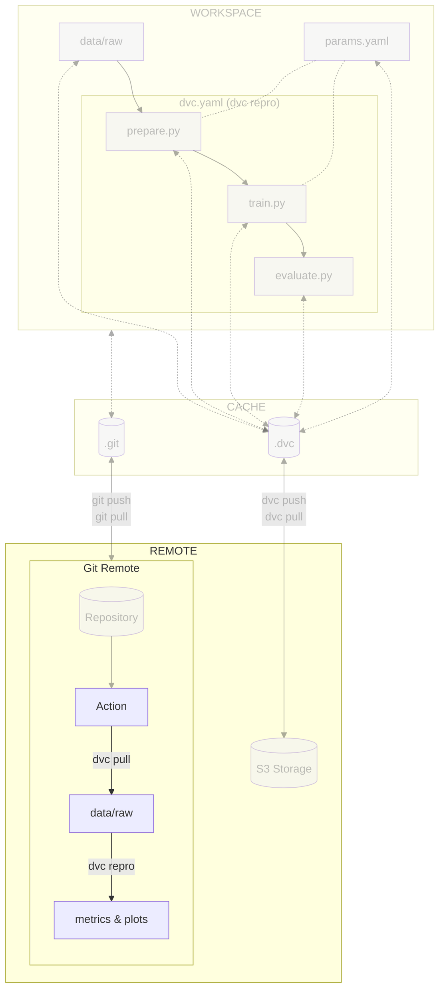

# Chapter 2.3 - Reproduce the ML experiment in a CI/CD pipeline

## Introduction

At this point, your code, your data and your execution process should be shared
with [:simple-git: Git](../tools.md) and [:simple-dvc: DVC](../tools.md).

Now, it's time to enhance your workflow further by incorporating a CI/CD
(Continuous Integration/Continuous Deployment) pipeline. This addition will
enable you to execute your ML experiments remotely and reproduce it, ensuring
that any changes made to the project won't inadvertently break. This helps
eliminate the notorious "but it works on my machine" effect, where code behave
differently across different environments.

In this chapter, you will learn how to:

1. Grant access to the S3 bucket on the cloud provider
2. Store the cloud provider credentials in the CI/CD configuration
3. Create the CI/CD pipeline configuration file
4. Push the CI/CD pipeline configuration file to Git
5. Visualize the execution of the CI/CD pipeline

The following diagram illustrates the control flow of the experiment at the end
of this chapter:



## Steps

### Set up access to the S3 bucket of the cloud provider

DVC will need to log in to the S3 bucket of the cloud provider to download the
data inside the CI/CD pipeline:

=== ":simple-googlecloud: Google Cloud"

    Google Cloud allows the creation of a "Service Account", so you don't have to
    store/share your own credentials. A Service Account can be deleted, hence
    revoking all the access it had.

    Create the Google Service Account and its associated Google Service Account Key
    to access Google Cloud without your own credentials.

    The key will be stored in your `~/.config/gcloud` directory under the name
    `google-service-account-key.json`:

    !!! danger

        You must **never** add and commit this file to your working directory. It is a
        sensitive data that you must keep safe.

    ```sh title="Execute the following command(s) in a terminal"
    # Create the Google Service Account
    gcloud iam service-accounts create google-service-account \
        --display-name="Google Service Account"

    # Set the permissions for the Google Service Account
    gcloud projects add-iam-policy-binding $GCP_PROJECT_ID \
        --member="serviceAccount:google-service-account@${GCP_PROJECT_ID}.iam.gserviceaccount.com" \
        --role="roles/storage.objectViewer"

    # Create the Google Service Account Key
    gcloud iam service-accounts keys create ~/.config/gcloud/google-service-account-key.json \
        --iam-account=google-service-account@${GCP_PROJECT_ID}.iam.gserviceaccount.com
    ```

    !!! info

        The path `~/.config/gcloud` should be created when installing `gcloud`. If it
        does not exist, you can create it by running `mkdir -p ~/.config/gcloud`

=== ":material-cloud: Using another cloud provider? Read this!"

    This guide has been written with Google Cloud in mind. We are open to
    contributions to add support for other cloud providers such as
    [:simple-amazonwebservices: Amazon Web Services](https://aws.amazon.com),
    [:simple-exoscale: Exoscale](https://www.exoscale.com),
    [:material-microsoft-azure: Microsoft Azure](https://azure.microsoft.com) or
    [:simple-kubernetes: Self-hosted Kubernetes](https://kubernetes.io) but we might
    not officially support them.

    If you want to contribute, please open an issue or a pull request on the
    [GitHub repository](https://github.com/swiss-ai-center/a-guide-to-mlops). Your
    help is greatly appreciated!

### Store the cloud provider credentials in the CI/CD configuration

Now that the credentials are created, you need to store them in the CI/CD
configuration. Depending on the CI/CD platform you are using, the process will
be different:

=== ":simple-googlecloud: Google Cloud"

    **Display the Google Service Account key**

    The service account key is stored on your computer as a JSON file. You need to
    display it and store it as a CI/CD variable in a text format.

    Display the Google Service Account key that you have downloaded from Google
    Cloud:

    ```sh title="Execute the following command(s) in a terminal"
    # Display the Google Service Account key
    cat ~/.config/gcloud/google-service-account-key.json
    ```

    **Store the Google Service Account key as a CI/CD variable**

    Store the output as a CI/CD variable by going to the **Settings** section from
    the top header of your GitHub repository.

    Select **Secrets and variables > Actions** and select **New repository secret**.

    Create a new variable named `GOOGLE_SERVICE_ACCOUNT_KEY` with the output value
    of the Google Service Account key file as its value. Save the variable by
    selecting **Add secret**.

=== ":material-cloud: Using another cloud provider? Read this!"

    This guide has been written with Google Cloud in mind. We are open to
    contributions to add support for other cloud providers such as
    [:simple-amazonwebservices: Amazon Web Services](https://aws.amazon.com),
    [:simple-exoscale: Exoscale](https://www.exoscale.com),
    [:material-microsoft-azure: Microsoft Azure](https://azure.microsoft.com) or
    [:simple-kubernetes: Self-hosted Kubernetes](https://kubernetes.io) but we might
    not officially support them.

    If you want to contribute, please open an issue or a pull request on the
    [GitHub repository](https://github.com/swiss-ai-center/a-guide-to-mlops). Your
    help is greatly appreciated!

### Create the CI/CD pipeline configuration file

At the root level of your Git repository, create a GitHub Workflow configuration
file `.github/workflows/mlops.yaml`. Take some time to understand the train job
and its steps:

```yaml title=".github/workflows/mlops.yaml"
name: MLOps

on:
  # Runs on pushes targeting main branch
  push:
    branches:
      - main

  # Runs on pull requests
  pull_request:

  # Allows you to run this workflow manually from the Actions tab
  workflow_dispatch:

jobs:
  train:
    runs-on: ubuntu-latest
    steps:
      - name: Checkout repository
        uses: actions/checkout@v5
      - name: Setup Python
        uses: actions/setup-python@v6
        with:
          python-version: '3.13'
          cache: pip
      - name: Install dependencies
        run: pip install --requirement requirements-freeze.txt
      - name: Login to Google Cloud
        uses: google-github-actions/auth@v3
        with:
          credentials_json: '${{ secrets.GOOGLE_SERVICE_ACCOUNT_KEY }}'
      - name: Train model
        run: dvc repro --pull
```

!!! tip

    Instead of running `dvc pull` and `dvc repro` separately, you can run them
    together with `dvc repro --pull`.

### Push the CI/CD pipeline configuration file to Git

Push the CI/CD pipeline configuration file to Git:

```sh title="Execute the following command(s) in a terminal"
# Add the configuration file
git add .github/workflows/mlops.yaml

# Commit the changes
git commit -m "Use a pipeline to run my experiment on each push"

# Push the changes
git push
```

### Check the results

You can see the pipeline running on the **Actions** page.

You should see a newly created pipeline. The pipeline should log into Google
Cloud, pull the data from DVC and reproduce the experiment. If you encounter
cache errors, verify that you have pushed all data to DVC with `dvc push`.

You may have noticed that DVC was able to skip all stages as its cache is up to
date. It helps you to ensure the experiment can be run (all data and metadata
are up to date) and that the experiment can be reproduced (the results are the
same).

This chapter is done, you can check the summary.

## Summary

Congratulations! You now have a CI/CD pipeline that will run the experiment on
each commit.

In this chapter, you have successfully:

1. Granted access to the S3 bucket on the cloud provider
2. Stored the cloud provider credentials in the CI/CD configuration
3. Created the CI/CD pipeline configuration file
4. Pushed the CI/CD pipeline configuration file to Git
5. Visualized the execution of the CI/CD pipeline

You fixed some of the previous issues:

- [x] The experiment can be executed on a clean machine with the help of a CI/CD
      pipeline

You have a CI/CD pipeline to ensure the whole experiment can still be reproduced
using the data and the commands to run using DVC over time.

You can now safely continue to the next chapter.

!!! abstract "Take away"

    - **CI/CD pipelines eliminate "works on my machine" problems**: By running
      experiments in a fresh, clean environment on every commit, you ensure that your
      code is truly reproducible and doesn't rely on hidden local configurations.
    - **Secrets management is critical for cloud access**: Storing cloud credentials
      as CI/CD secrets (GitHub Secrets) keeps sensitive information out of your
      codebase while allowing automated workflows to access required resources.
    - **dvc repro --pull combines data retrieval and execution**: This single
      command pulls data from DVC remote storage and reproduces the experiment, making
      CI/CD pipeline configurations simpler and more maintainable.
    - **Automated validation catches issues early**: Running your full pipeline on
      every push validates that all dependencies, data, and metadata are properly
      tracked, catching integration issues before they reach production.

## State of the MLOps process

- [x] Notebook has been transformed into scripts for production
- [x] Codebase and dataset are versioned
- [x] Steps used to create the model are documented and can be re-executed
- [x] Changes done to a model can be visualized with parameters, metrics and
      plots to identify differences between iterations
- [x] Codebase can be shared and improved by multiple developers
- [x] Dataset can be shared among the developers and is placed in the right
      directory in order to run the experiment
- [x] Experiment can be executed on a clean machine with the help of a CI/CD
      pipeline
- [ ] CI/CD pipeline does not report the results of the experiment
- [ ] Changes to model are not thoroughly reviewed and discussed before
      integration
- [ ] Model may have required artifacts that are forgotten or omitted in
      saved/loaded state
- [ ] Model cannot be easily used from outside of the experiment context
- [ ] Model requires manual publication to the artifact registry
- [ ] Model is not accessible on the Internet and cannot be used anywhere
- [ ] Model requires manual deployment on the cluster
- [ ] Model cannot be trained on hardware other than the local machine
- [ ] Model cannot be trained on custom hardware for specific use-cases

You will address these issues in the next chapters for improved efficiency and
collaboration. Continue the guide to learn how.

## Sources

Highly inspired by:

- [_Creating and managing service accounts_ - cloud.google.com](https://cloud.google.com/iam/docs/creating-managing-service-accounts)
- [_Create and manage service account keys_ - cloud.google.com](https://cloud.google.com/iam/docs/creating-managing-service-account-keys)
- [_IAM basic and predefined roles reference_ - cloud.google.com](https://cloud.google.com/iam/docs/understanding-roles)
- [_Using service accounts_ - dvc.org](https://dvc.org/doc/user-guide/setup-google-drive-remote#using-service-accounts)
- [_Creating encrypted secrets for a repository_ - docs.github.com](https://docs.github.com/en/actions/security-guides/encrypted-secrets#creating-encrypted-secrets-for-a-repository)
- [_Triggering a workflow_ - docs.github.com](https://docs.github.com/en/actions/using-workflows/triggering-a-workflow)
