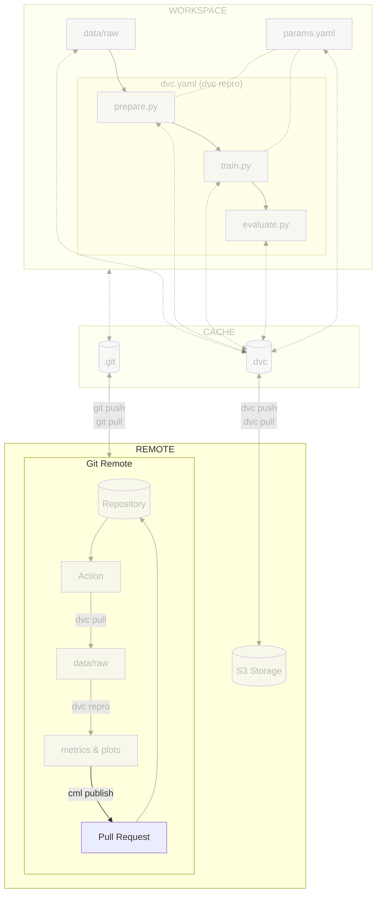

# Chapter 2.4 - Track model evolution in the CI/CD pipeline with CML

## Introduction

At this point, you have a CI/CD pipeline that will run the experiment on each
commit. However, you may want to visualize the results of the experiment in the
pipeline. For example, you may want to see the metrics and plots generated by
the experiment. This is where [CML](../tools.md) comes in.

In this chapter, you will learn how to:

1. Update the CI/CD pipeline configuration file to visualize them with CML
2. Push the CI/CD pipeline configuration file to Git
3. Visualize the execution of the CI/CD pipeline

The following diagram illustrates the control flow of the experiment at the end
of this chapter:



## Steps

The reports produced by CML compare the current run with a designated target
reference.

The target reference can be a specific commit, allowing for a comparison between
the current run and the run associated with that particular commit.
Alternatively, it can be a branch, enabling a comparison between the current run
and the run linked to the target branch.

Numerous workflows facilitate discussions and the integration of work into a
target reference. You will focus on a method that is commonly used on GitHub -
pull requests (PRs) - to incorporate the work performed into the `main` branch.

### Update the CI/CD pipeline configuration file

You will enhance the CI/CD pipeline by adding an automated report comparing new
parameters and new metrics to the main branch, and published as a comment.

These additions will enable a comprehensive analysis of branches and facilitate
collaboration and decision-making within the team.

Update the `.github/workflows/mlops.yaml` file with the following content.
Explore this file to understand the `train-and-report` stage and its steps:

```yaml title=".github/workflows/mlops.yaml" hl_lines="16-17 35-87"
name: MLOps

on:
  # Runs on pushes targeting main branch
  push:
    branches:
      - main

  # Runs on pull requests
  pull_request:

  # Allows you to run this workflow manually from the Actions tab
  workflow_dispatch:

jobs:
  train-and-report:
    permissions: write-all
    runs-on: ubuntu-latest
    steps:
      - name: Checkout repository
        uses: actions/checkout@v5
      - name: Setup Python
        uses: actions/setup-python@v6
        with:
          python-version: '3.13'
          cache: pip
      - name: Install dependencies
        run: pip install --requirement requirements-freeze.txt
      - name: Login to Google Cloud
        uses: google-github-actions/auth@v3
        with:
          credentials_json: '${{ secrets.GOOGLE_SERVICE_ACCOUNT_KEY }}'
      - name: Train model
        run: dvc repro --pull
      - name: Setup CML
        if: github.event_name == 'pull_request'
        uses: iterative/setup-cml@v2
        with:
          version: '0.20.6'
      - name: Create CML report
        if: github.event_name == 'pull_request'
        env:
          REPO_TOKEN: ${{ secrets.GITHUB_TOKEN }}
        run: |
          # Fetch all other Git branches
          git fetch --depth=1 origin main:main

          # Add title to the report
          echo "# Experiment Report (${{ github.sha }})" >> report.md

          # Compare parameters to main branch
          echo "## Params workflow vs. main" >> report.md
          dvc params diff main --md >> report.md

          # Compare metrics to main branch
          echo "## Metrics workflow vs. main" >> report.md
          dvc metrics diff main --md >> report.md

          # Compare plots (images) to main branch
          dvc plots diff main

          # Create plots
          echo "## Plots" >> report.md

          # Create training history plot
          echo "### Training History" >> report.md
          echo "#### main" >> report.md
          echo '' >> report.md
          echo "#### workspace" >> report.md
          echo '' >> report.md

          # Create predictions preview
          echo "### Predictions Preview" >> report.md
          echo "#### main" >> report.md
          echo '' >> report.md
          echo "#### workspace" >> report.md
          echo '' >> report.md

          # Create confusion matrix
          echo "### Confusion Matrix" >> report.md
          echo "#### main" >> report.md
          echo '' >> report.md
          echo "#### workspace" >> report.md
          echo '' >> report.md

          # Publish the CML report
          cml comment update --target=pr --publish report.md
```

The updated `train-and-report` job is responsible for reporting the results of
the model evaluation and comparing it with the main branch. Some steps in this
job are triggered only on pull requests. The job checks out the repository, sets
up DVC and CML, creates and publishes the report as a pull request comment.

Check the differences with Git to validate the changes:

```sh title="Execute the following command(s) in a terminal"
# Show the differences with Git
git diff .github/workflows/mlops.yaml
```

The output should be similar to this:

```diff
diff --git a/.github/workflows/mlops.yaml b/.github/workflows/mlops.yaml
index 5aae2a1..1fa989b 100644
--- a/.github/workflows/mlops.yaml
+++ b/.github/workflows/mlops.yaml
@@ -13,7 +13,8 @@ on:
   workflow_dispatch:

 jobs:
-  train:
+  train-and-report:
+    permissions: write-all
     runs-on: ubuntu-latest
     steps:
       - name: Checkout repository
@@ -31,3 +32,56 @@ jobs:
           credentials_json: '${{ secrets.GOOGLE_SERVICE_ACCOUNT_KEY }}'
       - name: Train model
         run: dvc repro --pull
+      - name: Setup CML
+        if: github.event_name == 'pull_request'
+        uses: iterative/setup-cml@v2
+        with:
+          version: '0.20.6'
+      - name: Create CML report
+        if: github.event_name == 'pull_request'
+        env:
+          REPO_TOKEN: ${{ secrets.GITHUB_TOKEN }}
+        run: |
+          # Fetch all other Git branches
+          git fetch --depth=1 origin main:main
+
+          # Add title to the report
+          echo "# Experiment Report (${{ github.sha }})" >> report.md
+
+          # Compare parameters to main branch
+          echo "## Params workflow vs. main" >> report.md
+          dvc params diff main --md >> report.md
+
+          # Compare metrics to main branch
+          echo "## Metrics workflow vs. main" >> report.md
+          dvc metrics diff main --md >> report.md
+
+          # Compare plots (images) to main branch
+          dvc plots diff main
+
+          # Create plots
+          echo "## Plots" >> report.md
+
+          # Create training history plot
+          echo "### Training History" >> report.md
+          echo "#### main" >> report.md
+          echo '' >> report.md
+          echo "#### workspace" >> report.md
+          echo '' >> report.md
+
+          # Create predictions preview
+          echo "### Predictions Preview" >> report.md
+          echo "#### main" >> report.md
+          echo '' >> report.md
+          echo "#### workspace" >> report.md
+          echo '' >> report.md
+
+          # Create confusion matrix
+          echo "### Confusion Matrix" >> report.md
+          echo "#### main" >> report.md
+          echo '' >> report.md
+          echo "#### workspace" >> report.md
+          echo '' >> report.md
+
+          # Publish the CML report
+          cml comment update --target=pr --publish report.md
```

Take some time to understand the changes made to the file.

### Push the CI/CD pipeline configuration file to Git

Push the CI/CD pipeline configuration file to Git:

```sh title="Execute the following command(s) in a terminal"
# Add the configuration file
git add .github/workflows/mlops.yaml

# Commit the changes
git commit -m "Add CML reporting to CI/CD pipeline"

# Push the changes
git push
```

### Check the results

You can see the pipeline running on the **Actions** page.

You should see a pipeline running on the `main` branch. The pipeline should run
the same way as in the previous chapter. In the next chapter, you will see how
the CML report is generated and published as a comment on a pull request/merge
request.

This chapter is done, you can check the summary.

## Summary

Congratulations! You now have a CI/CD pipeline that will run and update the
experiment results as well as create a report comparing the results with the
main branch on a pull request.

In this chapter, you have successfully:

1. Updated the CI/CD pipeline configuration file to add an automated report
   comparing new parameters and new metrics to the main branch, and published as a
   comment
2. Pushed the CI/CD pipeline configuration file to Git
3. Checked the results

You fixed some of the previous issues:

- [x] CI/CD pipeline is triggered on pull requests and reports the results of
      the experiment

You can now safely continue to the next chapter.

!!! abstract "Take away"

    - **CML brings experiment results into code review**: By automatically posting
      comparison reports to pull requests, CML makes model performance changes visible
      alongside code changes, enabling informed decisions before merging.
    - **Automated reporting reduces manual effort**: Instead of manually running
      `dvc metrics diff` and sharing screenshots, CML generates comprehensive reports
      with parameters, metrics, and plots automatically on every PR.
    - **Visual comparisons tell the story**: Side-by-side plots showing training
      history, predictions, and confusion matrices from main vs. workspace make it
      immediately clear whether changes improve or degrade model performance.
    - **Integration with the PR workflow encourages best practices**: By tying
      experiment reports to pull requests, CML naturally encourages code review,
      discussion, and validation before changes are merged into the main branch.

## State of the MLOps process

- [x] Notebook has been transformed into scripts for production
- [x] Codebase and dataset are versioned
- [x] Steps used to create the model are documented and can be re-executed
- [x] Changes done to a model can be visualized with parameters, metrics and
      plots to identify differences between iterations
- [x] Codebase can be shared and improved by multiple developers
- [x] Dataset can be shared among the developers and is placed in the right
      directory in order to run the experiment
- [x] Experiment can be executed on a clean machine with the help of a CI/CD
      pipeline
- [x] CI/CD pipeline is triggered on pull requests and reports the results of
      the experiment
- [ ] Changes to model are not thoroughly reviewed and discussed before
      integration
- [ ] Model may have required artifacts that are forgotten or omitted in
      saved/loaded state
- [ ] Model cannot be easily used from outside of the experiment context
- [ ] Model requires manual publication to the artifact registry
- [ ] Model is not accessible on the Internet and cannot be used anywhere
- [ ] Model requires manual deployment on the cluster
- [ ] Model cannot be trained on hardware other than the local machine
- [ ] Model cannot be trained on custom hardware for specific use-cases

You will address these issues in the next chapters for improved efficiency and
collaboration. Continue the guide to learn how.

## Sources

Highly inspired by:

- [_Get Started with CML on GitHub_ - cml.dev](https://cml.dev/doc/start/github)

And the following Git repositories:

- [`example_cml` - github.com](https://github.com/iterative/example_cml)
- [`cml_dvc_case` - github.com](https://github.com/iterative/cml_dvc_case)
