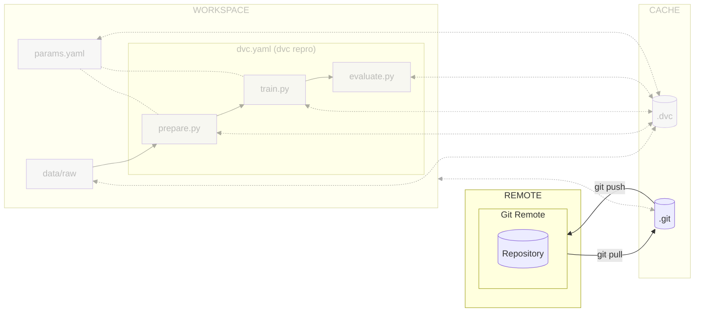

# Chapter 6: Move the ML experiment code to the cloud

## Introduction

Now that you have configured [:simple-dvc: DVC](../tools.md) and can reproduce
the experiment, let's set up a remote repository for sharing the code with the
team.

By linking your local project to a remote repository on platforms like
[:simple-github: GitHub](../tools.md) or [:simple-gitlab: GitLab](../tools.md),
you can seamlessly push, pull, and synchronize changes, facilitating
collaboration and ensuring smooth workflow.

The following diagram illustrates control flow of the experiment at the end of
this chapter:



## Create a remote Git repository

Create a Git repository on your preferred service to collaborate with peers.

=== ":simple-github: GitHub"

    !!! danger "Important"

        Configure the repository as you wish but **do not** check the box
        _"Add a README file"_, _"Add .gitignore"_ nor _"Choose a license"_.

    Create a new GitHub repository for this chapter by accessing
    <https://github.com/new>.

=== ":simple-gitlab: GitLab"

    !!! danger "Important"

        Configure the repository as you wish but **do not** check the box
        _"Initialize repository with a README"_.

    Create a new GitLab blank project for this chapter by accessing
    <https://gitlab.com/projects/new>.

## Configure Git for the remote branch

Add the remote origin to your repository. Replace `<your git repository url>`
with the URL of your Git repository. Your Git service should provide these
instructions as well.

```sh title="Execute the following command(s) in a terminal"
# Add the remote origin
git remote add origin <your git repository url>
```

## Push the changes to Git

Set the remote as the upstream branch and push the changes to Git.

```sh title="Execute the following command(s) in a terminal"
# Set remote origin and push the changes
git push -u origin main
```

After setting the upstream branch, you can simply use `git push` and `git pull`
without additional arguments to interact with the remote branch.

## Check the results

Go to your online Git repository and you will be able to view the files that are
stored there.

This chapter is now complete. Please review the summary for a recap of the key
points.

## Summary

Congratulations! You now have a codebase that can be used and shared among the
team.

In this chapter, you have successfully:

1. Set up a remote Git repository
2. Added the remote to your local git repository
3. Pushed your changes to the remote Git repository

You fixed some of the previous issues:

- [x] Codebase no longer needs manual download and is versioned

Another member of your team can easily clone the experiment with the following
commands.

```sh title="Execute the following command(s) in a terminal"
# Clone the Git repository
git clone <your git repository url>
```

You can now safely continue to the next chapter.

## State of the MLOps process

- [x] Notebook has been transformed into scripts for production
- [x] Codebase and dataset are versioned
- [x] Steps used to create the model are documented and can be re-executed
- [x] Changes done to a model can be visualized with parameters, metrics and
      plots to identify differences between iterations
- [x] Codebase can be shared and improved by multiple developers
- [ ] Dataset requires manual download and placement
- [ ] Experiment may not be reproducible on other machines
- [ ] CI/CD pipeline does not report the results of the experiment
- [ ] Changes to model are not thoroughly reviewed and discussed before
      integration
- [ ] Model may have required artifacts that are forgotten or omitted in
      saved/loaded state
- [ ] Model cannot be easily used from outside of the experiment context
- [ ] Model is not accessible on the Internet and cannot be used anywhere
- [ ] Model requires manual deployment on the cluster
- [ ] Model cannot be trained on hardware other than the local machine

You will address these issues in the next chapters for improved efficiency and
collaboration. Continue the guide to learn how.

## Sources

Highly inspired by:

- [_Creating a new repository_ - docs.github.com](https://docs.github.com/en/repositories/creating-and-managing-repositories/creating-a-new-repository)
- [_Create a project_ - docs.gitlab.com](https://docs.gitlab.com/ee/user/project/working_with_projects.html#create-a-project)
* [_Managing remote repositories_ - github.com](https://docs.github.com/en/get-started/getting-started-with-git/managing-remote-repositories)
* [_git-remote_ - git-scm.com](https://git-scm.com/docs/git-remote)
