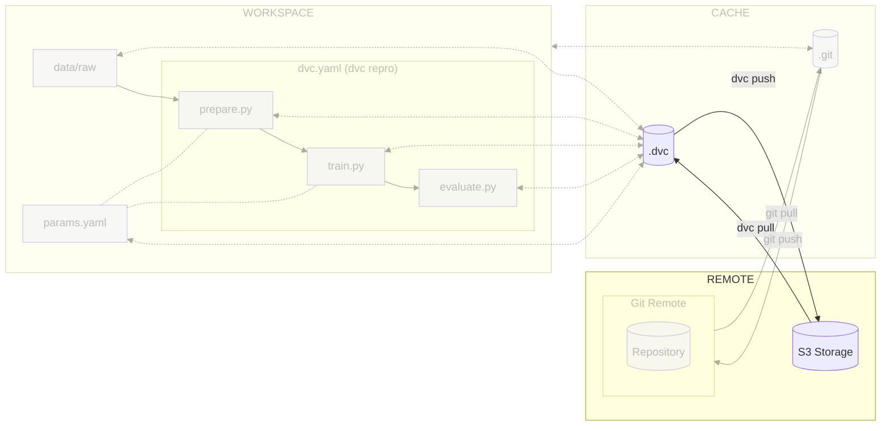

# Chapter 7 - Move the ML experiment data to the cloud

## Introduction

At this point, the codebase is made available to team members using
[:simple-git: Git](../tools.md), but the experiment data itself is not.

Similarly to other version control system, [:simple-dvc: DVC](../tools.md)
allows for storing the dataset in a remote storage, typically a cloud storage
provider, ensuring effective tracking of modifications and smooth maintenance
workflow.

This guide will demonstrate the use of a remote Storage Bucket for storing the
dataset.

In this chapter, you will learn how to:

1. Create a project on the cloud provider
2. Create a storage bucket on the cloud provider
3. Configure DVC for remote storage
4. Push the data files to DVC
5. Commit the metadata files to Git

The following diagram illustrates control flow of the experiment at the end of
this chapter:



Let's get started!

## Steps

### Install and configure the cloud provider CLI

Install and configure the cloud provider CLI tool to manage the cloud resources:

=== ":simple-googlecloud: Google Cloud"

    To install `gcloud`, follow the official documentation:
    [_Install the Google Cloud CLI_ - cloud.google.com](https://cloud.google.com/sdk/docs/install-sdk)

    **Initialize and configure the Google Cloud CLI**

    The following process will authenticate to Google Cloud using the Google Cloud
    CLI with the following command. It should open a browser window to authenticate
    to Google Cloud. You might need to follow the instructions in the terminal to
    authenticate:

    !!! warning

        If gcloud asks you to pick a project or create a project, exit the process by
        pressing ++ctrl+c++ in the terminal and follow the next steps to create a
        project.

    ```sh title="Execute the following command(s) in a terminal"
    # Initialize and login to Google Cloud
    gcloud init
    ```

=== ":material-cloud: Using another cloud provider? Read this!"

    This guide has been written with Google Cloud in mind. We are open to
    contributions to add support for other cloud providers such as
    [:simple-amazonaws: Amazon Web Services](https://aws.amazon.com),
    [:simple-exoscale: Exoscale](https://www.exoscale.com),
    [:simple-microsoftazure: Microsoft Azure](https://azure.microsoft.com) or
    [:simple-kubernetes: Self-hosted Kubernetes](https://kubernetes.io) but we might
    not officially support them.

    If you want to contribute, please open an issue or a pull request on the
    [GitHub repository](https://github.com/swiss-ai-center/a-guide-to-mlops). Your
    help is greatly appreciated!

### Create a project on a cloud provider

This step will create a project on a cloud provider to host the data.

!!! warning

    Do not create a new project through the web interface. The following commands
    will create a new project and link it to a billing account for you, without
    navigating through the web interface.

=== ":simple-googlecloud: Google Cloud"

    Export a Google Cloud Project ID with the following command. Replace
    `<my project id>` with a project ID of your choice. It has to be lowercase and
    words separated by hyphens. For example, use `mlops-project` for the project ID:

    !!! warning

        The project ID must be unique across all Google Cloud projects and users. Change
        the project ID if the command fails.

    ```sh title="Execute the following command(s) in a terminal"
    # Export the project ID
    export GCP_PROJECT_ID=<my project id>
    ```

    Create a Google Cloud Project with the following commands:

    ```sh title="Execute the following command(s) in a terminal"
    # Create a new project
    gcloud projects create $GCP_PROJECT_ID

    # Select your Google Cloud project
    gcloud config set project $GCP_PROJECT_ID
    ```

    Then run the following command to authenticate to Google Cloud with the
    Application Default. It will create a credentials file in
    `~/.config/gcloud/application_default_credentials.json`. This file must not be
    shared and will be used by DVC to authenticate to Google Cloud Storage.

    ```sh title="Execute the following command(s) in a terminal"
    # Set authentication for our ML experiment
    # https://dvc.org/doc/user-guide/data-management/remote-storage/google-cloud-storage
    # https://cloud.google.com/sdk/gcloud/reference/auth/application-default/login
    gcloud auth application-default login
    ```

=== ":material-cloud: Using another cloud provider? Read this!"

    This guide has been written with Google Cloud in mind. We are open to
    contributions to add support for other cloud providers such as
    [:simple-amazonaws: Amazon Web Services](https://aws.amazon.com),
    [:simple-exoscale: Exoscale](https://www.exoscale.com),
    [:simple-microsoftazure: Microsoft Azure](https://azure.microsoft.com) or
    [:simple-kubernetes: Self-hosted Kubernetes](https://kubernetes.io) but we might
    not officially support them.

    If you want to contribute, please open an issue or a pull request on the
    [GitHub repository](https://github.com/swiss-ai-center/a-guide-to-mlops). Your
    help is greatly appreciated!

### Link a billing account to the project

Link a billing account to the project to be able to create to create cloud
resources:

=== ":simple-googlecloud: Google Cloud"

    List the billing accounts with the following command:

    ```sh title="Execute the following command(s) in a terminal"
    # List the billing accounts
    gcloud billing accounts list
    ```

    If no billing account is available, you can add a new one from the
    [Google Cloud Console](https://console.cloud.google.com/billing) and then link
    it to the project.

    Export the billing account ID with the following command. Replace
    `<my billing account id>` with your own billing account ID:

    ```sh title="Execute the following command(s) in a terminal"
    # Export the billing account ID
    export GCP_BILLING_ACCOUNT_ID=<my billing account id>
    ```

    Link a billing account to the project with the following command:

    ```sh title="Execute the following command(s) in a terminal"
    # Link the billing account to the project
    gcloud billing projects link $GCP_PROJECT_ID \
        --billing-account $GCP_BILLING_ACCOUNT_ID
    ```

=== ":material-cloud: Using another cloud provider? Read this!"

    This guide has been written with Google Cloud in mind. We are open to
    contributions to add support for other cloud providers such as
    [:simple-amazonaws: Amazon Web Services](https://aws.amazon.com),
    [:simple-exoscale: Exoscale](https://www.exoscale.com),
    [:simple-microsoftazure: Microsoft Azure](https://azure.microsoft.com) or
    [:simple-kubernetes: Self-hosted Kubernetes](https://kubernetes.io) but we might
    not officially support them.

    If you want to contribute, please open an issue or a pull request on the
    [GitHub repository](https://github.com/swiss-ai-center/a-guide-to-mlops). Your
    help is greatly appreciated!

### Create the Storage Bucket on the cloud provider

Create the Storage Bucket to store the data with the cloud provider CLI:

!!! info

    On most cloud providers, the project must be linked to an active billing account
    to be able to create the bucket. You must set up a valid billing account for the
    cloud provider.

=== ":simple-googlecloud: Google Cloud"

    Create the Google Storage Bucket to store the data with the Google Cloud CLI.

    Export the bucket name as an environment variable. Replace `<my bucket name>`
    with a bucket name of your choice. It has to be lowercase and words separated by
    hyphens. For example, use `mlops-bucket` for the bucket name:

    !!! warning

        The bucket name must be unique across all Google Cloud projects and users.
<<<<<<< HEAD
        Change the bucket name if the command fails.
=======
>>>>>>> 87ee261 (Add details on name conventions)

    ```sh title="Execute the following command(s) in a terminal"
    # Export the bucket name
    export GCP_BUCKET_NAME=<my bucket name>
    ```

    Export the bucket location as an environment variable. You can view the
    available locations at
    [Cloud locations](https://cloud.google.com/about/locations). You should ideally
    select a location close to where most of the expected traffic will come from.
    Replace `<my bucket location>` with your own zone. For example, use
    `europe-west6` for Switzerland (Zurich):

    ```sh title="Execute the following command(s) in a terminal"
    # Export the bucket location
    export GCP_BUCKET_LOCATION=<my bucket location>
    ```

    Create the bucket:

    ```sh title="Execute the following command(s) in a terminal"
    # Create the Google Storage Bucket
    gcloud storage buckets create gs://$GCP_BUCKET_NAME \
        --location=$GCP_BUCKET_LOCATION \
        --uniform-bucket-level-access \
        --public-access-prevention
    ```

    You now have everything you need for DVC.

=== ":material-cloud: Using another cloud provider? Read this!"

    This guide has been written with Google Cloud in mind. We are open to
    contributions to add support for other cloud providers such as
    [:simple-amazonaws: Amazon Web Services](https://aws.amazon.com),
    [:simple-exoscale: Exoscale](https://www.exoscale.com),
    [:simple-microsoftazure: Microsoft Azure](https://azure.microsoft.com) or
    [:simple-kubernetes: Self-hosted Kubernetes](https://kubernetes.io) but we might
    not officially support them.

    If you want to contribute, please open an issue or a pull request on the
    [GitHub repository](https://github.com/swiss-ai-center/a-guide-to-mlops). Your
    help is greatly appreciated!

### Install the DVC Storage plugin

Install the DVC Storage plugin for the cloud provider:

=== ":simple-googlecloud: Google Cloud"

    Here, the `dvc[gs]` package enables support for Google Cloud Storage. Update the
    `requirements.txt` file:

    ```txt title="requirements.txt" hl_lines="4"
    tensorflow==2.12.0
    matplotlib==3.7.1
    pyyaml==6.0
    dvc[gs]==3.47.0
    ```

    Check the differences with Git to validate the changes:

    ```sh title="Execute the following command(s) in a terminal"
    # Show the differences with Git
    git diff requirements.txt
    ```

    The output should be similar to this:

    ```diff
    diff --git a/requirements.txt b/requirements.txt
    index 193ebac..8ccc2df 100644
    --- a/requirements.txt
    +++ b/requirements.txt
    @@ -1,4 +1,4 @@
    tensorflow==2.12.0
    matplotlib==3.7.1
    pyyaml==6.0
    -dvc==3.47.0
    +dvc[gs]==3.47.0
    ```

    Install the dependencies and update the freeze file:

    !!! warning

        Prior to running any pip commands, it is crucial to ensure the virtual
        environment is activated to avoid potential conflicts with system-wide Python
        packages.

        To check its status, simply run `pip -V`. If the virtual environment is active,
        the output will show the path to the virtual environment's Python executable. If
        it is not, you can activate it with `source .venv/bin/activate`.

    ```sh title="Execute the following command(s) in a terminal"
    # Install the dependencies
    pip install --requirement requirements.txt

    # Freeze the dependencies
    pip freeze --local --all > requirements-freeze.txt
    ```

=== ":material-cloud: Using another cloud provider? Read this!"

    This guide has been written with Google Cloud in mind. We are open to
    contributions to add support for other cloud providers such as
    [:simple-amazonaws: Amazon Web Services](https://aws.amazon.com),
    [:simple-exoscale: Exoscale](https://www.exoscale.com),
    [:simple-microsoftazure: Microsoft Azure](https://azure.microsoft.com) or
    [:simple-kubernetes: Self-hosted Kubernetes](https://kubernetes.io) but we might
    not officially support them.

    If you want to contribute, please open an issue or a pull request on the
    [GitHub repository](https://github.com/swiss-ai-center/a-guide-to-mlops). Your
    help is greatly appreciated!

### Configure DVC to use the Storage Bucket

Configure DVC to use the Storage Bucket on the cloud provider:

=== ":simple-googlecloud: Google Cloud"

    Configure DVC to use a Google Storage remote bucket. The `dvcstore` is a
    user-defined path on the bucket. You can change it if needed:

    ```sh title="Execute the following command(s) in a terminal"
    # Add the Google Storage remote bucket
    dvc remote add -d data gs://$GCP_BUCKET_NAME/dvcstore
    ```

=== ":material-cloud: Using another cloud provider? Read this!"

    This guide has been written with Google Cloud in mind. We are open to
    contributions to add support for other cloud providers such as
    [:simple-amazonaws: Amazon Web Services](https://aws.amazon.com),
    [:simple-exoscale: Exoscale](https://www.exoscale.com),
    [:simple-microsoftazure: Microsoft Azure](https://azure.microsoft.com) or
    [:simple-kubernetes: Self-hosted Kubernetes](https://kubernetes.io) but we might
    not officially support them.

    If you want to contribute, please open an issue or a pull request on the
    [GitHub repository](https://github.com/swiss-ai-center/a-guide-to-mlops). Your
    help is greatly appreciated!

### Check the changes

Check the changes with Git to ensure all wanted files are here:

```sh title="Execute the following command(s) in a terminal"
# Add all the available files
git add .

# Check the changes
git status
```

The output of the `git status` command should be similar to this:

```text
On branch main
Changes to be committed:
  (use "git restore --staged <file>..." to unstage)
    modified:   .dvc/config
    modified:   requirements-freeze.txt
    modified:   requirements.txt
```

### Push the data files to DVC

DVC works as Git. Once you want to share the data, you can use `dvc push` to
upload the data and its cache to the storage provider:

```sh title="Execute the following command(s) in a terminal"
# Upload the experiment data and cache to the remote bucket
dvc push
```

### Commit the changes to Git

You can now push the changes to Git so all team members can get the data from
DVC as well.

```sh title="Execute the following command(s) in a terminal"
# Commit the changes
git commit -m "My ML experiment data is shared with DVC"

# Push the changes
git push
```

### Check the results

Open the Bucket Storage on the cloud provider and check that the files were
hashed and have been uploaded.

<!-- TODO: Add explanation on how to check the files on the cloud provider, the difference between the data and the cache, and how to download the data from the cloud provider. -->

## Summary

Congratulations! You now have a dataset that can be used and shared among the
team.

In this chapter, you have successfully:

1. Created a new project on a cloud provider
2. Installed and configured the cloud provider CLI
3. Created the Storage Bucket on the cloud provider
4. Installed the DVC Storage plugin
5. Configured DVC to use the Storage Bucket
6. Updated the gitignore file and adding the experiment data to DVC
7. Pushed the data files to DVC
8. Commit the changes to Git

You fixed some of the previous issues:

- [x] Data no longer needs manual download and is placed in the right directory.

When used by another member of the team, they can easily get a copy of the
experiment data from DVC with the following command:

```sh title="Execute the following command(s) in a terminal"
# Download experiment data from DVC
dvc pull
```

With the help of DVC, they can also easily reproduce your experiment and, thanks
to caching, only the required steps will be executed:

```sh title="Execute the following command(s) in a terminal"
# Execute the pipeline
dvc repro
```

You can now safely continue to the next chapter.

## State of the MLOps process

- [x] Notebook has been transformed into scripts for production
- [x] Codebase and dataset are versioned
- [x] Steps used to create the model are documented and can be re-executed
- [x] Changes done to a model can be visualized with parameters, metrics and
      plots to identify differences between iterations
- [x] Codebase can be shared and improved by multiple developers
- [x] Dataset can be shared among the developers and is placed in the right
      directory in order to run the experiment
- [ ] Experiment may not be reproducible on other machines
- [ ] CI/CD pipeline does not report the results of the experiment
- [ ] Changes to model are not thoroughly reviewed and discussed before
      integration
- [ ] Model may have required artifacts that are forgotten or omitted in
      saved/loaded state
- [ ] Model cannot be easily used from outside of the experiment context
- [ ] Model is not accessible on the Internet and cannot be used anywhere
- [ ] Model requires manual deployment on the cluster
- [ ] Model cannot be trained on hardware other than the local machine

You will address these issues in the next chapters for improved efficiency and
collaboration. Continue the guide to learn how.

## Sources

Highly inspired by:

- [_Supported storage types_ - dvc.org](https://dvc.org/doc/command-reference/remote/add#supported-storage-types)
- [_Install the Google Cloud CLI_ - cloud.google.com](https://cloud.google.com/sdk/docs/install-sdk)
- [_Create storage buckets_ - cloud.google.com](https://cloud.google.com/storage/docs/creating-buckets)
- [_gcloud storage buckets create_ - cloud.google.com](https://cloud.google.com/sdk/gcloud/reference/storage/buckets/create)
