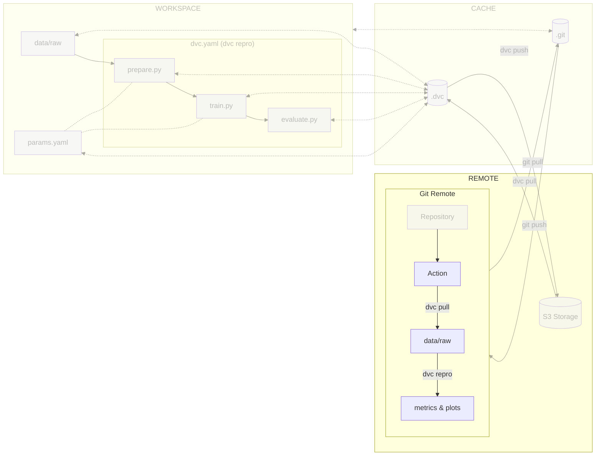

# Chapter 8: Reproduce the ML experiment in a CI/CD pipeline

??? info "You want to take over from this chapter? Collapse this section and follow the instructions below."

    _Work in progress._

    [//]: # "TODO"

## Introduction

At this point, your code, your data and your execution process should be shared
with Git and DVC.

Now, it's time to enhance your workflow further by incorporating a CI/CD
(Continuous Integration/Continuous Deployment) pipeline. This addition will
enable you to execute your ML experiments remotely and reproduce it, ensuring
that any changes made to the project won't inadvertently break. This helps
eliminate the notorious "but it works on my machine" effect, where code behave
differently across different environments.

In this chapter, you will learn how to:

1. Grant access to the S3 bucket on your cloud provider
2. Store the cloud provider credentials in the CI/CD configuration
3. Create the CI/CD pipeline configuration file
4. Push the CI/CD pipeline configuration file to Git
5. Visualize the execution of the CI/CD pipeline

The following diagram illustrates control flow of the experiment at the end of
this chapter:



## Steps

### Set up access to the S3 bucket of your cloud provider

DVC will need to log in to the S3 bucket of your cloud provider to download the
data inside the CI/CD pipeline.

=== ":simple-amazonaws: Amazon Web Services"

    _This is a work in progress._

=== ":simple-exoscale: Exoscale"

    _This is a work in progress._

=== ":simple-googlecloud: Google Cloud"

    Google Cloud allows the creation of a "Service Account", so you don't have to
    store/share your own credentials. A Service Account can be deleted, hence
    revoking all the access it had.

    Create the Google Service Account and its associated Google Service Account Key
    to access Google Cloud without your own credentials.

    The key will be stored in your **~/.config/gcloud** directory under the name
    `dvc-google-service-account-key.json`.

    !!! danger

        You must **never** add and commit this file to your working directory. It is a
        sensitive data that you must keep safe.

    ```sh title="Execute the following command(s) in a terminal"
    # Create the Google Service Account
    gcloud iam service-accounts create dvc-service-account \
        --display-name="DVC Service Account"

    # Set the permissions for the Google Service Account
    gcloud projects add-iam-policy-binding $GCP_PROJECT_ID \
        --member="serviceAccount:dvc-service-account@${GCP_PROJECT_ID}.iam.gserviceaccount.com" \
        --role="roles/storage.objectViewer"

    # Create the Google Service Account Key
    gcloud iam service-accounts keys create ~/.config/gcloud/dvc-google-service-account-key.json \
        --iam-account=dvc-service-account@${GCP_PROJECT_ID}.iam.gserviceaccount.com
    ```

    !!! info

        The path `~/.config/gcloud` should be created when installing `gcloud`. If it
        does not exist, you can create it by running `mkdir -p ~/.config/gcloud`

=== ":simple-microsoftazure: Microsoft Azure"

    _This is a work in progress._

=== ":simple-kubernetes: Self-hosted Kubernetes"

    _This is a work in progress._

### Store the cloud provider credentials in the CI/CD configuration

Now that the credentials are created, you need to store them in the CI/CD
configuration.

Depending on the CI/CD platform you are using, the process will be different.

=== ":simple-amazonaws: Amazon Web Services"

    _This is a work in progress._

=== ":simple-exoscale: Exoscale"

    _This is a work in progress._

=== ":simple-googlecloud: Google Cloud"

    **Display the Google Service Account key**

    The service account key is stored on your computer as a JSON file. You need to
    display it and store it as a CI/CD variable in a text format.

    === ":simple-github: GitHub"

        Display the Google Service Account key that you have downloaded from Google
        Cloud.

        ```sh title="Execute the following command(s) in a terminal"
        # Display the Google Service Account key
        cat ~/.config/gcloud/dvc-google-service-account-key.json
        ```

    === ":simple-gitlab: GitLab"

        Encode and display the Google Service Account key that you have downloaded from
        Google Cloud as `base64`. It allows to hide the secret in GitLab CI logs as a
        security measure.

        !!! tip

            If on Linux, you can use the command
            `base64 -w 0 -i ~/.config/gcloud/  dvc-google-service-account-key.json`.

        ```sh title="Execute the following command(s) in a terminal"
        # Encode the Google Service Account key to base64
        base64 -i ~/.config/gcloud/dvc-google-service-account-key.json
        ```

    **Store the Google Service Account key as a CI/CD variable**

    === ":simple-github: GitHub"

        Store the output as a CI/CD variable by going to the **Settings** section from
        the top header of your GitHub repository.

        Select **Secrets and variables > Actions** and select **New repository secret**.

        Create a new variable named `DVC_GCP_SERVICE_ACCOUNT_KEY` with the output value
        of the Google Service Account key file as its value. Save the variable by
        selecting **Add secret**.

    === ":simple-gitlab: GitLab"

        Store the output as a CI/CD Variable by going to **Settings > CI/CD** from the
        left sidebar of your GitLab project.

        Select **Variables** and select **Add variable**.

        Create a new variable named `DVC_GCP_SERVICE_ACCOUNT_KEY` with the Google
        Service Account key file encoded in `base64` as its value.

        - **Protect variable**: _Unchecked_
        - **Mask variable**: _Checked_
        - **Expand variable reference**: _Unchecked_

        Save the variable by clicking **Add variable**.

=== ":simple-microsoftazure: Microsoft Azure"

    _This is a work in progress._

=== ":simple-kubernetes: Self-hosted Kubernetes"

    _This is a work in progress._

### Create the CI/CD pipeline configuration file

=== ":simple-github: GitHub"

    At the root level of your Git repository, create a GitHub Workflow configuration
    file `.github/workflows/mlops.yml`.

    Take some time to understand the train job and its steps.

    ```yaml title=".github/workflows/mlops.yml"
    name: MLOps

    on:
      # Runs on pushes targeting main branch
      push:
        branches:
          - main

      # Runs on pull requests
      pull_request:

      # Allows you to run this workflow manually from the Actions tab
      workflow_dispatch:

    jobs:
      train:
        runs-on: ubuntu-latest
        steps:
          - name: Checkout repository
            uses: actions/checkout@v3
          - name: Setup Python
            uses: actions/setup-python@v4
            with:
              python-version: '3.10'
              cache: pip
          - name: Install dependencies
            run: pip install --requirement requirements-freeze.txt
          - name: Login to Google Cloud
            uses: 'google-github-actions/auth@v1'
            with:
              credentials_json: '${{ secrets.DVC_GCP_SERVICE_ACCOUNT_KEY }}'
          - name: Train model
            run: dvc repro --pull --allow-missing
    ```

A few notes:

* Instead of running `dvc pull` and `dvc repro` separately, we can run
        them together with `dvc repro --pull`.
* The `--allow-missing` flag allows
        DVC to skip downloading unnecessary files that are not used in the repro step.
        For example, if the prepare step is already cached, DVC will skip downloading
        the data again and will only download the cached prepare step.

=== ":simple-gitlab: GitLab"

    At the root level of your Git repository, create a GitLab CI configuration file
    `.gitlab-ci.yml`.

    Explore this file to understand the train stage and its steps.

    ```yaml title=".gitlab-ci.yml"
    stages:
      - train

    variables:
      # Change pip's cache directory to be inside the project directory since we can
      # only cache local items.
      PIP_CACHE_DIR: "$CI_PROJECT_DIR/.cache/pip"
      # https://dvc.org/doc/user-guide/troubleshooting?tab=GitLab-CI-CD#git-shallow
      GIT_DEPTH: "0"
      # Set the path to Google Service Account key for DVC - https://dvc.org/doc/command-reference/remote/add#google-cloud-storage
      GOOGLE_APPLICATION_CREDENTIALS: "${CI_PROJECT_DIR}/google-service-account-key.json"

    train:
      stage: train
      image: python:3.10
      rules:
        - if: $CI_COMMIT_BRANCH == "main"
        - if: $CI_PIPELINE_SOURCE == "merge_request_event"
      cache:
        paths:
          # Pip's cache doesn't store the Python packages
          # https://pip.pypa.io/en/stable/reference/pip_install/#caching
          - .cache/pip
          - .venv/
      before_script:
        # Set the Google Service Account key
        - echo "${DVC_GCP_SERVICE_ACCOUNT_KEY}" | base64 -d > $GOOGLE_APPLICATION_CREDENTIALS
        # Install dependencies
        - python3 -m venv .venv
        - source .venv/bin/activate
        - pip install --requirement requirements.txt
      script:
        # Run the experiment
        - dvc repro --pull --allow-missing # (1)!
    ```

    1. Instead of running `dvc pull` and `dvc repro` separately, we can run them
       together with `dvc repro --pull`. The `--allow-missing` flag allows DVC to skip
       downloading unnecessary files that are not used in the repro step. For example,
       if the prepare step is already cached, DVC will skip downloading the data again
       and will only download the cached prepare step.

### Push the CI/CD pipeline configuration file to Git

=== ":simple-github: GitHub"

    Push the CI/CD pipeline configuration file to Git.

    ```sh title="Execute the following command(s) in a terminal"
    # Add the configuration file
    git add .github/workflows/mlops.yml

    # Commit the changes
    git commit -m "A pipeline will run my experiment on each push"

    # Push the changes
    git push
    ```

=== ":simple-gitlab: GitLab"

    Push the CI/CD pipeline configuration file to Git.

    ```sh title="Execute the following command(s) in a terminal"
    # Add the configuration file
    git add .gitlab-ci.yml

    # Commit the changes
    git commit -m "A pipeline will run my experiment on each push"

    # Push the changes
    git push
    ```

### Check the results

=== ":simple-github: GitHub"

    You can see the pipeline running on the **Actions** page.

=== ":simple-gitlab: GitLab"

    You can see the pipeline running on the **CI/CD > Pipelines** page.

You should see a newly created pipeline. The pipeline should log into Google
Cloud, pull the data from DVC and reproduce the experiment. If you encounter
cache errors, verify that you have pushed all data to DVC with `dvc push`.

You may have noticed that DVC was able to skip all stages as its cache is up to
date. It helps you to ensure the experiment can be run (all data and metadata
are up to date) and that the experiment can be reproduced (the results are the
same).

This chapter is done, you can check the summary.

## Summary

Congrats! You now have a CI/CD pipeline that will run the experiment on each
commit.

In this chapter, you have successfully:

1. Granted access to the S3 bucket on your cloud provider
2. Stored the cloud provider credentials in the CI/CD configuration
3. Created the CI/CD pipeline configuration file
4. Pushed the CI/CD pipeline configuration file to Git
5. Visualized the execution of the CI/CD pipeline

You fixed some of the previous issues:

- [x] The experiment can be executed on a clean machine with the help of a CI/CD
      pipeline

You have a CI/CD pipeline to ensure the whole experiment can still be reproduced
using the data and the commands to run using DVC over time.

You can now safely continue to the next chapter.

## State of the MLOps process

- [x] Notebook has been transformed into scripts for production
- [x] Codebase and dataset are versioned
- [x] Steps used to create the model are documented and can be re-executed
- [x] Changes done to a model can be visualized with parameters, metrics and
      plots to identify differences between iterations
- [x] Dataset can be shared among the developers and is placed in the right
      directory in order to run the experiment
- [x] Codebase can be shared and improved by multiple developers
- [x] Experiment can be executed on a clean machine with the help of a CI/CD
      pipeline
- [ ] CI/CD pipeline does not report the results of the experiment
- [ ] Changes to model are not thoroughly reviewed and discussed before
      integration
- [ ] Model may have required artifacts that are forgotten or omitted in
      saved/loaded state
- [ ] Model cannot be easily used from outside of the experiment context
- [ ] Model cannot be deployed on and accessed from a Kubernetes cluster
- [ ] Model cannot be trained on hardware other than the local machine

You will address these issues in the next chapters for improved efficiency and
collaboration. Continue the guide to learn how.

## Sources

Highly inspired by:

* [_Creating and managing service accounts_ - cloud.google.com](https://cloud.google.com/iam/docs/creating-managing-service-accounts)
* [_Create and manage service account keys_ - cloud.google.com](https://cloud.google.com/iam/docs/creating-managing-service-account-keys)
* [_IAM basic and predefined roles reference_ - cloud.google.com](https://cloud.google.com/iam/docs/understanding-roles)
* [_Using service accounts_ - dvc.org](https://dvc.org/doc/user-guide/setup-google-drive-remote#using-service-accounts)
* [_Creating encrypted secrets for a repository_ - docs.github.com](https://docs.github.com/en/actions/security-guides/encrypted-secrets#creating-encrypted-secrets-for-a-repository)
* [_Add a CI/CD variable to a project_ - docs.gitlab.com](https://docs.gitlab.com/ee/ci/variables/#add-a-cicd-variable-to-a-project)
* [_Triggering a workflow_ - docs.github.com](https://docs.github.com/en/actions/using-workflows/triggering-a-workflow)
