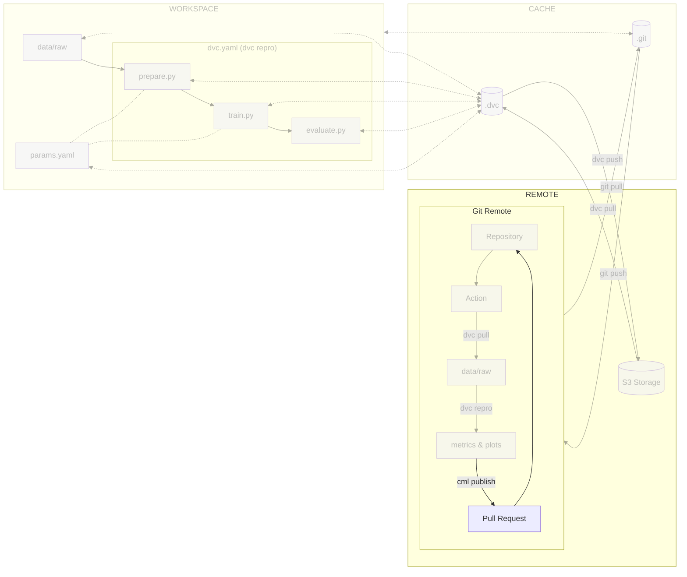

# Chapter 9: Update the CI/CD pipeline with CML

??? info "You want to take over from this chapter? Collapse this section and follow the instructions below."

    _Work in progress._

    [//]: # "TODO"

## Introduction

At this point, you have a CI/CD pipeline that will run the experiment on each
commit. However, you may want to visualize the results of the experiment in the
pipeline. For example, you may want to see the metrics and plots generated by
the experiment. This is where [CML](../../tools) comes in.

In this chapter, you will learn how to:

1. Update the CI/CD pipeline configuration file to visualize them with CML
2. Push the CI/CD pipeline configuration file to Git
3. Visualize the execution of the CI/CD pipeline

The following diagram illustrates control flow of the experiment at the end of
this chapter:



!!! info

    CML can do much more than just generating reports. Have a look at the chapter
    [Train the model on a Kubernetes cluster with CML](../../part-3-serve-and-deploy-the-model/chapter-13-train-the-model-on-a-kubernetes-pod-with-cml/)
    for more details.

## Steps

The reports produced by CML compare the current run with a designated target
reference.

The target reference can be a specific commit, allowing for a comparison between
the current run and the run associated with that particular commit.
Alternatively, it can be a branch, enabling a comparison between the current run
and the run linked to the target branch.

Numerous workflows facilitate discussions and the integration of work into a
target reference. In this guide, we will focus on two methods that are commonly
used on GitHub - pull requests (PRs) - and GitLab - merge requests (MRs) - to
incorporate the work performed into the `main` branch.

### Update the CI/CD pipeline configuration file

We will enhance the CI/CD pipeline by adding an automated report comparing new
parameters and new metrics to the main branch, and published as a comment.

These additions will enable a comprehensive analysis of branches and facilitate
collaboration and decision-making within the team.

=== ":simple-github: GitHub"

    Update the `.github/workflows/mlops.yml` file.

    Explore this file to understand the `train-and-report` stage and its steps.

    ```yaml title=".github/workflows/mlops.yml" hl_lines="16-17 34-100"
    name: MLOps

    on:
      # Runs on pushes targeting main branch
      push:
        branches:
            - main

      # Runs on pull requests
      pull_request:

      # Allows you to run this workflow manually from the Actions tab
      workflow_dispatch:

    jobs:
      train-and-report:
        permissions: write-all
        runs-on: ubuntu-latest
        steps:
          - name: Checkout repository
            uses: actions/checkout@v3
          - name: Setup Python
            uses: actions/setup-python@v4
            with:
              python-version: '3.10'
          - name: Install dependencies
            run: pip install --requirement requirements-freeze.txt
          - name: Login to Google Cloud
            uses: 'google-github-actions/auth@v1'
            with:
              credentials_json: '${{ secrets.GCP_SERVICE_ACCOUNT_KEY }}'
          - name: Train model
            run: dvc repro --pull --allow-missing
          # Node is required to run CML
          - name: Setup Node
            if: github.event_name == 'pull_request'
            uses: actions/setup-node@v3
            with:
              node-version: '16'
          - name: Setup CML
            if: github.event_name == 'pull_request'
            uses: iterative/setup-cml@v1
            with:
              version: '0.19.1'
          - name: Create CML report
            if: github.event_name == 'pull_request'
            env:
              REPO_TOKEN: ${{ secrets.GITHUB_TOKEN }}
            run: |
              # Fetch all other Git branches
              git fetch --depth=1 origin main:main

              # Add title to the report
              echo "# Experiment Report (${{ github.sha }})" >> report.md

              # Compare parameters to main branch
              echo "## Params workflow vs. main" >> report.md
              echo >> report.md
              dvc params diff main --md >> report.md
              echo >> report.md

              # Compare metrics to main branch
              echo "## Metrics workflow vs. main" >> report.md
              echo >> report.md
              dvc metrics diff main --md >> report.md
              echo >> report.md

              # Compare plots (images) to main branch
              dvc plots diff main

              # Create plots
              echo "## Plots" >> report.md
              echo >> report.md

              # Create training history plot
              echo "### Training History" >> report.md
              echo >> report.md
              echo '' >> report.md
              echo >> report.md
              echo '' >> report.md
              echo >> report.md

              # Create predictions preview
              echo "### Predictions Preview" >> report.md
              echo >> report.md
              echo '' >> report.md
              echo >> report.md
              echo '' >> report.md
              echo >> report.md

              # Create confusion matrix
              echo "### Confusion Matrix" >> report.md
              echo >> report.md
              echo '' >> report.md
              echo >> report.md
              echo '' >> report.md
              echo >> report.md

              # Publish the CML report
              cml comment update --target=pr --publish report.md
    ```

    The updated `train-and-report` job is responsible for reporting the results of
    the model evaluation and comparing it with the main branch. This job is
    triggered only on pull requests. The job checks out the repository, sets up DVC
    and CML, creates and publishes the report as a pull request comment.

    Check the differences with Git to validate the changes.

    ```sh title="Execute the following command(s) in a terminal"
    # Show the differences with Git
    git diff .github/workflows/mlops.yml
    ```

    The output should be similar to this:

    ```diff
    diff --git a/.github/workflows/mlops.yml b/.github/workflows/mlops.yml
    index 493691a..f229c9b 100644
    --- a/.github/workflows/mlops.yml
    +++ b/.github/workflows/mlops.yml
    @@ -2,18 +2,33 @@ name: MLOps

     on:
       # Runs on pushes targeting main branch
    -  push: # (1)!
    -    branches: # (2)!
    +  push:
    +    branches:
             - main
    +    paths: # (1)!
    +        - src/**
    +        - dvc.yaml
    +        - params.yaml
    +        - requirements.txt
    +        - requirements-freeze.txt
    +        - .github/workflows/mlops.yml

       # Runs on pull requests
    -  pull_request: # (3)!
    +  pull_request:
    +    paths: # (2)!
    +        - src/**
    +        - dvc.yaml
    +        - params.yaml
    +        - requirements.txt
    +        - requirements-freeze.txt
    +        - .github/workflows/mlops.yml

       # Allows you to run this workflow manually from the Actions tab
    -  workflow_dispatch: # (4)!
    +  workflow_dispatch:

     jobs:
    -  train:
    +  train-and-report:
    +    permissions: write-all
         runs-on: ubuntu-latest
         steps:
           - name: Checkout repository
    @@ -29,4 +44,82 @@ jobs:
             with:
               credentials_json: '${{ secrets.GCP_SERVICE_ACCOUNT_KEY }}'
           - name: Train model
    -        run: dvc repro --pull --allow-missing # (5)!
    +        run: dvc repro --pull --allow-missing
    +      # After the experiment is done we update the dvc.lock and push the
    +      # changes with dvc. This allows dvc to cache the experiment results
    +      # and use them locally and remotely on pipelines without running the
    +      # experiment again.
    +      - name: Commit changes in dvc.lock
    +        uses: stefanzweifel/git-auto-commit-action@v4
    +        with:
    +          commit_message: Commit changes in dvc.lock
    +          file_pattern: dvc.lock
    +      - name: Push experiment results to DVC remote storage
    +        run: dvc push
    +      # Node is required to run CML
    +      - name: Setup Node
    +        if: github.event_name == 'pull_request'
    +        uses: actions/setup-node@v3
    +        with:
    +          node-version: '16'
    +      - name: Setup CML
    +        if: github.event_name == 'pull_request'
    +        uses: iterative/setup-cml@v1
    +        with:
    +          version: '0.19.1'
    +      - name: Create CML report
    +        if: github.event_name == 'pull_request'
    +        env:
    +          REPO_TOKEN: ${{ secrets.GITHUB_TOKEN }}
    +        run: |
    +          # Fetch all other Git branches
    +          git fetch --depth=1 origin main:main
    +
    +          # Add title to the report
    +          echo "# Experiment Report (${{ github.sha }})" >> report.md
    +
    +          # Compare parameters to main branch
    +          echo "## Params workflow vs. main" >> report.md
    +          echo >> report.md
    +          dvc params diff main --md >> report.md
    +          echo >> report.md
    +
    +          # Compare metrics to main branch
    +          echo "## Metrics workflow vs. main" >> report.md
    +          echo >> report.md
    +          dvc metrics diff main --md >> report.md
    +          echo >> report.md
    +
    +          # Compare plots (images) to main branch
    +          dvc plots diff main
    +
    +          # Create plots
    +          echo "## Plots" >> report.md
    +          echo >> report.md
    +
    +          # Create training history plot
    +          echo "### Training History" >> report.md
    +          echo >> report.md
    +          echo '' >> report.md
    +          echo >> report.md
    +          echo '' >> report.md
    +          echo >> report.md
    +
    +          # Create predictions preview
    +          echo "### Predictions Preview" >> report.md
    +          echo >> report.md
    +          echo '' >> report.md
    +          echo >> report.md
    +          echo '' >> report.md
    +          echo >> report.md
    +
    +          # Create confusion matrix
    +          echo "### Confusion Matrix" >> report.md
    +          echo >> report.md
    +          echo '' >> report.md
    +          echo >> report.md
    +          echo '' >> report.md
    +          echo >> report.md
    +
    +          # Publish the CML report
    +          cml comment update --target=pr --publish report.md
    ```

=== ":simple-gitlab: GitLab"

    In order to allow commit from the CI and later generate reports with CML, a
    Personal Access Token (PAT) must be created. A Project or a Group Access Token
    are not sufficient for the usage of CML's runners that will be used in the next
    steps.

    To create a Personal Access Token, go in your
    **Profile preferences > Access Tokens**.

    - **Token name**: _gitlab-ci[bot]_
    - **Expiration date**: _None_
    - **Select a role**: _Developer_
    - **Select scopes**: `api`, `read_repository` and `write_repository`

    Select **Create personal access token** to create the token. Copy it. It will be
    displayed only once.

    Store the PAT as a CI/CD Variable by going to **Settings > CI/CD** from the left
    sidebar of your GitLab project.

    Select **Variables** and select **Add variable**.

    Create a new variable named `GITLAB_PAT` with the PAT value as its value.

    - **Protect variable**: _Unchecked_
    - **Mask variable**: _Checked_
    - **Expand variable reference**: _Unchecked_

    Save the variable by clicking **Add variable**.

    Update the `.gitlab-ci.yml` file.

    Explore this file to understand the `report` stage and its steps.

    ```yaml title=".gitlab-ci.yml" hl_lines="3 13-14 39-104"
    stages:
      - train
      - report

    variables:
      # Change pip's cache directory to be inside the project directory since we can
      # only cache local items.
      PIP_CACHE_DIR: "$CI_PROJECT_DIR/.cache/pip"
      # https://dvc.org/doc/user-guide/troubleshooting?tab=GitLab-CI-CD#git-shallow
      GIT_DEPTH: "0"
      # Set the path to Google Service Account key for DVC - https://dvc.org/doc/command-reference/remote/add#google-cloud-storage
      GOOGLE_APPLICATION_CREDENTIALS: "${CI_PROJECT_DIR}/google-service-account-key.json"
      # Environment variable for CML
      REPO_TOKEN: $GITLAB_PAT

    train:
      stage: train
      image: python:3.10
      rules:
        - if: $CI_COMMIT_BRANCH == "main"
        - if: $CI_PIPELINE_SOURCE == "merge_request_event"
      cache:
        paths:
          # Pip's cache doesn't store the Python packages
          # https://pip.pypa.io/en/stable/reference/pip_install/#caching
          - .cache/pip
          - .venv/
      before_script:
        # Set the Google Service Account key
        - echo "${GCP_SERVICE_ACCOUNT_KEY}" | base64 -d > $GOOGLE_APPLICATION_CREDENTIALS
        # Install dependencies
        - python3 -m venv .venv
        - source .venv/bin/activate
        - pip install --requirement requirements.txt
      script:
        # Run the experiment
        - dvc repro --pull --allow-missing

    report:
      stage: report
      image: iterativeai/cml:0-dvc3-base1
      needs:
        - train
      rules:
        - if: $CI_PIPELINE_SOURCE == "merge_request_event"
      before_script:
        # Set the Google Service Account key
        - echo "${GCP_SERVICE_ACCOUNT_KEY}" | base64 -d > $GOOGLE_APPLICATION_CREDENTIALS
      script:
        - |
          # Fetch the experiment changes
          dvc pull

          # Fetch all other Git branches
          git fetch --depth=1 origin main:main

          # Add title to the report
          echo "# Experiment Report (${CI_COMMIT_SHA})" >> report.md

          # Compare parameters to main branch
          echo "## Params workflow vs. main" >> report.md
          echo >> report.md
          dvc params diff main --md >> report.md
          echo >> report.md

          # Compare metrics to main branch
          echo "## Metrics workflow vs. main" >> report.md
          echo >> report.md
          dvc metrics diff main --md >> report.md
          echo >> report.md

          # Compare plots (images) to main branch
          dvc plots diff main

          # Create plots
          echo "## Plots" >> report.md
          echo >> report.md

          # Create training history plot
          echo "### Training History" >> report.md
          echo >> report.md
          echo '' >> report.md
          echo >> report.md
          echo '' >> report.md
          echo >> report.md

          # Create predictions preview
          echo "### Predictions Preview" >> report.md
          echo >> report.md
          echo '' >> report.md
          echo >> report.md
          echo '' >> report.md
          echo >> report.md

          # Create confusion matrix
          echo "### Confusion Matrix" >> report.md
          echo >> report.md
          echo '' >> report.md
          echo >> report.md
          echo '' >> report.md
          echo >> report.md

          # Publish the CML report
          cml comment update --target=pr --publish report.md
    ```

    The new `report` job is responsible for reporting the results of the model
    evaluation and comparing it with the main branch. This job is triggered only on
    merge requests. The job checks out the repository, sets up DVC and CML, creates
    and publishes the report as a merge request comment.

    !!! note

        You may notice that the `report` stage doesn't use the project dependencies. As
        we do not need to reproduce the experiment, we can use DVC from the
        `iterativeai/cml:0-dvc3-base1` Docker image without the project dependencies.
        DVC will then retrieve the data stored on the bucket on its own.

    Check the differences with Git to validate the changes.

    ```sh title="Execute the following command(s) in a terminal"
    # Show the differences with Git
    git diff .gitlab-ci.yml
    ```

    The output should be similar to this:

    ```diff
    diff --git a/.gitlab-ci.yml b/.gitlab-ci.yml
    index 726b176..6e2262d 100644
    --- a/.gitlab-ci.yml
    +++ b/.gitlab-ci.yml
    @@ -1,34 +1,124 @@
    -stages:
    -  - train
    -
    -variables:
    -  # Change pip's cache directory to be inside the project directory since we can
    -  # only cache local items.
    -  PIP_CACHE_DIR: "$CI_PROJECT_DIR/.cache/pip"
    -  # https://dvc.org/doc/user-guide/troubleshooting?tab=GitLab-CI-CD#git-shallow
    -  GIT_DEPTH: "0"
    -  # Set the path to Google Service Account key for DVC - https://dvc.org/doc/command-reference/remote/add#google-cloud-storage
    -  GOOGLE_APPLICATION_CREDENTIALS: "${CI_PROJECT_DIR}/google-service-account-key.json"
    -
    -train:
    -  stage: train
    -  image: python:3.10
    -  rules:
    -    - if: $CI_COMMIT_BRANCH == "main"
    -    - if: $CI_PIPELINE_SOURCE == "merge_request_event"
    -  cache:
    -    paths:
    -      # Pip's cache doesn't store the Python packages
    -      # https://pip.pypa.io/en/stable/reference/pip_install/#caching
    -      - .cache/pip
    -      - .venv/
    -  before_script:
    -    # Set the Google Service Account key
    -    - echo "${GCP_SERVICE_ACCOUNT_KEY}" | base64 -d > $GOOGLE_APPLICATION_CREDENTIALS
    -    # Install dependencies
    -    - python3 -m venv .venv
    -    - source .venv/bin/activate
    -    - pip install --requirement requirements.txt
    -  script:
    -    # Run the experiment
    -    - dvc repro --pull --allow-missing # (1)!
    +    .git-push-dvc-lock: &git-push-dvc-lock |
    +      # Check if there are changes in dvc.lock
    +      if [[ -n $(git status --porcelain dvc.lock) ]]; then
    +        git config --global user.name "gitlab-ci[bot]"
    +        git config --global user.email "gitlab-ci[bot]@users.noreply.gitlab.com"
    +        git add dvc.lock
    +        git commit -m "Commit changes in dvc.lock"
    +        # Get current branch name
    +        if [[ -n "${CI_MERGE_REQUEST_SOURCE_BRANCH_NAME}" ]]; then
    +          BRANCH_NAME=${CI_MERGE_REQUEST_SOURCE_BRANCH_NAME}
    +        else
    +          BRANCH_NAME=${CI_COMMIT_BRANCH}
    +        fi
    +        git push -o ci.skip https://${GITLAB_USER_LOGIN}:${GITLAB_PAT}@${CI_REPOSITORY_URL#*@} HEAD:${BRANCH_NAME}
    +      fi
    +
    +    stages:
    +      - train
    +      - report
    +
    +    variables:
    +      # Change pip's cache directory to be inside the project directory since we can
    +      # only cache local items.
    +      PIP_CACHE_DIR: "$CI_PROJECT_DIR/.cache/pip"
    +      # https://dvc.org/doc/user-guide/troubleshooting?tab=GitLab-CI-CD#git-shallow
    +      GIT_DEPTH: "0"
    +      # Set the path to Google Service Account key for DVC - https://dvc.org/doc/command-reference/remote/add#google-cloud-storage
    +      GOOGLE_APPLICATION_CREDENTIALS: "${CI_PROJECT_DIR}/google-service-account-key.json"
    +      # Environment variable for CML
    +	  REPO_TOKEN: $GITLAB_PAT
    +
    +    train:
    +      stage: train
    +      image: python:3.10
    +      rules:
    +        - if: $CI_COMMIT_BRANCH == "main"
    +        - if: $CI_PIPELINE_SOURCE == "merge_request_event"
    +      cache:
    +        paths:
    +          # Pip's cache doesn't store the Python packages
    +          # https://pip.pypa.io/en/stable/reference/pip_install/#caching
    +          - .cache/pip
    +          - .venv/
    +      before_script:
    +        # Set the Google Service Account key
    +        - echo "${GCP_SERVICE_ACCOUNT_KEY}" | base64 -d > $GOOGLE_APPLICATION_CREDENTIALS
    +        # Install dependencies
    +        - python3 -m venv .venv
    +        - source .venv/bin/activate
    +        - pip install --requirement requirements.txt
    +      script:
    +        # Run the experiment
    +        - dvc repro --pull --allow-missing
    +        # After the experiment is done we update the dvc.lock and push the changes with dvc. This allows dvc to cache the  experiment
    +        # results and use them in locally and remotely on pipelines without running the experiment again.
    +        - *git-push-dvc-lock
    +        - dvc push
    +
    +    report:
    +      stage: report
    +      image: iterativeai/cml:0-dvc3-base1
    +      needs:
    +        - train
    +      rules:
    +        - if: $CI_PIPELINE_SOURCE == "merge_request_event"
    +      before_script:
    +        # Set the Google Service Account key
    +        - echo "${GCP_SERVICE_ACCOUNT_KEY}" | base64 -d > $GOOGLE_APPLICATION_CREDENTIALS
    +      script:
    +        - |
    +          # Fetch the experiment changes
    +          dvc pull
    +
    +          # Fetch all other Git branches
    +          git fetch --depth=1 origin main:main
    +
    +          # Add title to the report
    +          echo "# Experiment Report (${CI_COMMIT_SHA})" >> report.md
    +
    +          # Compare parameters to main branch
    +          echo "## Params workflow vs. main" >> report.md
    +          echo >> report.md
    +          dvc params diff main --md >> report.md
    +          echo >> report.md
    +
    +          # Compare metrics to main branch
    +          echo "## Metrics workflow vs. main" >> report.md
    +          echo >> report.md
    +          dvc metrics diff main --md >> report.md
    +          echo >> report.md
    +
    +          # Compare plots (images) to main branch
    +          dvc plots diff main
    +
    +          # Create plots
    +          echo "## Plots" >> report.md
    +          echo >> report.md
    +
    +          # Create training history plot
    +          echo "### Training History" >> report.md
    +          echo >> report.md
    +          echo '' >> report.md
    +          echo >> report.md
    +          echo '' >> report.md
    +          echo >> report.md
    +
    +          # Create predictions preview
    +          echo "### Predictions Preview" >> report.md
    +          echo >> report.md
    +          echo '' >> report.md
    +          echo >> report.md
    +          echo '' >> report.md
    +          echo >> report.md
    +
    +          # Create confusion matrix
    +          echo "### Confusion Matrix" >> report.md
    +          echo >> report.md
    +          echo '' >> report.md
    +          echo >> report.md
    +          echo '' >> report.md
    +          echo >> report.md
    +
    +          # Publish the CML report
    +          cml comment update --target=pr --publish report.md
    ```

Take some time to understand the changes made to the file.

### Push the CI/CD pipeline configuration file to Git

=== ":simple-github: GitHub"

    Push the CI/CD pipeline configuration file to Git.

    ```sh title="Execute the following command(s) in a terminal"
    # Add the configuration file
    git add .github/workflows/mlops.yml

    # Commit the changes
    git commit -m "Add cml reporting to CI/CD pipeline"

    # Push the changes
    git push
    ```

=== ":simple-gitlab: GitLab"

    Push the CI/CD pipeline configuration file to Git.

    ```sh title="Execute the following command(s) in a terminal"
    # Add the configuration file
    git add .gitlab-ci.yml

    # Commit the changes
    git commit -m "Add cml reporting to CI/CD pipeline"

    # Push the changes
    git push
    ```

### Check the results

=== ":simple-github: GitHub"

    You can see the pipeline running on the **Actions** page.

=== ":simple-gitlab: GitLab"

    You can see the pipeline running on the **CI/CD > Pipelines** page.

You should see a pipeline running on the `main` branch. The pipeline should run
the same way as in the previous chapter. Note that CML will not publish a report
as the pipeline is not triggered by a pull request.

This chapter is done, you can check the summary.

## Summary

Congrats! You now have a CI/CD pipeline that will run and update the experiment
results as well as create a report comparing the results with the main branch on
a pull request.

In this chapter, you have successfully:

1. Updated the CI/CD pipeline configuration file to add an automated report
   comparing new parameters and new metrics to the main branch, and published as a
   comment
2. Pushed the CI/CD pipeline configuration file to Git
3. Checked the results

You fixed some of the previous issues:

- [x] CI/CD pipeline is triggered on pull requests and reports the results of
      the experiment

You can now safely continue to the next chapter.

## State of the MLOps process

- [x] Notebook has been transformed into scripts for production
- [x] Codebase and dataset are versioned
- [x] Steps used to create the model are documented and can be re-executed
- [x] Changes done to a model can be visualized with parameters, metrics and
      plots to identify differences between iterations
- [x] Dataset can be shared among the developers and is placed in the right
      directory in order to run the experiment
- [x] Codebase can be shared and improved by multiple developers
- [x] Experiment can be executed on a clean machine with the help of a CI/CD
      pipeline
- [x] CI/CD pipeline is triggered on pull requests and reports the results of
      the experiment
- [ ] Changes to model are not thoroughly reviewed and discussed before
      integration
- [ ] Model may have required artifacts that are forgotten or omitted in
      saved/loaded state
- [ ] Model cannot be easily used from outside of the experiment context
- [ ] Model cannot be deployed on and accessed from a Kubernetes cluster
- [ ] Model cannot be trained on hardware other than the local machine

You will address these issues in the next chapters for improved efficiency and
collaboration. Continue the guide to learn how.

## Sources

Highly inspired by:

* [_Get Started with CML on GitHub_ - cml.dev](https://cml.dev/doc/start/github)
* [_Get Started with CML on GitLab_ - cml.dev](https://cml.dev/doc/start/gitlab)
* [_Personal access tokens_ - docs.gitlab.com](https://docs.gitlab.com/ee/user/profile/personal_access_tokens.html)

And the following Git repositories:

* [`example_cml` - github.com](https://github.com/iterative/example_cml)
* [`cml_dvc_case` - github.com](https://github.com/iterative/cml_dvc_case)
* [`example_cml` - gitlab.com](https://gitlab.com/iterative.ai/example_cml)
* [`cml-dvc-case` - gitlab.com](https://gitlab.com/iterative.ai/cml-dvc-case)
