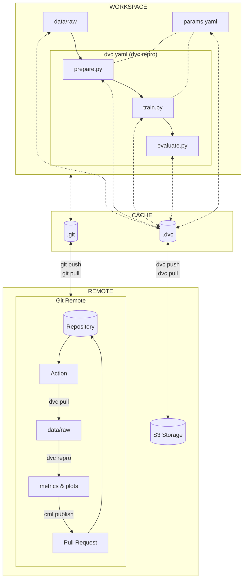

# Conclusion

Congratulations! You did it!

In this second part, you were able to share your experiment on the cloud and
with your peers. A new team member can easily clone the repository and reproduce
the experiment locally. The experiment is also reproducible on the cloud and
ensures it still works in a different environment. Once the experiment is
reproduced, the results are published and shared with the team. You can also
compare the results with the previous ones and decide if you want to merge the
new model or not.

The following diagram illustrates the bricks you set up at the end of this part:

## Next steps

**Ready to continue?**

Proceed to
[Part 3 - Serve and deploy the model](../part-3-serve-and-deploy-the-model/introduction.md)
to learn how to serve your model in production and deploy it to Kubernetes.

**Stopping here?**

If you decide to conclude your progress at this point, see the
[Clean up guide](../clean-up.md) for instructions on removing the resources you
created:

- Local Git repository and DVC cache
- Python virtual environment
- Cloud storage bucket (S3/GCS)
- CI/CD pipeline configurations
- Remote Git repository resources

This is necessary to return to a clean state on your computer, avoid unnecessary
incurring costs, and address potential security concerns when using cloud
services.

!!! note

    You can safely skip cleanup if you plan to continue with the next part of the
    guide immediately.
