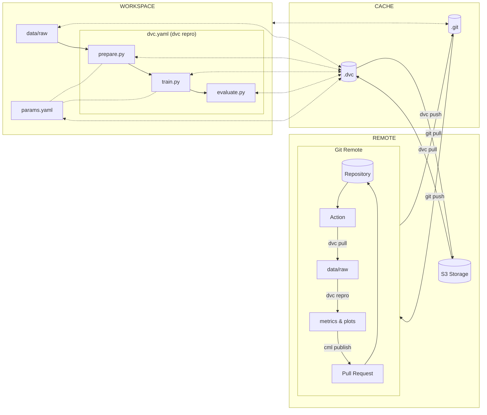

# Conclusion

Congratulations! You did it!

In this second part, you were able to share your experiment on the cloud and
with your peers. A new team member can easily clone the repository and reproduce
the experiment locally. The experiment is also reproducible on the cloud and
ensures it still works in a different environment. Once the experiment is
reproduced, the results are published and shared with the team. You can also
compare the results with the previous ones and decide if you want to merge the
new model or not.

The following diagram illustrates the bricks you set up at the end of this part:

Do not forget to [Clean up](./clean-up.md) if you want to stop here or continue
with
[Part 3 - Serve and deploy the model](../part-3-serve-and-deploy-the-model/introduction.md)
of the MLOps guide!
