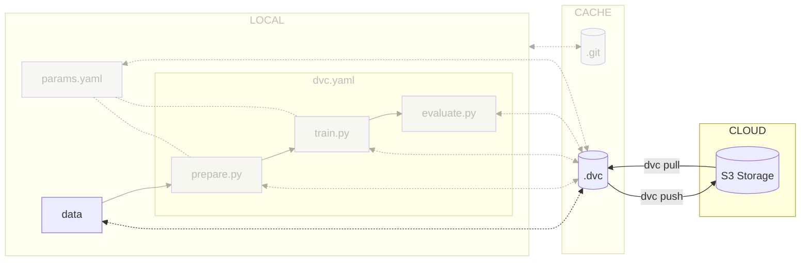

# Chapter 6: Move the ML experiment data to the cloud

## Introduction

Now that we have configured DVC and can reproduce the experiment, let's set up
a remote repository for sharing the data with the team.

Similarly to other version control system, DVC allows for storing the dataset in
a remote storage, typically a cloud storage provider, ensuring effective tracking
of modifications and smooth maintenance workflow.

This guide will demonstrate the use of a Google Storage Bucket for storing the
dataset, but it's important to note that DVC is also compatible with various
other cloud storage providers.

!!! info

    Want to self-host your storage? Check out the [Deploy MinIO](../../advanced-concepts/deploy-minio) guide!

In this chapter, you will learn how to:

1. Create a project on the chosen cloud provider
2. Create a storage bucket on the chosen cloud provider
3. Configure DVC for remote storage
4. Update the `.gitignore` file and add the experiment data to DVC
5. Push the data files to DVC
6. Push the metadata files to Git



Let's get started!

## Steps

### Create a project on a cloud provider

Create a project on a cloud provider to host the data.

=== ":simple-amazonaws: Amazon Web Services"

	TODO

=== ":simple-googlecloud: Google Cloud"

    Create a Google Cloud Project by going to the [Google Cloud
    console](https://console.cloud.google.com/), select **Select a project** in the
    upper left corner of the screen and select **New project**.

    Name your project and select **Create** to create the project.

    A new page opens. Note the ID of your project, it will be used later.

    !!! warning

        Always make sure you're in the right project by selecting your project with
        **Select a project** in the upper left corner of the screen.

    **Export the Google Cloud Project ID**

    Export the Google Cloud Project ID as an environment variable. Replace
    `<id of your gcp project>` with your own project ID.

    ```sh title="Execute the following command(s) in a terminal"
    export GCP_PROJECT_ID=<id of your gcp project>
    ```

=== ":simple-microsoftazure: Microsoft Azure"

	TODO

=== ":simple-rancher: Self-hosted Rancher"

	TODO

### Install and configure the cloud provider CLI

Install and configure the cloud provider CLI tool to manage the cloud resources.

=== ":simple-amazonaws: Amazon Web Services"

	TODO

=== ":simple-googlecloud: Google Cloud"

    To install `gcloud`, follow the official documentation: [_Install the Google
    Cloud CLI_ - cloud.google.com](https://cloud.google.com/sdk/docs/install-sdk)

    **Initialize and configure the Google Cloud CLI**

    The following process will authenticate to Google Cloud using the Google Cloud
    CLI. It will open a browser window to log you in and create a credentials file
    in `~/.config/gcloud/application_default_credentials.json`. This file must not
    be shared.

    DVC will then automatically use these credentials to authenticate to the cloud
    storage provider.

    Alternatively, you can set the `GOOGLE_APPLICATION_CREDENTIALS` environment
    variable to the path of the credentials file.

    ```sh title="Execute the following command(s) in a terminal"
    # Initialize and login to Google Cloud
    gcloud init

    # List all available projects
    gcloud projects list

    # Select your Google Cloud project
    gcloud config set project $GCP_PROJECT_ID
    ```

    Then run the following command to authenticate to Google Cloud with the Application Default.

    ```sh title="Execute the following command(s) in a terminal"
    # Set authentication for our ML experiment
    # https://dvc.org/doc/command-reference/remote/add#google-cloud-storage
    # https://cloud.google.com/sdk/gcloud/reference/auth/application-default/login
    gcloud auth application-default login
    ```

=== ":simple-microsoftazure: Microsoft Azure"

	TODO

=== ":simple-rancher: Self-hosted Rancher"

	TODO


### Create the Storage Bucket on the cloud provider

Create the Storage Bucket to store the data with the cloud provider CLI.

!!! info

    On most cloud providers, the project must be linked to an active billing account to be able to create the bucket. You must set up a valid billing account for your cloud provider.

=== ":simple-amazonaws: Amazon Web Services"

	TODO

=== ":simple-googlecloud: Google Cloud"

    Create the Google Storage Bucket to store the data with the Google Cloud CLI. You should ideally select a location close to where most of the expected traffic will come from. You can view the available regions at [Cloud locations](https://cloud.google.com/about/locations).

    Export the bucket name as an environment variable. Replace `<my bucket name>` with your own bucket name (ex: `mlopsdemo`).

    !!! warning

        The bucket name must be unique across all Google Cloud projects and users. Change the `<my bucket name>` to your own bucket name.

    ```sh title="Execute the following command(s) in a terminal"
    export GCP_BUCKET_NAME=<my bucket name>
    ```

    Export the bucket region as an environment variable. Replace `<my bucket region>` with your own zone. For example, use `EUROPE-WEST6` for Switzerland.

    ```sh title="Execute the following command(s) in a terminal"
    export GCP_BUCKET_REGION=<my bucket region>
    ```

    Create the bucket.

    ```sh title="Execute the following command(s) in a terminal"
    gcloud storage buckets create gs://$GCP_BUCKET_NAME \
    --location=$GCP_BUCKET_REGION \
    --uniform-bucket-level-access \
    --public-access-prevention
    ```

    You now have everything needed for DVC.

=== ":simple-microsoftazure: Microsoft Azure"

	TODO

=== ":simple-rancher: Self-hosted Rancher"

	TODO

### Install the DVC Storage plugin

Install the DVC Storage plugin for the chosen cloud provider.

=== ":simple-amazonaws: Amazon Web Services"

	TODO

=== ":simple-googlecloud: Google Cloud"

    Here, the `dvc[gs]` package enables support for Google Cloud Storage.

    ```sh title="Execute the following command(s) in a terminal"
    poetry add "dvc[gs]==2.37.0"
    ```
    Check the differences with Git to validate the changes.

    ```sh title="Execute the following command(s) in a terminal"
    # Show the differences with Git
    git diff pyproject.toml
    ```

    The output should be similar to this.

    ```diff
    diff --git a/pyproject.toml b/pyproject.toml
    index 8a57399..ff11768 100644
    --- a/pyproject.toml
    +++ b/pyproject.toml
    @@ -13,6 +13,7 @@ pyaml = "21.10.1"
    scikit-learn = "1.1.3"
    scipy = "1.10.1"
    matplotlib = "3.6.2"
    -dvc = {version = "2.37.0"}
    +dvc = {version = "2.37.0", extras = ["gs"]}

    [build-system]
    requires = ["poetry-core"]
    ```

=== ":simple-microsoftazure: Microsoft Azure"

	TODO

=== ":simple-rancher: Self-hosted Rancher"

	TODO

### Configure DVC to use the Storage Bucket

Configure DVC to use the Storage Bucket on the chosen cloud provider.

=== ":simple-amazonaws: Amazon Web Services"

	TODO

=== ":simple-googlecloud: Google Cloud"

    Configure DVC to use a Google Storage remote bucket. The `dvcstore` is a user-defined path on the bucket. You can change it if needed.

    ```sh title="Execute the following command(s) in a terminal"
    # Add the Google Storage remote bucket
    dvc remote add -d data gs://$GCP_BUCKET_NAME/dvcstore
    ```

=== ":simple-microsoftazure: Microsoft Azure"

	TODO

=== ":simple-rancher: Self-hosted Rancher"

	TODO

### Add the experiment data to DVC

Now that DVC has been setup, you can add files to DVC.

```sh title="Execute the following command(s) in a terminal"
# Add the experiment data to DVC
dvc add data/data.xml
```

The output should be similar to this. You can safely ignore the message.

```
To track the changes with git, run:

        git add data/data.xml.dvc data/.gitignore

To enable auto staging, run:

        dvc config core.autostage true
```

The effect of the `dvc add` command is to create a `data/data.csv.dvc` file and
a `data/.gitignore`. The `.dvc` file contains the metadata of the file that is
used by DVC to download and check the integrity of the files. The `.gitignore`
file is created to add the `data.csv` file to be ignored by Git. The `.dvc`
files must be added to Git.

Various DVC commands will automatically try to update the `.gitignore` files. If a
`.gitignore` file is already present, it will be updated to include the newly
ignored files.

### Push the data files to DVC

DVC works as Git. Once you want to share the data, you can use `dvc push` to
upload the data and its cache to the storage provider.

```sh title="Execute the following command(s) in a terminal"
# Upload the experiment data and cache to the remote bucket
dvc push
```

### Commit the changes to Git

You can now push the changes to Git so all team members can get the data from
DVC as well.

```sh title="Execute the following command(s) in a terminal"
# Commit the changes
git commit -m "My ML experiment data is saved with DVC"
```

### Check the results

Open the Bucket Storage on the cloud provider and check that the data files have been uploaded.

TODO: Add explanation on how to check the files on the cloud provider, the difference between the data and the cache, and how to download the data from the cloud provider.

## Summary

Congrats! You now have a dataset that can be used and shared among the team.

In this chapter, you have successfully:

1. Created a new project on a chosen cloud provider
2. Installed and configured the cloud provider CLI
3. Created the Storage Bucket on the cloud provider
4. Installed the DVC Storage plugin
5. Configured DVC to use the Storage Bucket
6. Updated the `.gitignore` file and adding the experiment data to DVC
7. Pushed the data files to DVC
8. Commit the changes to Git

You fixed some of the previous issues:

- ✅ Data no longer needs manual download and is placed in the right directory.

When used by another member of the team, they can easily get a copy of the
experiment data from DVC with the following command.

```sh title="Execute the following command(s) in a terminal"
# Download experiment data from DVC
dvc pull
```

With the help of DVC, they can also easily reproduce your experiment and,
thanks to caching, only the required steps will be executed.

```sh title="Execute the following command(s) in a terminal"
# Execute the pipeline
dvc repro
```

You can now safely continue to the next chapter.

## State of the MLOps process

- ✅ Notebook has been transformed into scripts for production
- ✅ Codebase and dataset are versioned
- ✅ Steps used to create the model are documented and can be re-executed
- ✅ Changes done to a model can be visualized with parameters, metrics and plots to identify
differences between iterations
- ✅ Dataset can be shared among the developers and is placed in the right
directory in order to run the experiment
- ❌ Codebase requires manual download and setup
- ❌ Experiment may not be reproducible on other machines
- ❌ Changes to model are not thoroughly reviewed and discussed before integration
- ❌ Model may have required artifacts that are forgotten or omitted in saved/loaded state
- ❌ Model cannot be easily used from outside of the experiment context

You will address these issues in the next chapters for improved efficiency and
collaboration. Continue the guide to learn how.

## Sources
