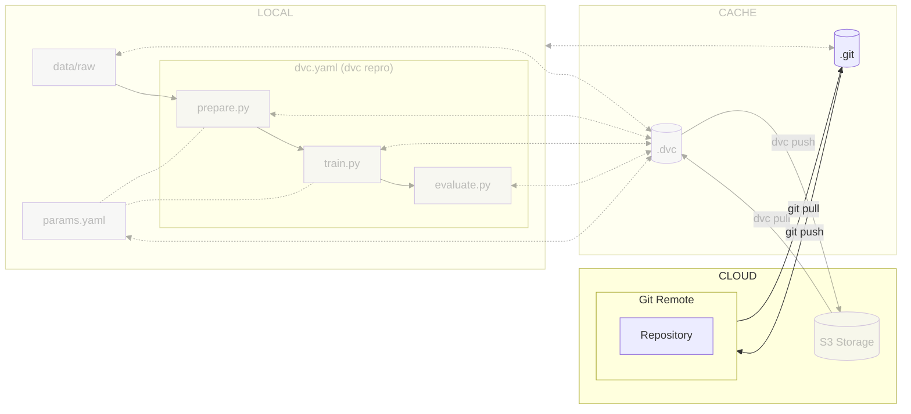

# Chapter 7: Move the ML experiment code to the cloud

??? info "You want to take over from this chapter? Collapse this section and follow the instructions below."

    _Work in progress._

    [//]: # "TODO"

## Introduction

At this point, the data is made available to team members using DVC, but the
experiment codebase itself is not.

By linking your local project to a remote repository on platforms like GitHub
or GitLab, you can seamlessly push, pull, and synchronize changes, facilitating
collaboration and ensuring smooth workflow.

The following diagram illustrates control flow of the experiment at the end of
this chapter:



## Create a remote Git repository

Create a Git repository on your preferred service to collaborate with peers.

=== ":simple-github: GitHub"

    Create a new GitHub repository for this chapter by accessing <https://github.com/new>. Configure the repository as you wish but **do not** check the box _"Add a README file"_.

=== ":simple-gitlab: GitLab"

    Create a new GitLab blank project for this chapter by accessing <https://gitlab.com/projects/new>. Configure the repository as you wish but **do not** check the box _"Initialize repository with a README"_.

## Configure Git for the remote branch

Add the remote origin to your repository. Your Git service should provide these
instructions as well.

```sh title="Execute the following command(s) in a terminal"
# Add the remote origin
git remote add origin <your git repository url>
```

## Push the changes to Git

Set the remote as the upstream branch and push the changes to Git.

```sh title="Execute the following command(s) in a terminal"
# Set remote origin and push the changes
git push -u origin main
```

After setting the upstream branch, you can simply use `git push` and `git pull`
without additional arguments to interact with the remote branch.

## Check the results

Go to your online Git repository and you will be able to view the files that are stored there.

This chapter is now complete. Please review the summary for a recap of the key points.

## Summary

Congrats! You now have a codebase that can be used and shared among the team.

In this chapter, you have successfully:

1. Set up a remote Git repository
2. Added the remote to your local git repository
3. Pushed your changes to the remote Git repository

You fixed some of the previous issues:

- ✅ Codebase no longer needs manual download and is versioned

Another member of your team can easily clone the experiment
with the following commands.

```sh title="Execute the following command(s) in a terminal"
# Clone the Git repository
git clone <your git repository url>
```

You can now safely continue to the next chapter.

## State of the MLOps process

- ✅ Notebook has been transformed into scripts for production
- ✅ Codebase and dataset are versioned
- ✅ Steps used to create the model are documented and can be re-executed
- ✅ Changes done to a model can be visualized with parameters, metrics and plots to identify
differences between iterations
- ✅ Dataset can be shared among the developers and is placed in the right
directory in order to run the experiment
- ✅ Codebase can be shared and improved by multiple developers
- ❌ Experiment may not be reproducible on other machines
- ❌ Changes to model are not thoroughly reviewed and discussed before integration
- ❌ Model may have required artifacts that are forgotten or omitted in saved/loaded state
- ❌ Model cannot be easily used from outside of the experiment context
- ❌ Model cannot be deployed on and accessed from a Kubernetes cluster
- ❌ Model cannot be trained on hardware other than the local machine

You will address these issues in the next chapters for improved efficiency and
collaboration. Continue the guide to learn how.

## Sources

Highly inspired by:

* [_Managing remote repositories_ - github.com](https://docs.github.com/en/get-started/getting-started-with-git/managing-remote-repositories)
* [_git-remote_ - git-scm.com](https://git-scm.com/docs/git-remote)
