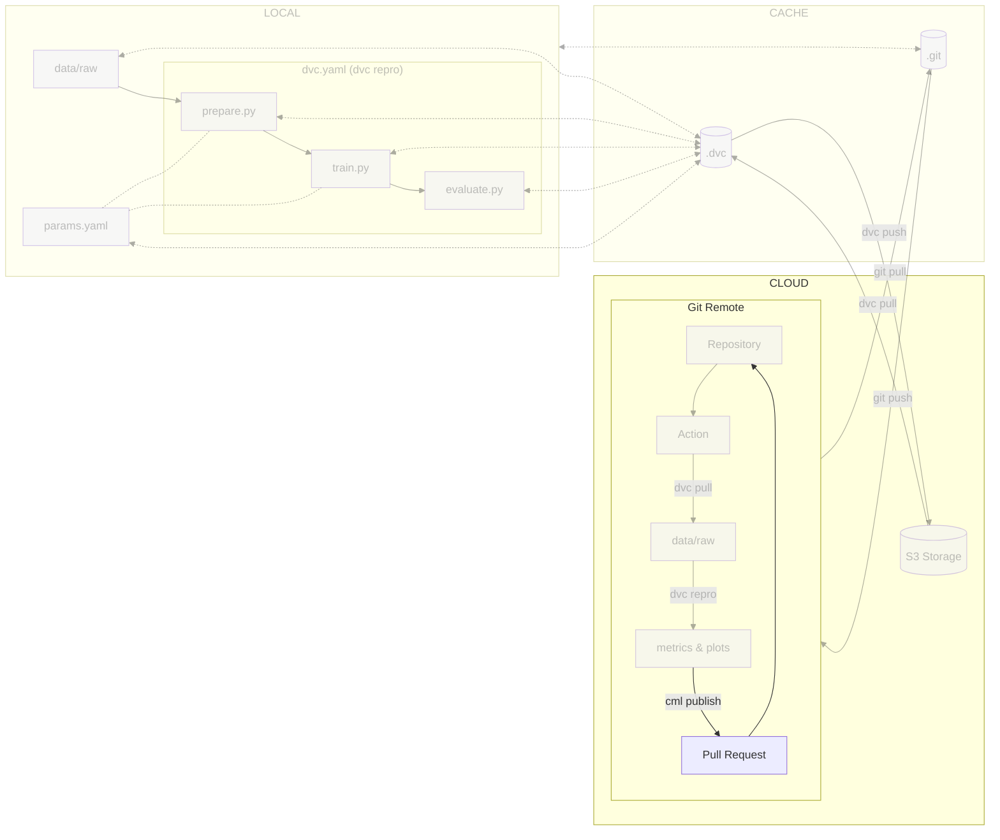

# Chapter 9: Track model evolution in the CI/CD pipeline with CML

??? info "You want to take over from this chapter? Collapse this section and follow the instructions below."

    _Work in progress._

    [//]: # "TODO"

## Introduction

The objective of this chapter is to effectively track the evolution of the model
and generate reports directly from the CI/CD pipeline, using [CML](../../tools).
This capability empowers collaborators to engage in online discussions, enabling
them to thoroughly review and deliberate on proposed changes before merging them
into the codebase.

In this chapter, you will learn how to:

1. Update the CI/CD configuration file to generate a CML report
2. Push the updated CI/CD configuration file to Git
3. Open an issue in your issue tracker
4. Create a new branch to add your changes
5. Check out the new branch
6. Commit and push experiment changes
7. Create a pull request/merge request
8. Visualize the execution of the CI/CD pipeline
9. Visualize the CML report that is added to your pull request/merge request
10. Merge the pull request/merge request to the main branch
11. Switch back to the main branch and pull latest changes

The following diagram illustrates control flow of the experiment at the end of
this chapter:



!!! info

    CML can do much more than just generating reports.
    Have a look to the [Train the model on a Kubernetes cluster with
    CML](../../part-3-serve-and-deploy-the-model-online/chapter-13-train-the-model-on-a-kubernetes-pod-with-cml/) guide.

## Steps

The reports produced by CML compare the current run with a designated target
reference.

The target reference can be a specific commit, allowing for a comparison between
the current run and the run associated with that particular commit.
Alternatively, it can be a branch, enabling a comparison between the current run
and the run linked to the target branch.

Numerous workflows facilitate discussions and the integration of work into a
target reference. In this guide, we will focus on two  methods that are commonly
used on GitHub - pull requests (PRs) - and GitLab - merge requests (MRs) - to
incorporate the work performed into the `main` branch.

### Update the CI/CD pipeline configuration file

We will enhance the CI/CD pipeline by adding an automated report comparing
new parameters and new metrics to the main branch, and published as a comment.

These additions will enable a comprehensive analysis of branches and facilitate
collaboration and decision-making within the team.

=== ":simple-github: GitHub"

    Update the `.github/workflows/mlops.yml` file.

    Take some time to understand the report job and its steps.

    ```yaml title=".github/workflows/mlops.yml" hl_lines="29-30 56-118"
    name: MLOps

    on:
      # Runs on pushes targeting main branch
      push:
        branches:
          - main
        paths:
            - src/**
            - dvc.yaml
            - params.yaml
            - requirements.txt
            - requirements-freeze.txt
            - .github/workflows/mlops.yml
      # Runs on pull requests
      pull_request:
        paths:
            - src/**
            - dvc.yaml
            - params.yaml
            - requirements.txt
            - requirements-freeze.txt
            - .github/workflows/mlops.yml

      # Allows you to run this workflow manually from the Actions tab
      workflow_dispatch:

    jobs:
      train-and-report:
        permissions: write-all
        runs-on: ubuntu-latest
        steps:
          - name: Checkout repository
            uses: actions/checkout@v3
          - name: Setup Python
            uses: actions/setup-python@v4
            with:
              python-version: '3.10'
          - name: Install dependencies
            run: pip install -r requirements-freeze.txt
          - name: Login to Google Cloud
            uses: 'google-github-actions/auth@v1'
            with:
              credentials_json: '${{ secrets.GCP_SERVICE_ACCOUNT_KEY }}'
          - name: Train model
            run: |
              # Run the experiment
              dvc repro --pull --allow-missing
              # Push the changes to the remote repository
              dvc push
          - name: Commit changes in dvc.lock
            uses: stefanzweifel/git-auto-commit-action@v4
            with:
              commit_message: Commit changes in dvc.lock
              file_pattern: dvc.lock
          - name: Setup Node
            if: github.event_name == 'pull_request'
            uses: actions/setup-node@v3
            with:
              node-version: '16'
          - name: Setup CML
            if: github.event_name == 'pull_request'
            uses: iterative/setup-cml@v1
            with:
              version: '0.19.1'
          - name: Create CML report
            if: github.event_name == 'pull_request'
            env:
              REPO_TOKEN: ${{ secrets.GITHUB_TOKEN }}
            run: |
              # Fetch all other Git branches
              git fetch --depth=1 origin main:main

              # Compare parameters to main branch
              echo "# Params workflow vs. main" >> report.md
              echo >> report.md
              dvc params diff main --md >> report.md
              echo >> report.md

              # Compare metrics to main branch
              echo "# Metrics workflow vs. main" >> report.md
              echo >> report.md
              dvc metrics diff main --md >> report.md
              echo >> report.md

              # Compare plots (images) to main branch
              dvc plots diff main

              # Create plots
              echo "# Plots" >> report.md
              echo >> report.md

              # Create training history plot
              echo "## Training History" >> report.md
              echo >> report.md
              echo '' >> report.md
              echo >> report.md
              echo '' >> report.md
              echo >> report.md

              # Create predictions preview
              echo "## Predictions Preview" >> report.md
              echo >> report.md
              echo '' >> report.md
              echo >> report.md
              echo '' >> report.md
              echo >> report.md

              # Create confusion matrix
              echo "## Confusion Matrix" >> report.md
              echo >> report.md
              echo '' >> report.md
              echo >> report.md
              echo '' >> report.md
              echo >> report.md

              # Publish the CML report
              cml comment update --target=pr --publish report.md
    ```

    You may notice that the `report` job doesn't use project dependencies. As we do not need to
    reproduce the experiment, we can install DVC using the `iterative/setup-dvc@v1`
    GitHub action without project dependencies. DVC will then retrieve the data stored on the
    bucket on its own.

    Check the differences with Git to validate the changes.

    ```sh title="Execute the following command(s) in a terminal"
    # Show the differences with Git
    git diff .github/workflows/mlops.yml
    ```

    The output should be similar to this:

    ```
    diff --git a/.github/workflows/mlops.yml b/.github/workflows/mlops.yml
    index 2a1914a..af1a0cb 100644
    --- a/.github/workflows/mlops.yml
    +++ b/.github/workflows/mlops.yml
    @@ -6,6 +6,9 @@ on:
    branches:
        - main

    +  # Runs on pull requests
    +  pull_request:
    +
    # Allows you to run this workflow manually from the Actions tab
    workflow_dispatch:

    @@ -31,3 +34,82 @@ jobs:
            dvc pull
            # Run the experiment
            dvc repro
    +
    +  report:
    +    permissions: write-all
    +    needs: train
    +    if: github.event_name == 'pull_request'
    +    runs-on: ubuntu-latest
    +    steps:
    +      - name: Checkout repository
    +        uses: actions/checkout@v3
    +        with:
    +          ref: ${{ github.event.pull_request.head.sha }}
    +      - name: Setup DVC
    +        uses: iterative/setup-dvc@v1
    +        with:
    +          version: '3.2.2'
    +      - name: Login to Google Cloud
    +        uses: 'google-github-actions/auth@v1'
    +        with:
    +          credentials_json: '${{ secrets.GCP_SERVICE_ACCOUNT_KEY }}'
    +      - name: Setup Node
    +        uses: actions/setup-node@v3
    +        with:
    +          node-version: '16'
    +      - name: Setup CML
    +        uses: iterative/setup-cml@v1
    +        with:
    +          version: '0.19.1'
    +      - name: Create CML report
    +        env:
    +          REPO_TOKEN: ${{ secrets.GITHUB_TOKEN }}
    +        run: |
    +          # Fetch all other Git branches
    +          git fetch --depth=1 origin main:main
    +
    +          # Compare parameters to main branch
    +          echo "# Params workflow vs. main" >> report.md
    +          echo >> report.md
    +          dvc params diff main --md >> report.md
    +          echo >> report.md
    +
    +          # Compare metrics to main branch
    +          echo "# Metrics workflow vs. main" >> report.md
    +          echo >> report.md
    +          dvc metrics diff main --md >> report.md
    +          echo >> report.md
    +
    +          # Compare plots (images) to main branch
    +          dvc plots diff main
    +
    +          # Create plots
    +          echo "# Plots" >> report.md
    +          echo >> report.md
    +
    +          # Create training history plot
    +          echo "## Training History" >> report.md
    +          echo >> report.md
    +          echo '' >> report.md
    +          echo >> report.md
    +          echo '' >> report.md
    +          echo >> report.md
    +
    +          # Create predictions preview
    +          echo "## Predictions Preview" >> report.md
    +          echo >> report.md
    +          echo '' >> report.md
    +          echo >> report.md
    +          echo '' >> report.md
    +          echo >> report.md
    +
    +          # Create confusion matrix
    +          echo "## Confusion Matrix" >> report.md
    +          echo >> report.md
    +          echo '' >> report.md
    +          echo >> report.md
    +          echo '' >> report.md
    +          echo >> report.md
    +
    +          # Publish the CML report
    +          cml comment update --target=pr --publish report.md
    ```

=== ":simple-gitlab: GitLab"

    In order to allow CML to generate reports, a Personal Access Token (PAT) must be
    created. A Project or a Group Access Token are not sufficient for the usage of
    CML's runners that will be used in the next steps.

    To create a Personal Access Token, go in your **Profile preferences > Access
    Tokens**.

    - **Token name**: _CML_
    - **Expiration date**: _None_
    - **Select scopes**: `api`, `read_repository` and `write_repository`

    Select **Create personal access token** to create the token. Copy it. It will be
    displayed only once.

    Store the PAT as a CI/CD Variable by going to **Settings > CI/CD** from the left
    sidebar of your GitLab project.

    Select **Variables** and select **Add variable**.

    Create a new variable named `CML_PAT` with the PAT value as its value.

    - **Protect variable**: _Unchecked_
    - **Mask variable**: _Checked_
    - **Expand variable reference**: _Unchecked_

    Save the variable by clicking **Add variable**.

    Update the `.gitlab-ci.yml` file.

    Explore this file to understand the report stage and its steps.

    ```yaml title=".gitlab-ci.yml" hl_lines="4 43-92"
    # ---------------------------------------------------------------
    # NOT WORKING - cannot push to current branch whithin ci pipeline
    # ---------------------------------------------------------------
    stages:
      - train
      - report

    variables:
      # Change pip's cache directory to be inside the project directory since we can
      # only cache local items.
      PIP_CACHE_DIR: "$CI_PROJECT_DIR/.cache/pip"
      # https://dvc.org/doc/user-guide/troubleshooting?tab=GitLab-CI-CD#git-shallow
      GIT_DEPTH: "0"
      # Set the path to Google Service Account key for DVC - https://dvc.org/doc/command-reference/remote/add#google-cloud-storage
      GOOGLE_APPLICATION_CREDENTIALS: "${CI_PROJECT_DIR}/google-service-account-key.json"
      # CML and git token
      REPO_TOKEN: $CML_PAT

    # Pip's cache doesn't store the python packages
    # https://pip.pypa.io/en/stable/reference/pip_install/#caching
    cache:
      paths:
        - .cache/pip
        - venv/

    before_script:
      # Set the Google Service Account key
      - echo "${GCP_SERVICE_ACCOUNT_KEY}" | base64 -d > $GOOGLE_APPLICATION_CREDENTIALS
      # Install dependencies
      - pip install virtualenv
      - virtualenv venv
      - source venv/bin/activate
      - pip install -r requirements.txt

    train:
      stage: train
      image: python:3.10
      rules:
        - if: $CI_COMMIT_BRANCH == "main"
        - if: $CI_PIPELINE_SOURCE == "merge_request_event"
      script:
        # Run the experiment
        - dvc repro --pull --allow-missing
        # Push the changes to the remote repository
        - dvc push
        # Commit changes in dvc.lock
        - |
          git config --global user.name "gitlab-ci[bot]"
          git config --global user.email "gitlab-ci[bot]@users.noreply.gitlab.com"
          git add dvc.lock
          git commit -m "Commit changes in dvc.lock"
          # Either use CI_COMMIT_BRANCH or CI_MERGE_REQUEST_SOURCE_BRANCH_NAME
          if [ -z "$CI_MERGE_REQUEST_SOURCE_BRANCH_NAME" ]
          then
            git push -o ci.skip "https://${GITLAB_USER_NAME}:${REPO_TOKEN}@${CI_REPOSITORY_URL#*@}" "HEAD:${CI_COMMIT_BRANCH}"
          else
            git push -o ci.skip "https://${GITLAB_USER_NAME}:${REPO_TOKEN}@${CI_REPOSITORY_URL#*@}" "HEAD:${CI_MERGE_REQUEST_SOURCE_BRANCH_NAME}"
          fi

    report:
      stage: report
      image: iterativeai/cml:0-dvc3-base1
      needs:
        - train
      rules:
        - if: $CI_PIPELINE_SOURCE == "merge_request_event"
      script:
        - |
          # Fetch the experiment changes
          dvc pull

          # Fetch all other Git branches
          git fetch --depth=1 origin main:main

          # Compare parameters to main branch
          echo "# Params workflow vs. main" >> report.md
          echo >> report.md
          dvc params diff main --md >> report.md
          echo >> report.md

          # Compare metrics to main branch
          echo "# Metrics workflow vs. main" >> report.md
          echo >> report.md
          dvc metrics diff main --md >> report.md
          echo >> report.md

          # Compare plots (images) to main branch
          dvc plots diff main

          # Create plots
          echo "# Plots" >> report.md
          echo >> report.md

          # Create training history plot
          echo "## Training History" >> report.md
          echo >> report.md
          echo '' >> report.md
          echo >> report.md
          echo '' >> report.md
          echo >> report.md

          # Create predictions preview
          echo "## Predictions Preview" >> report.md
          echo >> report.md
          echo '' >> report.md
          echo >> report.md
          echo '' >> report.md
          echo >> report.md

          # Create confusion matrix
          echo "## Confusion Matrix" >> report.md
          echo >> report.md
          echo '' >> report.md
          echo >> report.md
          echo '' >> report.md
          echo >> report.md

          # Publish the CML report
          cml comment update --target=pr --publish report.md
    ```

    You may notice that the `report` stage doesn't use the project dependencies. As we do not need to reproduce the experiment, we can use DVC from the `iterativeai/cml:0-dvc2-base1` Docker image without the project dependencies. DVC will then retrieve the data stored on the bucket on its own.

    Check the differences with Git to validate the changes.

    ```sh title="Execute the following command(s) in a terminal"
    # Show the differences with Git
    git diff .gitlab-ci.yml
    ```

    The output should be similar to this:

    ```
    diff --git a/.gitlab-ci.yml b/.gitlab-ci.yml
    index e104669..a946523 100644
    --- a/.gitlab-ci.yml
    +++ b/.gitlab-ci.yml
    @@ -1,5 +1,6 @@
    stages:
    - train
    +  - report

    variables:
    # Change pip's cache directory to be inside the project directory since we can
    @@ -33,3 +34,65 @@ train:
        - dvc pull
        # Run the experiment
        - dvc repro
    +
    +report:
    +  stage: report
    +  image: iterativeai/cml:0-dvc3-base1
    +  needs:
    +    - train
    +  rules:
    +    - if: $CI_PIPELINE_SOURCE == "merge_request_event"
    +  variables:
    +    # Set the path to Google Service Account key for DVC - https://dvc.org/doc/command-reference/remote/add#google-cloud-storage
    +    GOOGLE_APPLICATION_CREDENTIALS: "${CI_PROJECT_DIR}/google-service-account-key.json"
    +    REPO_TOKEN: $CML_PAT
    +  before_script:
    +    # Set the Google Service Account key
    +    - echo "${GCP_SERVICE_ACCOUNT_KEY}" | base64 -d > $GOOGLE_APPLICATION_CREDENTIALS
    +  script:
    +    - |
    +      # Compare parameters to main branch
    +      echo "# Params workflow vs. main" >> report.md
    +      echo >> report.md
    +      dvc params diff main --md >> report.md
    +      echo >> report.md
    +
    +      # Compare metrics to main branch
    +      echo "# Metrics workflow vs. main" >> report.md
    +      echo >> report.md
    +      dvc metrics diff main --md >> report.md
    +      echo >> report.md
    +
    +      # Compare plots (images) to main branch
    +      dvc plots diff main
    +
    +      # Create plots
    +      echo "# Plots" >> report.md
    +      echo >> report.md
    +
    +      # Create training history plot
    +      echo "## Training History" >> report.md
    +      echo >> report.md
    +      echo '' >> report.md
    +      echo >> report.md
    +      echo '' >> report.md
    +      echo >> report.md
    +
    +      # Create predictions preview
    +      echo "## Predictions Preview" >> report.md
    +      echo >> report.md
    +      echo '' >> report.md
    +      echo >> report.md
    +      echo '' >> report.md
    +      echo >> report.md
    +
    +      # Create confusion matrix
    +      echo "## Confusion Matrix" >> report.md
    +      echo >> report.md
    +      echo '' >> report.md
    +      echo >> report.md
    +      echo '' >> report.md
    +      echo >> report.md
    +
    +      # Publish the CML report
    +      cml comment update --target=pr --publish report.md
    ```

The new `report` job is responsible for reporting the results of the model
evaluation and comparing it with the main branch. This job is triggered only
when a pull request is opened and commits are made to it. The job checks out the
repository, sets up DVC and CML, creates and publishes the report as a pull
request or merge request comment.

Take some time to understand the changes made to the file.

### Push the CI/CD pipeline configuration file to Git

=== ":simple-github: GitHub"

    ```sh title="Execute the following command(s) in a terminal"
    # Add the updated workflow
    git add .github/workflows/mlops.yml

    # Commit the changes
    git commit -m "Enable CML reports on pull requests"

    # Push the changes
    git push
    ```

=== ":simple-gitlab: GitLab"

    ```sh title="Execute the following command(s) in a terminal"
    # Add the updated GitLab CI
    git add .gitlab-ci.yml

    # Commit the changes
    git commit -m "Enable CML reports on merge requests"

    # Push the changes
    git push
    ```

### Open an issue

=== ":simple-github: GitHub"

    Create a new issue by going to the **Issues** section from the top header of
    your GitHub repository. Select **New issue** and describe the
    work/improvements/ideas that you want to integrate to the codebase. In this
    guide, we will name the issue _Demonstrate model evolution tracking_. Create
    the issue by selecting **Submit new issue**.

=== ":simple-gitlab: GitLab"

    Create a new issue by going to the **Issues** section from the left sidebar of
    your GitLab project. Select **New issue** and describe the
    work/improvements/ideas that you want to integrate to the codebase. In this
    guide, we will name the issue _Demonstrate model evolution tracking_. Create
    the issue by selecting **Submit new issue**.

### Create a branch for the issue

=== ":simple-github: GitHub"

    In the newly created issue, select **Create a branch for this issue or link a
    pull request** from the right sidebar. Create the branch by selecting **Create
    branch**. A new pop-up opens with the name of the branch you want to checkout
    to.

=== ":simple-gitlab: GitLab"

    In the newly created issue, select **Create merge request** and change the
    merge request configuration if needed. Create the merge request by selecting
    **Create merge request**. This will automatically create a new branch linked
    to the issue.

### Checkout the new branch

On your machine, check out the new branch.

```sh title="Execute the following command(s) in a terminal"
# Get the latest updates from the remote origin
git fetch origin

# Check to the new branch
git checkout <the name of the new branch>
```

### Update the parameters of the experiment

Similarly to what we have done in [Chapter 5: Track model evolutions with
DVC](../../part-1-local-training-and-model-evaluation/chapter-5-track-model-evolution-with-dvc),
we will update the experiment to see the evolution being tracked remotely by CML.

If you don't have changes in your working directory, just update the parameters
of the experiment in `params.yaml` and reproduce the experiment with `dvc
repro`. You can then commit the changes.

Update your experiment with the following parameters by editing the
`params.yaml` file.

```yaml title="params.yaml" hl_lines="9 11-12"
prepare:
  seed: 77
  split: 0.2
  image_size: [32, 32]
  grayscale: True

train:
  seed: 77
  lr: 0.001
  epochs: 10
  conv_size: 64
  dense_size: 128
  output_classes: 11
```

Check the differences with Git to validate the changes.

```sh title="Execute the following command(s) in a terminal"
# Show the differences with Git
git diff params.yaml
```

The output should be similar to this.

```diff
diff --git a/params.yaml b/params.yaml
index 6a6ff45..4572100 100644
--- a/params.yaml
+++ b/params.yaml
@@ -6,8 +6,8 @@ prepare:

 train:
   seed: 77
-  lr: 0.0001
+  lr: 0.001
   epochs: 10
-  conv_size: 32
-  dense_size: 64
+  conv_size: 64
+  dense_size: 128
   output_classes: 11
```

Here, we simply changed the `max_features` and `ngrams` parameters of the
`featurize` stage, which should slightly affect the model's performance.

### Commit and push the experiment changes

You can now commit and push the above changes to trigger a change on the remote
repository.

Check the changes with Git to ensure all wanted files are here.

```sh title="Execute the following command(s) in a terminal"
# Add all the files
git add .

# Check the status
git status
```

The output of the `git status` command should be similar to this.

```
On branch cml-report
Your branch is up to date with 'cml-report'.

Changes to be committed:
  (use "git restore --staged <file>..." to unstage)
    modified:   params.yaml
```

```sh title="Execute the following command(s) in a terminal"
# Upload the experiment data and cache to the remote bucket
dvc push

# Commit the changes
git commit -m "I made some changes to the model"

# Push the changes
git push
```

### Create a pull request/merge request

=== ":simple-github: GitHub"

    Go back to your GitHub repository. A new **Compare & pull request** button
    should automatically appear. Click on it. Name the pull request and select
    **Create pull request**.

    !!! info

        You might need to wait for the pipeline to finish before the button appears.

=== ":simple-gitlab: GitLab"

    The merge request has already been created from the issue earlier, you can
    proceed to the next step.

### Visualize the execution of the CI/CD pipeline

=== ":simple-github: GitHub"

    The pull request opens and automatically starts the workflow `MLOps / train
    (pull_request)` under the **Some checks haven’t completed yet** section. You can
    click on **Details** to see the execution details.

    Explore the output and try to identify the steps that are executed.

    Once the workflow is done, a new workflow `MLOps / report (pull_request)` is
    started under the **Some checks haven’t completed yet** section. You can click
    on **Details** to see the details.

    Explore the output and try to see how the configuration file shows up in GitHub.

    Once all workflows have successfully been executed, the **Some checks haven't
    completed yet** section should become **All checks have passed**.

=== ":simple-gitlab: GitLab"

    Open the merge request. The pipeline should start. Click on the pipeline number
    to see its details.

    Explore the stages and jobs and try to see how the configuration file shows up
    in GitLab.

### Visualize the CML report

=== ":simple-github: GitHub"

    When the CI/CD pipeline completes, a new comment is added to your pull request.
    Check the pull request and examine the report published by CML. As it uses the
    evaluation data that was pulled from DVC, it can uses it to display all the
    plots.

=== ":simple-gitlab: GitLab"

    When the CI/CD pipeline completes, a new comment is added to your merge request.
    Check the merge request and examine the report made by CML. As it uses the
    evaluation data that was pulled DVC, it can uses it to display all the
    plots.

### Merge the pull request/merge request

=== ":simple-github: GitHub"

    Once you are satisfied with the model's performance, you can merge the changes.

    Go back to the pull request. At the end of the page, select **Merge pull
    request**. Confirm the merge by selecting **Confirm merge**.

    The associated issue will be automatically closed as well.

    You can delete the branch by clicking **Delete branch** to clean up your
    repository. If you ever need to go back to this branch, you can always restore
    the branch from this menu.

    Congrats! You can now iterate on your model while keeping a trace of the
    improvements made to it. You can visualize and discuss the changes made to a
    model before merging them into the codebase.

=== ":simple-gitlab: GitLab"

    Once you are satisfied with the model's performance, you can merge the changes.

    Go back to the merge request. Select **Mark as ready**. This will allow to merge
    the changes. Confirm the merge by selecting **Merge** (you might need to refresh
    the page to see this button).

    The associated issue will be automatically closed as well.

    Congrats! You can now iterate on your model while keeping a trace of the
    improvements made to it. You can visualize and discuss the changes made to a
    model before merging them into the codebase.

### Switch back to the main branch and pull latest changes

Now that the merge is done, you can get the changes on the main branch.

```sh title="Execute the following command(s) in a terminal"
# Get the latest updates from the remote origin
git fetch origin

# Check to the main branch
git checkout main

# Pull the changes made by the pull request/merge request
git pull
```

This chapter is done, you can check the summary.

## Summary

In this chapter, you have successfully:

1. Updated the CI/CD configuration file to generate a CML report
2. Pushed the updated CI/CD configuration file to Git
3. Opened an issue in your issue tracker
4. Created a new branch to add your changes
5. Checked out the new branch
6. Commit and pushed experiment changes
7. Created a pull request/merge request
8. Visualized the execution of the CI/CD pipeline
9. Visualized the CML report that is added to your pull request/merge request
10. Merged the pull request/merge request to the main branch
11. Switched back to the main branch and pulled latest changes

However, you might have identified the following areas for improvement:

- [ ] How can I serve my model to the rest of the world?

In the next chapters, you will enhance the workflow to fix those issues.

You can now safely continue to the next chapter.

## State of the MLOps process

- [x] Notebook has been transformed into scripts for production
- [x] Codebase and dataset are versioned
- [x] Steps used to create the model are documented and can be re-executed
- [x] Changes done to a model can be visualized with parameters, metrics and plots to identify
differences between iterations
- [x] Dataset can be shared among the developers and is placed in the right
directory in order to run the experiment
- [x] Codebase can be shared and improved by multiple developers
- [x] Experiment can be executed on a clean machine with the help of a CI/CD
pipeline
- [x] Changes to model can be thoroughly reviewed and discussed before integrating them into the codebase
- [ ] Model may have required artifacts that are forgotten or omitted in saved/loaded state
- [ ] Model cannot be easily used from outside of the experiment context

You will address these issues in the next chapters for improved efficiency and collaboration. Continue the guide to learn how.

## Sources

Highly inspired by the following guides:

* [_Get Started with CML on GitHub_ - cml.dev](https://cml.dev/doc/start/github)
* [_Creating an issue_ - docs.github.com](https://docs.github.com/en/issues/tracking-your-work-with-issues/creating-an-issue)
* [_Creating a branch to work on an issue_ - docs.github.com](https://docs.github.com/en/issues/tracking-your-work-with-issues/creating-a-branch-for-an-issue)
* [_Get Started with CML on GitLab_ - cml.dev](https://cml.dev/doc/start/gitlab)
* [_Personal access tokens_ - docs.gitlab.com](https://docs.gitlab.com/ee/user/profile/personal_access_tokens.html)

And the following Git repositories:

* [`example_cml` - github.com](https://github.com/iterative/example_cml)
* [`cml_dvc_case` - github.com](https://github.com/iterative/cml_dvc_case)
* [`example_cml` - gitlab.com](https://gitlab.com/iterative.ai/example_cml)
* [`cml-dvc-case` - gitlab.com](https://gitlab.com/iterative.ai/cml-dvc-case)
