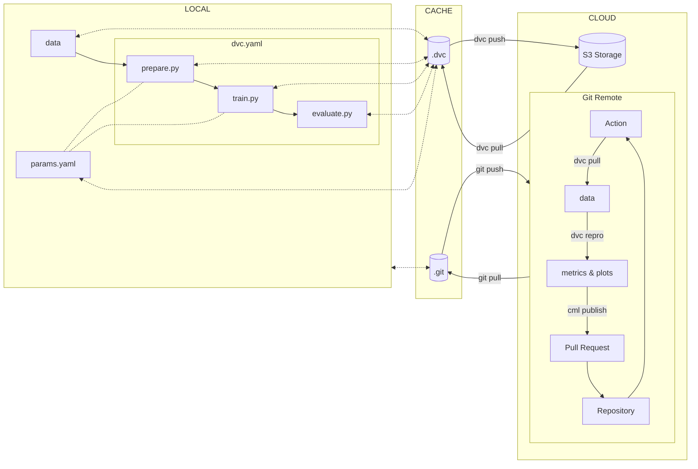

# Conclusion

```mermaid
flowchart LR
	789994[(".dvc")] -->|"dvc push"| 574108[("S3 Storage")]
	574108 -->|"dvc pull"| 789994
	429113[(".git")] -->|"git push"| 723944["Git Remote"]
	723944 -->|"git pull"| 429113
    356399 <-....-> 429113
	980408["data"] <-.-> 789994
	subgraph 438901["CACHE"]
		789994
		429113
	end
	subgraph 356399["LOCAL"]
		672354["prepare.py"] <-.-> 789994
		347464["train.py"] <-.-> 789994
		964259["evaluate.py"] <-.-> 789994
		980408 --> 672354
		subgraph 695374["dvc.yaml"]
			672354 --> 347464
			347464 --> 964259
		end
        238472["params.yaml"] -.- 672354
        238472 -.- 347464
        238472 <-.-> 789994
	end
	subgraph 935111["CLOUD"]
		574108
		subgraph 723944["Git Remote"]
			386452["Repository"] --> 241240["Action"]
			241240 -->|"dvc pull"| 525260["data"]
			525260 -->|"dvc repro"| 732730["metrics &amp; plots"]
			732730 -->|"cml publish"| 983104["Pull Request"]
			983104 --> 386452
		end
	end
```