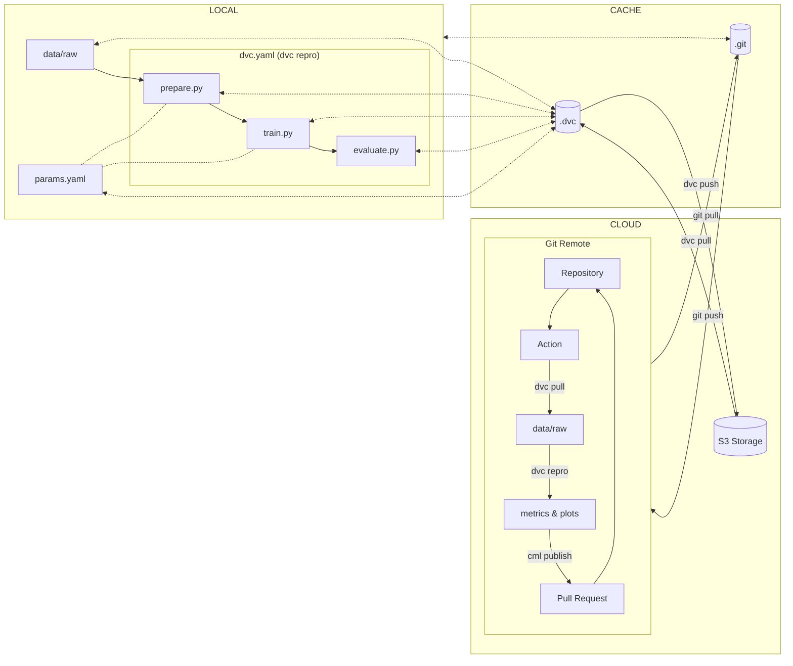

# Conclusion

```mermaid
flowchart LR
	dot_dvc[(.dvc)] -->|dvc push| s3_storage[(S3 Storage)]
	s3_storage -->|dvc pull| dot_dvc
	dot_git[(.git)] -->|git push| gitGraph[Git Remote]
	gitGraph -->|git pull| dot_git
    localGraph <-....-> dot_git
	data[data/raw] <-.-> dot_dvc
    subgraph cloudGraph[CLOUD]
        s3_storage
        subgraph gitGraph[Git Remote]
            repository[Repository] --> action[Action]
            action -->|dvc pull| action_data[data/raw]
            action_data -->|dvc repro| action_out[metrics & plots]
            action_out -->|cml publish| pr[Pull Request]
            pr --> repository
        end
	end
	subgraph cacheGraph[CACHE]
		dot_dvc
		dot_git
	end
	subgraph localGraph[LOCAL]
		prepare[prepare.py] <-.-> dot_dvc
		train[train.py] <-.-> dot_dvc
		evaluate[evaluate.py] <-.-> dot_dvc
		data --> prepare
		subgraph dvcGraph["dvc.yaml (dvc repro)"]
			prepare --> train
			train --> evaluate
		end
        params[params.yaml] -.- prepare
        params -.- train
        params <-.-> dot_dvc
	end
```
