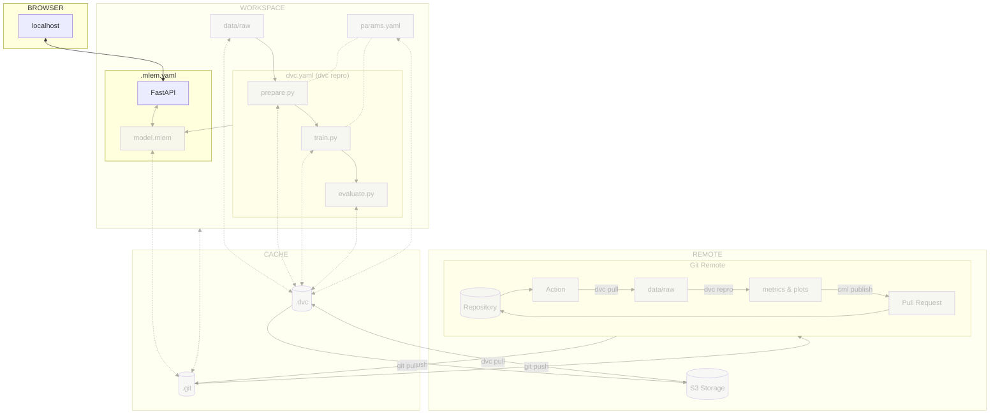

# Chapter 12: Serve the model locally with MLEM

## Introduction

Now that the model is using [MLEM](../tools.md), enabling the extraction of
metadata upon saving, you will serve the model and leverage the capabilities of
[FastAPI](https://fastapi.tiangolo.com/) to create local endpoints for
interacting with the model.

In this chapter, you will learn how to:

1. Install MLEM with FastAPI support
2. Serve the model with FastAPI
3. Push the changes to DVC and Git

The following diagram illustrates control flow of the experiment at the end of
this chapter:



## Steps

### Install MLEM with FastAPI support

Update the `requirements.txt` file to add `fastapi` support to the `mlem`
package.

!!! info

    FastAPI is only one of the available backends that MLEM can use to serve the
    model. Check out their
    [official documentation](https://mlem.ai/doc/user-guide/serving) for more
    options.

```txt title="requirements.txt" hl_lines="5"
tensorflow==2.12.0
matplotlib==3.7.1
pyyaml==6.0
dvc[gs]==3.2.2
mlem[fastapi]==0.4.13
```

Check the differences with Git to validate the changes.

```sh title="Execute the following command(s) in a terminal"
# Show the differences with Git
git diff requirements.txt
```

The output should be similar to this.

```diff
diff --git a/requirements.txt b/requirements.txt
index 7542f6a..fcdd460 100644
--- a/requirements.txt
+++ b/requirements.txt
@@ -2,4 +2,4 @@ tensorflow==2.12.0
 matplotlib==3.7.1
 pyyaml==6.0
 dvc[gs]==3.2.2
-mlem==0.4.13
+mlem[fastapi]==0.4.13
```

Install the dependencies and update the freeze file.

!!! warning

    Prior to running any pip commands, it is crucial to ensure the virtual
    environment is activated to avoid potential conflicts with system-wide Python
    packages.

    To check its status, simply run `pip -V`. If the virtual environment is active,
    the output will show the path to the virtual environment's Python executable. If
    it is not, you can activate it with `source .venv/bin/activate`.

```sh title="Execute the following command(s) in a terminal"
# Install the dependencies
pip install --requirement requirements.txt

# Freeze the dependencies
pip freeze --local --all > requirements-freeze.txt
```

### Serve the model with FastAPI

Serve the model with FastAPI. FastAPI will generate a REST API that you can use
to get predictions from our model.

```sh title="Execute the following command(s) in a terminal"
# Serve the model with FastAPI
mlem serve fastapi --model model
```

MLEM will load the model, create the FastAPI app and start it. You can then
access the auto-generated model documentation on
<http://localhost:8080/docs>{:target="\_blank"}.

!!! info

    Remember the `sample_data` variable discussed in the previous chapter? This will
    be used by MLEM to generate the FastAPI endpoints with the right OpenAPI/Swagger
    specifications.

The following endpoint has been created:

- `/predict`: Upload a `png` or `jpg` image and get a prediction from the model.

You can try out predictions by inputing some sentences to the model through the
REST API!

### Try out the prediction endpoint

The following images are available in the `extra-data` repository that you will
use in a future chapter:
<https://github.com/swiss-ai-center/a-guide-to-mlops/tree/extra-data/extra_data>.

Here are some example you can use.

!!! warning

    Please be aware that this model is for demonstration purposes. Some inputs may
    be incorrectly predicted.

#### Moon example

Download the following image of the moon on your computer.

<figure markdown>
  
</figure>

Upload it to the `/predict` endpoint and check the prediction.

The output should be similar to this.

```json
{
  "prediction": "Moon",
  "probabilities": {
    "Earth": 7.035154793791354e-13,
    "Jupiter": 0.00007276538963196799,
    "MakeMake": 0.02092079259455204,
    "Mars": 0.010689028538763523,
    "Mercury": 0.023408930748701096,
    "Moon": 0.9338789582252502,
    "Neptune": 0.000002209141257480951,
    "Pluto": 0.0028652558103203773,
    "Saturn": 1.8474166695123945e-13,
    "Uranus": 1.9255971039910946e-7,
    "Venus": 0.008161773905158043
  }
}
```

#### Makemake example

Download the following image of Makemake on your computer.

<figure markdown>
  
</figure>

Upload it to the `/predict` endpoint and check the prediction.

The output should be similar to this.

```json
{
  "prediction": "MakeMake",
  "probabilities": {
    "Earth": 1.7512833494492952e-7,
    "Jupiter": 0.041287556290626526,
    "MakeMake": 0.8213532567024231,
    "Mars": 0.0008790065185166895,
    "Mercury": 0.05630605295300484,
    "Moon": 0.07207279652357101,
    "Neptune": 0.0020877758506685495,
    "Pluto": 0.001172061893157661,
    "Saturn": 3.342878756029677e-7,
    "Uranus": 0.0000021771340925624827,
    "Venus": 0.004838812164962292
  }
}
```

#### Neptune example

Download the following image of Neptune on your computer.

<figure markdown>
  
</figure>

Upload it to the `/predict` endpoint and check the prediction.

The output should be similar to this. You may notice the model got it wrong and
prediced Uranus instead!

```json
{
  "prediction": "Uranus",
  "probabilities": {
    "Earth": 1.949044925453336e-9,
    "Jupiter": 0.02630659192800522,
    "MakeMake": 0.00044166349107399583,
    "Mars": 0.0023288053926080465,
    "Mercury": 0.0007231549825519323,
    "Moon": 0.0012503587640821934,
    "Neptune": 0.3933066725730896,
    "Pluto": 0.002935060765594244,
    "Saturn": 0.0000018027430996880867,
    "Uranus": 0.5725908279418945,
    "Venus": 0.00011510706099215895
  }
}
```

### Check the changes

Check the changes with Git to ensure that all the necessary files are tracked.

```sh title="Execute the following command(s) in a terminal"
# Add all the files
git add .

# Check the changes
git status
```

The output should look like this.

```
On branch main
Changes to be committed:
  (use "git restore --staged <file>..." to unstage)
    modified:   requirements-freeze.txt
    modified:   requirements.txt
```

### Commit the changes to DVC and Git

Commit the changes to DVC and Git.

```sh title="Execute the following command(s) in a terminal"
# Upload the experiment data and cache to the remote bucket
dvc push

# Commit the changes
git commit -m "MLEM can serve the model with FastAPI"

# Push the changes
git push
```

### Check the results

Congratulations! You now have a model served over a REST API!

This chapter is done, you can check the summary.

## Summary

In this chapter, you have successfully:

1. Installed MLEM with FastAPI support
2. Served the model with FastAPI
3. Pushed the changes to DVC and Git

You did fix some of the previous issues:

- [x] Model can be easily used outside of the experiment context.

You could serve this model from anywhere. Additional services could submit
predictions to your model. The usage of FastAPI creates endpoints that are
automatically documented to interact with the model.

You can now safely continue to the next chapter.

## State of the MLOps process

- [x] Notebook has been transformed into scripts for production
- [x] Codebase and dataset are versioned
- [x] Steps used to create the model are documented and can be re-executed
- [x] Changes done to a model can be visualized with parameters, metrics and
      plots to identify differences between iterations
- [x] Codebase can be shared and improved by multiple developers
- [x] Dataset can be shared among the developers and is placed in the right
      directory in order to run the experiment
- [x] Experiment can be executed on a clean machine with the help of a CI/CD
      pipeline
- [x] CI/CD pipeline is triggered on pull requests and reports the results of
      the experiment
- [x] Changes to model can be thoroughly reviewed and discussed before
      integrating them into the codebase
- [x] Model can be saved and loaded with all required artifacts for future usage
- [x] Model can be easily used outside of the experiment context
- [ ] Model is not accessible on the Internet and cannot be used anywhere
- [ ] Model requires manual deployment on the cluster
- [ ] Model cannot be trained on hardware other than the local machine

You will address these issues in the next chapters for improved efficiency and
collaboration. Continue the guide to learn how.

## Sources

Highly inspired by:

* [_Serving models_ - mlem.ai](https://mlem.ai/doc/user-guide/serving)
