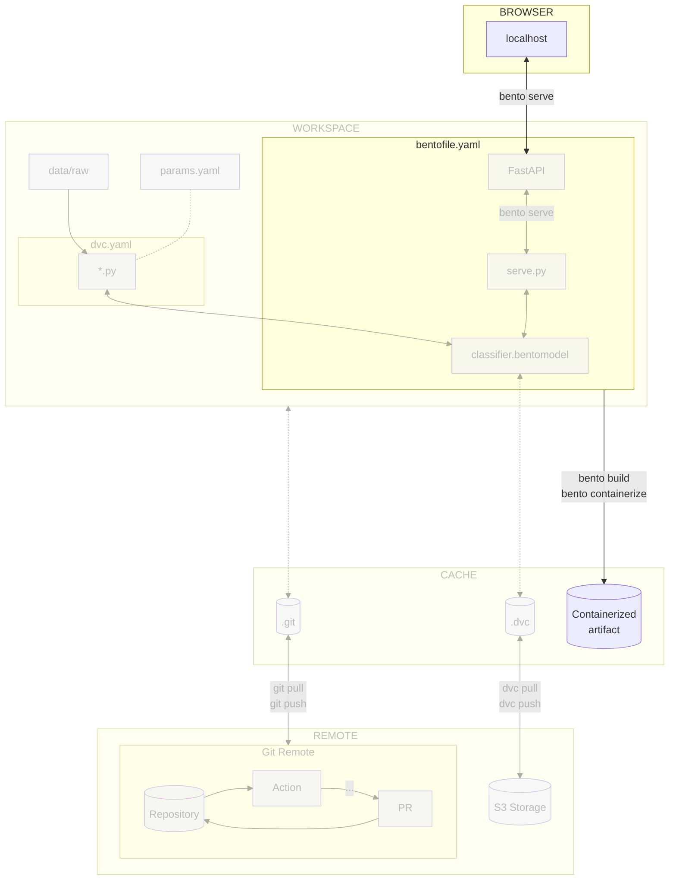

# Chapter 13 - Build and publish the model with BentoML and Docker locally

## Introduction

Serving the model locally is great for testing purposes, but it is not
sufficient for production. In this chapter, you will learn how to build and
publish the model with [BentoML](../tools.md) and [Docker](../tools.md).

This will allow to share the model with others and deploy it on a Kubernetes in
a later chapter.

In this chapter, you will learn how to:

1. Create a BentoML model artifact
2. Containerize the model artifact with BentoML and Docker
3. Test the containerized model artifact by serving it locally with Docker

The following diagram illustrates control flow of the experiment at the end of
this chapter:



## Steps

### Create a BentoML model artifact

A BentoML model artifact (called "Bento" in the documentation) packages your
model, code, and environment dependencies into a single file. It is the standard
format for saving and sharing ML models.

The BentoML model artifact is described in a `bentofile.yaml` file. It contains
the following information:

- The service filename and class name
- The Python packages required to run the service
- The Docker configuration, such as the Python version to use

Create a new `bentofile.yaml` file in the `src` directory with the following
content:

```yaml title="src/bentofile.yaml"
service: 'serve:CelestialBodiesClassifierService'
include:
  - serve.py
python:
  packages:
    - "tensorflow==2.12.0"
    - "matplotlib==3.7.1"
    - "pillow==10.2.0"
docker:
    python_version: "3.11"
```

Do not forget to include the `serve.py` file in the BentoML model artifact. This
file contains the code to serve the model with FastAPI as you have seen in the
previous chapter.

The `python` section contains the Python packages required to run the service.
It does not contain DVC and other packages to build the model, as they are not
required to run the service.

The `docker` section contains the Python version to use. It is important to
specify the Python version to ensure the service runs correctly.

Now that the `bentofile.yaml` file is created, you can serve the model with the
following command:

```sh title="Execute the following command(s) in a terminal"
# Serve the model
bentoml serve --working-dir src
```

### Build the BentoML model artifact

Before containerizing the BentoML model artifact with Docker, you need to build
it.

A BentoML model artifact can be built with the following command:

```sh title="Execute the following command(s) in a terminal"
# Build the BentoML model artifact
bentoml build src
```

The output should be similar to this:

```text
2024-02-15 14:21:52.512530: I tensorflow/core/platform/cpu_feature_guard.cc:182] This TensorFlow binary is optimized to use available CPU instructions in performance-critical operations.
To enable the following instructions: AVX2 FMA, in other operations, rebuild TensorFlow with the appropriate compiler flags.
Adding current BentoML version to requirements.txt: 1.2.2
Locking PyPI package versions.
WARNING: --strip-extras is becoming the default in version 8.0.0. To silence this warning, either use --strip-extras to opt into the new default or use --no-strip-extras to retain the existing behavior.

██████╗ ███████╗███╗   ██╗████████╗ ██████╗ ███╗   ███╗██╗
██╔══██╗██╔════╝████╗  ██║╚══██╔══╝██╔═══██╗████╗ ████║██║
██████╔╝█████╗  ██╔██╗ ██║   ██║   ██║   ██║██╔████╔██║██║
██╔══██╗██╔══╝  ██║╚██╗██║   ██║   ██║   ██║██║╚██╔╝██║██║
██████╔╝███████╗██║ ╚████║   ██║   ╚██████╔╝██║ ╚═╝ ██║███████╗
╚═════╝ ╚══════╝╚═╝  ╚═══╝   ╚═╝    ╚═════╝ ╚═╝     ╚═╝╚══════╝

Successfully built Bento(tag="celestial_bodies_classifier:f7hnaegmawocrlg6").

Possible next steps:

 * Containerize your Bento with `bentoml containerize`:
    $ bentoml containerize celestial_bodies_classifier:f7hnaegmawocrlg6  [or bentoml build --containerize]

 * Push to BentoCloud with `bentoml push`:
    $ bentoml push celestial_bodies_classifier:f7hnaegmawocrlg6 [or bentoml build --push]
```

All Bentos can be listed with the following command:

```sh title="Execute the following command(s) in a terminal"
# List all BentoML model artifacts
bentoml list
```

The output should be similar to this:

```text
bentoml list
 Tag                                                   Size       Model Size  Creation Time
 celestial_bodies_classifier:f7hnaegmawocrlg6          17.25 KiB  9.53 MiB    2024-02-15 14:22:21
```

### Containerize the BentoML model artifact with Docker

Now that the BentoML model artifact is built, you can containerize it with the
following command:

```sh title="Execute the following command(s) in a terminal"
# Containerize the BentoML model artifact with Docker
bentoml containerize celestial_bodies_classifier:latest --image-tag celestial-bodies-classifier:latest
```

The first `:latest` is the tag of the BentoML model artifact. It is a symlink to
the latest version of the BentoML model artifact.

The output should be similar to this:

```text
Building OCI-compliant image for celestial_bodies_classifier:f7hnaegmawocrlg6 with docker

[+] Building 95.6s (16/16) FINISHED                                                                                                                                             docker:desktop-linux
 => [internal] load build definition from Dockerfile                                                                                                                                            0.1s
 => => transferring dockerfile: 1.71kB                                                                                                                                                          0.0s
 => [internal] load metadata for docker.io/library/python:3.11-slim                                                                                                                             1.4s
 => [internal] load .dockerignore                                                                                                                                                               0.0s
 => => transferring context: 2B                                                                                                                                                                 0.0s
 => [base-container  1/11] FROM docker.io/library/python:3.11-slim@sha256:ce81dc539f0aedc9114cae640f8352fad83d37461c24a3615b01f081d0c0583a                                                      0.0s
 => => resolve docker.io/library/python:3.11-slim@sha256:ce81dc539f0aedc9114cae640f8352fad83d37461c24a3615b01f081d0c0583a                                                                       0.0s
 => [internal] load build context                                                                                                                                                               0.4s
 => => transferring context: 10.02MB                                                                                                                                                            0.4s
 => CACHED [base-container  2/11] RUN rm -f /etc/apt/apt.conf.d/docker-clean; echo 'Binary::apt::APT::Keep-Downloaded-Packages "true";' > /etc/apt/apt.conf.d/keep-cache                        0.0s
 => CACHED [base-container  3/11] RUN --mount=type=cache,target=/var/lib/apt --mount=type=cache,target=/var/cache/apt set -eux &&     apt-get update -y &&     apt-get install -q -y --no-inst  0.0s
 => CACHED [base-container  4/11] RUN groupadd -g 1034 -o bentoml && useradd -m -u 1034 -g 1034 -o -r bentoml                                                                                   0.0s
 => CACHED [base-container  5/11] RUN mkdir /home/bentoml/bento && chown bentoml:bentoml /home/bentoml/bento -R                                                                                 0.0s
 => CACHED [base-container  6/11] WORKDIR /home/bentoml/bento                                                                                                                                   0.0s
 => [base-container  7/11] COPY --chown=bentoml:bentoml ./env/python ./env/python/                                                                                                              0.1s
 => [base-container  8/11] RUN --mount=type=cache,target=/root/.cache/pip bash -euxo pipefail /home/bentoml/bento/env/python/install.sh                                                        83.2s
 => [base-container  9/11] COPY --chown=bentoml:bentoml . ./                                                                                                                                    0.0s
 => [base-container 10/11] RUN rm -rf /var/lib/{apt,cache,log}                                                                                                                                  0.2s
 => [base-container 11/11] RUN chmod +x /home/bentoml/bento/env/docker/entrypoint.sh                                                                                                            0.3s
 => exporting to image                                                                                                                                                                          9.7s
 => => exporting layers                                                                                                                                                                         9.7s
 => => writing image sha256:db1517bb791c68dc70853bfe844a94264440f66e5dd021da9296a2e3ee2ccb3e                                                                                                    0.0s
 => => naming to docker.io/library/celestial-bodies-classifier:latest                                                                                                                           0.0s

What's Next?
  View a summary of image vulnerabilities and recommendations → docker scout quickview
Successfully built Bento container for "celestial_bodies_classifier:latest" with tag(s) "celestial-bodies-classifier:latest"
To run your newly built Bento container, run:
    docker run --rm -p 3000:3000 celestial-bodies-classifier:latest
```

### Test the containerized BentoML model artifact locally

The BentoML model artifact is now containerized. To verify its behavior, serve
the model artifact locally by running the Docker image:

```sh title="Execute the following command(s) in a terminal"
# Run the Docker image
docker run --rm -p 3000:3000 celestial-bodies-classifier:latest
```

Congrats! You have successfully containerized the BentoML model artifact using
Docker. You have also tested the container by running it locally. The model is
now ready to be shared on a container registry.

### Check the changes

Check the changes with Git to ensure that all the necessary files are tracked:

```sh title="Execute the following command(s) in a terminal"
# Add all the files
git add .

# Check the changes
git status
```

The output should look similar to this:

```text
On branch main
Your branch is up to date with 'origin/main'.

Changes to be committed:
(use "git restore --staged <file>..." to unstage)
    new file:   src/bentofile.yaml
```

### Commit the changes to Git

Commit the changes to Git.

```sh title="Execute the following command(s) in a terminal"
# Commit the changes
git commit -m "BentoML can be used to containerize the model artifact"

# Push the changes
git push
```

## Summary

Congratulations! You have successfully prepared the model for deployment in a
production environment.

In this chapter, you have successfully:

1. Created and containerized a BentoML model artifact
2. Published the BentoML model artifact Docker image to the container registry

## State of the MLOps process

- [x] Notebook has been transformed into scripts for production
- [x] Codebase and dataset are versioned
- [x] Steps used to create the model are documented and can be re-executed
- [x] Changes done to a model can be visualized with parameters, metrics and
      plots to identify differences between iterations
- [x] Codebase can be shared and improved by multiple developers
- [x] Dataset can be shared among the developers and is placed in the right
      directory in order to run the experiment
- [x] Experiment can be executed on a clean machine with the help of a CI/CD
      pipeline
- [x] CI/CD pipeline is triggered on pull requests and reports the results of
      the experiment
- [x] Changes to model can be thoroughly reviewed and discussed before
      integrating them into the codebase
- [x] Model can be saved and loaded with all required artifacts for future usage
- [x] Model can be easily used outside of the experiment context
- [ ] Model is accessible from the Internet and can be used anywhere
- [ ] Model requires manual deployment on the cluster
- [ ] Model cannot be trained on hardware other than the local machine

You will address these issues in the next chapters for improved efficiency and
collaboration. Continue the guide to learn how.

## Sources

Highly inspired by:

- [_Connecting a repository to a package_ - docs.github.com](https://docs.github.com/en/packages/learn-github-packages/connecting-a-repository-to-a-package)
- [_Working with the Container registry_ - docs.github.com](https://docs.github.com/en/packages/working-with-a-github-packages-registry/working-with-the-container-registry)
- [_Containerization_ - docs.bentoml.com](https://docs.bentoml.com/en/latest/guides/containerization.html)
- [_Build options_ - docs.bentoml.com](https://docs.bentoml.com/en/latest/guides/build-options.html)
