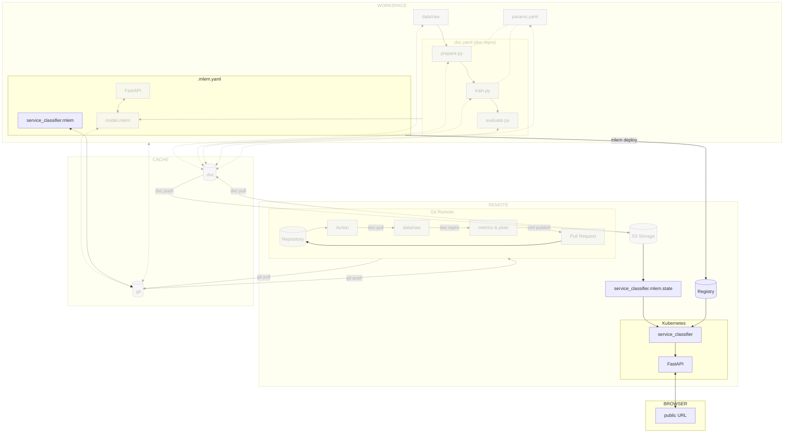

# Chapter 13: Deploy and access the model on Kubernetes with BentoML

## Introduction

Serving the model locally is great for testing purposes, but it is not
sufficient for production. In this chapter, you will learn how to deploy the
model on Kubernetes with [BentoML](../tools.md) and access it from a Kubernetes
pod.

This will allow the model to be used by other applications and services on a
public endpoint accessible from anywhere.

In this chapter, you will learn how to:

1. Create a BentoML model artifact
2. Containerize the model artifact with BentoML and Docker
3. Create a container registry that will serve as your model registry
4. Publish the containerized model artifact Docker image to the container registry
5. Create the Kubernetes cluster
6. Validate kubectl can access the Kubernetes cluster
7. Create the Kubernetes configuration files
8. Deploy the Docker image on Kubernetes
9. Access the model

!!! danger

    The following steps will create resources on the cloud provider. These resources
    will be deleted at the end of the guide, but you might be charged for them.
    Kubernetes clusters are not free on most cloud providers and can be expensive.
    Make sure to delete the resources at the end of the guide.

The following diagram illustrates control flow of the experiment at the end of
this chapter:

TODO: Update this chart



## Steps

### Create a BentoML model artifact

A BentoML model artifact (called "Bento" in the documentation) packages your model, code, and environment
dependencies into a single file. It is the standard format for saving and
sharing ML models.

The BentoML model artifact is described in a `bentofile.yaml` file. It contains the following
information:

- The service filename and class name
- The Python packages required to run the service
- The Docker configuration, such as the Python version to use

Create a new `bentofile.yaml` file in the `src` directory with the following
content:

```yaml title="src/bentofile.yaml"
service: 'serve:CelestialBodiesClassifierService'
include:
  - serve.py
python:
  packages:
    - "tensorflow==2.12.0"
    - "matplotlib==3.7.1"
    - "pillow==10.2.0"
docker:
    python_version: "3.11"
```

Do not forget to include the `serve.py` file in the Bento model artifact. This file
contains the code to serve the model with FastAPI as you have seen in the
previous chapter.

The `python` section contains the Python packages required to run the service.
It does not contain DVC and other packages to build the model, as they are not
required to run the service.

The `docker` section contains the Python version to use. It is important to
specify the Python version to ensure the service runs correctly.

Now that the `bentofile.yaml` file is created, you can serve the model with the
following command:

```sh title="Execute the following command(s) in a terminal"
# Serve the model
bentoml serve --working-dir src
```

### Containerize the BentoML model artifact with Docker

To containerize the BentoML model artifact, you will need to build a Docker image. This is done
in the following steps:

1. Build the BentoML model artifact
2. Containerize the BentoML model artifact with Docker

#### Build the BentoML model artifact

A BentoML model artifact can be built with the following command:

```sh title="Execute the following command(s) in a terminal"
# Build the Bento
bentoml build src
```

The output should be similar to this:

```text
2024-02-15 14:21:52.512530: I tensorflow/core/platform/cpu_feature_guard.cc:182] This TensorFlow binary is optimized to use available CPU instructions in performance-critical operations.
To enable the following instructions: AVX2 FMA, in other operations, rebuild TensorFlow with the appropriate compiler flags.
Adding current BentoML version to requirements.txt: 1.2.2
Locking PyPI package versions.
WARNING: --strip-extras is becoming the default in version 8.0.0. To silence this warning, either use --strip-extras to opt into the new default or use --no-strip-extras to retain the existing behavior.

██████╗ ███████╗███╗   ██╗████████╗ ██████╗ ███╗   ███╗██╗
██╔══██╗██╔════╝████╗  ██║╚══██╔══╝██╔═══██╗████╗ ████║██║
██████╔╝█████╗  ██╔██╗ ██║   ██║   ██║   ██║██╔████╔██║██║
██╔══██╗██╔══╝  ██║╚██╗██║   ██║   ██║   ██║██║╚██╔╝██║██║
██████╔╝███████╗██║ ╚████║   ██║   ╚██████╔╝██║ ╚═╝ ██║███████╗
╚═════╝ ╚══════╝╚═╝  ╚═══╝   ╚═╝    ╚═════╝ ╚═╝     ╚═╝╚══════╝

Successfully built Bento(tag="celestial_bodies_classifier:f7hnaegmawocrlg6").

Possible next steps:

 * Containerize your Bento with `bentoml containerize`:
    $ bentoml containerize celestial_bodies_classifier:f7hnaegmawocrlg6  [or bentoml build --containerize]

 * Push to BentoCloud with `bentoml push`:
    $ bentoml push celestial_bodies_classifier:f7hnaegmawocrlg6 [or bentoml build --push]
```

All Bentos can be listed with the following command:

```sh title="Execute the following command(s) in a terminal"
# List all Bentos
bentoml list
```

The output should be similar to this:

```text
bentoml list
 Tag                                                   Size       Model Size  Creation Time
 celestial_bodies_classifier:f7hnaegmawocrlg6          17.25 KiB  9.53 MiB    2024-02-15 14:22:21
```

#### Containerize the BentoML model artifact with Docker

Now that the BentoML model artifact is built, you can containerize it with the following command:

```sh title="Execute the following command(s) in a terminal"
# Containerize the BentoML model artifact with Docker
bentoml containerize celestial_bodies_classifier:latest --image-tag celestial-bodies-classifier:latest
```

The first `:latest` is the tag of the BentoML model artifact. It is a symlink to the latest
version of the BentoML model artifact.

The output should be similar to this:

```text
Building OCI-compliant image for celestial_bodies_classifier:f7hnaegmawocrlg6 with docker

[+] Building 95.6s (16/16) FINISHED                                                                                                                                             docker:desktop-linux
 => [internal] load build definition from Dockerfile                                                                                                                                            0.1s
 => => transferring dockerfile: 1.71kB                                                                                                                                                          0.0s
 => [internal] load metadata for docker.io/library/python:3.11-slim                                                                                                                             1.4s
 => [internal] load .dockerignore                                                                                                                                                               0.0s
 => => transferring context: 2B                                                                                                                                                                 0.0s
 => [base-container  1/11] FROM docker.io/library/python:3.11-slim@sha256:ce81dc539f0aedc9114cae640f8352fad83d37461c24a3615b01f081d0c0583a                                                      0.0s
 => => resolve docker.io/library/python:3.11-slim@sha256:ce81dc539f0aedc9114cae640f8352fad83d37461c24a3615b01f081d0c0583a                                                                       0.0s
 => [internal] load build context                                                                                                                                                               0.4s
 => => transferring context: 10.02MB                                                                                                                                                            0.4s
 => CACHED [base-container  2/11] RUN rm -f /etc/apt/apt.conf.d/docker-clean; echo 'Binary::apt::APT::Keep-Downloaded-Packages "true";' > /etc/apt/apt.conf.d/keep-cache                        0.0s
 => CACHED [base-container  3/11] RUN --mount=type=cache,target=/var/lib/apt --mount=type=cache,target=/var/cache/apt set -eux &&     apt-get update -y &&     apt-get install -q -y --no-inst  0.0s
 => CACHED [base-container  4/11] RUN groupadd -g 1034 -o bentoml && useradd -m -u 1034 -g 1034 -o -r bentoml                                                                                   0.0s
 => CACHED [base-container  5/11] RUN mkdir /home/bentoml/bento && chown bentoml:bentoml /home/bentoml/bento -R                                                                                 0.0s
 => CACHED [base-container  6/11] WORKDIR /home/bentoml/bento                                                                                                                                   0.0s
 => [base-container  7/11] COPY --chown=bentoml:bentoml ./env/python ./env/python/                                                                                                              0.1s
 => [base-container  8/11] RUN --mount=type=cache,target=/root/.cache/pip bash -euxo pipefail /home/bentoml/bento/env/python/install.sh                                                        83.2s
 => [base-container  9/11] COPY --chown=bentoml:bentoml . ./                                                                                                                                    0.0s
 => [base-container 10/11] RUN rm -rf /var/lib/{apt,cache,log}                                                                                                                                  0.2s
 => [base-container 11/11] RUN chmod +x /home/bentoml/bento/env/docker/entrypoint.sh                                                                                                            0.3s
 => exporting to image                                                                                                                                                                          9.7s
 => => exporting layers                                                                                                                                                                         9.7s
 => => writing image sha256:db1517bb791c68dc70853bfe844a94264440f66e5dd021da9296a2e3ee2ccb3e                                                                                                    0.0s
 => => naming to docker.io/library/celestial-bodies-classifier:latest                                                                                                                           0.0s

What's Next?
  View a summary of image vulnerabilities and recommendations → docker scout quickview
Successfully built Bento container for "celestial_bodies_classifier:latest" with tag(s) "celestial-bodies-classifier:latest"
To run your newly built Bento container, run:
    docker run --rm -p 3000:3000 celestial-bodies-classifier:latest
```

The BentoML model artifact is now containerized with Docker. You can run the Docker image with
the following command:

```sh title="Execute the following command(s) in a terminal"
# Run the Docker image
docker run --rm -p 3000:3000 celestial-bodies-classifier:latest
```

Congrats! You have successfully containerized the BentoML model artifact with Docker. The model
is now ready to be shared on a container registry.

### Create a container registry

A container registry is a crucial component that provides a centralized system
to manage Docker images. It serves as a repository for storing, versioning, and
tracking Docker models built with BentoML, as each version comes with essential
metadata, including training data, hyperparameters, and performance metrics.

This comprehensive information ensures reproducibility by preserving historical
model versions, which aids in debugging and auditing. Additionally, it fosters
transparency and simplifies model comparison and selection for deployment,
allowing for seamless integration into production environments.

The model registry also facilitates collaboration among team members, enabling
standardized model formats and easy sharing of access. Its support for automated
deployment pipelines ensures consistent and reliable model deployment, allowing
for an efficient models management.

=== ":simple-googlecloud: Google Cloud"

    To streamline the deployment process on the Kubernetes server, you will utilize
    Google Artifact Registry for the ML model registry, capitalizing on Google
    Kubernetes Engine's ability to directly pull images from Docker repositories.

    **Enable the Google Artifact Registry API**

    You must enable the Google Artifact Registry API to create a container registry
    on Google Cloud.

    [Enable Google Artifact Registry API :octicons-arrow-up-right-16:](https://console.cloud.google.com/flows/enableapi?apiid=artifactregistry.googleapis.com){ .md-button .md-button--primary }

    **Create the Google Container Registry**

    Export the repository name as an environment variable. Replace
    `<my repository name>` with your own name (ex: `mlops-registry`):

    ```sh title="Execute the following command(s) in a terminal"
    export GCP_CONTAINER_REGISTRY_NAME=<my repository name>
    ```

    Export the repository location as an environment variable. You can view the available
    locations at [Cloud locations](https://cloud.google.com/about/locations). You
    should ideally select a location close to where most of the expected traffic
    will come from. Replace `<my repository location>` with your own zone. For example,
    use `europe-west6` for Switzerland (Zurich):

    ```sh title="Execute the following command(s) in a terminal"
    export GCP_CONTAINER_REGISTRY_LOCATION=<my repository location>
    ```

    Lastly, when creating the repository, remember to specify the repository format
    as `docker`.

    ```sh title="Execute the following command(s) in a terminal"
    # Create the Google Container Registry
    gcloud artifacts repositories create $GCP_CONTAINER_REGISTRY_NAME \
        --repository-format=docker \
        --location=$GCP_CONTAINER_REGISTRY_LOCATION
    ```

    The output should be similar to this:

    ```text
    Create request issued for: [mlops-registry]
    Waiting for operation [projects/mlops-code-395207/locations/europe-west6/operations/be8b09fa-279c-468
    5-b451-1f3c900d4a36] to complete...done.
    Created repository [mlops-registry].
    ```

=== ":material-cloud: Using another cloud provider? Read this!"

    This guide has been written with Google Cloud in mind. We are open to
    contributions to add support for other cloud providers such as
    [:simple-amazonaws: Amazon Web Services](https://aws.amazon.com),
    [:simple-exoscale: Exoscale](https://www.exoscale.com),
    [:simple-microsoftazure: Microsoft Azure](https://azure.microsoft.com) or
    [:simple-kubernetes: Self-hosted Kubernetes](https://kubernetes.io) but we might
    not officially support them.

    If you want to contribute, please open an issue or a pull request on the
    [GitHub repository](https://github.com/csia-pme/csia-pme). Your help is greatly
    appreciated!

### Login to the remote Container Registry

=== ":simple-googlecloud: Google Cloud"

    **Authenticate with the Google Container Registry**

    Configure gcloud to use the Google Container Registry as a Docker credential
    helper.

    ```sh title="Execute the following command(s) in a terminal"
    # Authenticate with the Google Container Registry
    gcloud auth configure-docker ${GCP_CONTAINER_REGISTRY_LOCATION}-docker.pkg.dev
    ```

    Press ++y++ to validate the changes.

    Export the container registry host:

    ```sh title="Execute the following command(s) in a terminal"
    export GCP_CONTAINER_REGISTRY_HOST=${GCP_CONTAINER_REGISTRY_LOCATION}-docker.pkg.dev/${GCP_PROJECT_ID}/${GCP_CONTAINER_REGISTRY_NAME}
    ```

    !!! tip

        To get the ID of your project, you can use the Google Cloud CLI.

        ```sh title="Execute the following command(s) in a terminal"
        # List the projects
        gcloud projects list
        ```

        The output should be similar to this:

        ```text
        PROJECT_ID             NAME            PROJECT_NUMBER
        mlops-workshop-396007  mlops-workshop  475307267926
        ```

        Copy the PROJECT_ID and export it as an environment variable. Replace
        `<id of your gcp project>` with your own project ID:

        ```sh title="Execute the following command(s) in a terminal"
        export GCP_PROJECT_ID=<id of your gcp project>
        ```

=== ":material-cloud: Using another cloud provider? Read this!"

    This guide has been written with Google Cloud in mind. We are open to
    contributions to add support for other cloud providers such as
    [:simple-amazonaws: Amazon Web Services](https://aws.amazon.com),
    [:simple-exoscale: Exoscale](https://www.exoscale.com),
    [:simple-microsoftazure: Microsoft Azure](https://azure.microsoft.com) or
    [:simple-kubernetes: Self-hosted Kubernetes](https://kubernetes.io) but we might
    not officially support them.

    If you want to contribute, please open an issue or a pull request on the
    [GitHub repository](https://github.com/csia-pme/csia-pme). Your help is greatly
    appreciated!

### Publish the BentoML model artifact Docker image to the container registry

The BentoML model artifact Docker image can be published to the container registry with the
following commands:

```sh title="Execute the following command(s) in a terminal"
# Tag the local BentoML model artifact Docker image with the remote container registry host
docker tag celestial-bodies-classifier:latest $GCP_CONTAINER_REGISTRY_HOST/celestial-bodies-classifier:latest

# Push the BentoML model artifact Docker image to the container registry
docker push $GCP_CONTAINER_REGISTRY_HOST/celestial-bodies-classifier:latest
```

### Create the Kubernetes cluster

In order to deploy the model on Kubernetes, you will need a Kubernetes cluster.
Follow the steps below to create one.

=== ":simple-googlecloud: Google Cloud"

    **Enable the Google Kubernetes Engine API**

    You must enable the Google Kubernetes Engine API to create Kubernetes clusters
    on Google Cloud.

    [Enable Google Kubernetes Engine API :octicons-arrow-up-right-16:](https://console.cloud.google.com/flows/enableapi?apiid=container.googleapis.com){ .md-button .md-button--primary }

    **Create the Kubernetes cluster**

    Create the Google Kubernetes cluster with the Google Cloud CLI.

    Export the cluster name as an environment variable. Replace `<my cluster name>`
    with your own name (ex: `mlops-kubernetes`).

    ```sh title="Execute the following command(s) in a terminal"
    export GCP_K8S_CLUSTER_NAME=<my cluster name>
    ```

    Export the cluster zone as an environment variable. You can view the available
    zones at
    [Regions and zones](https://cloud.google.com/compute/docs/regions-zones#available).
    You should ideally select a zone close to where most of the expected traffic
    will come from. Replace `<my cluster zone>` with your own zone (ex:
    `europe-west6-a` for Zurich, Switzerland).

    ```sh title="Execute the following command(s) in a terminal"
    export GCP_K8S_CLUSTER_ZONE=<my cluster zone>
    ```

    Create the Kubernetes cluster. This can take a few minutes. You can also view the available types of machine with the
    `gcloud compute machine-types list` command:

    ```sh title="Execute the following command(s) in a terminal"
    # Create the Kubernetes cluster
    gcloud container clusters create \
    	--machine-type=e2-standard-2 \
    	--num-nodes=2 \
    	--zone=$GCP_K8S_CLUSTER_ZONE \
    	$GCP_K8S_CLUSTER_NAME
    ```

    The output should be similar to this:

    ```text
    Default change: VPC-native is the default mode during cluster creation for versions greater than 1.21.0-gke.1500. To create advanced routes based clusters, please pass the `--no-enable-ip-alias` flag
    Default change: During creation of nodepools or autoscaling configuration changes for cluster versions greater than 1.24.1-gke.800 a default location policy is applied. For Spot and PVM it defaults to ANY, and for all other VM kinds a BALANCED policy is used. To change the default values use the `--location-policy` flag.
    Note: Your Pod address range (`--cluster-ipv4-cidr`) can accommodate at most 1008 node(s).
    Creating cluster mlops-kubernetes in europe-west6-a... Cluster is being health-checked (master is hea
    lthy)...done.
    Created [https://container.googleapis.com/v1/projects/mlops-code-395207/zones/europe-west6-a/clusters/mlops-kubernetes].
    To inspect the contents of your cluster, go to: https://console.cloud.google.com/kubernetes/workload_/gcloud/europe-west6-a/mlops-kubernetes?project=mlops-code-395207
    kubeconfig entry generated for mlops-kubernetes.
    NAME              LOCATION        MASTER_VERSION   MASTER_IP    MACHINE_TYPE   NODE_VERSION     NUM_NODES  STATUS
    mlops-kubernetes  europe-west6-a  1.27.2-gke.1200  34.65.19.80  e2-standard-2  1.27.2-gke.1200  2          RUNNING
    ```

=== ":material-cloud: Using another cloud provider? Read this!"

    This guide has been written with Google Cloud in mind. We are open to
    contributions to add support for other cloud providers such as
    [:simple-amazonaws: Amazon Web Services](https://aws.amazon.com),
    [:simple-exoscale: Exoscale](https://www.exoscale.com),
    [:simple-microsoftazure: Microsoft Azure](https://azure.microsoft.com) or
    [:simple-kubernetes: Self-hosted Kubernetes](https://kubernetes.io) but we might
    not officially support them.

    If you want to contribute, please open an issue or a pull request on the
    [GitHub repository](https://github.com/swiss-ai-center/a-guide-to-mlops). Your
    help is greatly appreciated!

Install the Kubernetes CLI (kubectl) on your machine.

=== ":simple-googlecloud: Google Cloud"

	Install kubectl with the Google Cloud CLI:

    ```sh title="Execute the following command(s) in a terminal"
    # Install kubectl with gcloud
    gcloud components install kubectl
    ```

=== ":material-cloud: Using another cloud provider? Read this!"

    This guide has been written with Google Cloud in mind. We are open to
    contributions to add support for other cloud providers such as
    [:simple-amazonaws: Amazon Web Services](https://aws.amazon.com),
    [:simple-exoscale: Exoscale](https://www.exoscale.com),
    [:simple-microsoftazure: Microsoft Azure](https://azure.microsoft.com) or
    [:simple-kubernetes: Self-hosted Kubernetes](https://kubernetes.io) but we might
    not officially support them.

    If you want to contribute, please open an issue or a pull request on the
    [GitHub repository](https://github.com/swiss-ai-center/a-guide-to-mlops). Your
    help is greatly appreciated!

### Validate kubectl can access the Kubernetes cluster

Validate kubectl can access the Kubernetes cluster:

```sh title="Execute the following command(s) in a terminal"
# Get namespaces
kubectl get namespaces
```

The output should be similar to this:

```text
NAME              STATUS   AGE
default           Active   25m
kube-node-lease   Active   25m
kube-public       Active   25m
kube-system       Active   25m
```

### Create the Kubernetes configuration files

In order to deploy the model on Kubernetes, you will need to create the
Kubernetes configuration files. These files describe the deployment and service
of the model.

Create a new directory called `kubernetes` in the root of the project.

Create a new file called `deployment.yaml` in the `kubernetes` directory with
the following content. Replace `<docker image>` with the Docker image you have
created in the previous steps:

!!! tip

    You can find the Docker image with the following command:

    ```sh title="Execute the following command(s) in a terminal"
    # Get the Docker image
    echo $GCP_CONTAINER_REGISTRY_HOST/celestial-bodies-classifier:latest
    ```

```yaml title="kubernetes/deployment.yaml"
apiVersion: apps/v1
kind: Deployment
metadata:
  name: celestial-bodies-classifier-deployment
  labels:
    app: celestial-bodies-classifier
spec:
  replicas: 1
  selector:
    matchLabels:
      app: celestial-bodies-classifier
  template:
    metadata:
      labels:
        app: celestial-bodies-classifier
    spec:
      containers:
      - name: celestial-bodies-classifier
        image: <docker image>
```

Create a new file called `service.yaml` in the `kubernetes` directory with the
following content:

```yaml title="kubernetes/service.yaml"
apiVersion: v1
kind: Service
metadata:
  name: celestial-bodies-classifier-service
spec:
  type: LoadBalancer
  ports:
    - name: http
      port: 80
      targetPort: 3000
      protocol: TCP
  selector:
    app: celestial-bodies-classifier
```

The `deployment.yaml` file describes the deployment of the model. It contains
the number of replicas, the image to use, and the labels to use.

The `service.yaml` file describes the service of the model. It contains the type
of service, the ports to use, and the labels to use.

### Deploy the Bento on Kubernetes

To deploy the Bento on Kubernetes, you will need to apply the Kubernetes
configuration files.

Apply the Kubernetes configuration files with the following commands:

```sh title="Execute the following command(s) in a terminal"
# Apply the deployment
kubectl apply -f kubernetes/deployment.yaml

# Apply the service
kubectl apply -f kubernetes/service.yaml
```

The output should be similar to this:

```text
deployment.apps/celestial-bodies-classifier-deployment created
service/celestial-bodies-classifier-service created
```

### Access the model

To access the model, you will need to find the external IP address of the
service. You can do so with the following command:

!!! info

    The external IP address of the service can take a few minutes to be
    available.

```sh title="Execute the following command(s) in a terminal"
# Get the description of the service
kubectl describe services celestial-bodies-classifier
```

The output should be similar to this:

```text hl_lines="11"
Name:                     celestial-bodies-classifier-service
Namespace:                default
Labels:                   <none>
Annotations:              cloud.google.com/neg: {"ingress":true}
Selector:                 app=celestial-bodies-classifier
Type:                     LoadBalancer
IP Family Policy:         SingleStack
IP Families:              IPv4
IP:                       10.24.1.34
IPs:                      10.24.1.34
LoadBalancer Ingress:     34.65.255.92
Port:                     http  80/TCP
TargetPort:               3000/TCP
NodePort:                 http  30882/TCP
Endpoints:                10.20.0.9:3000
Session Affinity:         None
External Traffic Policy:  Cluster
Events:
  Type    Reason                Age                  From                Message
  ----    ------                ----                 ----                -------
  Normal  Type                  36m                  service-controller  ClusterIP -> LoadBalancer
```

The `LoadBalancer Ingress` field contains the external IP address of the
service. In this case, it is `34.65.255.92`.

Try to access the model at the port `80` using the external IP address of the
service. You should be able to access the FastAPI documentation page at
`http://<load balancer ingress ip>:80`. In this case, it is
`http://34.65.255.92:80`.

### Check the changes

Check the changes with Git to ensure that all the necessary files are tracked:

```sh title="Execute the following command(s) in a terminal"
# Add all the files
git add .

# Check the changes
git status
```

The output should look similar to this:

```text
On branch main
Your branch is up to date with 'origin/main'.

Changes to be committed:
(use "git restore --staged <file>..." to unstage)
    new file:   kubernetes/deployment.yaml
    new file:   kubernetes/service.yaml
    new file:   src/bentofile.yaml
```

### Commit the changes to Git

Commit the changes to Git.

```sh title="Execute the following command(s) in a terminal"
# Commit the changes
git commit -m "Kubernetes can be used to deploy the model"

# Push the changes
git push
```

## Summary

Congratulations! You have successfully deployed the model on Kubernetes with
BentoML and Docker, accessed it from an external IP address.

You can now use the model from anywhere.

In this chapter, you have successfully:

1. Created and containerized a BentoML model artifact
2. Published the BentoML model artifact Docker image to the container registry
3. Created the Kubernetes configuration files and deployed the BentoML model artifact on
   Kubernetes
4. Access the model

## State of the MLOps process

- [x] Notebook has been transformed into scripts for production
- [x] Codebase and dataset are versioned
- [x] Steps used to create the model are documented and can be re-executed
- [x] Changes done to a model can be visualized with parameters, metrics and
      plots to identify differences between iterations
- [x] Codebase can be shared and improved by multiple developers
- [x] Dataset can be shared among the developers and is placed in the right
      directory in order to run the experiment
- [x] Experiment can be executed on a clean machine with the help of a CI/CD
      pipeline
- [x] CI/CD pipeline is triggered on pull requests and reports the results of
      the experiment
- [x] Changes to model can be thoroughly reviewed and discussed before
      integrating them into the codebase
- [x] Model can be saved and loaded with all required artifacts for future usage
- [x] Model can be easily used outside of the experiment context
- [x] Model is accessible from the Internet and can be used anywhere
- [ ] Model requires manual deployment on the cluster
- [ ] Model cannot be trained on hardware other than the local machine

You will address these issues in the next chapters for improved efficiency and
collaboration. Continue the guide to learn how.

## Sources

Highly inspired by:

- [_Connecting a repository to a package_ - docs.github.com](https://docs.github.com/en/packages/learn-github-packages/connecting-a-repository-to-a-package)
- [_Working with the Container registry_ - docs.github.com](https://docs.github.com/en/packages/working-with-a-github-packages-registry/working-with-the-container-registry)
- [_Containerization_ - docs.bentoml.com](https://docs.bentoml.com/en/latest/guides/containerization.html)
- [_Build options_ - docs.bentoml.com](https://docs.bentoml.com/en/latest/guides/build-options.html)
