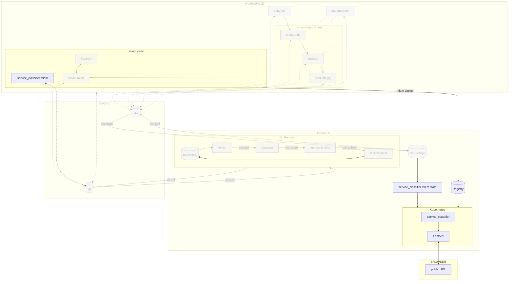

# Chapter 13: Deploy and access the model on Kubernetes with MLEM

??? info "You want to take over from this chapter? Collapse this section and follow the instructions below."

    !!! warning

        It might be easier to start from the previous chapter(s). Only follow this
        section if you are comfortable with the content of the previous chapter(s).

    Work in progress.

## Introduction

Serving the model locally is great for testing purposes, but it is not
sufficient for production. In this chapter, you will learn how to deploy the
model on Kubernetes with [MLEM](../tools.md) and access it from a Kubernetes
pod.

This will allow the model to be used by other applications and services on a
public endpoint accessible from anywhere.

In this chapter, you will learn how to:

1. Create the Kubernetes cluster
2. Validate kubectl can access the Kubernetes cluster
3. Install MLEM with Kubernetes support
4. Create a Model Registry
5. Manage deployment declaration and state
6. Deploy the model on Kubernetes with MLEM
7. Access the model

!!! danger

    The following steps will create resources on the cloud provider. These resources
    will be deleted at the end of the guide, but you might be charged for them.
    Kubernetes clusters are not free on most cloud providers and can be expensive.
    Make sure to delete the resources at the end of the guide.

The following diagram illustrates control flow of the experiment at the end of
this chapter:



## Steps

### Create the Kubernetes cluster

In order to deploy the model on Kubernetes, you will need a Kubernetes cluster.
Follow the steps below to create one.

=== ":simple-googlecloud: Google Cloud"

    **Enable the Google Kubernetes Engine API**

    You must enable the Google Kubernetes Engine API to create Kubernetes clusters
    on Google Cloud.

    [Enable Google Kubernetes Engine API :octicons-arrow-up-right-16:](https://console.cloud.google.com/flows/enableapi?apiid=container.googleapis.com){ .md-button .md-button--primary }

    **Create the Kubernetes cluster**

    Create the Google Kubernetes cluster with the Google Cloud CLI.

    Export the cluster name as an environment variable. Replace `<my cluster name>`
    with your own name (ex: `mlops-kubernetes`).

    ```sh title="Execute the following command(s) in a terminal"
    export GCP_CLUSTER_NAME=<my cluster name>
    ```

    Export the cluster zone as an environment variable. You can view the available
    zones at
    [Regions and zones](https://cloud.google.com/compute/docs/regions-zones#available).
    You should ideally select a location close to where most of the expected traffic
    will come from. Replace `<my cluster zone>` with your own zone (ex:
    `europe-west6-a` for Switzerland (Zurich)).

    You can also view the available types of machine with the
    `gcloud compute machine-types list` command.

    ```sh title="Execute the following command(s) in a terminal"
    export GCP_CLUSTER_ZONE=<my cluster zone>
    ```

    Create the Kubernetes cluster. This can take a few minutes.

    ```sh title="Execute the following command(s) in a terminal"
    # Create the Kubernetes cluster
    gcloud container clusters create \
    	--machine-type=e2-standard-2 \
    	--num-nodes=2 \
    	--zone=$GCP_CLUSTER_ZONE \
    	$GCP_CLUSTER_NAME
    ```

    The output should be similar to this.

    ```
    Default change: VPC-native is the default mode during cluster creation for versions greater than 1.21.0-gke.1500. To create advanced routes based clusters, please pass the `--no-enable-ip-alias` flag
    Default change: During creation of nodepools or autoscaling configuration changes for cluster versions greater than 1.24.1-gke.800 a default location policy is applied. For Spot and PVM it defaults to ANY, and for all other VM kinds a BALANCED policy is used. To change the default values use the `--location-policy` flag.
    Note: Your Pod address range (`--cluster-ipv4-cidr`) can accommodate at most 1008 node(s).
    Creating cluster mlops-kubernetes in europe-west6-a... Cluster is being health-checked (master is hea
    lthy)...done.
    Created [https://container.googleapis.com/v1/projects/mlops-code-395207/zones/europe-west6-a/clusters/mlops-kubernetes].
    To inspect the contents of your cluster, go to: https://console.cloud.google.com/kubernetes/workload_/gcloud/europe-west6-a/mlops-kubernetes?project=mlops-code-395207
    kubeconfig entry generated for mlops-kubernetes.
    NAME              LOCATION        MASTER_VERSION   MASTER_IP    MACHINE_TYPE   NODE_VERSION     NUM_NODES  STATUS
    mlops-kubernetes  europe-west6-a  1.27.2-gke.1200  34.65.19.80  e2-standard-2  1.27.2-gke.1200  2          RUNNING
    ```

=== ":material-cloud: Using another cloud provider? Read this!"

    This guide has been written with Google Cloud in mind. We are open to
    contributions to add support for other cloud providers such as
    [:simple-amazonaws: Amazon Web Services](https://aws.amazon.com),
    [:simple-exoscale: Exoscale](https://www.exoscale.com),
    [:simple-microsoftazure: Microsoft Azure](https://azure.microsoft.com) or
    [:simple-kubernetes: Self-hosted Kubernetes](https://kubernetes.io) but we might
    not officially support them.

    If you want to contribute, please open an issue or a pull request on the
    [GitHub repository](https://github.com/csia-pme/csia-pme). Your help is greatly
    appreciated!

Install the Kubernetes CLI (kubectl) on your machine.

=== ":simple-googlecloud: Google Cloud"

	Install kubectl with the Google Cloud CLI.

    ```sh title="Execute the following command(s) in a terminal"
    # Install kubectl with gcloud
    gcloud components install kubectl
    ```

=== ":material-cloud: Using another cloud provider? Read this!"

    This guide has been written with Google Cloud in mind. We are open to
    contributions to add support for other cloud providers such as
    [:simple-amazonaws: Amazon Web Services](https://aws.amazon.com),
    [:simple-exoscale: Exoscale](https://www.exoscale.com),
    [:simple-microsoftazure: Microsoft Azure](https://azure.microsoft.com) or
    [:simple-kubernetes: Self-hosted Kubernetes](https://kubernetes.io) but we might
    not officially support them.

    If you want to contribute, please open an issue or a pull request on the
    [GitHub repository](https://github.com/csia-pme/csia-pme). Your help is greatly
    appreciated!

### Validate kubectl can access the Kubernetes cluster

Validate kubectl can access the Kubernetes cluster.

```sh title="Execute the following command(s) in a terminal"
# Get namespaces
kubectl get namespaces
```

The output should be similar to this.

```
NAME              STATUS   AGE
default           Active   25m
kube-node-lease   Active   25m
kube-public       Active   25m
kube-system       Active   25m
```

### Add Kubernetes support to MLEM

Update the `requirements.txt` file to add `kubernetes` support in addtion to
`fastapi` to the `mlem` package.

!!! info

    Kubernetes is only one of the available backend that MLEM can deploy to. Check
    out their [official documentation](https://mlem.ai/doc/user-guide/deploying) for
    more options.

```txt title="requirements.txt" hl_lines="5"
tensorflow==2.12.0
matplotlib==3.7.1
pyyaml==6.0
dvc[gs]==3.2.2
mlem[fastapi,kubernetes]==0.4.13
```

Check the differences with Git to validate the changes.

```sh title="Execute the following command(s) in a terminal"
# Show the differences with Git
git diff requirements.txt
```

The output should be similar to this.

```diff
diff --git a/requirements.txt b/requirements.txt
index fcdd460..b89d189 100644
--- a/requirements.txt
+++ b/requirements.txt
@@ -2,4 +2,4 @@ tensorflow==2.12.0
 matplotlib==3.7.1
 pyyaml==6.0
 dvc[gs]==3.2.2
-mlem[fastapi]==0.4.13
+mlem[fastapi,kubernetes]==0.4.13
```

Install the dependencies and update the freeze file.

!!! warning

    Prior to running any pip commands, it is crucial to ensure the virtual
    environment is activated to avoid potential conflicts with system-wide Python
    packages.

    To check its status, simply run `pip -V`. If the virtual environment is active,
    the output will show the path to the virtual environment's Python executable. If
    it is not, you can activate it with `source .venv/bin/activate`.

```sh title="Execute the following command(s) in a terminal"
# Install the dependencies
pip install --requirement requirements.txt

# Freeze the dependencies
pip freeze --local --all > requirements-freeze.txt
```

### Create a model registry

A model registry is a crucial component that provides a centralized system to
manage ML models throughout their lifecycle. It serves as a repository for
storing, versioning, and tracking models, as each version comes with essential
metadata, including training data, hyperparameters, and performance metrics.

This comprehensive information ensures reproducibility by preserving historical
model versions, which aids in debugging and auditing. Additionally, it fosters
transparency and simplifies model comparison and selection for deployment,
allowing for seamless integration into production environments.

The model registry also facilitates collaboration among team members, enabling
standardized model formats and easy sharing of access. Its support for automated
deployment pipelines ensures consistent and reliable model deployment, allowing
for an efficient models management.

=== ":simple-googlecloud: Google Cloud"

    To streamline the deployment process on the Kubernetes server, you will utilize
    Google Artifact Registry for the ML model registry, capitalizing on Google
    Kubernetes Engine's ability to directly pull images from Docker repositories.

    **Enable the Google Artifact Registry API**

    You must enable the Google Artifact Registry API to create a container registry
    on Google Cloud.

    [Enable Google Artifact Registry API :octicons-arrow-up-right-16:](https://console.cloud.google.com/flows/enableapi?apiid=artifactregistry.googleapis.com){ .md-button .md-button--primary }

    **Create the Google Container Registry**

    Export the repository name as an environment variable. Replace
    `<my repository name>` with your own name (ex: `mlops-registry`).

    ```sh title="Execute the following command(s) in a terminal"
    export GCP_REPOSITORY_NAME=<my repository name>
    ```

    Export the repository location as an environment variable. Replace
    `<my repository location>` with your own location (ex: `europe-west6` for
    Switzerland Zurich).

    ```sh title="Execute the following command(s) in a terminal"
    export GCP_REPOSITORY_LOCATION=<my repository location>
    ```

    Lastly, when creating the repository, remember to specify the repository format
    as `docker`.

    ```sh title="Execute the following command(s) in a terminal"
    # Create the Google Container Registry
    gcloud artifacts repositories create $GCP_REPOSITORY_NAME \
        --repository-format=docker \
        --location=$GCP_REPOSITORY_LOCATION
    ```

    The output should be similar to this.

    ```
    Create request issued for: [mlops-registry]
    Waiting for operation [projects/mlops-code-395207/locations/europe-west6/operations/be8b09fa-279c-468
    5-b451-1f3c900d4a36] to complete...done.
    Created repository [mlops-registry].
    ```

=== ":material-cloud: Using another cloud provider? Read this!"

    This guide has been written with Google Cloud in mind. We are open to
    contributions to add support for other cloud providers such as
    [:simple-amazonaws: Amazon Web Services](https://aws.amazon.com),
    [:simple-exoscale: Exoscale](https://www.exoscale.com),
    [:simple-microsoftazure: Microsoft Azure](https://azure.microsoft.com) or
    [:simple-kubernetes: Self-hosted Kubernetes](https://kubernetes.io) but we might
    not officially support them.

    If you want to contribute, please open an issue or a pull request on the
    [GitHub repository](https://github.com/csia-pme/csia-pme). Your help is greatly
    appreciated!

### Login to the remote Container Registry

=== ":simple-googlecloud: Google Cloud"

    **Authenticate with the Google Container Registry**

    ```sh title="Execute the following command(s) in a terminal"
    # Authenticate with the Google Container Registry
    gcloud auth configure-docker ${GCP_REPOSITORY_LOCATION}-docker.pkg.dev
    ```

    ```sh title="Execute the following command(s) in a terminal"
    export GCP_PROJECT_ID=$(gcloud config get-value project)
    ```

    Export the container registry host:

    ```sh title="Execute the following command(s) in a terminal"
    export CONTAINER_REGISTRY_HOST=${GCP_REPOSITORY_LOCATION}-docker.pkg.dev/$GCP_PROJECT_ID/$GCP_REPOSITORY_NAME
    ```

=== ":material-cloud: Using another cloud provider? Read this!"

    This guide has been written with Google Cloud in mind. We are open to
    contributions to add support for other cloud providers such as
    [:simple-amazonaws: Amazon Web Services](https://aws.amazon.com),
    [:simple-exoscale: Exoscale](https://www.exoscale.com),
    [:simple-microsoftazure: Microsoft Azure](https://azure.microsoft.com) or
    [:simple-kubernetes: Self-hosted Kubernetes](https://kubernetes.io) but we might
    not officially support them.

    If you want to contribute, please open an issue or a pull request on the
    [GitHub repository](https://github.com/csia-pme/csia-pme). Your help is greatly
    appreciated!

### Deploy the model on Kubernetes with MLEM

Deploy the model on Kubernetes with MLEM. This will create a Docker image, push
it to the remote Container Registry and deploy the model on Kubernetes. The
operation can takes a few minutes.

??? question "Having issues to deploy the model on Kubernetes?"

    If you have issues to deploy the model on Kubernetes, ensure the Kubernetes
    cluster is actually ready. Wait a few minutes and try again.

```sh title="Execute the following command(s) in a terminal"
# Deploy the model on Kubernetes with MLEM
mlem deployment run kubernetes service_classifier \
--model model \
--registry remote \
--registry.host=$CONTAINER_REGISTRY_HOST \
--server fastapi \
--service_type loadbalancer
```

The name `service_classifier` is the name of the deployment. It can be changed
to anything you want.

The arguments are:

- `--model`: The path to the MLEM model.
- `--registry remote`: Use a remote Container Registry.
- `--registry.host <host>`: The host of the remote Container Registry.
- `--server fastapi`: Use FastAPI as the server.
- `--service_type loadbalancer`: Use a load balancer to expose the service.

The output should be similar to this.

```
💾 Saving deployment to service_classifier.mlem
⏳️ Loading model from model.mlem
🛠 Creating docker image ml
  💼 Adding model files...
  🛠 Generating dockerfile...
  💼 Adding sources...
  💼 Generating requirements file...
  🛠 Building docker image europe-west6-docker.pkg.dev/mlops-test-391911/mlops-registry/ml:dbdf5b923413970ed7cd31cc5da22455...
2023-08-02 10:58:29,915 [WARNING] mlem.contrib.docker.base: Skipped logging in to remote registry at host europe-west6-docker.pkg.dev/mlops-test-391911/mlops-registry because no credentials given. You could specify credentials as EUROPE-WEST6-DOCKER_PKG_DEV/MLOPS-TEST-391911/MLOPS-REGISTRY_USERNAME and EUROPE-WEST6-DOCKER_PKG_DEV/MLOPS-TEST-391911/MLOPS-REGISTRY_PASSWORD environment variables.
✅  Built docker image europe-west6-docker.pkg.dev/mlops-registry/mlops-registry/ml:dbdf5b923413970ed7cd31cc5da22455
  🔼 Pushing image europe-west6-docker.pkg.dev/mlops-test-391911/mlops-registry/ml:dbdf5b923413970ed7cd31cc5da22455 to
europe-west6-docker.pkg.dev/mlops-test-391911/mlops-registry
  ✅  Pushed image
europe-west6-docker.pkg.dev/mlops-test-391911/mlops-registry/ml:dbdf5b923413970ed7cd31cc5da22455 to
europe-west6-docker.pkg.dev/mlops-test-391911/mlops-registry
namespace created. status='{'conditions': None, 'phase': 'Active'}'
deployment created. status='{'available_replicas': None,
 'collision_count': None,
 'conditions': None,
 'observed_generation': None,
 'ready_replicas': None,
 'replicas': None,
 'unavailable_replicas': None,
 'updated_replicas': None}'
service created. status='{'conditions': None, 'load_balancer': {'ingress': None}}'
✅  Deployment ml is up in mlem namespace
```

!!! tip "Tips"

    The status of a MLEM deployment can be checked with the command
    `mlem deployment status <deployment name>`.

    A MLEM Kubernetes deployment can be deleted with the command
    `mlem deploy remove <deployment name>`.

Running the deployment command not only deploys the model on the Kubernetes
server, but it should also create two files in your repository, corresponding to
the chosen deployment name.

- `service_classifier.mlem`: This file contains the declaration of the
  deployment, holding the main information such as where your model
   is deployed as well as other additional parameters needed for the specificties
   of the deployment. It is deployed to the Kubernetes target environment.

- `service_classifier.mlem.state`: This file is a snapshot of the actual state
  of your deployment.
   It is created and updated by MLEM during the deployment process to keep track of
   parameters needed for state management, which is stored separately from the
   declaration.

You will soon see how to use them to redeploy the model on Kubernetes.

### Access the model

By default, MLEM deploys the model as a service named `ml` in the `mlem`
namespace.

To access the model, you will need to find the external IP address of the
service. You can do so with the following command.

```sh title="Execute the following command(s) in a terminal"
# Get the description of the service
kubectl describe services ml --namespace mlem
```

The output should be similar to this.

```text hl_lines="11"
Name:                     mlops-classifier
Namespace:                mlem
Labels:                   run=mlops-classifier
Annotations:              cloud.google.com/neg: {"ingress":true}
Selector:                 app=mlops-classifier
Type:                     LoadBalancer
IP Family Policy:         SingleStack
IP Families:              IPv4
IP:                       10.44.6.134
IPs:                      10.44.6.134
LoadBalancer Ingress:     34.65.72.237
Port:                     <unset>  8080/TCP
TargetPort:               8080/TCP
NodePort:                 <unset>  32723/TCP
Endpoints:                10.40.0.12:8080
Session Affinity:         None
External Traffic Policy:  Cluster
Events:
  Type    Reason                Age   From                Message
  ----    ------                ----  ----                -------
  Normal  EnsuringLoadBalancer  99s   service-controller  Ensuring load balancer
  Normal  EnsuredLoadBalancer   59s   service-controller  Ensured load balancer
```

The `LoadBalancer Ingress` field contains the external IP address of the
service. In this case, it is `34.65.72.237`.

Try to access the model at the port `8080` using the external IP address of the
service. You should be able to access the FastAPI documentation page at
`http://<load balancer ingress ip>:8080/docs`. In this case, it is
`http://34.65.72.237:8080/docs`.

### Setup the MLEM remote state manager

After the model is deployed on Kubernetes, MLEM will save the deployment state
as local files. This is fine if you are working alone, however, if you are
working with a team, your local files will not be available to your colleagues.

While the parameters of the deployment's declaration file can be shared via Git,
the state file, which represents the current snapshot of the state of the
Kubernetes server, should be stored separately as the state is independent of
the actual codebase.

This file should however still be accessible remotely to permit each team
members to change the state of the Kubernetes server when required.

To solve this issue, MLEM can use a remote state manager to store the state of
the infrastructure.

Let's start by deleting the current deployment on the server and by removing the
existing `service_classifier.mlem.state` file.

```sh title="Execute the following command(s) in a terminal"
# Delete the deployment on Kubernetes
mlem deploy remove service_classifier

# Remove the state file
rm service_classifier.mlem.state
```

Instead of relaying on that state file locally, you will configure MLEM to
create it remotely directly.

Setting up remote state manager is a lot like setting DVC remote. All you need
to do is provide a URI where you want to store state files.

!!! warning

    Make sure to use the same bucket name as the one you created in
    [Chapter 7: Move the ML experiment data to the cloud](../part-2-move-the-model-to-the-cloud/chapter-7-move-the-ml-experiment-data-to-the-cloud.md).

=== ":simple-googlecloud: Google Cloud"
    ```sh title="Execute the following command(s) in a terminal"
    # Setup the MLEM remote state manager
    mlem config set core.state.uri gs://$GCP_BUCKET_NAME
    ```

    !!! tip

        To get the URI of your bucket, you can use the Google Cloud CLI.

        ```sh title="Execute the following command(s) in a terminal"
        # List the buckets
        gcloud storage ls
        ```

        The output should be similar to this.

        ```
        gs://<my bucket name>/
        ```

        Copy the URI and export it as an environment variable. Replace
        `<my bucket name>` with your own bucket name.

        ```sh title="Execute the following command(s) in a terminal"
        export GCP_BUCKET_NAME=<my bucket name>
        ```

    This will update your `.mlem.yaml` configuration file.

=== ":material-cloud: Using another cloud provider? Read this!"

    This guide has been written with Google Cloud in mind. We are open to
    contributions to add support for other cloud providers such as
    [:simple-amazonaws: Amazon Web Services](https://aws.amazon.com),
    [:simple-exoscale: Exoscale](https://www.exoscale.com),
    [:simple-microsoftazure: Microsoft Azure](https://azure.microsoft.com) or
    [:simple-kubernetes: Self-hosted Kubernetes](https://kubernetes.io) but we might
    not officially support them.

    If you want to contribute, please open an issue or a pull request on the
    [GitHub repository](https://github.com/csia-pme/csia-pme). Your help is greatly
    appreciated!

### Create and version deployment declaration

It would also be useful to be able to create deployments configuration
**without** actually running them, as to later trigger already configured
deployments. For example, this would allow you to track deployment parameters in
Git and use it in CI/CD pipelines more easily.

Let's create such deployment file, without actually deploying it. You will also
take the opportunity to improve and customize the deployment parameters further.

```sh title="Execute the following command(s) in a terminal"
# Create the deployment configuration for MLEM
mlem declare deployment kubernetes service_classifier \
    --namespace live \
    --image_name mlops-classifier \
    --image_uri mlops-classifier:latest \
    --registry remote \
    --registry.host=$CONTAINER_REGISTRY_HOST \
    --server fastapi \
    --service_type loadbalancer
```

In addition to the previously mentioned arguments, you also make use of
additional arguments to adjust the namespace and the image name.

The corresponding arguments are:

- `--namespace <namespace>`: The namespace name where the model will be deployed
  in Kubernetes.
- `--image_name <image name>`: The name of the Docker image.
- `--image_uri <image uri>`: The URI of the Docker image.

This will create a new `service_classifier.mlem` file at the root of your
project, containing the configuration of the deployment.

### Deploy the model again on Kubernetes with MLEM

Next, to deploy the model on Kubernetes, run the following command:

```sh title="Execute the following command(s) in a terminal"
# Deploy the model on Kubernetes with MLEM
mlem deployment run --load service_classifier --model model
```

The arguments are:

- `--load <deployment name>`: The name of the deployment configuration to load.
- `--model <model name>`: The name of the model to deploy.

The output should be similar to this.

```
💾 Saving deployment to service_classifier.mlem
⏳️ Loading model from model.mlem
🛠 Creating docker image mlops-classifier
  💼 Adding model files...
  🛠 Generating dockerfile...
  💼 Adding sources...
  💼 Generating requirements file...
  🛠 Building docker image europe-west6-docker.pkg.dev/mlops-test-391911/mlops-registry/mlops-classifier:dbdf5b923413970ed7cd31cc5da22455...
2023-08-02 10:58:29,915 [WARNING] mlem.contrib.docker.base: Skipped logging in to remote registry at host europe-west6-docker.pkg.dev/mlops-test-391911/mlops-registry because no credentials given. You could specify credentials as EUROPE-WEST6-DOCKER_PKG_DEV/MLOPS-TEST-391911/MLOPS-REGISTRY_USERNAME and EUROPE-WEST6-DOCKER_PKG_DEV/MLOPS-TEST-391911/MLOPS-REGISTRY_PASSWORD environment variables.
  ✅  Built docker image europe-west6-docker.pkg.dev/mlops-test-391911/mlops-registry/mlops-classifier:dbdf5b923413970ed7cd31cc5da22455
  🔼 Pushing image europe-west6-docker.pkg.dev/mlops-test-391911/mlops-registry/mlops-classifier:dbdf5b923413970ed7cd31cc5da22455 to
europe-west6-docker.pkg.dev/mlops-test-391911/mlops-registry
  ✅  Pushed image
europe-west6-docker.pkg.dev/mlops-test-391911/mlops-registry/mlops-classifier:dbdf
5b923413970ed7cd31cc5da22455 to
europe-west6-docker.pkg.dev/mlops-test-391911/mlops-registry
namespace created. status='{'conditions': None, 'phase': 'Active'}'
deployment created. status='{'available_replicas': None,
 'collision_count': None,
 'conditions': None,
 'observed_generation': None,
 'ready_replicas': None,
 'replicas': None,
 'unavailable_replicas': None,
 'updated_replicas': None}'
service created. status='{'conditions': None, 'load_balancer': {'ingress': None}}'
✅  Deployment mlops-classifier is up in live namespace
```

### Access the model

This time, MLEM deploys the model as a service named `service_classifier` in the
defined `live` namespace.

To access the model, you will need to find the external IP address of the
service. You can do so with the following command.

```sh title="Execute the following command(s) in a terminal"
# Get the description of the service
kubectl describe services mlops-classifier --namespace live
```

Again, use the the `LoadBalancer Ingress` field of the output as it contains the
external IP address of the service.

Try to access the model at the port `8080` using the external IP address of the
service. You should be able to access the FastAPI documentation page at
`http://<load balancer ingress ip>:8080/docs` as earlier in the guide!

### Check the changes

Check the changes with Git to ensure that all the necessary files are tracked.

```sh title="Execute the following command(s) in a terminal"
# Add all the files
git add .

# Check the changes
git status
```

The output should look like this.

```
On branch main
Your branch is up to date with 'origin/main'.

Changes to be committed:
(use "git restore --staged <file>..." to unstage)
    modified:   .mlem.yaml
    modified:   requirements-freeze.txt
    modified:   requirements.txt
    new file:   service_classifier.mlem
```

### Commit the changes to Git

Commit the changes to Git.

```sh title="Execute the following command(s) in a terminal"
# Commit the changes
git commit -m "MLEM can deploy the model with FastAPI on Kubernetes"

# Push the changes
git push
```

## Summary

Congratulations! You have successfully deployed the model on Kubernetes with
MLEM, accessed it from an external IP address, and properly versioned and shared
the deployment declaration and state.

You can now use the model from anywhere.

In this chapter, you have successfully:

1. Created a Kubernetes cluster
2. Managed the Kubernetes cluster with kubectl
3. Installed MLEM with Kubernetes support
4. Create a Model Registry
5. Manage deployment declaration and state
6. Deploy the model on Kubernetes with MLEM
7. Access the model

## State of the MLOps process

- [x] Notebook has been transformed into scripts for production
- [x] Codebase and dataset are versioned
- [x] Steps used to create the model are documented and can be re-executed
- [x] Changes done to a model can be visualized with parameters, metrics and
      plots to identify differences between iterations
- [x] Codebase can be shared and improved by multiple developers
- [x] Dataset can be shared among the developers and is placed in the right
      directory in order to run the experiment
- [x] Experiment can be executed on a clean machine with the help of a CI/CD
      pipeline
- [x] CI/CD pipeline is triggered on pull requests and reports the results of
      the experiment
- [x] Changes to model can be thoroughly reviewed and discussed before
      integrating them into the codebase
- [x] Model can be saved and loaded with all required artifacts for future usage
- [x] Model can be easily used outside of the experiment context
- [x] Model is accessible from the Internet and can be used anywhere
- [ ] Model requires manual deployment on the cluster
- [ ] Model cannot be trained on hardware other than the local machine

You will address these issues in the next chapters for improved efficiency and
collaboration. Continue the guide to learn how.

## Sources

Highly inspired by:

- [_Connecting a repository to a package_ - docs.github.com](https://docs.github.com/en/packages/learn-github-packages/connecting-a-repository-to-a-package)
- [_Get Started_ - mlem.ai](https://mlem.ai/doc/get-started?tab=Kubernetes)
- [_Kubernetes_ - mlem.ai](https://mlem.ai/doc/user-guide/deploying/kubernetes)
- [_Working with the Container registry_ - docs.github.com](https://docs.github.com/en/packages/working-with-a-github-packages-registry/working-with-the-container-registry)
- [_Deploying models_ - mlem.ai](https://mlem.ai/doc/user-guide/deploying)
