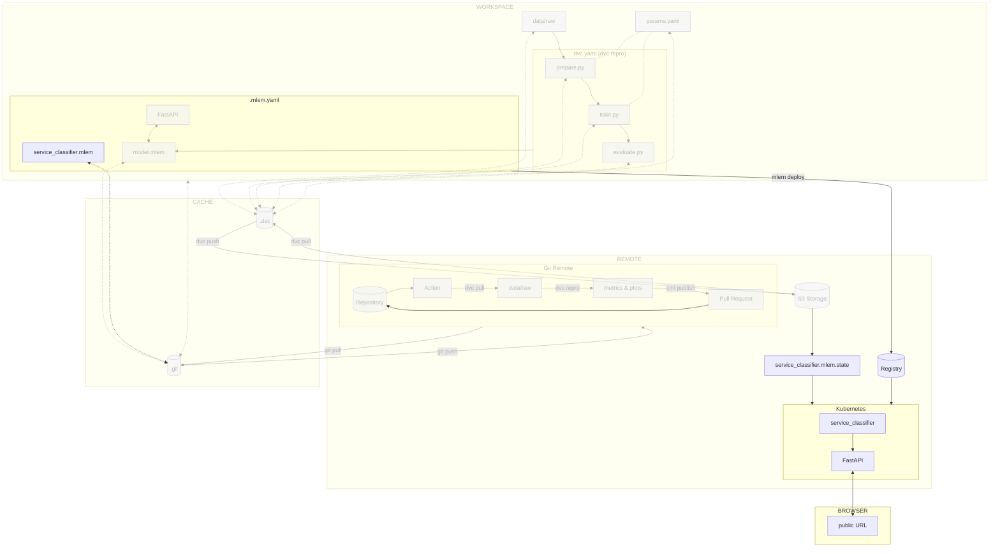

# Chapter 13: Deploy and access the model on Kubernetes with MLEM

??? info "You want to take over from this chapter? Collapse this section and follow the instructions below."

    _Work in progress._

    [//]: # "TODO"

    === ":simple-amazonaws: Amazon Web Services"

        _This is a work in progress._

    === ":simple-exoscale: Exoscale"

        _This is a work in progress._

    === ":simple-googlecloud: Google Cloud"

        **Create a Google Cloud Project**

        Create a Google Cloud Project by going to the
        [Google Cloud console](https://console.cloud.google.com/), select
        **Select a project** in the upper left corner of the screen and select
        **New project**.

        Name your project and select **Create** to create the project.

        A new page opens. Note the ID of your project, it will be used later.

        !!! warning

            Always make sure you're in the right project by selecting your project with
            **Select a project** in the upper left corner of the screen.

        **Export the Google Cloud Project ID**

        Export the Google Cloud Project ID as an environment variable. Replace
        `<id of your gcp project>` with your own project ID.

        ```sh title="Execute the following command(s) in a terminal"
        export GCP_PROJECT_ID=<id of your gcp project>
        ```

        **Install the Google Cloud CLI**

        To install `gcloud`, follow the official documentation:
        [_Install the Google Cloud CLI_ - cloud.google.com](https://cloud.google.com/sdk/docs/install-sdk)

        **Initialize and configure the Google Cloud CLI**

        The following process will authenticate to Google Cloud using the Google Cloud
        CLI. It will open a browser window to log you in and create a credentials file
        in `~/.config/gcloud/application_default_credentials.json`. This file must not
        be shared.

        ```sh title="Execute the following command(s) in a terminal"
        # Initialize and login to Google Cloud
        gcloud init

        # List all available projects
        gcloud projects list

        # Select your Google Cloud project
        gcloud config set project $GCP_PROJECT_ID
        ```

    === ":simple-microsoftazure: Microsoft Azure"

        _This is a work in progress._

    === ":simple-kubernetes: Self-hosted Kubernetes"

        If you have a self-hosted Kubertenes cluster, you can skip this step.

## Introduction

Serving the model locally is great for testing purposes, but it is not
sufficient for production. In this chapter, you will learn how to deploy the
model on Kubernetes with MLEM and access it from a Kubernetes pod.

This will allow the model to be used by other applications and services on a
public endpoint accessible from anywhere.

In this chapter, you will learn how to:

1. Create the Kubernetes cluster
2. Validate kubectl can access the Kubernetes cluster
3. Install MLEM with Kubernetes support
4. Deploy the model on Kubernetes with MLEM
5. Access the model

!!! danger

    The following steps will create resources on your cloud provider. These
    resources will be deleted at the end of the guide, but you might be charged for
    them. Kubernetes clusters are not free on most cloud providers and can be
    expensive. Make sure to delete the resources at the end of the guide.

The following diagram illustrates control flow of the experiment at the end of
this chapter:



## Steps

### Create the Kubernetes cluster

In order to deploy the model on Kubernetes, you will need a Kubernetes cluster.
Follow the steps below to create one.

=== ":simple-amazonaws: Amazon Web Services"

    _This is a work in progress._

=== ":simple-exoscale: Exoscale"

    _This is a work in progress._

=== ":simple-googlecloud: Google Cloud"

    **Enable the Google Kubernetes Engine API**

    You must enable the Google Kubernetes Engine API to create Kubernetes clusters
    on Google Cloud.

    [Enable Google Kubernetes Engine API :octicons-arrow-up-right-16:](https://console.cloud.google.com/flows/enableapi?apiid=container.googleapis.com){ .md-button .md-button--primary }

    **Create the Kubernetes cluster**

    Create the Google Kubernetes cluster with the Google Cloud CLI.

    Export the cluster name as an environment variable. Replace `<my cluster name>`
    with your own name (ex: `mlops-kubernetes`).

    ```sh title="Execute the following command(s) in a terminal"
    export GCP_CLUSTER_NAME=<my cluster name>
    ```

    Export the cluster zone as an environment variable. Replace `<my cluster zone>`
    with your own zone (ex: `europe-west6-a` for Switzerland Zurich).

    You should ideally select a location close to where most of the expected traffic
    will come from. You can view the available zones at
    [Regions and zones](https://cloud.google.com/compute/docs/regions-zones#available).
    You can view the available types of machine with the
    `gcloud compute machine-types list` command.

    ```sh title="Execute the following command(s) in a terminal"
    export GCP_CLUSTER_ZONE=<my cluster zone>
    ```

    Create the Kubernetes cluster. This can take a few minutes.

    ```sh title="Execute the following command(s) in a terminal"
    gcloud container clusters create \
    	--machine-type=e2-standard-2 \
    	--num-nodes=2 \
    	--zone=$GCP_CLUSTER_ZONE \
    	$GCP_CLUSTER_NAME
    ```

=== ":simple-microsoftazure: Microsoft Azure"

    _This is a work in progress._

=== ":simple-kubernetes: Self-hosted Kubernetes"

    If you have a self-hosted Kubertenes cluster, you can skip this step.

Install the Kubernetes CLI (kubectl) on your machine.

=== ":simple-amazonaws: Amazon Web Services"

    _This is a work in progress._

=== ":simple-exoscale: Exoscale"

    _This is a work in progress._

=== ":simple-googlecloud: Google Cloud"

	Install kubectl with the Google Cloud CLI.

    ```sh title="Execute the following command(s) in a terminal"
    # Install kubectl with gcloud
    gcloud components install kubectl
    ```

=== ":simple-microsoftazure: Microsoft Azure"

    _This is a work in progress._

=== ":simple-kubernetes: Self-hosted Kubernetes"

    _This is a work in progress._

### Validate kubectl can access the Kubernetes cluster

Validate kubectl can access the Kubernetes cluster.

```sh title="Execute the following command(s) in a terminal"
kubectl get namespaces
```

The output should be similar to this.

```
NAME              STATUS   AGE
default           Active   25m
kube-node-lease   Active   25m
kube-public       Active   25m
kube-system       Active   25m
```

### Add Kubernetes support to MLEM

Update the `requirements.txt` file to add `kubernetes` support in addtion to
`fastapi` to the `mlem` package.

!!! info

    Kubernetes is only one of the available backend that MLEM can deploy to. Check
    out their official documentation for more options.

```txt title="requirements.txt" hl_lines="5"
tensorflow==2.12.0
matplotlib==3.7.1
pyyaml==6.0
dvc[gs]==3.2.2
mlem[fastapi,kubernetes]==0.4.13
```

Check the differences with Git to validate the changes.

```sh title="Execute the following command(s) in a terminal"
# Show the differences with Git
git diff requirements.txt
```

The output should be similar to this.

```diff
diff --git a/requirements.txt b/requirements.txt
index fcdd460..b89d189 100644
--- a/requirements.txt
+++ b/requirements.txt
@@ -2,4 +2,4 @@ tensorflow==2.12.0
 matplotlib==3.7.1
 pyyaml==6.0
 dvc[gs]==3.2.2
-mlem[fastapi]==0.4.13
+mlem[fastapi,kubernetes]==0.4.13
```

Install the dependencies and update the freeze file.

!!! warning

    Prior to running any `pip` commands, it is crucial to ensure the virtual
    environment is activated to avoid potential conflicts with system-wide Python
    packages.

    To check its status, simply run `pip -V`. If the virtual environment is active,
    the output will show the path to the virtual environment's Python executable. If
    it is not, you can activate it with `source .venv/bin/activate`.

```sh title="Execute the following command(s) in a terminal"
# Install the requirements
pip install --requirement requirements.txt

# Freeze the requirements
pip freeze --local --all > requirements-freeze.txt
```

### Create a Container Registry

=== ":simple-amazonaws: Amazon Web Services"

    _This is a work in progress._

=== ":simple-exoscale: Exoscale"

    _This is a work in progress._

=== ":simple-googlecloud: Google Cloud"

    **Enable the Google Artifact Registry API**

    You must enable the Google Artifact Registry API to create a container registry
    on Google Cloud.

    [Enable Google Artifact Registry API :octicons-arrow-up-right-16:](https://console.cloud.google.com/flows/enableapi?apiid=artifactregistry.googleapis.com){ .md-button .md-button--primary }

    **Create the Google Container Registry**

    Export the repository name as an environment variable. Replace
    `<my repository name>` with your own name (ex: `mlops-registry`).

    ```sh title="Execute the following command(s) in a terminal"
    export GCP_REPOSITORY_NAME=<my repository name>
    ```

    Export the repository location as an environment variable. Replace
    `<my repository location>` with your own location (ex: `europe-west6` for
    Switzerland Zurich).

    ```sh title="Execute the following command(s) in a terminal"
    export GCP_REPOSITORY_LOCATION=<my repository location>
    ```

    ```sh title="Execute the following command(s) in a terminal"
    gcloud artifacts repositories create $GCP_REPOSITORY_NAME \
    	--repository-format=docker \
    	--location=$GCP_REPOSITORY_LOCATION \
    ```

=== ":simple-microsoftazure: Microsoft Azure"

    _This is a work in progress._

=== ":simple-kubernetes: Self-hosted Kubernetes"

    _This is a work in progress._

### Login to the remote Container Registry

=== ":simple-amazonaws: Amazon Web Services"

    _This is a work in progress._

=== ":simple-exoscale: Exoscale"

    _This is a work in progress._

=== ":simple-googlecloud: Google Cloud"

    **Authenticate with the Google Container Registry**

    ```sh title="Execute the following command(s) in a terminal"
    gcloud auth configure-docker ${GCP_REPOSITORY_LOCATION}-docker.pkg.dev
    ```

    ```sh title="Execute the following command(s) in a terminal"
    export GCP_PROJECT_ID=$(gcloud config get-value project)
    ```

    Export the container registry host:

    ```sh title="Execute the following command(s) in a terminal"
    export CONTAINER_REGISTRY_HOST=${GCP_REPOSITORY_LOCATION}-docker.pkg.dev/$GCP_PROJECT_ID/$GCP_REPOSITORY_NAME
    ```

=== ":simple-microsoftazure: Microsoft Azure"

    _This is a work in progress._

=== ":simple-kubernetes: Self-hosted Kubernetes"

    _This is a work in progress._

### Setup the MLEM Remote State Manager

After the model is deployed on Kubernetes, MLEM will state as local files. This
is fine if you are working alone, however, if you are working with a team, your
local files will not be available to your colleagues. To solve this issue, MLEM
can use a remote state manager to store the state of the infrastructure.

Setting up remote state manager is a lot like setting DVC remote. All you need
to do is provide URI where you want to store state files:

Make sure to use the same bucket name as the one you created in chapter 6.

!!! note

    To get the URI of your bucket, you can use the Google Cloud CLI.

    ```sh title="Execute the following command(s) in a terminal"
    gcloud storage ls
    ```

    The output should be similar to this.

    ```
    gs://<my bucket name>/
    ```

    Copy the URI and export it as an environment variable. Replace
    `<my bucket name>` with your own bucket name.

    ```sh title="Execute the following command(s) in a terminal"
    export GCP_BUCKET_NAME=<my bucket name>
    ```

```sh title="Execute the following command(s) in a terminal"
# Setup the MLEM Remote State Manager
mlem config set core.state.uri gs://$GCP_BUCKET_NAME
```

This will update your `.mlem.yaml` configuration file.

### Deploy the model on Kubernetes with MLEM

Deploy the model on Kubernetes with MLEM. This will create a Docker image, push
it to the remote Container Registry and deploy the model on Kubernetes.

The name `service_classifier` is the name of the deployment. It can be changed
to anything you want.

```sh title="Execute the following command(s) in a terminal"
# Create the deployment configuration for MLEM
mlem declare deployment kubernetes service_classifier \
    --namespace live \
    --image_name mlops-classifier \
    --image_uri mlops-classifier:latest \
    --registry remote \
    --registry.host=$CONTAINER_REGISTRY_HOST \
    --server fastapi \
    --service_type loadbalancer
```

The arguments are:

- `--namespace <namespace>`: The namespace name where the model will be deployed
  in Kubernetes.
- `--image_name <image name>`: The name of the Docker image.
- `--image_uri <image uri>`: The URI of the Docker image.
- `--registry remote`: Use a remote Container Registry.
- `--registry.host <host>`: The host of the remote Container Registry.
- `--server fastapi`: Use FastAPI as the server.
- `--service_type loadbalancer`: Use a load balancer to expose the service.

This will create a new `service_classifier.mlem` file at the root of your
project. This file contains the configuration of the deployment.

Next, to deploy the model on Kubernetes, run the following command:

```sh title="Execute the following command(s) in a terminal"
# Deploy the model on Kubernetes with MLEM
mlem deployment run --load service_classifier --model model
```

The arguments are:

- `--load <deployment name>`: The name of the deployment configuration to load.
- `--model <model name>`: The name of the model to deploy.

??? question "Having issues to deploy the model on Kubernetes?"

    If you have issues to deploy the model on Kubernetes, it can be because of the
    following reasons:

    - The Kubernetes cluster is not ready yet. Wait a few minutes and try again.
    - The image published on GitHub Container Registry is private. By default, the
      image is private. You can make it public by going to the Packages page of your
      profile and changing the visibility of the image to public. TODO: Improve this
      section. More specifically, how can we associate the container to the GitHub
      project instead of the user profile using the following documentation
      <https://docs.github.com/en/packages/learn-github-packages/connecting-a-repository-to-a-package>
      ?

The output should be similar to this.

```
💾 Saving deployment to service_classifier.mlem
⏳️ Loading model from model.mlem
🛠 Creating docker image mlops-classifier
  💼 Adding model files...
  🛠 Generating dockerfile...
  💼 Adding sources...
  💼 Generating requirements file...
  🛠 Building docker image europe-west6-docker.pkg.dev/mlops-test-391911/mlops-registry/mlops-classifier:dbdf5b923413970ed7cd31cc5da22455...
2023-08-02 10:58:29,915 [WARNING] mlem.contrib.docker.base: Skipped logging in to remote registry at host europe-west6-docker.pkg.dev/mlops-test-391911/mlops-registry because no credentials given. You could specify credentials as EUROPE-WEST6-DOCKER_PKG_DEV/MLOPS-TEST-391911/MLOPS-REGISTRY_USERNAME and EUROPE-WEST6-DOCKER_PKG_DEV/MLOPS-TEST-391911/MLOPS-REGISTRY_PASSWORD environment variables.
  ✅  Built docker image europe-west6-docker.pkg.dev/mlops-test-391911/mlops-registry/mlops-classifier:dbdf5b923413970ed7cd31cc5da22455
  🔼 Pushing image europe-west6-docker.pkg.dev/mlops-test-391911/mlops-registry/mlops-classifier:dbdf5b923413970ed7cd31cc5da22455 to
europe-west6-docker.pkg.dev/mlops-test-391911/mlops-registry
  ✅  Pushed image
europe-west6-docker.pkg.dev/mlops-test-391911/mlops-registry/mlops-classifier:dbdf
5b923413970ed7cd31cc5da22455 to
europe-west6-docker.pkg.dev/mlops-test-391911/mlops-registry
namespace created. status='{'conditions': None, 'phase': 'Active'}'
deployment created. status='{'available_replicas': None,
 'collision_count': None,
 'conditions': None,
 'observed_generation': None,
 'ready_replicas': None,
 'replicas': None,
 'unavailable_replicas': None,
 'updated_replicas': None}'
service created. status='{'conditions': None, 'load_balancer': {'ingress': None}}'
✅  Deployment mlops-classifier is up in live namespace
```

!!! tip

    A MLEM Kubernetes deployment can be deleted with the command
    `mlem deploy remove <deployment name>`.

### Access the model

By default, MLEM deploys the model as a service named `service_classifier` in
the `live` namespace.

To access the model, you will need to find the external IP address of the
service. You can do so with the following command.

```sh title="Execute the following command(s) in a terminal"
# Get the description of the service
kubectl describe services mlops-classifier --namespace live
```

The output should be similar to this.

```
Name:                     mlops-classifier
Namespace:                live
Labels:                   run=mlops-classifier
Annotations:              cloud.google.com/neg: {"ingress":true}
Selector:                 app=mlops-classifier
Type:                     LoadBalancer
IP Family Policy:         SingleStack
IP Families:              IPv4
IP:                       10.44.6.134
IPs:                      10.44.6.134
LoadBalancer Ingress:     34.65.72.237
Port:                     <unset>  8080/TCP
TargetPort:               8080/TCP
NodePort:                 <unset>  32723/TCP
Endpoints:                10.40.0.12:8080
Session Affinity:         None
External Traffic Policy:  Cluster
Events:
  Type    Reason                Age   From                Message
  ----    ------                ----  ----                -------
  Normal  EnsuringLoadBalancer  99s   service-controller  Ensuring load balancer
  Normal  EnsuredLoadBalancer   59s   service-controller  Ensured load balancer
```

The `LoadBalancer Ingress` field contains the external IP address of the
service. In this case, it is `34.65.72.237`.

Try to access the model with the IP you found at the port `8080`
(`<load balancer ingress ip>:8080`). You should access the FastAPI documentation
page as earlier in the guide!

### Check the changes

Check the changes with Git to ensure that all the necessary files are tracked.

```sh title="Execute the following command(s) in a terminal"
# Add all the files
git add .

# Check the changes
git status
```

The output should look like this.

```
On branch main
Your branch is up to date with 'origin/main'.

Changes to be committed:
(use "git restore --staged <file>..." to unstage)
    modified:   .mlem.yaml
    modified:   requirements-freeze.txt
    modified:   requirements.txt
    new file:   service_classifier.mlem
```

### Commit the changes to Git

Commit the changes to Git.

```sh title="Execute the following command(s) in a terminal"
# Commit the changes
git commit -m "MLEM provides k8s deployment files"

# Push the changes
git push
```

## Summary

Congratulations! You have successfully deployed the model on Kubernetes with
MLEM and accessed it from an external IP address.

You can now use the model from anywhere.

In this chapter, you have successfully:

1. Created a Kubernetes cluster
2. Managed the Kubernetes cluster with kubectl
3. Installed MLEM with Kubernetes support
4. Deployed the model on Kubernetes with MLEM
5. Accessed the model

## State of the MLOps process

- [x] Notebook has been transformed into scripts for production
- [x] Codebase and dataset are versioned
- [x] Steps used to create the model are documented and can be re-executed
- [x] Changes done to a model can be visualized with parameters, metrics and
      plots to identify differences between iterations
- [x] Codebase can be shared and improved by multiple developers
- [x] Dataset can be shared among the developers and is placed in the right
      directory in order to run the experiment
- [x] Experiment can be executed on a clean machine with the help of a CI/CD
      pipeline
- [x] CI/CD pipeline is triggered on pull requests and reports the results of
      the experiment
- [x] Changes to model can be thoroughly reviewed and discussed before
      integrating them into the codebase
- [x] Model can be saved and loaded with all required artifacts for future usage
- [x] Model can be easily used outside of the experiment context
- [x] Model is accessible from the Internet and can be used anywhere
- [ ] Model requires manual deployment on the cluster
- [ ] Model cannot be trained on hardware other than the local machine

You will address these issues in the next chapters for improved efficiency and
collaboration. Continue the guide to learn how.

## Sources

Highly inspired by:

- [_Connecting a repository to a package_ - docs.github.com](https://docs.github.com/en/packages/learn-github-packages/connecting-a-repository-to-a-package)
- [_Get Started_ - mlem.ai](https://mlem.ai/doc/get-started?tab=Kubernetes)
- [_Kubernetes_ - mlem.ai](https://mlem.ai/doc/user-guide/deploying/kubernetes)
- [_Working with the Container registry_ - docs.github.com](https://docs.github.com/en/packages/working-with-a-github-packages-registry/working-with-the-container-registry)
