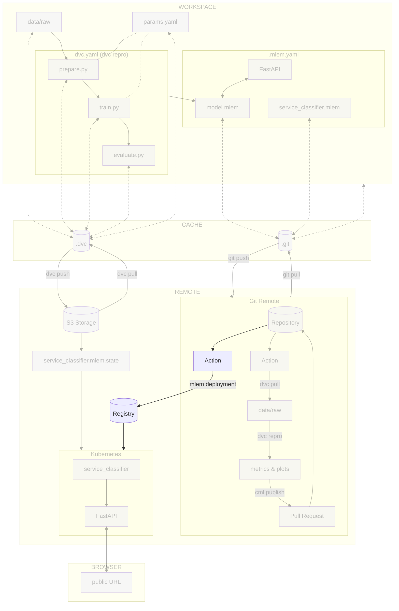

# Chapter 14: Continuous deployment of the model with MLEM and the CI/CD pipeline

??? info "You want to take over from this chapter? Collapse this section and follow the instructions below."

    _Work in progress._

    [//]: # "TODO"

## Introduction

In this chapter, we will deploy the model to the Kubernetes cluster with the
help of the CI/CD pipeline. We will use the MLEM tool to deploy the model to the
cluster and the pipeline to trigger the deployment.

The steps will be similar to the last chapter, but we will use the pipeline to
automate the process.

In this chapter, you will learn how to:

1. Grant access to the container registry on your cloud provider
2. Store the cloud provider credentials in the CI/CD configuration
3. Create the CI/CD pipeline for deploying the model to the Kubernetes cluster
4. Push the CI/CD pipeline configuration file to Git
5. Visualize the execution of the CI/CD pipeline

The following diagram illustrates control flow of the experiment at the end of
this chapter:



## Steps

### Set up access to the container registry of your cloud provider

MLEM will need to access the container registry inside the CI/CD pipeline to
push the Docker image.

This is the same process as in
[Chapter 8 - Reproduce the ML experiment in a CI/CD pipeline](../part-2-move-the-model-to-the-cloud/chapter-8-reproduce-the-ml-experiment-in-a-cicd-pipeline.md).

=== ":simple-googlecloud: Google Cloud"

    Create the Google Service Account and its associated Google Service Account Key
    to access Google Cloud without your own credentials.

    As a reminder, the key will be stored in your **~/.config/gcloud** directory
    under the name `mlem-google-service-account-key.json`.

    !!! danger

        You must **never** add and commit this file to your working directory. It is a
        sensitive data that you must keep safe.

    ```sh title="Execute the following command(s) in a terminal"
    # Create the Google Service Account
    gcloud iam service-accounts create mlem-service-account \
        --display-name="MLEM Service Account"

    # Set the Cloud Storage permissions for the Google Service Account
    gcloud projects add-iam-policy-binding $GCP_PROJECT_ID \
        --member="serviceAccount:mlem-service-account@${GCP_PROJECT_ID}.iam.gserviceaccount.com" \
        --role="roles/storage.objectAdmin"

    # Set the Artifact Registry permissions for the Google Service Account
    gcloud projects add-iam-policy-binding $GCP_PROJECT_ID \
        --member="serviceAccount:mlem-service-account@${GCP_PROJECT_ID}.iam.gserviceaccount.com" \
        --role="roles/storage.objectAdmin"
        --role="roles/artifactregistry.createOnPushWriter"

    # Set the Kubernetes Cluster permissions for the Google Service Account
    gcloud projects add-iam-policy-binding $GCP_PROJECT_ID \
        --member="serviceAccount:mlem-service-account@${GCP_PROJECT_ID}.iam.gserviceaccount.com" \
        --role="roles/container.clusterViewer"

    # Create the Google Service Account Key
    gcloud iam service-accounts keys create ~/.config/gcloud/mlem-google-service-account-key.json \
        --iam-account=mlem-service-account@${GCP_PROJECT_ID}.iam.gserviceaccount.com
    ```

=== ":material-cloud: Using another cloud provider? Read this!"

    This guide has been written with Google Cloud Platform in mind. We are open to
    contributions to add support for other cloud providers such as
    [:simple-amazonaws: Amazon Web Services](https://aws.amazon.com),
    [:simple-exoscale: Exoscale](https://www.exoscale.com),
    [:simple-microsoftazure: Microsoft Azure](https://azure.microsoft.com) or
    [:simple-kubernetes: Self-hosted Kubernetes](https://kubernetes.io) but we might
    not officially support them.

    If you want to contribute, please open an issue or a pull request on the
    [GitHub repository](https://github.com/csia-pme/csia-pme). Your help is greatly
    appreciated!

### Store the cloud provider credentials in the CI/CD configuration

Now that the credentials are created, you need to store them in the CI/CD
configuration.

Depending on the CI/CD platform you are using, the process will be different.

=== ":simple-googlecloud: Google Cloud"

    **Display the Google Service Account key**

    The service account key is stored on your computer as a JSON file. You need to
    display it and store it as a CI/CD variable in a text format.

    === ":simple-github: GitHub"

        Display the Google Service Account key that you have downloaded from Google
        Cloud.

        ```sh title="Execute the following command(s) in a terminal"
        # Display the Google Service Account key
        cat ~/.config/gcloud/mlem-google-service-account-key.json
        ```

    === ":simple-gitlab: GitLab"

        Encode and display the Google Service Account key that you have downloaded from
        Google Cloud as `base64`. It allows to hide the secret in GitLab CI logs as a
        security measure.

        !!! tip

            If on Linux, you can use the command
            `base64 -w 0 -i ~/.config/gcloud/mlem-google-service-account-key.json`.

        ```sh title="Execute the following command(s) in a terminal"
        # Encode the Google Service Account key to base64
        base64 -i ~/.config/gcloud/mlem-google-service-account-key.json
        ```

    **Store the Google Service Account key as a CI/CD variable**

    === ":simple-github: GitHub"

        Store the output as a CI/CD variable by going to the **Settings** section from
        the top header of your GitHub repository.

        Select **Secrets and variables > Actions** and select **New repository secret**.

        Create a new variable named `MLEM_GCP_SERVICE_ACCOUNT_KEY` with the output value
        of the Google Service Account key file as its value. Save the variable by
        selecting **Add secret**.

    === ":simple-gitlab: GitLab"

        Store the output as a CI/CD Variable by going to **Settings > CI/CD** from the
        left sidebar of your GitLab project.

        Select **Variables** and select **Add variable**.

        Create a new variable named `MLEM_GCP_SERVICE_ACCOUNT_KEY` with the Google
        Service Account key file encoded in `base64` as its value.

        - **Protect variable**: _Unchecked_
        - **Mask variable**: _Checked_
        - **Expand variable reference**: _Unchecked_

        Save the variable by clicking **Add variable**.

=== ":material-cloud: Using another cloud provider? Read this!"

    This guide has been written with Google Cloud Platform in mind. We are open to
    contributions to add support for other cloud providers such as
    [:simple-amazonaws: Amazon Web Services](https://aws.amazon.com),
    [:simple-exoscale: Exoscale](https://www.exoscale.com),
    [:simple-microsoftazure: Microsoft Azure](https://azure.microsoft.com) or
    [:simple-kubernetes: Self-hosted Kubernetes](https://kubernetes.io) but we might
    not officially support them.

    If you want to contribute, please open an issue or a pull request on the
    [GitHub repository](https://github.com/csia-pme/csia-pme). Your help is greatly
    appreciated!

### Update the CI/CD pipeline configuration file

You will the pipeline to deploy the model to the Kubernetes cluster. The
following steps will be performed:

1. Detect a new commit on the `main` branch
2. Authenticate to your cloud provider
3. Deploy the model with MLEM if `model.mlem` has changed

=== ":simple-github: GitHub"

    At the root level of your Git repository, create a new GitHub Workflow
    configuration file `.github/workflows/deploy.yml`.

    Take some time to understand the deploy job and its steps.

    ```yaml
    name: Deploy

    on:
      # Runs when called from another workflow
      workflow_call:

      # Allows you to run this workflow manually from the Actions tab
      workflow_dispatch:

    jobs:
      deploy:
        runs-on: ubuntu-latest
        steps:
          - name: Checkout repository
            uses: actions/checkout@v3
          - name: Setup Python
            uses: actions/setup-python@v4
            with:
              python-version: '3.10'
              cache: 'pip'
          - name: Install dependencies
            run: pip install -r requirements-freeze.txt
          - name: Login to Google Cloud
            uses: 'google-github-actions/auth@v1'
            with:
              credentials_json: '${{ secrets.MLEM_GCP_SERVICE_ACCOUNT_KEY }}'
          - name: Get Google Cloud's Kubernetes credentials
            uses: 'google-github-actions/get-gke-credentials@v1'
            with:
              cluster_name: 'mlops-kubernetes'
              location: 'europe-west6-a'
          - name: Deploy the model
            run: mlem deployment run --load service_classifier --model model
    ```

=== ":simple-gitlab: GitLab"

    _Work in progress._

### Push the CI/CD pipeline configuration file to Git

=== ":simple-github: GitHub"

    Push the CI/CD pipeline configuration file to Git.

    ```sh title="Execute the following command(s) in a terminal"
    # Add the configuration file
    git add .github/workflows/deploy.yml

    # Commit the changes
    git commit -m "A pipeline will deploy the model on the Kubernetes cluster"

    # Push the changes
    git push
    ```

=== ":simple-gitlab: GitLab"

    _Work in progress._

### Check the results

TODO: Add GitHub/GitLab manual trigger of the pipeline with instructions.

TODO: Add a screenshot of the pipeline running.

If you click on the pipeline, you should see the following output for the
`Deploy the model` step:

```sh
> mlem deployment run --load service_classifier --model model

⏳️ Loading model from model.mlem
⏳️ Loading deployment from service_classifier.mlem
```

Note that since the model has not changed, MLEM has not re-deployed the model.

## State of the MLOps process

- [x] Notebook has been transformed into scripts for production
- [x] Codebase and dataset are versioned
- [x] Steps used to create the model are documented and can be re-executed
- [x] Changes done to a model can be visualized with parameters, metrics and
      plots to identify differences between iterations
- [x] Codebase can be shared and improved by multiple developers
- [x] Dataset can be shared among the developers and is placed in the right
      directory in order to run the experiment
- [x] Experiment can be executed on a clean machine with the help of a CI/CD
      pipeline
- [x] CI/CD pipeline is triggered on pull requests and reports the results of
      the experiment
- [x] Changes to model can be thoroughly reviewed and discussed before
      integrating them into the codebase
- [x] Model can be saved and loaded with all required artifacts for future usage
- [x] Model can be easily used outside of the experiment context.
- [x] Model can be accessed from a Kubernetes cluster
- [x] Model is continuously deployed with the CI/CD
- [ ] Model can be trained on a custom infrastructure with custom hardware for
      specific use-cases

You can now safely continue to the next chapter of this guide concluding your
journey and the next things you could do with your model.

## Sources
