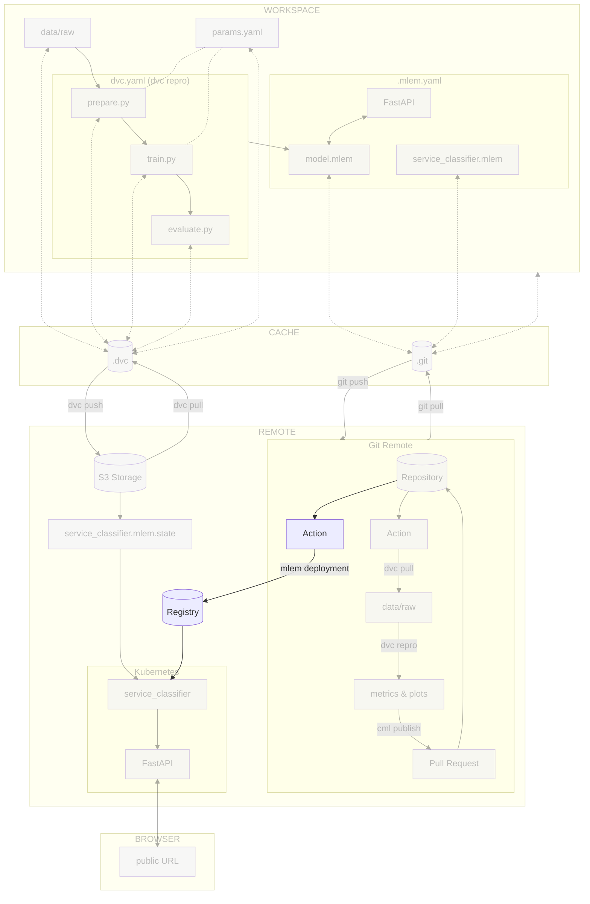

# Chapter 14: Continuous deployment of the model with the CI/CD pipeline

## Introduction

In this chapter, you will deploy the model to the Kubernetes cluster with the
help of the CI/CD pipeline. You will use the [MLEM](../tools.md) tool to deploy
the model to the cluster and the pipeline to trigger the deployment.

The steps will be similar to the last chapter, but we will use the pipeline to
automate the process.

In this chapter, you will learn how to:

1. Grant access to the container registry on the cloud provider
2. Store the cloud provider credentials in the CI/CD configuration
3. Create the CI/CD pipeline for deploying the model to the Kubernetes cluster
4. Push the CI/CD pipeline configuration file to [:simple-git: Git](../tools.md)
5. Visualize the execution of the CI/CD pipeline

The following diagram illustrates control flow of the experiment at the end of
this chapter:



## Steps

### Set up access to the container registry of the cloud provider

MLEM will need to access the container registry inside the CI/CD pipeline to
push the Docker image.

This is the same process you did for DVC as described in
[Chapter 8 - Reproduce the ML experiment in a CI/CD pipeline](../part-2-move-the-model-to-the-cloud/chapter-8-reproduce-the-ml-experiment-in-a-cicd-pipeline.md)
but this time for MLEM.

=== ":simple-googlecloud: Google Cloud"

    Create the Google Service Account and its associated Google Service Account Key
    to access Google Cloud for MLEM without your own credentials.

    As a reminder, the key will be stored in your **`~/.config/gcloud`** directory
    under the name `mlem-google-service-account-key.json`.

    !!! danger

        You must **never** add and commit this file to your working directory. It is a
        sensitive data that you must keep safe.

    ```sh title="Execute the following command(s) in a terminal"
    # Create the Google Service Account
    gcloud iam service-accounts create mlem-service-account \
        --display-name="MLEM Service Account"

    # Set the Cloud Storage permissions for the Google Service Account
    gcloud projects add-iam-policy-binding $GCP_PROJECT_ID \
        --member="serviceAccount:mlem-service-account@${GCP_PROJECT_ID}.iam.gserviceaccount.com" \
        --role="roles/storage.objectAdmin"

    # Set the Artifact Registry permissions for the Google Service Account
    gcloud projects add-iam-policy-binding $GCP_PROJECT_ID \
        --member="serviceAccount:mlem-service-account@${GCP_PROJECT_ID}.iam.gserviceaccount.com" \
        --role="roles/storage.objectAdmin" \
        --role="roles/artifactregistry.createOnPushWriter"

    # Set the Kubernetes Cluster permissions for the Google Service Account
    gcloud projects add-iam-policy-binding $GCP_PROJECT_ID \
        --member="serviceAccount:mlem-service-account@${GCP_PROJECT_ID}.iam.gserviceaccount.com" \
        --role="roles/container.clusterViewer"

    # Create the Google Service Account Key
    gcloud iam service-accounts keys create ~/.config/gcloud/mlem-google-service-account-key.json \
        --iam-account=mlem-service-account@${GCP_PROJECT_ID}.iam.gserviceaccount.com
    ```

=== ":material-cloud: Using another cloud provider? Read this!"

    This guide has been written with Google Cloud in mind. We are open to
    contributions to add support for other cloud providers such as
    [:simple-amazonaws: Amazon Web Services](https://aws.amazon.com),
    [:simple-exoscale: Exoscale](https://www.exoscale.com),
    [:simple-microsoftazure: Microsoft Azure](https://azure.microsoft.com) or
    [:simple-kubernetes: Self-hosted Kubernetes](https://kubernetes.io) but we might
    not officially support them.

    If you want to contribute, please open an issue or a pull request on the
    [GitHub repository](https://github.com/swiss-ai-center/a-guide-to-mlops). Your
    help is greatly appreciated!

### Store the cloud provider credentials in the CI/CD configuration

Now that the credentials are created, you need to store them in the CI/CD
configuration.

Depending on the CI/CD platform you are using, the process will be different.

=== ":simple-googlecloud: Google Cloud"

    **Display the Google Service Account key**

    The service account key is stored on your computer as a JSON file. You need to
    display it and store it as a CI/CD variable in a text format.

    === ":simple-github: GitHub"

        Display the Google Service Account key that you have downloaded from Google
        Cloud.

        ```sh title="Execute the following command(s) in a terminal"
        # Display the Google Service Account key
        cat ~/.config/gcloud/mlem-google-service-account-key.json
        ```

    === ":simple-gitlab: GitLab"

        Encode and display the Google Service Account key that you have downloaded from
        Google Cloud as `base64`. It allows to hide the secret in GitLab CI logs as a
        security measure.

        === ":simple-linux: Linux & :simple-windows: Windows"

            ```sh title="Execute the following command(s) in a terminal"
            # Encode the Google Service Account key to base64
            base64 -w 0 -i ~/.config/gcloud/mlem-google-service-account-key.json
            ```

        === ":simple-apple: macOS"

            ```sh title="Execute the following command(s) in a terminal"
            # Encode the Google Service Account key to base64
            base64 -i ~/.config/gcloud/mlem-google-service-account-key.json
            ```

    **Store the Google Service Account key as a CI/CD variable**

    === ":simple-github: GitHub"

        Store the output as a CI/CD variable by going to the **Settings** section from
        the top header of your GitHub repository.

        Select **Secrets and variables > Actions** and select **New repository secret**.

        Create a new variable named `MLEM_GCP_SERVICE_ACCOUNT_KEY` with the output value
        of the Google Service Account key file as its value. Save the variable by
        selecting **Add secret**.

    === ":simple-gitlab: GitLab"

        Store the output as a CI/CD Variable by going to **Settings > CI/CD** from the
        left sidebar of your GitLab project.

        Select **Variables** and select **Add variable**.

        Create a new variable named `MLEM_GCP_SERVICE_ACCOUNT_KEY` with the Google
        Service Account key file encoded in `base64` as its value.

        - **Protect variable**: _Unchecked_
        - **Mask variable**: _Checked_
        - **Expand variable reference**: _Unchecked_

        Save the variable by clicking **Add variable**.

=== ":material-cloud: Using another cloud provider? Read this!"

    This guide has been written with Google Cloud in mind. We are open to
    contributions to add support for other cloud providers such as
    [:simple-amazonaws: Amazon Web Services](https://aws.amazon.com),
    [:simple-exoscale: Exoscale](https://www.exoscale.com),
    [:simple-microsoftazure: Microsoft Azure](https://azure.microsoft.com) or
    [:simple-kubernetes: Self-hosted Kubernetes](https://kubernetes.io) but we might
    not officially support them.

    If you want to contribute, please open an issue or a pull request on the
    [GitHub repository](https://github.com/swiss-ai-center/a-guide-to-mlops). Your
    help is greatly appreciated!

### Update the CI/CD pipeline configuration file

You will the pipeline to deploy the model to the Kubernetes cluster. The
following steps will be performed:

1. Detect a new commit on the `main` branch
2. Authenticate to the cloud provider
3. Deploy the model with MLEM if `model.mlem` has changed

=== ":simple-github: GitHub"

    At the root level of your Git repository, create a new GitHub workflow
    configuration file `.github/workflows/mlops-deploy.yml`. Replace
    `<my cluster name>` with your own name (ex: `mlops-kubernetes`). Replace
    `<my cluster zone>` with your own zone (ex: `europe-west6-a` for Zurich,
    Switzerland).

    Take some time to understand the deploy job and its steps.

    ```yaml title=".github/workflows/mlops-deploy.yml"
    name: Deploy

    on:
      # Runs when called from another workflow
      workflow_call:

      # Allows you to run this workflow manually from the Actions tab
      workflow_dispatch:

    jobs:
      deploy:
        runs-on: ubuntu-latest
        steps:
          - name: Checkout repository
            uses: actions/checkout@v3
          - name: Setup Python
            uses: actions/setup-python@v4
            with:
              python-version: '3.10'
              cache: 'pip'
          - name: Install dependencies
            run: pip install --requirement requirements-freeze.txt
          - name: Login to Google Cloud
            uses: 'google-github-actions/auth@v1'
            with:
              credentials_json: '${{ secrets.MLEM_GCP_SERVICE_ACCOUNT_KEY }}'
          - name: Get Google Cloud's Kubernetes credentials
            uses: 'google-github-actions/get-gke-credentials@v1'
            with:
              cluster_name: '<my cluster name>'
              location: '<my cluster zone>'
          - name: Deploy the model
            run: mlem deployment run --load service_classifier --model model
    ```

    By utilizing the `workflow_call` function, it becomes possible to directly
    invoke this action from our primary `mlops.yml` workflow. Let's proceed to make
    the necessary modifications to achieve this seamlessly:

    ```yaml title=".github/workflows/mlops.yml" hl_lines="95-100"
    name: MLOps

    on:
      # Runs on pushes targeting main branch
      push:
        branches:
          - main

      # Runs on pull requests
      pull_request:

      # Allows you to run this workflow manually from the Actions tab
      workflow_dispatch:

    jobs:
      train-and-report:
        permissions: write-all
        runs-on: ubuntu-latest
        steps:
          - name: Checkout repository
            uses: actions/checkout@v3
          - name: Setup Python
            uses: actions/setup-python@v4
            with:
              python-version: '3.10'
              cache: pip
          - name: Install dependencies
            run: pip install --requirement requirements-freeze.txt
          - name: Login to Google Cloud
            uses: 'google-github-actions/auth@v1'
            with:
              credentials_json: '${{ secrets.DVC_GCP_SERVICE_ACCOUNT_KEY }}'
          - name: Train model
            run: dvc repro --pull --allow-missing
            # Node is required to run CML
          - name: Setup Node
            if: github.event_name == 'pull_request'
            uses: actions/setup-node@v3
            with:
              node-version: '16'
          - name: Setup CML
            if: github.event_name == 'pull_request'
            uses: iterative/setup-cml@v1
            with:
              version: '0.19.1'
          - name: Create CML report
            if: github.event_name == 'pull_request'
            env:
              REPO_TOKEN: ${{ secrets.GITHUB_TOKEN }}
            run: |
              # Fetch all other Git branches
              git fetch --depth=1 origin main:main

              # Add title to the report
              echo "# Experiment Report (${{ github.sha }})" >> report.md

              # Compare parameters to main branch
              echo "## Params workflow vs. main" >> report.md
              dvc params diff main --md >> report.md

              # Compare metrics to main branch
              echo "## Metrics workflow vs. main" >> report.md
              dvc metrics diff main --md >> report.md

              # Compare plots (images) to main branch
              dvc plots diff main

              # Create plots
              echo "## Plots" >> report.md

              # Create training history plot
              echo "### Training History" >> report.md
              echo "#### main" >> report.md
              echo '' >> report.md
              echo "#### workspace" >> report.md
              echo '' >> report.md

              # Create predictions preview
              echo "### Predictions Preview" >> report.md
              echo "#### main" >> report.md
              echo '' >> report.md
              echo "#### workspace" >> report.md
              echo '' >> report.md

              # Create confusion matrix
              echo "### Confusion Matrix" >> report.md
              echo "#### main" >> report.md
              echo '' >> report.md
              echo "#### workspace" >> report.md
              echo '' >> report.md

              # Publish the CML report
              cml comment update --target=pr --publish report.md

      deploy:
        # Runs on main branch only
        if: github.ref == 'refs/heads/main'
        needs: train-and-report
        name: Call Deploy
        uses: ./.github/workflows/mlops-deploy.yml
        secrets: inherit
    ```

    Check the differences with Git to validate the changes.

    ```sh title="Execute the following command(s) in a terminal"
    # Show the differences with Git
    git diff .github/workflows/mlops.yml
    ```

    The output should be similar to this:

    ```diff
    diff --git a/.github/workflows/mlops.yml b/.github/workflows/mlops.yml
    index f40cb93..26e25f9 100644
    --- a/.github/workflows/mlops.yml
    +++ b/.github/workflows/mlops.yml
    @@ -91,3 +91,10 @@ jobs:

               # Publish the CML report
               cml comment update --target=pr --publish report.md
    +
    +  deploy:
    +    # Runs on main branch only
    +    if: github.ref == 'refs/heads/main'
    +    needs: train-and-report
    +    name: Call Deploy
    +    uses: ./.github/workflows/mlops-deploy.yml
    +    secrets: inherit
    ```

=== ":simple-gitlab: GitLab"

    In order to execute commands on the Kubernetes cluster, an agent must be set up
    on the cluster.

    **Create the agent configuration file**

    Create a new empty file named `.gitlab/agents/k8s-agent/config.yaml` at the root
    of the repository.

    This file is empty and only serves to enable Kubernetes integration with GitLab.

    Commit the changes to Git.

    ```sh title="Execute the following command(s) in a terminal"
    # Add the file
    git add .gitlab/agents/k8s-agent/config.yaml

    # Commit the changes
    git commit -m "Enable Kubernetes integration with GitLab"

    # Push the changes
    git push
    ```

    **Register the agent with GitLab**

    On GitLab, in the left sidebar, go to **Operate > Kubernetes clusters**. Click
    on **Connect a cluster**. Select the **k8s-agent** configuration file in the
    list. Click **Register**. A modal opens.

    In the modal, a command to register the GitLab Kubernetes agent is displayed.

    The command should look like this:

    ```sh
    helm repo add gitlab https://charts.gitlab.io
    helm repo update
    helm upgrade --install XXX gitlab/gitlab-agent \
        --namespace XXX \
        --create-namespace \
        --set image.tag=XXX \
        --set config.token=XXX \
        --set config.kasAddress=XXX
    ```

    This command must be executed on the Google Cloud Kubernetes cluster.

    **Install the agent on the Kubernetes cluster**

    Copy and paste the command GitLab displays in your terminal. This should install
    the GitLab agent on the Kubernetes cluster.

    The output should look like this:

    ```
    "gitlab" has been added to your repositories
    Hang tight while we grab the latest from your chart repositories...
    ...Successfully got an update from the "gitlab" chart repository
    Update Complete. ⎈Happy Helming!⎈
    Release "k8s-agent" does not exist. Installing it now.
    NAME: k8s-agent
    LAST DEPLOYED: Tue Aug 15 13:59:01 2023
    NAMESPACE: gitlab-agent-k8s-agent
    STATUS: deployed
    REVISION: 1
    TEST SUITE: None
    NOTES:
    Thank you for installing gitlab-agent.

    Your release is named k8s-agent.
    ```

    Once the command was executed on the Kubernetes cluster, you can close the
    model.

    Refresh the page and you should see the agent has successfully connected to
    GitLab.

    **Update the CI/CD pipeline configuration file**

    Update the `.gitlab-ci.yml` file to add a new stage to deploy the model on the
    Kubernetes cluster.

    Take some time to understand the deploy job and its steps.

    ```yaml title=".gitlab-ci.yml" hl_lines="4 100-130"
    stages:
      - train
      - report
      - deploy

    variables:
      # Change pip's cache directory to be inside the project directory since we can
      # only cache local items.
      PIP_CACHE_DIR: "$CI_PROJECT_DIR/.cache/pip"
      # https://dvc.org/doc/user-guide/troubleshooting?tab=GitLab-CI-CD#git-shallow
      GIT_DEPTH: "0"
      # Set the path to Google Service Account key for DVC - https://dvc.org/doc/command-reference/remote/add#google-cloud-storage
      GOOGLE_APPLICATION_CREDENTIALS: "${CI_PROJECT_DIR}/google-service-account-key.json"
      # Environment variable for CML
      REPO_TOKEN: $GITLAB_PAT

    train:
      stage: train
      image: python:3.10
      rules:
        - if: $CI_COMMIT_BRANCH == "main"
        - if: $CI_PIPELINE_SOURCE == "merge_request_event"
      cache:
        paths:
          # Pip's cache doesn't store the Python packages
          # https://pip.pypa.io/en/stable/reference/pip_install/#caching
          - .cache/pip
          - .venv/
      before_script:
        # Set the Google Service Account key
        - echo "${DVC_GCP_SERVICE_ACCOUNT_KEY}" | base64 -d > $GOOGLE_APPLICATION_CREDENTIALS
        # Create the virtual environment for caching
        - python3 -m venv .venv
        - source .venv/bin/activate
        # Install dependencies
        - pip install --requirement requirements-freeze.txt
      script:
        # Run the experiment
        - dvc repro --pull --allow-missing

    report:
      stage: report
      image: iterativeai/cml:0-dvc3-base1
      needs:
        - train
      rules:
        - if: $CI_PIPELINE_SOURCE == "merge_request_event"
      before_script:
        # Set the Google Service Account key
        - echo "${DVC_GCP_SERVICE_ACCOUNT_KEY}" | base64 -d > $GOOGLE_APPLICATION_CREDENTIALS
      script:
        - |
          # Fetch the experiment changes
          dvc pull

          # Fetch all other Git branches
          git fetch --depth=1 origin main:main

          # Add title to the report
          echo "# Experiment Report (${CI_COMMIT_SHA})" >> report.md

          # Compare parameters to main branch
          echo "## Params workflow vs. main" >> report.md
          dvc params diff main --md >> report.md

          # Compare metrics to main branch
          echo "## Metrics workflow vs. main" >> report.md
          dvc metrics diff main --md >> report.md

          # Compare plots (images) to main branch
          dvc plots diff main

          # Create plots
          echo "## Plots" >> report.md

          # Create training history plot
          echo "### Training History" >> report.md
          echo "#### main" >> report.md
          echo '' >> report.md
          echo "#### workspace" >> report.md
          echo '' >> report.md

          # Create predictions preview
          echo "### Predictions Preview" >> report.md
          echo "#### main" >> report.md
          echo '' >> report.md
          echo "#### workspace" >> report.md
          echo '' >> report.md

          # Create confusion matrix
          echo "### Confusion Matrix" >> report.md
          echo "#### main" >> report.md
          echo '' >> report.md
          echo "#### workspace" >> report.md
          echo '' >> report.md

          # Publish the CML report
          cml comment update --target=pr --publish report.md

    deploy:
      stage: deploy
      image: python:3.10
      rules:
        - if: $CI_COMMIT_BRANCH == "main"
      cache:
        paths:
          # Pip's cache doesn't store the Python packages
          # https://pip.pypa.io/en/stable/reference/pip_install/#caching
          - .cache/pip
          - .venv/
      before_script:
        # Install Kubernetes
        - export KUBERNETES_VERSION=$(curl -L -s https://dl.k8s.io/release/stable.txt)
        - curl -LO -s "https://dl.k8s.io/release/${KUBERNETES_VERSION}/bin/linux/amd64/kubectl"
        - curl -LO -s "https://dl.k8s.io/${KUBERNETES_VERSION}/bin/linux/amd64/kubectl.sha256"
        - echo "$(cat kubectl.sha256) kubectl" | sha256sum --check
        - install -o root -g root -m 0755 kubectl /usr/local/bin/kubectl
        # Switch to the right Kubernetes context
        - kubectl config use-context ${CI_PROJECT_PATH}:k8s-agent
        - export KUBERNETES_CONFIGURATION=$(cat $KUBECONFIG)
        # Set the Google Service Account key
        - echo "${MLEM_GCP_SERVICE_ACCOUNT_KEY}" | base64 -d > $GOOGLE_APPLICATION_CREDENTIALS
        # Create the virtual environment for caching
        - python3 -m venv .venv
        - source .venv/bin/activate
        # Install dependencies
        - pip install --requirement requirements-freeze.txt
      script:
        # Deploy the model
        - mlem deployment run --load service_classifier --model model
    ```

    Check the differences with Git to validate the changes.

    ```sh title="Execute the following command(s) in a terminal"
    # Show the differences with Git
    git diff .gitlab-ci.yml
    ```

    The output should be similar to this:

    ```diff
    diff --git a/.gitlab-ci.yml b/.gitlab-ci.yml
    index 722c708..ed9e228 100644
    --- a/.gitlab-ci.yml
    +++ b/.gitlab-ci.yml
    @@ -1,6 +1,7 @@
     stages:
       - train
       - report
    +  - deploy

     variables:
       # Change pip's cache directory to be inside the project directory since we can
    @@ -95,3 +96,35 @@ report:

           # Publish the CML report
           cml comment update --target=pr --publish report.md
    +
    +deploy:
    +  stage: deploy
    +  image: python:3.10
    +  rules:
    +    - if: $CI_COMMIT_BRANCH == "main"
    +  cache:
    +    paths:
    +      # Pip's cache doesn't store the Python packages
    +      # https://pip.pypa.io/en/stable/reference/pip_install/#caching
    +      - .cache/pip
    +      - .venv/
    +  before_script:
    +    # Install Kubernetes
    +    - export KUBERNETES_VERSION=$(curl -L -s https://dl.k8s.io/release/stable.txt)
    +    - curl -LO -s "https://dl.k8s.io/release/${KUBERNETES_VERSION}/bin/linux/amd64/kubectl"
    +    - curl -LO -s "https://dl.k8s.io/${KUBERNETES_VERSION}/bin/linux/amd64/kubectl.sha256"
    +    - echo "$(cat kubectl.sha256) kubectl" | sha256sum --check
    +    - install -o root -g root -m 0755 kubectl /usr/local/bin/kubectl
    +    # Switch to the right Kubernetes context
    +    - kubectl config use-context ${CI_PROJECT_PATH}:k8s-agent
    +    - export KUBERNETES_CONFIGURATION=$(cat $KUBECONFIG)
    +    # Set the Google Service Account key
    +    - echo "${MLEM_GCP_SERVICE_ACCOUNT_KEY}" | base64 -d > $GOOGLE_APPLICATION_CREDENTIALS
    +    # Create the virtual environment for caching
    +    - python3 -m venv .venv
    +    - source .venv/bin/activate
    +    # Install dependencies
    +    - pip install --requirement requirements-freeze.txt
    +  script:
    +    # Deploy the model
    +    - mlem deployment run --load service_classifier --model model
    ```

### Check the changes

Check the changes with Git to ensure that all the necessary files are tracked.

```sh title="Execute the following command(s) in a terminal"
# Add all the files
git add .

# Check the changes
git status
```

The output should look like this.

=== ":simple-github: GitHub"

    ```
    On branch main
    Your branch is up to date with 'origin/main'.

    Changes to be committed:
    (use "git restore --staged <file>..." to unstage)
        modified:   .github/workflows/mlops.yml
        new file:   .github/workflows/mlops-deploy.yml
    ```

=== ":simple-gitlab: GitLab"

    ```
    On branch main
    Your branch is up to date with 'origin/main'.

    Changes to be committed:
    (use "git restore --staged <file>..." to unstage)
        modified:   .gitlab-ci.yml
    ```

### Commit the changes to Git

Push the CI/CD pipeline configuration file to Git.

```sh title="Execute the following command(s) in a terminal"
# Commit the changes
git commit -m "A pipeline will deploy the model on the Kubernetes cluster"

# Push the changes
git push
```

### Check the results

With the new configuration in place, each and every commit that makes its way to
the main branch will serve as a trigger for the pipeline, which will
automatically set in motion the deployment of the model, ensuring that the
latest version is consistently available on the Kubernetes server for use.

=== ":simple-github: GitHub"

    In the **Actions** tab, click on the **Call Deploy** > **deploy**.

=== ":simple-gitlab: GitLab"

    You can see the pipeline running on the **CI/CD > Pipelines** page. Check the
    `deploy` job:

The output should look like this.

```
> mlem deployment run --load service_classifier --model model

⏳️ Loading model from model.mlem
⏳️ Loading deployment from service_classifier.mlem
```

Note that since the model has not changed, MLEM has not re-deployed the model.

??? bug "Having a `NameError: name 'UUID' is not defined` error? Read this!"

    The `NameError: name 'UUID' is not defined` error is a known issue with MLEM:
    <https://github.com/iterative/mlem/issues/700>. You can disable MLEM telemetry
    with the following command:

    ```sh
    # Disable telemetry
    mlem config set core.no_analytics True
    ```

    This will update the `mlem.yaml` file to disable telemetry, solving the
    mentioned issue.

## State of the MLOps process

- [x] Notebook has been transformed into scripts for production
- [x] Codebase and dataset are versioned
- [x] Steps used to create the model are documented and can be re-executed
- [x] Changes done to a model can be visualized with parameters, metrics and
      plots to identify differences between iterations
- [x] Codebase can be shared and improved by multiple developers
- [x] Dataset can be shared among the developers and is placed in the right
      directory in order to run the experiment
- [x] Experiment can be executed on a clean machine with the help of a CI/CD
      pipeline
- [x] CI/CD pipeline is triggered on pull requests and reports the results of
      the experiment
- [x] Changes to model can be thoroughly reviewed and discussed before
      integrating them into the codebase
- [x] Model can be saved and loaded with all required artifacts for future usage
- [x] Model can be easily used outside of the experiment context.
- [x] Model can be accessed from a Kubernetes cluster
- [x] Model is continuously deployed with the CI/CD
- [ ] Model can be trained on a custom infrastructure with custom hardware for
      specific use-cases

You can now safely continue to the next chapter of this guide concluding your
journey and the next things you could do with your model.

## Sources

Highly inspired by:

- [_Installing the agent for Kubernetes_ - gitlab.com](https://docs.gitlab.com/ee/user/clusters/agent/install/)
