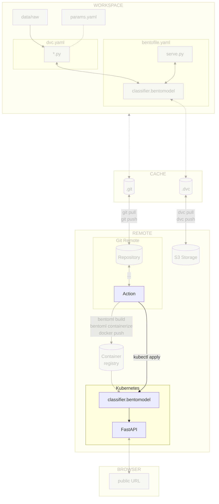

# Chapter 16 - Continuous deployment of the model with the CI/CD pipeline

## Introduction

In this chapter, you will deploy the model to the Kubernetes cluster with the
help of the CI/CD pipeline. You will use [Kubernetes](../tools.md) to deploy the
model to the cluster and the pipeline to trigger the deployment.

The steps will be similar to the last chapter, but we will use the pipeline to
automate the process.

In this chapter, you will learn how to:

1. Grant access to the Kubernetes cluster on the cloud provider for the CI/CD
   pipeline
2. Store the cloud provider credentials in the CI/CD configuration
3. Create the CI/CD pipeline for deploying the model to the Kubernetes cluster
4. Push the CI/CD pipeline configuration file to [:simple-git: Git](../tools.md)
5. Visualize the execution of the CI/CD pipeline

The following diagram illustrates the control flow of the experiment at the end
of this chapter:



## Steps

### Set up access to the Kubernetes cluster of the cloud provider

The Kubernetes cluster will need to be accessed inside the CI/CD pipeline to
deploy the Docker image.

This is the same process you did for the container registry as described in
[Chapter 14 - Build and publish the model with BentoML and Docker in the CI/CD pipeline](../part-3-serve-and-deploy-the-model/chapter-14-build-and-publish-the-model-with-bentoml-and-docker-with-the-cicd-pipeline.md)
but this time for the Kubernetes cluster.

=== ":simple-googlecloud: Google Cloud"

    Update the Google Service Account and its associated Google Service Account Key
    to access Google Cloud from the CI/CD pipeline without your own credentials.

    ```sh title="Execute the following command(s) in a terminal"
    # Set the Kubernetes Cluster permissions for the Google Service Account
    gcloud projects add-iam-policy-binding $GCP_PROJECT_ID \
        --member="serviceAccount:google-service-account@${GCP_PROJECT_ID}.iam.gserviceaccount.com" \
        --role="roles/container.developer"
    ```

    !!! tip

        There is no need to update the value in the CI/CD pipeline configuration.

        All changes are made at the Google Cloud level and the key file is not changed.

=== ":material-cloud: Using another cloud provider? Read this!"

    This guide has been written with Google Cloud in mind. We are open to
    contributions to add support for other cloud providers such as
    [:simple-amazonwebservices: Amazon Web Services](https://aws.amazon.com),
    [:simple-exoscale: Exoscale](https://www.exoscale.com),
    [:material-microsoft-azure: Microsoft Azure](https://azure.microsoft.com) or
    [:simple-kubernetes: Self-hosted Kubernetes](https://kubernetes.io) but we might
    not officially support them.

    If you want to contribute, please open an issue or a pull request on the
    [GitHub repository](https://github.com/swiss-ai-center/a-guide-to-mlops). Your
    help is greatly appreciated!

### Add Kubernetes CI/CD secrets

Add the Kubernetes secrets to access the Kubernetes cluster from the CI/CD
pipeline. Depending on the CI/CD platform you are using, the process will be
different:

=== ":simple-googlecloud: Google Cloud"

    === ":simple-github: GitHub"

        Create the following new variables by going to the **Settings** section from the
        top header of your GitHub repository. Select **Secrets and variables > Actions**
        and select **New repository secret**:

        - `GCP_K8S_CLUSTER_NAME`: The name of the Kubernetes cluster (ex:
          `mlops-kubernetes`, from the variable `GCP_K8S_CLUSTER_NAME` in the previous
          chapters)
        - `GCP_K8S_CLUSTER_ZONE`: The zone of the Kubernetes cluster (ex:
          `europe-west6-a` for Zurich, Switzerland, from the variable
          `GCP_K8S_CLUSTER_ZONE` in the previous chapters)

        Save the variables by selecting **Add secret**.

    === ":simple-gitlab: GitLab"

        No additional secret variables are necessary for the GitLab CI/CD.

=== ":material-cloud: Using another cloud provider? Read this!"

    This guide has been written with Google Cloud in mind. We are open to
    contributions to add support for other cloud providers such as
    [:simple-amazonwebservices: Amazon Web Services](https://aws.amazon.com),
    [:simple-exoscale: Exoscale](https://www.exoscale.com),
    [:material-microsoft-azure: Microsoft Azure](https://azure.microsoft.com) or
    [:simple-kubernetes: Self-hosted Kubernetes](https://kubernetes.io) but we might
    not officially support them.

    If you want to contribute, please open an issue or a pull request on the
    [GitHub repository](https://github.com/swiss-ai-center/a-guide-to-mlops). Your
    help is greatly appreciated!

### Update the CI/CD pipeline configuration file

You will adjust the pipeline to deploy the model to the Kubernetes cluster. The
following steps will be performed:

1. Detect a new commit on the `main` branch
2. Authenticate to the cloud provider
3. Build the Docker image
4. Push the Docker image to the container registry
5. Deploy the model on the Kubernetes cluster

=== ":simple-github: GitHub"

    Update the `.github/workflows/mlops.yaml` file with the following content.

    Take some time to understand the deploy job and its steps:

    ```yaml title=".github/workflows/mlops.yaml" hl_lines="16 109-133"
    name: MLOps

    on:
      # Runs on pushes targeting main branch
      push:
        branches:
          - main

      # Runs on pull requests
      pull_request:

      # Allows you to run this workflow manually from the Actions tab
      workflow_dispatch:

    jobs:
      train-report-publish-and-deploy:
        permissions: write-all
        runs-on: ubuntu-latest
        steps:
          - name: Checkout repository
            uses: actions/checkout@v4
          - name: Setup Python
            uses: actions/setup-python@v5
            with:
              python-version: '3.11'
              cache: pip
          - name: Install dependencies
            run: pip install --requirement requirements-freeze.txt
          - name: Login to Google Cloud
            uses: google-github-actions/auth@v2
            with:
              credentials_json: '${{ secrets.GOOGLE_SERVICE_ACCOUNT_KEY }}'
          - name: Train model
            run: dvc repro --pull
          - name: Setup CML
            if: github.event_name == 'pull_request'
            uses: iterative/setup-cml@v2
            with:
              version: '0.20.0'
          - name: Create CML report
            if: github.event_name == 'pull_request'
            env:
              REPO_TOKEN: ${{ secrets.GITHUB_TOKEN }}
            run: |
              # Fetch all other Git branches
              git fetch --depth=1 origin main:main

              # Add title to the report
              echo "# Experiment Report (${{ github.sha }})" >> report.md

              # Compare parameters to main branch
              echo "## Params workflow vs. main" >> report.md
              dvc params diff main --md >> report.md

              # Compare metrics to main branch
              echo "## Metrics workflow vs. main" >> report.md
              dvc metrics diff main --md >> report.md

              # Compare plots (images) to main branch
              dvc plots diff main

              # Create plots
              echo "## Plots" >> report.md

              # Create training history plot
              echo "### Training History" >> report.md
              echo "#### main" >> report.md
              echo '' >> report.md
              echo "#### workspace" >> report.md
              echo '' >> report.md

              # Create predictions preview
              echo "### Predictions Preview" >> report.md
              echo "#### main" >> report.md
              echo '' >> report.md
              echo "#### workspace" >> report.md
              echo '' >> report.md

              # Create confusion matrix
              echo "### Confusion Matrix" >> report.md
              echo "#### main" >> report.md
              echo '' >> report.md
              echo "#### workspace" >> report.md
              echo '' >> report.md

              # Publish the CML report
              cml comment update --target=pr --publish report.md
          - name: Log in to the Container registry
            uses: docker/login-action@v3
            with:
              registry: ${{ secrets.GCP_CONTAINER_REGISTRY_HOST }}
              username: _json_key
              password: ${{ secrets.GOOGLE_SERVICE_ACCOUNT_KEY }}
          - name: Import the BentoML model
            if: github.ref == 'refs/heads/main'
            run: bentoml models import model/celestial_bodies_classifier_model.bentomodel
          - name: Build the BentoML model artifact
            if: github.ref == 'refs/heads/main'
            run: bentoml build src
          - name: Containerize and publish the BentoML model artifact Docker image
            if: github.ref == 'refs/heads/main'
            run: |
              # Containerize the Bento
              bentoml containerize celestial_bodies_classifier:latest \
                --image-tag ${{ secrets.GCP_CONTAINER_REGISTRY_HOST }}/celestial-bodies-classifier:latest \
                --image-tag ${{ secrets.GCP_CONTAINER_REGISTRY_HOST }}/celestial-bodies-classifier:${{ github.sha }}
              # Push the container to the Container Registry
              docker push --all-tags ${{ secrets.GCP_CONTAINER_REGISTRY_HOST }}/celestial-bodies-classifier
          - name: Get Google Cloud's Kubernetes credentials
            if: github.ref == 'refs/heads/main'
            uses: google-github-actions/get-gke-credentials@v2
            with:
              cluster_name: ${{ secrets.GCP_K8S_CLUSTER_NAME }}
              location: ${{ secrets.GCP_K8S_CLUSTER_ZONE }}
          - name: Update the Kubernetes deployment
            if: github.ref == 'refs/heads/main'
            run: |
              yq -i '.spec.template.spec.containers[0].image = "${{ secrets.GCP_CONTAINER_REGISTRY_HOST }}/celestial-bodies-classifier:${{ github.sha }}"' kubernetes/deployment.yaml
          - name: Deploy the model on Kubernetes
            if: github.ref == 'refs/heads/main'
            run: |
              kubectl apply \
                -f kubernetes/deployment.yaml \
                -f kubernetes/service.yaml
    ```

    Check the differences with Git to validate the changes.

    ```sh title="Execute the following command(s) in a terminal"
    # Show the differences with Git
    git diff .github/workflows/mlops.yaml
    ```

    The output should be similar to this:

    ```diff
    diff --git a/.github/workflows/mlops.yaml b/.github/workflows/mlops.yaml
    index 1fa989b..6d479ef 100644
    --- a/.github/workflows/mlops.yaml
    +++ b/.github/workflows/mlops.yaml
    @@ -13,7 +13,7 @@ on:
       workflow_dispatch:

     jobs:
    -  train-report-and-publish:
    +  train-report-publish-and-deploy:
         permissions: write-all
         runs-on: ubuntu-latest
         steps:
    @@ -106,3 +106,43 @@ jobs:

               # Push the container to the Container Registry
               docker push --all-tags ${{ secrets.GCP_CONTAINER_REGISTRY_HOST }}/celestial-bodies-classifier
    +      - name: Get Google Cloud's Kubernetes credentials
    +        if: github.ref == 'refs/heads/main'
    +        uses: google-github-actions/get-gke-credentials@v2
    +        with:
    +          cluster_name: ${{ secrets.GCP_K8S_CLUSTER_NAME }}
    +          location: ${{ secrets.GCP_K8S_CLUSTER_ZONE }}
    +      - name: Update the Kubernetes deployment
    +        if: github.ref == 'refs/heads/main'
    +        run: |
    +          yq -i '.spec.template.spec.containers[0].image = "${{ secrets.GCP_CONTAINER_REGISTRY_HOST }}/celestial-bodies-classifier:${{ github.sha }}"' kubernetes/deployment.yaml
    +      - name: Deploy the model on Kubernetes
    +        if: github.ref == 'refs/heads/main'
    +        run: |
    +          kubectl apply \
    +            -f kubernetes/deployment.yaml \
    +            -f kubernetes/service.yaml
    ```

=== ":simple-gitlab: GitLab"

    !!! warning

        You must have [:simple-helm: Helm](https://helm.sh/) installed on your local
        machine to execute the following steps.

    In order to execute commands on the Kubernetes cluster, an agent must be set up
    on the cluster.

    **Create the agent configuration file**

    Create a new empty file named `.gitlab/agents/k8s-agent/config.yaml` at the root
    of the repository.

    This file is empty and only serves to enable Kubernetes integration with GitLab.

    Commit the changes to Git.

    ```sh title="Execute the following command(s) in a terminal"
    # Add the file
    git add .gitlab/agents/k8s-agent/config.yaml

    # Commit the changes
    git commit -m "Enable Kubernetes integration with GitLab"

    # Push the changes
    git push
    ```

    **Register the agent with GitLab**

    On GitLab, in the left sidebar, go to **Operate > Kubernetes clusters**. Click
    on **Connect a cluster**. Select the **k8s-agent** configuration file in the
    list. Click **Register**. A modal opens.

    In the modal, a command to register the GitLab Kubernetes agent is displayed.

    The command should look like this:

    ```sh
    helm repo add gitlab https://charts.gitlab.io
    helm repo update
    helm upgrade --install XXX gitlab/gitlab-agent \
        --namespace XXX \
        --create-namespace \
        --set image.tag=XXX \
        --set config.token=XXX \
        --set config.kasAddress=XXX
    ```

    This command must be executed to install the agent on the Google Cloud
    Kubernetes cluster.

    **Install the agent on the Kubernetes cluster**

    Copy and paste the command GitLab displays in your terminal. This should install
    the GitLab agent on the Kubernetes cluster.

    The output should look like this:

    ```text
    "gitlab" has been added to your repositories
    Hang tight while we grab the latest from your chart repositories...
    ...Successfully got an update from the "gitlab" chart repository
    Update Complete. ⎈Happy Helming!⎈
    Release "k8s-agent" does not exist. Installing it now.
    NAME: k8s-agent
    LAST DEPLOYED: Tue Aug 15 13:59:01 2023
    NAMESPACE: gitlab-agent-k8s-agent
    STATUS: deployed
    REVISION: 1
    TEST SUITE: None
    NOTES:
    Thank you for installing gitlab-agent.

    Your release is named k8s-agent.
    ```

    Once the command was executed on the Kubernetes cluster, you can close the
    model.

    Refresh the page and you should see the agent has successfully connected to
    GitLab.

    **Update the CI/CD pipeline configuration file**

    Update the `.gitlab-ci.yml` file to add a new stage to deploy the model on the
    Kubernetes cluster.

    Take some time to understand the publish and deploy job and its steps.

    ```yaml title=".gitlab-ci.yml" hl_lines="4-5 101-169"
    stages:
      - train
      - report
      - publish
      - deploy

    variables:
      # Change pip's cache directory to be inside the project directory since we can
      # only cache local items.
      PIP_CACHE_DIR: "$CI_PROJECT_DIR/.cache/pip"
      # https://dvc.org/doc/user-guide/troubleshooting?tab=GitLab-CI-CD#git-shallow
      GIT_DEPTH: "0"
      # Set the path to Google Service Account key for DVC - https://dvc.org/doc/command-reference/remote/add#google-cloud-storage
      GOOGLE_APPLICATION_CREDENTIALS: "${CI_PROJECT_DIR}/google-service-account-key.json"
      # Environment variable for CML
      REPO_TOKEN: $GITLAB_PAT

    train:
      stage: train
      image: python:3.11
      rules:
        - if: $CI_COMMIT_BRANCH == "main"
        - if: $CI_PIPELINE_SOURCE == "merge_request_event"
      before_script:
        # Set the Google Service Account key
        - echo "${GOOGLE_SERVICE_ACCOUNT_KEY}" | base64 -d > $GOOGLE_APPLICATION_CREDENTIALS
        # Create the virtual environment for caching
        - python3.11 -m venv .venv
        - source .venv/bin/activate
      script:
        # Install dependencies
        - pip install --requirement requirements-freeze.txt
        # Run the experiment
        - dvc repro --pull
      cache:
        paths:
          # Pip's cache doesn't store the Python packages
          # https://pip.pypa.io/en/stable/reference/pip_install/#caching
          - .cache/pip
          - .venv/

    report:
      stage: report
      image: iterativeai/cml:0-dvc3-base1
      needs:
        - train
      rules:
        - if: $CI_PIPELINE_SOURCE == "merge_request_event"
      before_script:
        # Set the Google Service Account key
        - echo "${GOOGLE_SERVICE_ACCOUNT_KEY}" | base64 -d > $GOOGLE_APPLICATION_CREDENTIALS
      script:
        - |
          # Fetch the experiment changes
          dvc pull

          # Fetch all other Git branches
          git fetch --depth=1 origin main:main

          # Add title to the report
          echo "# Experiment Report (${CI_COMMIT_SHA})" >> report.md

          # Compare parameters to main branch
          echo "## Params workflow vs. main" >> report.md
          dvc params diff main --md >> report.md

          # Compare metrics to main branch
          echo "## Metrics workflow vs. main" >> report.md
          dvc metrics diff main --md >> report.md

          # Compare plots (images) to main branch
          dvc plots diff main

          # Create plots
          echo "## Plots" >> report.md

          # Create training history plot
          echo "### Training History" >> report.md
          echo "#### main" >> report.md
          echo '' >> report.md
          echo "#### workspace" >> report.md
          echo '' >> report.md

          # Create predictions preview
          echo "### Predictions Preview" >> report.md
          echo "#### main" >> report.md
          echo '' >> report.md
          echo "#### workspace" >> report.md
          echo '' >> report.md

          # Create confusion matrix
          echo "### Confusion Matrix" >> report.md
          echo "#### main" >> report.md
          echo '' >> report.md
          echo "#### workspace" >> report.md
          echo '' >> report.md

          # Publish the CML report
          cml comment update --target=pr --publish report.md

    publish:
      stage: publish
      image: python:3.11
      needs:
        - train
      rules:
        - if: $CI_COMMIT_BRANCH == "main"
      services:
        - docker:25.0.3-dind
      variables:
        DOCKER_HOST: "tcp://docker:2375"
      before_script:
        # Install Docker
        - apt-get update
        - apt-get install --yes ca-certificates curl
        - install -m 0755 -d /etc/apt/keyrings
        - curl -fsSL https://download.docker.com/linux/debian/gpg -o /etc/apt/keyrings/docker.asc
        - chmod a+r /etc/apt/keyrings/docker.asc
        - echo "deb [arch=$(dpkg --print-architecture) signed-by=/etc/apt/keyrings/docker.asc] https://download.docker.com/linux/debian $(. /etc/os-release && echo "$VERSION_CODENAME") stable" | tee /etc/apt/sources.list.d/docker.list > /dev/null
        - apt-get update
        - apt-get install --yes docker-ce docker-ce-cli containerd.io docker-buildx-plugin docker-compose-plugin
        # Set the Google Service Account key
        - echo "${GOOGLE_SERVICE_ACCOUNT_KEY}" | base64 -d > $GOOGLE_APPLICATION_CREDENTIALS
        # Login to the Google Container Registry
        - cat "${GOOGLE_APPLICATION_CREDENTIALS}" | docker login -u _json_key --password-stdin "${GCP_CONTAINER_REGISTRY_HOST}"
        # Create the virtual environment for caching
        - python3.11 -m venv .venv
        - source .venv/bin/activate
      script:
        # Install dependencies
        - pip install --requirement requirements-freeze.txt
        # Pull the BentoML model artifact
        - dvc pull model/celestial_bodies_classifier_model.bentomodel
        # Import the BentoML model
        - bentoml models import model/celestial_bodies_classifier_model.bentomodel
        # Build the BentoML model artifact
        - bentoml build src
        # Containerize and publish the BentoML model artifact Docker image
        - |
          bentoml containerize celestial_bodies_classifier:latest \
            --image-tag $GCP_CONTAINER_REGISTRY_HOST/celestial-bodies-classifier:latest \
            --image-tag $GCP_CONTAINER_REGISTRY_HOST/celestial-bodies-classifier:${CI_COMMIT_SHA}
        # Push the container to the Container Registry
        - docker push --all-tags $GCP_CONTAINER_REGISTRY_HOST/celestial-bodies-classifier
      cache:
        paths:
          # Pip's cache doesn't store the Python packages
          # https://pip.pypa.io/en/stable/reference/pip_install/#caching
          - .cache/pip
          - .venv/

    deploy:
      stage: deploy
      image: alpine
      needs:
        - publish
      rules:
        - if: $CI_COMMIT_BRANCH == "main"
      before_script:
        # Install kubectl and yq
        - apk add --no-cache kubectl yq
        # Switch to the right Kubernetes context
        - kubectl config use-context ${CI_PROJECT_PATH}:k8s-agent
        - kubectl get nodes
      script:
        # Update the Kubernetes deployment
        - yq -i '.spec.template.spec.containers[0].image = "${GCP_CONTAINER_REGISTRY_HOST}/celestial-bodies-classifier:${CI_COMMIT_SHA}"' kubernetes/deployment.yaml
        # Deploy the model on Kubernetes
        - kubectl apply -f kubernetes/deployment.yaml -f kubernetes/service.yaml
    ```

    Check the differences with Git to validate the changes.

    ```sh title="Execute the following command(s) in a terminal"
    # Show the differences with Git
    git diff .gitlab-ci.yml
    ```

    The output should be similar to this:

    ```diff
    diff --git a/.gitlab-ci.yml b/.gitlab-ci.yml
    index dbf3b25..7dcdfe7 100644
    --- a/.gitlab-ci.yml
    +++ b/.gitlab-ci.yml
    @@ -1,6 +1,8 @@
     stages:
       - train
       - report
       - publish
    +  - deploy

     variables:
       # Change pip's cache directory to be inside the project directory since we can
    @@ -95,3 +97,73 @@ report:

           - .cache/pip
           - .venv/
    +
    +deploy:
    +  stage: deploy
    +  image: alpine
    +  needs:
    +    - publish
    +  rules:
    +    - if: $CI_COMMIT_BRANCH == "main"
    +  before_script:
    +    # Install kubectl and yq
    +    - apk add --no-cache kubectl yq
    +    # Switch to the right Kubernetes context
    +    - kubectl config use-context ${CI_PROJECT_PATH}:k8s-agent
    +    - kubectl get nodes
    +  script:
    +    # Update the Kubernetes deployment
    +    - yq -i '.spec.template.spec.containers[0].image = "${GCP_CONTAINER_REGISTRY_HOST}/celestial-bodies-classifier:${CI_COMMIT_SHA}"' kubernetes/deployment.yaml
    +    # Deploy the model on Kubernetes
    +    - kubectl apply -f kubernetes/deployment.yaml -f kubernetes/service.yaml
    ```

### Check the changes

Check the changes with Git to ensure that all the necessary files are tracked.

```sh title="Execute the following command(s) in a terminal"
# Add all the files
git add .

# Check the changes
git status
```

The output should look like this.

=== ":simple-github: GitHub"

    ```text
    On branch main
    Your branch is up to date with 'origin/main'.

    Changes to be committed:
    (use "git restore --staged <file>..." to unstage)
        modified:   .github/workflows/mlops.yaml
    ```

=== ":simple-gitlab: GitLab"

    ```text
    On branch main
    Your branch is up to date with 'origin/main'.

    Changes to be committed:
    (use "git restore --staged <file>..." to unstage)
        modified:   .gitlab-ci.yml
    ```

### Commit the changes to Git

Push the CI/CD pipeline configuration file to Git.

```sh title="Execute the following command(s) in a terminal"
# Commit the changes
git commit -m "A pipeline will deploy the model on the Kubernetes cluster"

# Push the changes
git push
```

### Check the results

With the new configuration in place, each and every commit that makes its way to
the main branch will serve as a trigger for the pipeline, which will
automatically set in motion the deployment of the model, ensuring that the
latest version is consistently available on the Kubernetes server for use.

=== ":simple-github: GitHub"

    In the **Actions** tab, click on the **MLOps** workflow.

=== ":simple-gitlab: GitLab"

    You can see the pipeline running on the **CI/CD > Pipelines** page. Check the
    `MLOps` pipeline.

The output should look like this:

```text
Run kubectl apply \
deployment.apps/celestial-bodies-classifier-deployment configured
service/celestial-bodies-classifier-service configured
```

If you execute the pipeline a second time, you should see the following output:

```text
Run kubectl apply \
deployment.apps/celestial-bodies-classifier-deployment configured
service/celestial-bodies-classifier-service unchanged
```

As you can see, the deployment was successful and the service was unchanged.

### Access the model

You can access the new model at the same URL as before. The model should be
updated with the latest version.

!!! tip

    To get the external IP of the service, you can use the Google Cloud CLI.

    ```sh title="Execute the following command(s) in a terminal"
    # Get the description of the service
    kubectl describe services celestial-bodies-classifier
    ```

## Summary

Congratulations! You have successfully deployed the model on the Kubernetes
cluster automatically with the CI/CD pipeline!

New versions of the model will be deployed automatically as soon as they are
pushed to the main branch.

## State of the MLOps process

- [x] Notebook has been transformed into scripts for production
- [x] Codebase and dataset are versioned
- [x] Steps used to create the model are documented and can be re-executed
- [x] Changes done to a model can be visualized with parameters, metrics and
      plots to identify differences between iterations
- [x] Codebase can be shared and improved by multiple developers
- [x] Dataset can be shared among the developers and is placed in the right
      directory in order to run the experiment
- [x] Experiment can be executed on a clean machine with the help of a CI/CD
      pipeline
- [x] CI/CD pipeline is triggered on pull requests and reports the results of
      the experiment
- [x] Changes to model can be thoroughly reviewed and discussed before
      integrating them into the codebase
- [x] Model can be saved and loaded with all required artifacts for future usage
- [x] Model can be easily used outside of the experiment context
- [x] Model publication to the artifact registry is automated
- [x] Model can be accessed from a Kubernetes cluster
- [x] Model is continuously deployed with the CI/CD
- [ ] Model can be trained on a custom infrastructure with custom hardware for
      specific use-cases

You can now safely continue to the next chapter of this guide concluding your
journey and the next things you could do with your model.

## Sources

Highly inspired by:

- [_Installing the agent for Kubernetes_ - gitlab.com](https://docs.gitlab.com/ee/user/clusters/agent/install/)
