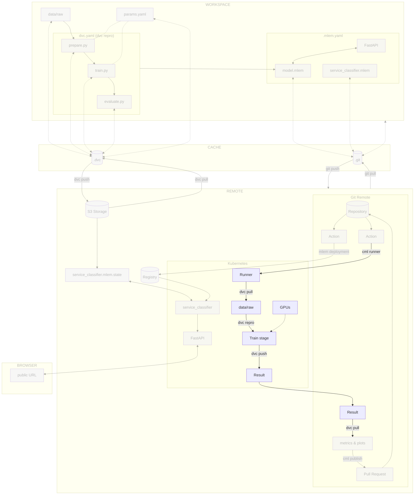

# Chapter 17 - Train the model on a Kubernetes pod

!!! warning "This is a work in progress"

    This chapter is a work in progress. Please check back later for updates. Thank
    you!

## Introduction

Some experiments can require specific hardware to run. For example, you may need
a GPU to train a deep learning model.

Training these experiments locally can be challenging. You may not have the
required hardware, or you may not want to use your local machine for training.
In this case, you can use a specialized Kubernetes pod to train your model.

In this chapter, you will learn how to train the model on a Kubernetes pod with
[CML](../tools.md).

In this chapter, you will learn how to:

1. Configure CML to start a runner on Kubernetes
2. Start the training of the model from your CI/CD pipeline on the Kubernetes
   cluster

The following diagram illustrates the control flow of the experiment at the end
of this chapter:




## Steps

### Display the nodes names and labels

Display the nodes with the following command.

```sh title="Execute the following command(s) in a terminal"
# Display the nodes
kubectl get nodes --show-labels
```

The output should be similar to this: As noticed, you have two nodes in your
cluster with their labels.

```
NAME                                              STATUS   ROLES    AGE   VERSION            LABELS
gke-mlops-kubernetes-default-pool-d4f966ea-8rbn   Ready    <none>   49s   v1.24.9-gke.3200   beta.kubernetes.io/arch=amd64,[...]
gke-mlops-kubernetes-default-pool-d4f966ea-p7qm   Ready    <none>   50s   v1.24.9-gke.3200   beta.kubernetes.io/arch=amd64,[...]
```

Export the name of the two nodes as environment variables. Replace the
`<my_node_1_name>` and `<my_node_2_name>` placeholders with the names of your
nodes (`gke-mlops-kubernetes-default-pool-d4f966ea-8rbn` and
`gke-mlops-kubernetes-default-pool-d4f966ea-p7qm` in this example).

```sh title="Execute the following command(s) in a terminal"
export K8S_NODE_1_NAME=<my_node_1_name>
```

```sh title="Execute the following command(s) in a terminal"
export K8S_NODE_2_NAME=<my_node_2_name>
```

### Labelize the nodes

Let's imagine one node has a GPU and the other one doesn't. You can labelize the
nodes to be able to use the GPU node for the training of the model. For our
experiment, there is no need to have a GPU to train the model but it's for
demonstration purposes.

```sh title="Execute the following command(s) in a terminal"
# Labelize the nodes
kubectl label nodes $K8S_NODE_1_NAME gpu=true
kubectl label nodes $K8S_NODE_2_NAME gpu=false
```

You can check the labels with the `kubectl get nodes --show-labels` command. You
should see the node with the `gpu=true`/ `gpu=false` labels.

### Set up access to the Kubernetes Cluster of the cloud provider

CML will need to access the Kubernetes Cluster inside the CI/CD pipeline to
create the runner.

This is the same process as in
[Chapter 8 - Reproduce the ML experiment in a CI/CD pipeline](../part-2-move-the-model-to-the-cloud/chapter-8-reproduce-the-ml-experiment-in-a-cicd-pipeline.md).

=== ":simple-googlecloud: Google Cloud"

    Create a new Google Service Account and its associated Google Service Account
    Key to access Google Cloud without your own credentials.

    As a reminder, the key will be stored in your **`~/.config/gcloud`** directory
    under the name `cml-google-service-account-key.json`.

    !!! danger

        You must **never** add and commit this file to your working directory. It is a
        sensitive data that you must keep safe.

    ```sh title="Execute the following command(s) in a terminal"
    # Create the Google Service Account
    gcloud iam service-accounts create cml-service-account \
        --display-name="CML Service Account"

    # Set the Kubernetes Cluster permissions for the Google Service Account
    gcloud projects add-iam-policy-binding $GCP_PROJECT_ID \
        --member="serviceAccount:cml-service-account@${GCP_PROJECT_ID}.iam.gserviceaccount.com" \
        --role="roles/container.admin"

    # Create the Google Service Account Key
    gcloud iam service-accounts keys create ~/.config/gcloud/cml-google-service-account-key.json \
        --iam-account=cml-service-account@${GCP_PROJECT_ID}.iam.gserviceaccount.com
    ```

=== ":material-cloud: Using another cloud provider? Read this!"

    This guide has been written with Google Cloud in mind. We are open to
    contributions to add support for other cloud providers such as
    [:simple-amazonwebservices: Amazon Web Services](https://aws.amazon.com),
    [:simple-exoscale: Exoscale](https://www.exoscale.com),
    [:material-microsoft-azure: Microsoft Azure](https://azure.microsoft.com) or
    [:simple-kubernetes: Self-hosted Kubernetes](https://kubernetes.io) but we might
    not officially support them.

    If you want to contribute, please open an issue or a pull request on the
    [GitHub repository](https://github.com/swiss-ai-center/a-guide-to-mlops). Your
    help is greatly appreciated!

### Store the cloud provider credentials in the CI/CD configuration

Now that the credentials are created, you need to store them in the CI/CD
configuration.

Depending on the CI/CD platform you are using, the process will be different.

=== ":simple-googlecloud: Google Cloud"

    **Display the Google Service Account key**

    The service account key is stored on your computer as a JSON file. You need to
    display it and store it as a CI/CD variable in a text format.

    === ":simple-github: GitHub"

        Display the Google Service Account key that you have downloaded from Google
        Cloud.

        ```sh title="Execute the following command(s) in a terminal"
        # Display the Google Service Account key
        cat ~/.config/gcloud/cml-google-service-account-key.json
        ```

    === ":simple-gitlab: GitLab"

        Encode and display the Google Service Account key that you have downloaded from
        Google Cloud as `base64`. It allows to hide the secret in GitLab CI logs as a
        security measure.

        !!! tip

            If on Linux, you can use the command
            `base64 -w 0 -i ~/.config/gcloud/cml-google-service-account-key.json`.

        ```sh title="Execute the following command(s) in a terminal"
        # Encode the Google Service Account key to base64
        base64 -i ~/.config/gcloud/cml-google-service-account-key.json
        ```

    **Store the Google Service Account key as a CI/CD variable**

    === ":simple-github: GitHub"

        Store the output as a CI/CD variable by going to the **Settings** section from
        the top header of your GitHub repository.

        Select **Secrets and variables > Actions** and select **New repository secret**.

        Create a new variable named `CML_GCP_SERVICE_ACCOUNT_KEY` with the output value
        of the Google Service Account key file as its value. Save the variable by
        selecting **Add secret**.

    === ":simple-gitlab: GitLab"

        Store the output as a CI/CD Variable by going to **Settings > CI/CD** from the
        left sidebar of your GitLab project.

        Select **Variables** and select **Add variable**.

        Create a new variable named `CML_GCP_SERVICE_ACCOUNT_KEY` with the Google
        Service Account key file encoded in `base64` as its value.

        - **Protect variable**: _Unchecked_
        - **Mask variable**: _Checked_
        - **Expand variable reference**: _Unchecked_

        Save the variable by clicking **Add variable**.

=== ":material-cloud: Using another cloud provider? Read this!"

    This guide has been written with Google Cloud in mind. We are open to
    contributions to add support for other cloud providers such as
    [:simple-amazonwebservices: Amazon Web Services](https://aws.amazon.com),
    [:simple-exoscale: Exoscale](https://www.exoscale.com),
    [:material-microsoft-azure: Microsoft Azure](https://azure.microsoft.com) or
    [:simple-kubernetes: Self-hosted Kubernetes](https://kubernetes.io) but we might
    not officially support them.

    If you want to contribute, please open an issue or a pull request on the
    [GitHub repository](https://github.com/swiss-ai-center/a-guide-to-mlops). Your
    help is greatly appreciated!

### Update the CI/CD configuration file

You'll now update the CI/CD configuration file to start a runner on the
Kubernetes cluster with the help of CML. Using the labels defined previously,
you'll be able to start the training of the model on the node with the GPU.

=== ":simple-github: GitHub"

    In order to allow CML to create a self-hosted runner, a Personal Access Token
    (PAT) must be created.

    Follow the
    [_Personal Access Token_ - cml.dev](https://cml.dev/doc/self-hosted-runners?tab=GitHub#personal-access-token)
    guide to create a personal access token named `CML_PAT` with the `repo` scope.

    Store the Personal Access Token as a CI/CD variable by going to the **Settings**
    section from the top header of your GitHub repository.

    Select **Secrets and variables > Actions** and select **New repository secret**.

    Create a new variable named `CML_PAT` with the value of the Personal Access
    Token as its value. Save the variable by selecting **Add secret**.

    Update the `.github/workflows/mlops.yaml` file. Replace `<my_cluster_name>` with
    your own name (ex: `mlops-kubernetes`). Replace `<my_cluster_zone>` with your
    own zone (ex: `europe-west6-a` for Zurich, Switzerland).

    ```yaml title=".github/workflows/mlops.yaml" hl_lines="15-18 21-51 54-56"
    name: MLOps

    on:
      # Runs on pushes targeting main branch
      push:
        branches:
          - main

      # Runs on pull requests
      pull_request:

      # Allows you to run this workflow manually from the Actions tab
      workflow_dispatch:

    # Allow the creation and usage of self-hosted runners
    permissions:
      contents: read
      id-token: write

    jobs:
      setup-runner:
        runs-on: ubuntu-latest
        steps:
          - name: Checkout repository
            uses: actions/checkout@v3
          - name: Login to Google Cloud
            uses: 'google-github-actions/auth@v1'
            with:
              credentials_json: '${{ secrets.CML_GCP_SERVICE_ACCOUNT_KEY }}'
          - name: Get Google Cloud's Kubernetes credentials
            uses: 'google-github-actions/get-gke-credentials@v1'
            with:
              cluster_name: '<my_cluster_name>'
              location: '<my_cluster_zone>'
          - uses: iterative/setup-cml@v1
            with:
              version: '0.19.1'
          - name: Initialize runner on Kubernetes
            env:
              REPO_TOKEN: ${{ secrets.CML_PAT }}
            run: |
              export KUBERNETES_CONFIGURATION=$(cat $KUBECONFIG)
              # https://cml.dev/doc/ref/runner
              # https://registry.terraform.io/providers/iterative/iterative/latest/docs/resources/task#machine-type
              # https://registry.terraform.io/providers/iterative/iterative/latest/docs/resources/task#{cpu}-{memory}
              cml runner \
                --labels="cml-runner" \
                --cloud="kubernetes" \
                --cloud-type="1-2000" \
                --cloud-kubernetes-node-selector="gpu=true" \
                --single

      train-and-report:
        permissions: write-all
        needs: setup-runner
        runs-on: [self-hosted, cml-runner]
        steps:
          - name: Checkout repository
            uses: actions/checkout@v3
          - name: Setup Python
            uses: actions/setup-python@v4
            with:
              python-version: '3.11'
              cache: pip
          - name: Install dependencies
            run: pip install --requirement requirements-freeze.txt
          - name: Login to Google Cloud
            uses: 'google-github-actions/auth@v1'
            with:
              credentials_json: '${{ secrets.GOOGLE_SERVICE_ACCOUNT_KEY }}'
          - name: Train model
            run: dvc repro --pull
            # Node is required to run CML
          - name: Setup Node
            if: github.event_name == 'pull_request'
            uses: actions/setup-node@v3
            with:
              node-version: '16'
          - name: Setup CML
            if: github.event_name == 'pull_request'
            uses: iterative/setup-cml@v1
            with:
              version: '0.19.1'
          - name: Create CML report
            if: github.event_name == 'pull_request'
            env:
              REPO_TOKEN: ${{ secrets.GITHUB_TOKEN }}
            run: |
              # Fetch all other Git branches
              git fetch --depth=1 origin main:main

              # Add title to the report
              echo "# Experiment Report (${{ github.sha }})" >> report.md

              # Compare parameters to main branch
              echo "## Params workflow vs. main" >> report.md
              dvc params diff main --md >> report.md

              # Compare metrics to main branch
              echo "## Metrics workflow vs. main" >> report.md
              dvc metrics diff main --md >> report.md

              # Compare plots (images) to main branch
              dvc plots diff main

              # Create plots
              echo "## Plots" >> report.md

              # Create training history plot
              echo "### Training History" >> report.md
              echo "#### main" >> report.md
              echo '' >> report.md
              echo "#### workspace" >> report.md
              echo '' >> report.md

              # Create predictions preview
              echo "### Predictions Preview" >> report.md
              echo "#### main" >> report.md
              echo '' >> report.md
              echo "#### workspace" >> report.md
              echo '' >> report.md

              # Create confusion matrix
              echo "### Confusion Matrix" >> report.md
              echo "#### main" >> report.md
              echo '' >> report.md
              echo "#### workspace" >> report.md
              echo '' >> report.md

              # Publish the CML report
              cml comment update --target=pr --publish report.md

      deploy:
        # Runs on main branch only
        if: github.ref == 'refs/heads/main'
        needs: train-and-report
        name: Call Deploy
        uses: ./.github/workflows/mlops-deploy.yml
        secrets: inherit
    ```

    Check the differences with Git to validate the changes.

    ```sh title="Execute the following command(s) in a terminal"
    # Show the differences with Git
    git diff .github/workflows/mlops.yaml
    ```

    The output should be similar to this:

    ```diff
    diff --git a/.github/workflows/mlops.yaml b/.github/workflows/mlops.yaml
    index 30bbce8..5d4a6dd 100644
    --- a/.github/workflows/mlops.yaml
    +++ b/.github/workflows/mlops.yaml
    @@ -12,10 +12,48 @@ on:
       # Allows you to run this workflow manually from the Actions tab
       workflow_dispatch:

    +# Allow the creation and usage of self-hosted runners
    +permissions:
    +  contents: read
    +  id-token: write
    +
     jobs:
    +  setup-runner:
    +    runs-on: ubuntu-latest
    +    steps:
    +      - name: Checkout repository
    +        uses: actions/checkout@v3
    +      - name: Login to Google Cloud
    +        uses: 'google-github-actions/auth@v1'
    +        with:
    +          credentials_json: '${{ secrets.CML_GCP_SERVICE_ACCOUNT_KEY }}'
    +      - name: Get Google Cloud's Kubernetes credentials
    +        uses: 'google-github-actions/get-gke-credentials@v1'
    +        with:
    +          cluster_name: '<my_cluster_name>'
    +          location: '<my_cluster_zone>'
    +      - uses: iterative/setup-cml@v1
    +        with:
    +          version: '0.19.1'
    +      - name: Initialize runner on Kubernetes
    +        env:
    +          REPO_TOKEN: ${{ secrets.CML_PAT }}
    +        run: |
    +          export KUBERNETES_CONFIGURATION=$(cat $KUBECONFIG)
    +          # https://cml.dev/doc/ref/runner
    +          # https://registry.terraform.io/providers/iterative/iterative/latest/docs/resources/task#machine-type
    +          # https://registry.terraform.io/providers/iterative/iterative/latest/docs/resources/task#{cpu}-{memory}
    +          cml runner \
    +            --labels="cml-runner" \
    +            --cloud="kubernetes" \
    +            --cloud-type="1-2000" \
    +            --cloud-kubernetes-node-selector="gpu=true" \
    +            --single
    +
       train-and-report:
         permissions: write-all
    -    runs-on: ubuntu-latest
    +    needs: setup-runner
    +    runs-on: [self-hosted, cml-runner]
         steps:
           - name: Checkout repository
             uses: actions/checkout@v3
    ```

    Take some time to understand the changes made to the file.

=== ":simple-gitlab: GitLab"

    TODO: This is not complete, only github is supported for now.

    Update the `.gitlab-ci.yml` file.

    ```yaml title=".gitlab-ci.yml" hl_lines="2 22-43 48-52"
    stages:
      - setup runner
      - train
      - report

    variables:
      # Change pip's cache directory to be inside the project directory since we can
      # only cache local items.
      PIP_CACHE_DIR: "$CI_PROJECT_DIR/.cache/pip"
      # https://dvc.org/doc/user-guide/troubleshooting?tab=GitLab-CI-CD#git-shallow
      GIT_DEPTH: "0"
      # https://python-poetry.org/docs/#ci-recommendations
      POETRY_HOME: "$CI_PROJECT_DIR/.cache/poetry"

    # Pip's cache doesn't store the Python packages
    # https://pip.pypa.io/en/stable/reference/pip_install/#caching
    cache:
      paths:
        - .cache/pip
        - .cache/poetry

    setup-runner:
      stage: setup runner
      image: iterativeai/cml:0-dvc2-base1
      before_script:
        # Install Kubernetes
        - export KUBERNETES_VERSION=$(curl -L -s https://dl.k8s.io/release/stable.txt)
        - curl -LO -s "https://dl.k8s.io/release/${KUBERNETES_VERSION}/bin/linux/amd64/kubectl"
        - curl -LO -s "https://dl.k8s.io/${KUBERNETES_VERSION}/bin/linux/amd64/kubectl.sha256"
        - echo "$(cat kubectl.sha256) kubectl" | sha256sum --check
        - sudo install -o root -g root -m 0755 kubectl /usr/local/bin/kubectl
        # https://cml.dev/doc/self-hosted-runners?tab=Kubernetes#cloud-compute-resource-credentials
        - export KUBERNETES_CONFIGURATION=$(cat $GCP_KUBECONFIG)
      script:
        # https://cml.dev/doc/ref/runner
        # https://registry.terraform.io/providers/iterative/iterative/latest/docs/resources/task#machine-type
        # https://registry.terraform.io/providers/iterative/iterative/latest/docs/resources/task#{cpu}-{memory}
        - cml runner
            --labels="cml-runner"
            --cloud="kubernetes"
            --cloud-type="1-2000"
            --cloud-kubernetes-node-selector="gpu=true"
            --single

    train:
      stage: train
      image: iterativeai/cml:0-dvc2-base1
      needs:
        - setup-runner
      tags:
        # Uses the runner set up by CML
        - cml-runner
      rules:
        - if: $CI_COMMIT_BRANCH == "main"
        - if: $CI_PIPELINE_SOURCE == "merge_request_event"
      variables:
        # Set the path to Google Service Account key for DVC - https://dvc.org/doc/command-reference/remote/    add#google-cloud-storage
        GOOGLE_APPLICATION_CREDENTIALS: "${CI_PROJECT_DIR}/google-service-account-key.json"
      before_script:
        # Set the Google Service Account key
        - echo "${GCP_SERVICE_ACCOUNT_KEY}" | base64 -d > $GOOGLE_APPLICATION_CREDENTIALS
        # Install Poetry
        - pip install poetry==1.4.0
        # Install dependencies
        - poetry install
        - source `poetry env info --path`/bin/activate
      script:
        # Pull data from DVC
        - dvc pull
        # Run the experiment
        - dvc repro --force
      artifacts:
        expire_in: 1 week
        paths:
          - "evaluation"

    report:
      stage: report
      image: iterativeai/cml:0-dvc2-base1
      needs:
        - job: train
          artifacts: true
      rules:
        - if: $CI_PIPELINE_SOURCE == "merge_request_event"
      variables:
        REPO_TOKEN: $CML_PAT
      script:
        - |
          # Compare parameters to main branch
          echo "# Params workflow vs. main" >> report.md
          echo >> report.md
          dvc params diff main --show-md >> report.md
          echo >> report.md

          # Compare metrics to main branch
          echo "# Metrics workflow vs. main" >> report.md
          echo >> report.md
          dvc metrics diff main --show-md >> report.md
          echo >> report.md

          # Create plots
          echo "# Plots" >> report.md
          echo >> report.md

          echo "## Precision recall curve" >> report.md
          echo >> report.md
          dvc plots diff \
            --target evaluation/plots/prc.json \
            -x recall \
            -y precision \
            --show-vega main > vega.json
          vl2png vega.json > prc.png
          echo '' >> report.md
          echo >> report.md

          echo "## Roc curve" >> report.md
          echo >> report.md
          dvc plots diff \
            --target evaluation/plots/sklearn/roc.json \
            -x fpr \
            -y tpr \
            --show-vega main > vega.json
          vl2png vega.json > roc.png
          echo '' >> report.md
          echo >> report.md

          echo "## Confusion matrix" >> report.md
          echo >> report.md
          dvc plots diff \
            --target evaluation/plots/sklearn/confusion_matrix.json \
            --template confusion \
            -x actual \
            -y predicted \
            --show-vega main > vega.json
          vl2png vega.json > confusion_matrix.png
          echo '' >> report.md
          echo >> report.md

          # Publish the CML report
          cml comment update --target=pr --publish report.md
    ```

    Check the differences with Git to validate the changes.

    ```sh title="Execute the following command(s) in a terminal"
    # Show the differences with Git
    git diff .gitlab-ci.yml
    ```

    The output should be similar to this:

    ```diff
    diff --git a/.gitlab-ci.yml b/.gitlab-ci.yml
    index 561d04f..fad1002 100644
    --- a/.gitlab-ci.yml
    +++ b/.gitlab-ci.yml
    @@ -1,4 +1,5 @@
     stages:
    +  - setup runner
       - train
       - report

    @@ -18,9 +19,37 @@ cache:
         - .cache/pip
         - .cache/poetry

    +setup-runner:
    +  stage: setup runner
    +  image: iterativeai/cml:0-dvc2-base1
    +  before_script:
    +    # Install Kubernetes
    +    - export KUBERNETES_VERSION=$(curl -L -s https://dl.k8s.io/release/stable.txt)
    +    - curl -LO -s "https://dl.k8s.io/release/${KUBERNETES_VERSION}/bin/linux/amd64/kubectl"
    +    - curl -LO -s "https://dl.k8s.io/${KUBERNETES_VERSION}/bin/linux/amd64/kubectl.sha256"
    +    - echo "$(cat kubectl.sha256) kubectl" | sha256sum --check
    +    - sudo install -o root -g root -m 0755 kubectl /usr/local/bin/kubectl
    +    # https://cml.dev/doc/self-hosted-runners?tab=Kubernetes#cloud-compute-resource-c
    redentials
    +    - export KUBERNETES_CONFIGURATION=$(cat $GCP_KUBECONFIG)
    +  script:
    +    # https://cml.dev/doc/ref/runner#--cloud-type
    +    # https://registry.terraform.io/providers/iterative/iterative/latest/docs/resourc
    es/task#machine-type
    +    # https://registry.terraform.io/providers/iterative/iterative/latest/docs/resourc
    es/task#{cpu}-{memory}
    +    - cml runner
    +        --labels="cml-runner"
    +        --cloud="kubernetes"
    +        --cloud-type="1-2000"
    +        --cloud-kubernetes-node-selector="gpu=true"
    +        --single
    +
     train:
       stage: train
       image: iterativeai/cml:0-dvc2-base1
    +  needs:
    +    - setup-runner
    +  tags:
    +    # Uses the runner set up by CML
    +    - cml-runner
       rules:
         - if: $CI_COMMIT_BRANCH == "main"
         - if: $CI_PIPELINE_SOURCE == "merge_request_event"
    ```

    Take some time to understand the changes made to the file.

### Push the CI/CD pipeline configuration file to Git

=== ":simple-github: GitHub"

    Push the CI/CD pipeline configuration file to Git.

    ```sh title="Execute the following command(s) in a terminal"
    # Add the configuration file
    git add .github/workflows/mlops.yaml

    # Commit the changes
    git commit -m "A pipeline will run my experiment on Kubernetes on each push"

    # Push the changes
    git push
    ```

=== ":simple-gitlab: GitLab"

    Push the CI/CD pipeline configuration file to Git.

    ```sh title="Execute the following command(s) in a terminal"
    # Add the configuration file
    git add .gitlab-ci.yml

    # Commit the changes
    git commit -m "A pipeline will run my experiment on Kubernetes on each push"

    # Push the changes
    git push
    ```

### Check the results

On GitHub, you can see the pipeline running on the **Actions** page.

On GitLab, you can see the pipeline running on the **CI/CD > Pipelines** page.

The pod should be created on the Kubernetes Cluster.

=== ":simple-googlecloud: Google Cloud"

    On Google Cloud Console, you can see the pod that has been created on the
    **Kubernetes Engine > Workloads** page. Open the pod and go to the **YAML** tab
    to see the configuration of the pod. You should notice that the pod has been
    created with the node selector `gpu=true` and that it has been created on the
    right node.

=== ":material-cloud: Using another cloud provider? Read this!"

    This guide has been written with Google Cloud in mind. We are open to
    contributions to add support for other cloud providers such as
    [:simple-amazonwebservices: Amazon Web Services](https://aws.amazon.com),
    [:simple-exoscale: Exoscale](https://www.exoscale.com),
    [:material-microsoft-azure: Microsoft Azure](https://azure.microsoft.com) or
    [:simple-kubernetes: Self-hosted Kubernetes](https://kubernetes.io) but we might
    not officially support them.

    If you want to contribute, please open an issue or a pull request on the
    [GitHub repository](https://github.com/swiss-ai-center/a-guide-to-mlops). Your
    help is greatly appreciated!

This chapter is done, you can check the summary.

## Summary

Congratulations! You now can train your model on on a custom infrastructure with
custom hardware for specific use-cases.

In this chapter, you have successfully:

1. Created a Kubernetes cluster on Google Cloud
2. Configured CML to start a runner on Kubernetes
3. Trained the model on the Kubernetes cluster

For more information, you can check the following resources:
[CML Command Reference: `runner` #Using `--cloud-kubernetes-node-selector`](https://cml.dev/doc/ref/runner#using---cloud-kubernetes-node-selector).

### Destroy the Kubernetes cluster

When you are done with the chapter, you can destroy the Kubernetes cluster.

```sh title="Execute the following command(s) in a terminal"
# Destroy the Kubernetes cluster
gcloud container clusters delete --zone europe-west6-a mlops-kubernetes
```

## State of the MLOps process

- [x] Notebook has been transformed into scripts for production
- [x] Codebase and dataset are versioned
- [x] Steps used to create the model are documented and can be re-executed
- [x] Changes done to a model can be visualized with parameters, metrics and
      plots to identify differences between iterations
- [x] Codebase can be shared and improved by multiple developers
- [x] Dataset can be shared among the developers and is placed in the right
      directory in order to run the experiment
- [x] Experiment can be executed on a clean machine with the help of a CI/CD
      pipeline
- [x] CI/CD pipeline is triggered on pull requests and reports the results of
      the experiment
- [x] Changes to model can be thoroughly reviewed and discussed before
      integrating them into the codebase
- [x] Model can be saved and loaded with all required artifacts for future usage
- [x] Model can be easily used outside of the experiment context
- [x] Model publication to the artifact registry is automated
- [x] Model can be accessed from a Kubernetes cluster
- [x] Model is continuously deployed with the CI/CD
- [x] Model can be trained on a custom infrastructure with custom hardware for
      specific use-cases

You can now safely continue to the next chapter of this guide concluding your
journey and the next things you could do with your model.

## Sources

Highly inspired by:

- [_Self-hosted (On-premise or Cloud) Runners_ - cml.dev](https://cml.dev/doc/self-hosted-runners)
- [_Install kubectl and configure cluster access_ - cloud.google.com](https://cloud.google.com/kubernetes-engine/docs/how-to/cluster-access-for-kubectl)
- [_gcloud container clusters create_ - cloud.google.com](https://cloud.google.com/sdk/gcloud/reference/container/clusters/create)
- [_Install Tools_ - kubernetes.io](https://kubernetes.io/docs/tasks/tools/)
- [_Assigning Pods to Nodes_ - kubernetes.io](https://kubernetes.io/docs/concepts/scheduling-eviction/assign-pod-node/#nodeselector)
- [_Assign Pods to Nodes_ - kubernetes.io](https://kubernetes.io/docs/tasks/configure-pod-container/assign-pods-nodes/)
