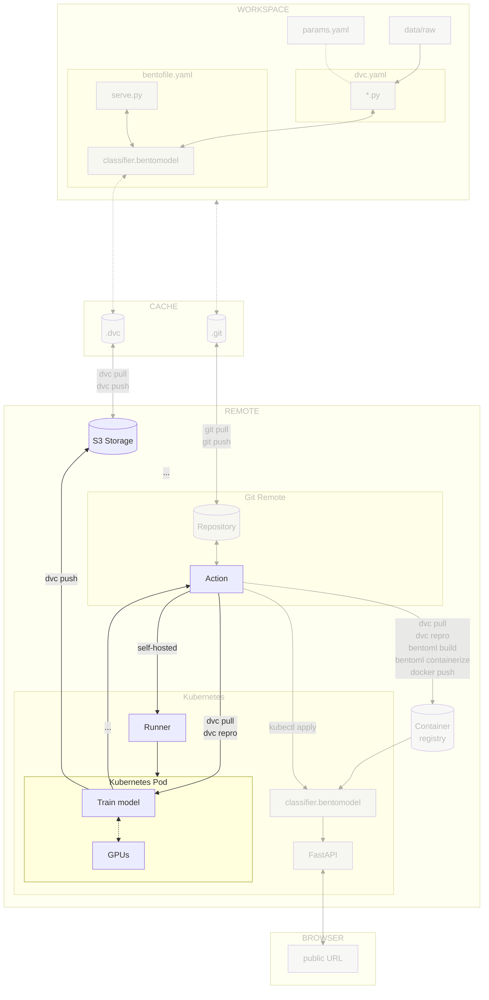

# Chapter 17 - Train the model on a Kubernetes pod

## Introduction

!!! warning

    This chapter is a work in progress. It focuses for now solely on :simple-github:
    GitHub. Please check back later for updates specific to using :simple-gitlab:
    GitLab.

    Thank you!

Some experiments can require specific hardware to run. For example, you may need
a GPU to train a deep learning model.

Training these experiments locally can be challenging. You may not have the
required hardware, or you may not want to use your local machine for training.
In this case, you can use a specialized Kubernetes pod to train your model.

In this chapter, you will learn how to:

1. Create a self-hosted runner Docker container image
2. Publish the runner image to the container registry and deploy it
3. Configure the CI/CD to start the containerized runner on Kubernetes
4. Start the training of the model from your CI/CD pipeline on a specialized pod
   on the Kubernetes cluster

The following diagram illustrates the control flow of the experiment at the end
of this chapter:



## Steps

### Identify the specialized node

The cluster consists of two nodes. For demonstration purposes, let's assume that
one node is equipped with a GPU while the other is not. You will need to
identify which node has the specialized hardware required for training the
model. This can be achieved by assigning a label to the nodes.

!!! note

    For our small experiment, there is actually no need to have a GPU to train the
    model. This is done solely for demonstration purposes. In a real-life production
    setup with a larger machine learning experiment, however, training with a GPU is
    likely to be a strong requirement due to the increased computational demands and
    the need for faster processing times.

#### Display the nodes names and labels

Display the nodes with the following command.

```sh title="Execute the following command(s) in a terminal"
# Display the nodes
kubectl get nodes --show-labels
```

The output should be similar to this: As noticed, you have two nodes in your
cluster with their labels.

```
NAME                                              STATUS   ROLES    AGE   VERSION               LABELS
gke-mlops-kubernetes-default-pool-d4f966ea-8rbn   Ready    <none>   49s   v1.30.3-gke.1969001   beta.kubernetes.io/arch=amd64,[...]
gke-mlops-kubernetes-default-pool-d4f966ea-p7qm   Ready    <none>   50s   v1.30.3-gke.1969001   beta.kubernetes.io/arch=amd64,[...]
```

Export the name of the two nodes as environment variables. Replace the
`<my_node_1_name>` and `<my_node_2_name>` placeholders with the names of your
nodes (`gke-mlops-kubernetes-default-pool-d4f966ea-8rbn` and
`gke-mlops-kubernetes-default-pool-d4f966ea-p7qm` in this example).

```sh title="Execute the following command(s) in a terminal"
export K8S_NODE_1_NAME=<my_node_1_name>
```

```sh title="Execute the following command(s) in a terminal"
export K8S_NODE_2_NAME=<my_node_2_name>
```

#### Labelize the nodes

You can now labelize the nodes to be able to use the GPU node for the training
of the model.

```sh title="Execute the following command(s) in a terminal"
# Labelize the nodes
kubectl label nodes $K8S_NODE_1_NAME gpu=true
kubectl label nodes $K8S_NODE_2_NAME gpu=false
```

You can check the labels with the `kubectl get nodes --show-labels` command. You
should see the node with the `gpu=true`/ `gpu=false` labels.

### Create a self-hosted runner container image

Jobs in a CI/CD workflow are executed on applications known as runners. These
can be physical servers, virtual machines (like the default runner used for our
workflow so far), or container images, and may operate on a public cloud or
on-premises within your own infrastructure.

We will create a custom container image for a self-hosted runner and deploy it
on our Kubernetes cluster. A base instance of this runner listens for jobs from
GitHub Actions. When asked to, it creates a specialized GPU runner pods on the
Kubernetes cluster to execute the jobs. This specialized runner will then be
destroyed.

This approach optimizes resource usage by ensuring that GPU resources are only
used when necessary.

!!! info

    Kubernetes restricts the direct execution of Docker within a container due to
    security and architectural considerations. As a result, only the training and
    reporting steps will be executed on the self-hosted runner. The resulting model
    will be uploaded to the remote bucket using DVC, making it available to the main
    runner that operates on a conventional VM. As this environment supports Docker,
    it allows the model artifact to be built, containerized, and stored in the
    container registry prior to deployment.

The runner uses a custom Docker image that includes the necessary dependencies
to run the workflows.

At the root level of your Git repository, create a `docker` folder. The
following table describes the files that you will create in this folder:

| **File**     | **Description**                                    | **Role**                               |
| ------------ | -------------------------------------------------- | ---------------------------------------|
| `Dockerfile` | Instructions for building a Docker container image | Package runner files and dependencies  |
| `startup.sh` | The entrypoint for the Docker image                | Initialize the container when launched |

#### Create the Dockerfile

The `Dockerfile` provides the instructions needed to create a custom Docker
container image that incorporates the
[GitHub Actions runner](https://github.com/actions/runner) along with the
workflow files and all its necessary dependencies.

Replace `<my_repository_url>` with your own repository name.

```yaml title="docker/Dockerfile"
FROM ubuntu:22.04

ENV RUNNER_VERSION=2.319.1

LABEL RunnerVersion=${RUNNER_VERSION}
LABEL org.opencontainers.image.source="<my_repository_url>"

# Install dependencies
RUN apt-get update -y && \
    apt-get install -y build-essential lsb-release python3 python3-pip \
    curl jq vim gpg wget git unzip tar gettext-base

# Add a non-root user
RUN useradd -m runner

WORKDIR /home/actions-runner

# Install GitHub Actions Runner
RUN curl -o actions-runner-linux-x64-${RUNNER_VERSION}.tar.gz -L https://github.com/actions/runner/releases/download/v${RUNNER_VERSION}/actions-runner-linux-x64-${RUNNER_VERSION}.tar.gz
RUN tar xzf ./actions-runner-linux-x64-${RUNNER_VERSION}.tar.gz

# Install extra dependencies for the runner
RUN ./bin/installdependencies.sh

COPY startup.sh .

RUN chmod +x startup.sh

USER runner

ENTRYPOINT ["./startup.sh"]
```

#### Create the startup script

This `startup.sh` script will act as an entrypoint for the Docker image. It will
be used to initialize our Docker container when launched from the image we are
creating. The primary purpose of this script is to register a new self-hosted
GitHub runner instance for our repository, each time a new container is started
from the image.

Replace `<my_username>` and `<my_repository_name>` with your own username and
repository name.

```yaml title="docker/startup.sh"
#!/bin/bash

set -e  # Exit on error

REPOSITORY_OWNER=<my_username>
REPOSITORY_NAME=<my_repository_name>

# Set the runner token (expires after 1 hour)
set_token() {
    REG_TOKEN=$(curl -s -X POST -H "Accept: application/vnd.github.v3+json" -H "Authorization: token ${GITHUB_RUNNER_PAT}" https://api.github.com/repos/${REPOSITORY_OWNER}/${REPOSITORY_NAME}/actions/runners/registration-token | jq -r .token)
}

# Configure the runner
set_token
./config.sh --unattended \
    --url https://github.com/${REPOSITORY_OWNER}/${REPOSITORY_NAME} \
    --replace --labels ${GITHUB_RUNNER_LABEL} --token ${REG_TOKEN}

# Cleanup the runner
cleanup() {
    echo "Removing runner..."
    set_token
    ./config.sh remove --unattended --token ${REG_TOKEN}
}

trap 'cleanup; exit 130' INT
trap 'cleanup; exit 143' TERM

# Start the runner
./run.sh > run.log 2>&1 & wait $!
```

Note the `GITHUB_RUNNER_LABEL` variable will be used to identify the runner in
subsequent steps.

#### Authenticate with the GitHub Container Registry

Before proceeding, you will need to create a personal access token. This token
will be used to authenticate you on the GitHub Container Registry, allowing you
to push the image there.

!!! note

    We opted to use the GitHub Container Registry for our self-hosted Docker image
    because of its close integration with our existing GitHub environment. This
    decision allows us to restrict our CI/CD processes to the GitHub infrastructure
    while also demonstrating its use. However, we could have also used our existing
    Google Cloud Container Registry.

Follow the
[_Managing Personal Access Token_ - GitHub docs](https://docs.github.com/en/authentication/keeping-your-account-and-data-secure/managing-your-personal-access-tokens)
guide to create a personal access token (classic) named `GHCR_PAT` with the
`write:package` scope.

Export your token in as a variable. Replace`<my_personal_access_token>` with
your own token.

```sh title="Execute the following command(s) in a terminal"
export GHCR_PAT=<my_personal_access_token>
```

Authenticate to the Container Registry. Replace `<my_username>` with your own
username.

```sh title="Execute the following command(s) in a terminal"
echo $GHCR_PAT | docker login -u <my_username> ghcr.io --password-stdin
```

#### Build and push the image to the container regsitry

With the entrypoint script ready, we can now build the Docker image before
pushing it to the Container Registry.

To build the docker image, navigate to the `docker` folder and run the following
command. Make sure to adjust the `my_username` and `my_repository_name`
variables in the tag of the Docker image to match your own your own username and
repository.

```sh title="Execute the following command(s) in a terminal"
docker build --platform=linux/amd64 --tag ghcr.io/<my_username>/<my_repository_name>/github-runner:latest .
```

!!! note

    Please note that the `--platform` parameter is important to set if your machine
    does not use the [x86_64](https://en.wikipedia.org/wiki/X86-64) architecture
    (like Apple Silicon). This is necessary because the runner, on which the Docker
    image will be deployed, operates on a 64-bit Linux environment.

The output should be similar to this:

```
[+] Building 57.3s (14/14) FINISHED                                                                      docker:default
 => [internal] load build definition from Dockerfile                                                               0.1s
 => => transferring dockerfile: 920B                                                                               0.0s
 => [internal] load metadata for docker.io/library/ubuntu:24.04                                                    1.8s
 => [internal] load .dockerignore                                                                                  0.0s
 => => transferring context: 2B                                                                                    0.0s
 => [1/9] FROM docker.io/library/ubuntu:24.04@sha256:8a37d68f4f73ebf3d4efafbcf66379bf3728902a8038616808f04e34a9ab  2.5s
 => => resolve docker.io/library/ubuntu:24.04@sha256:8a37d68f4f73ebf3d4efafbcf66379bf3728902a8038616808f04e34a9ab  0.0s
 => => sha256:8a37d68f4f73ebf3d4efafbcf66379bf3728902a8038616808f04e34a9ab63ee 1.34kB / 1.34kB                     0.0s
 => => sha256:d35dfc2fe3ef66bcc085ca00d3152b482e6cafb23cdda1864154caf3b19094ba 424B / 424B                         0.0s
 => => sha256:edbfe74c41f8a3501ce542e137cf28ea04dd03e6df8c9d66519b6ad761c2598a 2.30kB / 2.30kB                     0.0s
 => => sha256:31e907dcc94a592a57796786399eb004dcbba714389fa615f5efa05a91316356 29.71MB / 29.71MB                   1.1s
 => => extracting sha256:31e907dcc94a592a57796786399eb004dcbba714389fa615f5efa05a91316356                          1.2s
 => [internal] load build context                                                                                  0.0s
 => => transferring context: 862B                                                                                  0.0s
 => [2/9] RUN apt-get update -y && apt-get install -y     build-essential lsb-release     python3 python3-pip     26.6s
 => [3/9] RUN useradd -m runner                                                                                    0.3s
 => [4/9] WORKDIR /home/actions-runner                                                                             0.1s
 => [5/9] RUN curl -o actions-runner-linux-x64-2.319.1.tar.gz -L https://github.com/actions/runner/releases/downl  7.3s
 => [6/9] RUN tar xzf ./actions-runner-linux-x64-2.319.1.tar.gz                                                    4.2s
 => [7/9] RUN ./bin/installdependencies.sh                                                                        12.3s
 => [8/9] COPY startup.sh .                                                                                        0.2s
 => [9/9] RUN chmod +x startup.sh                                                                                  0.3s
 => exporting to image                                                                                             1.5s
 => => exporting layers                                                                                            1.4s
 => => writing image sha256:91b6c9cbfd267d995f2701bcbc45181b78413b8b3d580f9ac6333f25ca2903c4                       0.0s
 => => naming to ghcr.io/username/a-guide-to-mlops/github-runner:latest                                            0.0s
```

Push the docker image to the GitHub Container Registry:

```sh title="Execute the following command(s) in a terminal"
docker push ghcr.io/<my_username>/<my_repository_name>/github-runner:latest
```

#### Adjust image visibility

Make sure to set the image visibility to `Public` in the GitHub Container
Registry settings.

In your repository page, click on **Packages** on the right hand side, then on
your **github-runner** package. In **Package settings** in the **Danger Zone**
section, choose **Change package visibility** and set the package to **public**.

### Configure security

It is important to understand that using a self-hosted runner allows other users
to execute code on your infrastructure. Specifically, **forks** of your public
repository **will trigger the workflow** when a pull request is created.

Consequently, other users can potentially run malicious code on your self-hosted
runner machine by executing a workflow.

While our self-hosted runner will be set up in a containerized, isolated
environment that limits the impact of any malicious code, unwanted pull requests
in forks could still exhaust the computational resources for which you are
responsible.

To mitigate these risks, it is advisable to secure your runner by disabling
workflow triggers by forks. In the repository, go to
**Settings > Actions > General**. In the **Fork pull request workflows**
section, ensure the **Run workflows from fork pull requests** checkbox is
disabled and click on **Save**.

!!! danger

    Make sure to secure your runner and restrict access to the repository. For more
    information, see
    [Self-hosted runner security](https://docs.github.com/en/actions/hosting-your-own-runners/managing-self-hosted-runners/about-self-hosted-runners#self-hosted-runner-security).

    More generally, it is recommended that you only use self-hosted runners with
    private repositories.

    You can change the repository visibility in **Settings > General**. In the
    **Danger Zone** section, choose **Change visibility** and set the repository to
    **private**.

### Set the self-hosted base runner

We will now deploy our self-hosted GitHub runner to our Kubernetes cluster with
the help of a YAML configuration file. As a reminder, the runner is used to
execute the GitHub Action workflows defined in the repository.

The runner will use the custom Docker image that we pushed to the GitHub
Container Registry. This image is identified by the label named
`GITHUB_RUNNER_LABEL` which is set to the value `base-runner`.

Create a new file called `runner.yaml` in the `kubernetes` directory with the
following content. Replace also `<my_username>` and `<my_repository_name>` with
your own username and repository name.

```txt title="kubernetes/runner.yaml"
apiVersion: v1
kind: Pod
metadata:
  name: github-runner
  labels:
    app: github-runner
spec:
  containers:
    - name: github-runner
      image: ghcr.io/<my_username>/<my_repository_name>/github-runner:latest
      env:
        - name: GITHUB_RUNNER_LABEL
          value: "base-runner"
        - name: GITHUB_RUNNER_PAT
          valueFrom:
            secretKeyRef:
              name: github-runner-pat
              key: token
      securityContext:
        runAsUser: 1000
      resources:
        limits:
          cpu: "1"
          memory: "4Gi"
        requests:
          cpu: "1"
          memory: "4Gi"
  nodeSelector:
    gpu: "false"
```

Note the `nodeSelector` field that will select a node with a `gpu=false` label.

#### Add Kubeconfig secret

To enable the registration of the self-hosted runner, authentication via a
secret is required. Initially, you need to generate a Personal Access Token
(PAT) to authenticate with the GitHub repository. This token will subsequently
be used to create a secret, allowing the use of the `kubectl` command on your
machine.

Follow the
[_Managing Personal Access Token_ - GitHub docs](https://docs.github.com/en/authentication/keeping-your-account-and-data-secure/managing-your-personal-access-tokens)
guide to create a personal access token (classic) named `GH_RUNNER_PAT` with the
`repo` and `read:org` scopes

Export your token in as a variable. Replace `<my_repository_token>` with your
own token.

```
export GH_RUNNER_PAT=<my_repository_token>
```

Run the following command to create the secret:

```sh title="Execute the following command(s) in a terminal"
kubectl create secret generic github-runner-pat --from-literal=token=$GH_RUNNER_PAT
```

The created secret is stored within the Kubernetes cluster itself. As such, the
secret is securely kept within the cluster and can be accessed by Kubernetes
components running in that cluster.

#### Deploy the base runner

To deploy the base runner to the Kubernetes cluster, run the following command:

```sh title="Execute the following command(s) in a terminal"
kubectl apply -f kubernetes/runner.yaml
```

This will deploy a GitHub runner pod named `github-runner` in your current
Kubernetes namespace. The runner will automatically register itself to the
repository.

You can check the status of the pod with the following command:

```sh title="Execute the following command(s) in a terminal"
kubectl get pods
```

The output should be similar to this:

!!! info

     This can take several minutes.

```text
NAME                                                      READY   STATUS    RESTARTS   AGE
celestial-bodies-classifier-deployment-5f47f7dddc-t4swp   1/1     Running   0          15m
github-runner                                             1/1     Running   0          2m11s
```

You can connect to the pod once it is running with:

```sh title="Execute the following command(s) in a terminal"
kubectl exec -it github-runner -- bash
```

You can then check the runner logs with:

```sh title="Execute the following command(s) in a terminal"
tail -f run.log
```

The output should be similar to this:

```
√ Connected to GitHub

Current runner version: '2.319.1'
2024-09-27 12:15:19Z: Listening for Jobs
```

Exit the process by pressing ++ctrl+c++ in the terminal, then exit the pod by
entering `exit`.

In addtion, in **Settings** > **Actions** > **Runners**, you should now be able
to see the `github-runner` runner listed with the *Idle* status.

!!! note

    To remove the runner from the Kubernetes cluster, run the following command:

    ```sh title="Execute the following command(s) in a terminal"
    kubectl delete -f kubernetes/runner.yaml
    ```

    The runner will also automatically be unregistered from the repository.

### Set self-hosted GPU runner

We also create a similar configuration file for the GPU runner, which is used
exclusively during the *train* and *report* steps of the workflow to create a
self-hosted GPU runner specifically for executing this step.

The runner will use the same custom Docker image that we pushed to the GitHub
Container Registry. This image is identified by the label `GITHUB_RUNNER_LABEL`
which is set to the value `gpu-runner`.

Create a new file called `runner-gpu.yaml` in the `kubernetes` directory with
the following content. Replace `<my_username>` and `<my_repository_name>` with
your own username and repository name.

```txt title="kubernetes/runner-gpu.yaml"
apiVersion: v1
kind: Pod
metadata:
  name: github-runner-gpu-${GITHUB_RUN_ID}
  labels:
    app: github-runner-gpu-${GITHUB_RUN_ID}
spec:
  volumes:
    - name: dshm
      emptyDir:
        medium: Memory
        sizeLimit: 4Gi
  containers:
    - name: github-runner-gpu-${GITHUB_RUN_ID}
      image: ghcr.io/<my_username>/<my_repository_name>/github-runner:latest
      # We mount a shared memory volume for training
      volumeMounts:
        - name: dshm
          mountPath: /dev/shm
      env:
        - name: GITHUB_RUNNER_LABEL
          value: "gpu-runner"
        - name: GITHUB_RUNNER_PAT
          valueFrom:
            secretKeyRef:
              name: github-runner-pat
              key: token
      securityContext:
        runAsUser: 1000
      resources:
        limits:
          cpu: "1"
          memory: "4Gi"
        requests:
          cpu: "1"
          memory: "4Gi"
  nodeSelector:
    gpu: "true"
```

Note the `nodeSelector` field that will select a node with a `gpu=true` label.

#### Add Kubeconfig secret

To enable the GPU runner to access the cluster, authentication is required. To
obtain the credentials for your Google Cloud Kubernetes cluster, you can execute
the following command to set up your kubeconfig file (`~/.kube/config`) with the
necessary credentials:

```sh title="Execute the following command(s) in a terminal"
# Get Kubernetes cluster credentials
gcloud container clusters get-credentials $GCP_K8S_CLUSTER_NAME --zone $GCP_K8S_CLUSTER_ZONE
```

This updates the kubeconfig file (`~/.kube/config`) used by `kubectl` with the
necessary information to connect to your Google Cloud Kubernetes cluster.

The relevant section of the kubeconfig file will look something like this:

```yaml title=".kube/config"
apiVersion: v1
clusters:
- cluster:
    certificate-authority-data: <REDACTED>
    server: https://<YOUR_CLUSTER_ENDPOINT>
  name: gke_<YOUR_PROJECT_ID_YOUR_ZONE_YOUR_CLUSTER_NAME>
contexts:
- context:
    cluster: gke_<YOUR_PROJECT_ID_YOUR_ZONE_YOUR_CLUSTER_NAME>
    user: gke_<YOUR_PROJECT_ID_YOUR_ZONE_YOUR_CLUSTER_NAME>
  name: gke_<YOUR_PROJECT_ID_YOUR_ZONE_YOUR_CLUSTER_NAME>
current-context: gke_<YOUR_PROJECT_ID_YOUR_ZONE_YOUR_CLUSTER_NAME>
kind: Config
preferences: {}
users:
- name: gke_<YOUR_PROJECT_ID_YOUR_ZONE_YOUR_CLUSTER_NAME>
  user:
    exec:
      apiVersion: client.authentication.k8s.io/v1beta1
      command: gke-gcloud-auth-plugin
      installHint: Install gke-gcloud-auth-plugin for use with kubectl by following
        https://cloud.google.com/kubernetes-engine/docs/how-to/cluster-access-for-kubectl#install_plugin
      provideClusterInfo: true
```

!!! info

    If using macOS, make sure the `users.user.exec.command` parameter is set to
    `gke-gcloud-auth-plugin`. The kubeconfig file is generated locally and may point
    to the Homebrew installation path. However, this configuration will be used in a
    standard Linux environment when accessing the Kubernetes cluster from the CI/CD
    pipeline.

#### Add Kubernetes CI/CD secrets

Add the Kubernetes secrets to access the Kubernetes cluster from the CI/CD
pipeline. Depending on the CI/CD platform you are using, the process will be
different:

=== ":simple-googlecloud: Google Cloud"

    === ":simple-github: GitHub"

        Create the following new variable by going to the **Settings** section from the
        top header of your GitHub repository. Select **Secrets and variables > Actions**
        and select **New repository secret**:

        - `GCP_K8S_KUBECONFIG`: The content of the kubeconfig file of the Kubernetes
          cluster.

        Save the variables by selecting **Add secret**.

    === ":simple-gitlab: GitLab"

        No additional secret variables are necessary for the GitLab CI/CD.

=== ":material-cloud: Using another cloud provider? Read this!"

    This guide has been written with Google Cloud in mind. We are open to
    contributions to add support for other cloud providers such as
    [:simple-amazonwebservices: Amazon Web Services](https://aws.amazon.com),
    [:simple-exoscale: Exoscale](https://www.exoscale.com),
    [:material-microsoft-azure: Microsoft Azure](https://azure.microsoft.com) or
    [:simple-kubernetes: Self-hosted Kubernetes](https://kubernetes.io) but we might
    not officially support them.

    If you want to contribute, please open an issue or a pull request on the
    [GitHub repository](https://github.com/swiss-ai-center/a-guide-to-mlops). Your
    help is greatly appreciated!

### Update the CI/CD configuration file

You'll now update the CI/CD configuration file to start a runner on the
Kubernetes cluster. Using the labels defined previously, you'll be able to start
the training of the model on the node with the GPU.

Additionally, as the experiment is now being trained directly from the CI/CD
pipeline, the workflow will be modified to automatically push the results to the
remote storage with DVC and to commit the updated lock file to the repository
automatically.

!!! tip

    When proposing changes to the model files in a branch, you no longer need to run
    `dvc repro` locally before pushing the changes with `git push`. You can obtain
    the updated `dvc.lock` file and model by using `git pull` and `dvc pull` on the
    main branch.

Update the `.github/workflows/mlops.yaml` file.

Take some time to understand the new steps:

```yaml title=".github/workflows/mlops.yaml" hl_lines="15-19 21-58 60-62 79-89 141-159 191-216"
name: MLOps

on:
  # Runs on pushes targeting main branch
  push:
    branches:
      - main

  # Runs on pull requests
  pull_request:

  # Allows you to run this workflow manually from the Actions tab
  workflow_dispatch:

# Allow the creation and usage of self-hosted runners
permissions:
  contents: read
  id-token: write

jobs:
  setup-runner:
    runs-on: [self-hosted, base-runner]
    steps:
      - name: Checkout repository
        uses: actions/checkout@v4
      - name: Login to Google Cloud
        uses: google-github-actions/auth@v2
        with:
          credentials_json: '${{ secrets.GOOGLE_SERVICE_ACCOUNT_KEY }}'
      - name: Get Google Cloud's Kubernetes credentials
        uses: google-github-actions/get-gke-credentials@v2
        with:
          cluster_name: ${{ secrets.GCP_K8S_CLUSTER_NAME }}
          location: ${{ secrets.GCP_K8S_CLUSTER_ZONE }}
      - name: Set up GCloud SDK
        uses: google-github-actions/setup-gcloud@v2
        with:
          version: '>= 494.0.0'
      - name: Install kubectl
        run: |
          gcloud components install kubectl
      - name: Install gke-gcloud-auth-plugin
        run: |
          gcloud components install gke-gcloud-auth-plugin
      - name: Initialize runner on Kubernetes
        env:
          KUBECONFIG_DATA: ${{ secrets.GCP_K8S_KUBECONFIG }}
        # We use envsubst to replace variables in runner-gpu.yaml
        # in order to create a unique runner name with the
        # GitHub run ID. This prevents conflicts when multiple
        # runners are created at the same time.
        run: |
          echo "$KUBECONFIG_DATA" > kubeconfig
          export KUBECONFIG=kubeconfig
          # We use run_id to make the runner name unique
          export GITHUB_RUN_ID="${{ github.run_id }}"
          envsubst < kubernetes/runner-gpu.yaml | kubectl apply -f -
  train-and-report:
    permissions: write-all
    needs: setup-runner
    runs-on: [self-hosted, gpu-runner]
    if: github.event_name == 'pull_request'
    steps:
      - name: Checkout repository
        uses: actions/checkout@v4
      - name: Setup Python
        uses: actions/setup-python@v5
        with:
          python-version: '3.11'
          cache: pip
      - name: Install dependencies
        run: pip install --requirement requirements-freeze.txt
      - name: Login to Google Cloud
        uses: google-github-actions/auth@v2
        with:
          credentials_json: '${{ secrets.GOOGLE_SERVICE_ACCOUNT_KEY }}'
      - name: Train model
        run: dvc repro --pull
      - name: Push the outcomes to DVC remote storage
        run: dvc push
      - name: Commit changes in dvc.lock
        uses: stefanzweifel/git-auto-commit-action@v5
        with:
          commit_message: Commit changes in dvc.lock
          file_pattern: dvc.lock
      - name: Setup Node
        uses: actions/setup-node@v4
        with:
          node-version: 20
      - name: Setup CML
        uses: iterative/setup-cml@v2
        with:
          version: '0.20.0'
      - name: Create CML report
        env:
          REPO_TOKEN: ${{ secrets.GITHUB_TOKEN }}
        run: |
          # Fetch all other Git branches
          git fetch --depth=1 origin main:main

          # Add title to the report
          echo "# Experiment Report (${{ github.sha }})" >> report.md

          # Compare parameters to main branch
          echo "## Params workflow vs. main" >> report.md
          dvc params diff main --md >> report.md

          # Compare metrics to main branch
          echo "## Metrics workflow vs. main" >> report.md
          dvc metrics diff main --md >> report.md

          # Compare plots (images) to main branch
          dvc plots diff main

          # Create plots
          echo "## Plots" >> report.md

          # Create training history plot
          echo "### Training History" >> report.md
          echo "#### main" >> report.md
          echo '' >> report.md
          echo "#### workspace" >> report.md
          echo '' >> report.md

          # Create predictions preview
          echo "### Predictions Preview" >> report.md
          echo "#### main" >> report.md
          echo '' >> report.md
          echo "#### workspace" >> report.md
          echo '' >> report.md

          # Create confusion matrix
          echo "### Confusion Matrix" >> report.md
          echo "#### main" >> report.md
          echo '' >> report.md
          echo "#### workspace" >> report.md
          echo '' >> report.md

          # Publish the CML report
          cml comment update --target=pr --publish report.md
  publish-and-deploy:
    runs-on: ubuntu-latest
    if: github.ref == 'refs/heads/main'
    steps:
      - name: Checkout repository
        uses: actions/checkout@v4
      - name: Setup Python
        uses: actions/setup-python@v5
        with:
          python-version: '3.11'
          cache: pip
      - name: Install dependencies
        run: pip install --requirement requirements-freeze.txt
      - name: Login to Google Cloud
        uses: google-github-actions/auth@v2
        with:
          credentials_json: '${{ secrets.GOOGLE_SERVICE_ACCOUNT_KEY }}'
      - name: Check model
        run: dvc repro --pull
      - name: Log in to the Container registry
        uses: docker/login-action@v3
        with:
          registry: ${{ secrets.GCP_CONTAINER_REGISTRY_HOST }}
          username: _json_key
          password: ${{ secrets.GOOGLE_SERVICE_ACCOUNT_KEY }}
      - name: Import the BentoML model
        run: bentoml models import model/celestial_bodies_classifier_model.bentomodel
      - name: Build the BentoML model artifact
        run: bentoml build src
      - name: Containerize and publish the BentoML model artifact Docker image
        run: |
          # Containerize the Bento
          bentoml containerize celestial_bodies_classifier:latest \
            --image-tag ${{ secrets.GCP_CONTAINER_REGISTRY_HOST }}/celestial-bodies-classifier:latest \
            --image-tag ${{ secrets.GCP_CONTAINER_REGISTRY_HOST }}/celestial-bodies-classifier:${{ github.sha }}
          # Push the container to the Container Registry
          docker push --all-tags ${{ secrets.GCP_CONTAINER_REGISTRY_HOST }}/celestial-bodies-classifier
      - name: Get Google Cloud's Kubernetes credentials
        uses: google-github-actions/get-gke-credentials@v2
        with:
          cluster_name: ${{ secrets.GCP_K8S_CLUSTER_NAME }}
          location: ${{ secrets.GCP_K8S_CLUSTER_ZONE }}
      - name: Update the Kubernetes deployment
        run: |
          yq -i '.spec.template.spec.containers[0].image = "${{ secrets.GCP_CONTAINER_REGISTRY_HOST }}/celestial-bodies-classifier:${{ github.sha }}"' kubernetes/deployment.yaml
      - name: Deploy the model on Kubernetes
        run: |
          kubectl apply \
            -f kubernetes/deployment.yaml \
            -f kubernetes/service.yaml
  cleanup-runner:
    needs: train-and-report
    runs-on: [self-hosted, base-runner]
    # Always run this job even if the previous jobs fail
    if: always()
    steps:
      - name: Checkout repository
        uses: actions/checkout@v4
      - name: Set up GCloud SDK
        uses: google-github-actions/setup-gcloud@v2
        with:
          version: '>= 494.0.0'
      - name: Install kubectl
        run: |
          gcloud components install kubectl
      - name: Install gke-gcloud-auth-plugin
        run: |
          gcloud components install gke-gcloud-auth-plugin
      - name: Cleanup runner on Kubernetes
        env:
          KUBECONFIG_DATA: ${{ secrets.GCP_K8S_KUBECONFIG }}
        run: |
          echo "$KUBECONFIG_DATA" > kubeconfig
          export KUBECONFIG=kubeconfig
          export GITHUB_RUN_ID="${{ github.run_id }}"
          envsubst < kubernetes/runner-gpu.yaml | kubectl delete --wait=false -f -
```

Here, the following should be noted:

* the `setup-runner` job creates a self-hosted GPU runner.
* the `train-report` job runs on the self-hosted GPU runner on pull requests. It
  trains the model and DVC pushes the trained model to the remote bucket.
* the `publish-and-deploy` runs on the main runner when merging pull requests.
  It retrieves the model with DVC, containerizes then deploys the model artifact.
* the `cleanup-runner` job deletes the self-hosted GPU runner.

Check the differences with Git to validate the changes.

```sh title="Execute the following command(s) in a terminal"
# Show the differences with Git
git diff .github/workflows/mlops.yaml
```

The output should be similar to this:

```diff
diff --git a/.github/workflows/mlops.yaml b/.github/workflows/mlops.yaml
index 3ac0f67..db9db1d 100644
--- a/.github/workflows/mlops.yaml
+++ b/.github/workflows/mlops.yaml
@@ -12,10 +12,54 @@ on:
   # Allows you to run this workflow manually from the Actions tab
   workflow_dispatch:

+# Allow the creation and usage of self-hosted runners
+permissions:
+  contents: read
+  id-token: write
+
 jobs:
-  train-report-publish-and-deploy:
+  setup-runner:
+    runs-on: [self-hosted, base-runner]
+    steps:
+      - name: Checkout repository
+        uses: actions/checkout@v4
+      - name: Login to Google Cloud
+        uses: google-github-actions/auth@v2
+        with:
+          credentials_json: '${{ secrets.GOOGLE_SERVICE_ACCOUNT_KEY }}'
+      - name: Get Google Cloud's Kubernetes credentials
+        uses: google-github-actions/get-gke-credentials@v2
+        with:
+          cluster_name: ${{ secrets.GCP_K8S_CLUSTER_NAME }}
+          location: ${{ secrets.GCP_K8S_CLUSTER_ZONE }}
+      - name: Set up GCloud SDK
+        uses: google-github-actions/setup-gcloud@v2
+        with:
+          version: '>= 494.0.0'
+      - name: Install kubectl
+        run: |
+          gcloud components install kubectl
+      - name: Install gke-gcloud-auth-plugin
+        run: |
+          gcloud components install gke-gcloud-auth-plugin
+      - name: Initialize runner on Kubernetes
+        env:
+          KUBECONFIG_DATA: ${{ secrets.GCP_K8S_KUBECONFIG }}
+        # We use envsubst to replace variables in runner-gpu.yaml
+        # in order to create a unique runner name with the
+        # GitHub run ID. This prevents conflicts when multiple
+        # runners are created at the same time.
+        run: |
+          echo "$KUBECONFIG_DATA" > kubeconfig
+          export KUBECONFIG=kubeconfig
+          # We use run_id to make the runner name unique
+          export GITHUB_RUN_ID="${{ github.run_id }}"
+          envsubst < kubernetes/runner-gpu.yaml | kubectl apply -f -
+  train-and-report:
     permissions: write-all
-    runs-on: ubuntu-latest
+    needs: setup-runner
+    runs-on: [self-hosted, gpu-runner]
+    if: github.event_name == 'pull_request'
     steps:
       - name: Checkout repository
         uses: actions/checkout@v4
@@ -32,13 +76,22 @@ jobs:
           credentials_json: '${{ secrets.GOOGLE_SERVICE_ACCOUNT_KEY }}'
       - name: Train model
         run: dvc repro --pull
+      - name: Push the outcomes to DVC remote storage
+        run: dvc push
+      - name: Commit changes in dvc.lock
+        uses: stefanzweifel/git-auto-commit-action@v5
+        with:
+          commit_message: Commit changes in dvc.lock
+          file_pattern: dvc.lock
+      - name: Setup Node
+        uses: actions/setup-node@v4
+        with:
+          node-version: 20
       - name: Setup CML
-        if: github.event_name == 'pull_request'
         uses: iterative/setup-cml@v2
         with:
           version: '0.20.0'
       - name: Create CML report
-        if: github.event_name == 'pull_request'
         env:
           REPO_TOKEN: ${{ secrets.GITHUB_TOKEN }}
         run: |
@@ -85,6 +138,25 @@ jobs:

           # Publish the CML report
           cml comment update --target=pr --publish report.md
+  publish-and-deploy:
+    runs-on: ubuntu-latest
+    if: github.ref == 'refs/heads/main'
+    steps:
+      - name: Checkout repository
+        uses: actions/checkout@v4
+      - name: Setup Python
+        uses: actions/setup-python@v5
+        with:
+          python-version: '3.11'
+          cache: pip
+      - name: Install dependencies
+        run: pip install --requirement requirements-freeze.txt
+      - name: Login to Google Cloud
+        uses: google-github-actions/auth@v2
+        with:
+          credentials_json: '${{ secrets.GOOGLE_SERVICE_ACCOUNT_KEY }}'
+      - name: Check model
+        run: dvc repro --pull
       - name: Log in to the Container registry
         uses: docker/login-action@v3
         with:
@@ -92,13 +164,10 @@ jobs:
           username: _json_key
           password: ${{ secrets.GOOGLE_SERVICE_ACCOUNT_KEY }}
       - name: Import the BentoML model
-        if: github.ref == 'refs/heads/main'
         run: bentoml models import model/celestial_bodies_classifier_model.bentomodel
       - name: Build the BentoML model artifact
-        if: github.ref == 'refs/heads/main'
         run: bentoml build src
       - name: Containerize and publish the BentoML model artifact Docker image
-        if: github.ref == 'refs/heads/main'
         run: |
           # Containerize the Bento
           bentoml containerize celestial_bodies_classifier:latest \
@@ -107,18 +176,41 @@ jobs:
           # Push the container to the Container Registry
           docker push --all-tags ${{ secrets.GCP_CONTAINER_REGISTRY_HOST }}/celestial-bodies-classifier
       - name: Get Google Cloud's Kubernetes credentials
-        if: github.ref == 'refs/heads/main'
         uses: google-github-actions/get-gke-credentials@v2
         with:
           cluster_name: ${{ secrets.GCP_K8S_CLUSTER_NAME }}
           location: ${{ secrets.GCP_K8S_CLUSTER_ZONE }}
       - name: Update the Kubernetes deployment
-        if: github.ref == 'refs/heads/main'
         run: |
           yq -i '.spec.template.spec.containers[0].image = "${{ secrets.GCP_CONTAINER_REGISTRY_HOST }}/celestial-bodies-classifier:${{ github.sha }}"' kubernetes/deployment.yaml
       - name: Deploy the model on Kubernetes
-        if: github.ref == 'refs/heads/main'
         run: |
           kubectl apply \
             -f kubernetes/deployment.yaml \
             -f kubernetes/service.yaml
+  cleanup-runner:
+    needs: train-and-report
+    runs-on: [self-hosted, base-runner]
+    # Always run this job even if the previous jobs fail
+    if: always()
+    steps:
+      - name: Checkout repository
+        uses: actions/checkout@v4
+      - name: Set up GCloud SDK
+        uses: google-github-actions/setup-gcloud@v2
+        with:
+          version: '>= 494.0.0'
+      - name: Install kubectl
+        run: |
+          gcloud components install kubectl
+      - name: Install gke-gcloud-auth-plugin
+        run: |
+          gcloud components install gke-gcloud-auth-plugin
+      - name: Cleanup runner on Kubernetes
+        env:
+          KUBECONFIG_DATA: ${{ secrets.GCP_K8S_KUBECONFIG }}
+        run: |
+          echo "$KUBECONFIG_DATA" > kubeconfig
+          export KUBECONFIG=kubeconfig
+          export GITHUB_RUN_ID="${{ github.run_id }}"
+          envsubst < kubernetes/runner-gpu.yaml | kubectl delete --wait=false -f -
```

Take some time to understand the changes made to the file.

### Check the changes

Check the changes with Git to ensure that all the necessary files are tracked.

```sh title="Execute the following command(s) in a terminal"
# Add all the files
git add .

# Check the changes
git status
```

The output should look like this.

```text
Changes to be committed:
  (use "git restore --staged <file>..." to unstage)
        modified:   .github/workflows/mlops.yaml
        new file:   docker/Dockerfile
        new file:   docker/startup.sh
        new file:   kubernetes/runner-gpu.yaml
        new file:   kubernetes/runner.yaml
```

### Push the CI/CD pipeline configuration file to Git

Push the CI/CD pipeline configuration file to Git.

```sh title="Execute the following command(s) in a terminal"
# Commit the changes
git commit -m "A pipeline will run my experiment on Kubernetes on each push"

# Push the changes
git push
```

### Check the results

On GitHub, you can see the pipeline running on the **Actions** page.

On GitLab, you can see the pipeline running on the **CI/CD > Pipelines** page.

The pod should be created on the Kubernetes Cluster.

=== ":simple-googlecloud: Google Cloud"

    On Google Cloud Console, you can see the pod that has been created on the
    **Kubernetes Engine > Workloads** page. Open the pod and go to the **YAML** tab
    to see the configuration of the pod. You should notice that the pod has been
    created with the node selector `gpu=true` and that it has been created on the
    right node.

=== ":material-cloud: Using another cloud provider? Read this!"

    This guide has been written with Google Cloud in mind. We are open to
    contributions to add support for other cloud providers such as
    [:simple-amazonwebservices: Amazon Web Services](https://aws.amazon.com),
    [:simple-exoscale: Exoscale](https://www.exoscale.com),
    [:material-microsoft-azure: Microsoft Azure](https://azure.microsoft.com) or
    [:simple-kubernetes: Self-hosted Kubernetes](https://kubernetes.io) but we might
    not officially support them.

    If you want to contribute, please open an issue or a pull request on the
    [GitHub repository](https://github.com/swiss-ai-center/a-guide-to-mlops). Your
    help is greatly appreciated!

This chapter is done, you can check the summary.

## Summary

Congratulations! You now can train your model on on a custom infrastructure with
custom hardware for specific use-cases.

In this chapter, you have successfully:

1. Created a self-hosted runner Docker container image
2. Published the containerized runner image to the container registry
3. Deployed the self-hosted runner on Kubernetes
4. Trained the model on a specialized pod on the Kubernetes cluster

### Destroy the Kubernetes cluster

When you are done with the chapter, you can destroy the Kubernetes cluster.

```sh title="Execute the following command(s) in a terminal"
# Destroy the Kubernetes cluster
gcloud container clusters delete --zone $GCP_K8S_CLUSTER_ZONE $GCP_K8S_CLUSTER_NAME
```

!!! tip

    If you need to quickly recreate the cluster after destroying it, here are the
    steps involved:

    * Create the Kubernetes cluster.
    * Deploy the containerized model on Kubernetes.
    * Identify the specialized node.
    * Label the nodes.
    * Deploy the base runner.
    * Retrieve the Kubernetes cluster credentials.
    * Update the Kubernetes `GCP_K8S_KUBECONFIG` CI/CD secret.

    Refer to the previous chapters for the specific commands. Additionally, ensure
    that all necessary environment variables are correctly defined.

## State of the MLOps process

- [x] Notebook has been transformed into scripts for production
- [x] Codebase and dataset are versioned
- [x] Steps used to create the model are documented and can be re-executed
- [x] Changes done to a model can be visualized with parameters, metrics and
      plots to identify differences between iterations
- [x] Codebase can be shared and improved by multiple developers
- [x] Dataset can be shared among the developers and is placed in the right
      directory in order to run the experiment
- [x] Experiment can be executed on a clean machine with the help of a CI/CD
      pipeline
- [x] CI/CD pipeline is triggered on pull requests and reports the results of
      the experiment
- [x] Changes to model can be thoroughly reviewed and discussed before
      integrating them into the codebase
- [x] Model can be saved and loaded with all required artifacts for future usage
- [x] Model can be easily used outside of the experiment context
- [x] Model publication to the artifact registry is automated
- [x] Model can be accessed from a Kubernetes cluster
- [x] Model is continuously deployed with the CI/CD
- [x] Model can be trained on a custom infrastructure with custom hardware for
      specific use-cases

You can now safely continue to the next chapter of this guide concluding your
journey and the next things you could do with your model.

## Sources

Highly inspired by:

- [_Adding self-hosted runners_ - GitHub docs](https://docs.github.com/en/actions/hosting-your-own-runners/managing-self-hosted-runners/adding-self-hosted-runners)
- [_GitHub Actions self-hosted runners on Google Cloud_ - github.blog](https://github.blog/news-insights/product-news/github-actions-self-hosted-runners-on-google-cloud/)
- [_Self-hosted runner security_ - GitHubdocs](https://docs.github.com/en/actions/hosting-your-own-runners/managing-self-hosted-runners/about-self-hosted-runners#self-hosted-runner-security)
- [_Security for self-managed runners_ - GitLab docs](https://docs.gitlab.com/runner/security/)
- [_Install kubectl and configure cluster access_ - cloud.google.com](https://cloud.google.com/kubernetes-engine/docs/how-to/cluster-access-for-kubectl)
- [_Deploying to Google Kubernetes Engine_ - GitHub docs](https://docs.github.com/en/actions/use-cases-and-examples/deploying/deploying-to-google-kubernetes-engine)
- [_gcloud container clusters create_ - cloud.google.com](https://cloud.google.com/sdk/gcloud/reference/container/clusters/create)
- [_Install Tools_ - kubernetes.io](https://kubernetes.io/docs/tasks/tools/)
- [_Assigning Pods to Nodes_ - kubernetes.io](https://kubernetes.io/docs/concepts/scheduling-eviction/assign-pod-node/#nodeselector)
- [_Assign Pods to Nodes_ - kubernetes.io](https://kubernetes.io/docs/tasks/configure-pod-container/assign-pods-nodes/)

