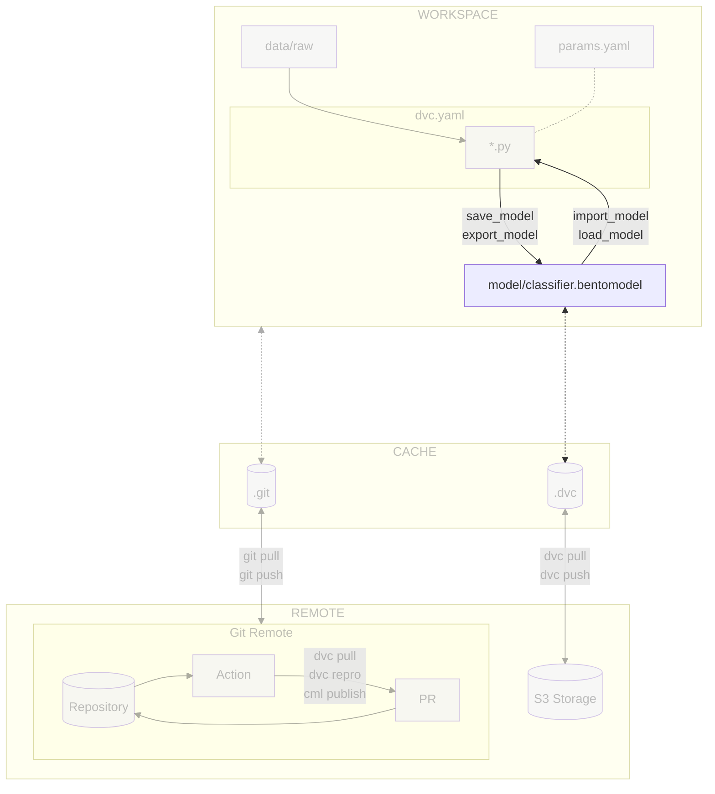

# Chapter 3.1 - Save and load the model with BentoML

## Introduction

The purpose of this chapter is to serve and use the model for usage outside of
the experiment context with the help of [:simple-bentoml: BentoML](../tools.md),
a tool designed for easy packaging, deployment, and serving of Machine Learning
models.

By transforming your model into a BentoML model artifact, it is possible to load
the model for future usage with all its dependencies. This will allow you to use
the model in a production environment, share it with others, and deploy it to a
cluster.

In this chapter, you will learn how to:

1. Install BentoML
2. Learn about BentoML's model store
3. Update and run the experiment to use BentoML to save and load the model to
   and from the model's store

The following diagram illustrates the control flow of the experiment at the end
of this chapter:



## Steps

### Install BentoML and dependencies

Add the `bentoml` package to install BentoML support. `pillow` is also added to
support image processing:

```txt title="requirements.txt" hl_lines="5-6"
tensorflow==2.19.0
matplotlib==3.10.3
pyyaml==6.0.2
dvc[gs]==3.60.1
bentoml==1.4.17
pillow==11.2.1
```

Check the differences with Git to validate the changes:

```sh title="Execute the following command(s) in a terminal"
# Show the differences with Git
git diff requirements.txt
```

The output should be similar to this:

```diff
diff --git a/requirements.txt b/requirements.txt
index 4b8d3d9..d584cca 100644
--- a/requirements.txt
+++ b/requirements.txt
@@ -2,3 +2,5 @@ tensorflow==2.19.0
matplotlib==3.10.3
pyyaml==6.0.2
dvc[gs]==3.60.1
+bentoml==1.4.17
+pillow==11.2.1
```

Install the package and update the freeze file.

!!! warning

    Prior to running any pip commands, it is crucial to ensure the virtual
    environment is activated to avoid potential conflicts with system-wide Python
    packages.

    To check its status, simply run `pip -V`. If the virtual environment is active,
    the output will show the path to the virtual environment's Python executable. If
    it is not, you can activate it with `source .venv/bin/activate`.

```sh title="Execute the following command(s) in a terminal"
# Install the dependencies
pip install --requirement requirements.txt

# Freeze the dependencies
pip freeze --local --all > requirements-freeze.txt
```

### Update the experiment

To make the most of BentoML's capabilities, you must start by converting your
model into the specialized BentoML model artifact format with all its
dependencies.

BentoML offers a model store, which is a centralized repository for all your
models. This store is stored in a directory on your local machine at
`~/bentoml/`.

In order to share the model with others, the model must be exported in the
current working directory. It will then be uploaded to DVC and shared with
others.

#### Update `src/train.py`

Update the `src/train.py` file to save the model with BentoML:

```py title="src/train.py" hl_lines="1 9-10 67-69 90-125"
import json
import sys
from pathlib import Path
from typing import Tuple

import numpy as np
import tensorflow as tf
import yaml
import bentoml
from PIL.Image import Image

from utils.seed import set_seed


def get_model(
    image_shape: Tuple[int, int, int],
    conv_size: int,
    dense_size: int,
    output_classes: int,
) -> tf.keras.Model:
    """Create a simple CNN model"""
    model = tf.keras.models.Sequential(
        [
            tf.keras.layers.Conv2D(
                conv_size, (3, 3), activation="relu", input_shape=image_shape
            ),
            tf.keras.layers.MaxPooling2D((3, 3)),
            tf.keras.layers.Flatten(),
            tf.keras.layers.Dense(dense_size, activation="relu"),
            tf.keras.layers.Dense(output_classes),
        ]
    )
    return model


def main() -> None:
    if len(sys.argv) != 3:
        print("Arguments error. Usage:\n")
        print("\tpython3 train.py <prepared-dataset-folder> <model-folder>\n")
        exit(1)

    # Load parameters
    prepare_params = yaml.safe_load(open("params.yaml"))["prepare"]
    train_params = yaml.safe_load(open("params.yaml"))["train"]

    prepared_dataset_folder = Path(sys.argv[1])
    model_folder = Path(sys.argv[2])

    image_size = prepare_params["image_size"]
    grayscale = prepare_params["grayscale"]
    image_shape = (*image_size, 1 if grayscale else 3)

    seed = train_params["seed"]
    lr = train_params["lr"]
    epochs = train_params["epochs"]
    conv_size = train_params["conv_size"]
    dense_size = train_params["dense_size"]
    output_classes = train_params["output_classes"]

    # Set seed for reproducibility
    set_seed(seed)

    # Load data
    ds_train = tf.data.Dataset.load(str(prepared_dataset_folder / "train"))
    ds_test = tf.data.Dataset.load(str(prepared_dataset_folder / "test"))

    labels = None
    with open(prepared_dataset_folder / "labels.json") as f:
        labels = json.load(f)

    # Define the model
    model = get_model(image_shape, conv_size, dense_size, output_classes)
    model.compile(
        optimizer=tf.keras.optimizers.Adam(lr),
        loss=tf.keras.losses.SparseCategoricalCrossentropy(from_logits=True),
        metrics=[tf.keras.metrics.SparseCategoricalAccuracy()],
    )
    model.summary()

    # Train the model
    model.fit(
        ds_train,
        epochs=epochs,
        validation_data=ds_test,
    )

    # Save the model
    model_folder.mkdir(parents=True, exist_ok=True)

    def preprocess(x: Image):
        # convert PIL image to tensor
        x = x.convert('L' if grayscale else 'RGB')
        x = x.resize(image_size)
        x = np.array(x)
        x = x / 255.0
        # add batch dimension
        x = np.expand_dims(x, axis=0)
        return x

    def postprocess(x: Image):
        return {
            "prediction": labels[tf.argmax(x, axis=-1).numpy()[0]],
            "probabilities": {
                labels[i]: prob
                for i, prob in enumerate(tf.nn.softmax(x).numpy()[0].tolist())
            },
        }

    # Save the model using BentoML to its model store
    # https://docs.bentoml.com/en/latest/reference/frameworks/keras.html#bentoml.keras.save_model
    bentoml.keras.save_model(
        "celestial_bodies_classifier_model",
        model,
        include_optimizer=True,
        custom_objects={
            "preprocess": preprocess,
            "postprocess": postprocess,
        }
    )

    # Export the model from the model store to the local model folder
    bentoml.models.export_model(
        "celestial_bodies_classifier_model:latest",
        f"{model_folder}/celestial_bodies_classifier_model.bentomodel",
    )

    # Save the model history
    np.save(model_folder / "history.npy", model.history.history)

    print(f"\nModel saved at {model_folder.absolute()}")


if __name__ == "__main__":
    main()
```

BentoML can save the model with custom objects.

These custom objects can be used to save the model with arbitrary data that can
be used afterword when loading back the model. In this case, the following
objects are saved with the model:

- `preprocess` is used to preprocess the input data before feeding it to the
  model.
- `postprocess` is used to postprocess the output of the model.

These functions will be used later to transform the input and output data when
using the model through a HTTP REST API.

Check the differences with Git to better understand the changes:

```sh title="Execute the following command(s) in a terminal"
# Show the differences with Git
git diff src/train.py
```

The output should be similar to this:

```diff
diff --git a/src/train.py b/src/train.py
index 5c69e2f..b845eb3 100644
--- a/src/train.py
+++ b/src/train.py
@@ -1,3 +1,4 @@
+import json
 import sys
 from pathlib import Path
 from typing import Tuple
@@ -5,6 +6,8 @@ from typing import Tuple
 import numpy as np
 import tensorflow as tf
 import yaml
+import bentoml
+from PIL.Image import Image

 from utils.seed import set_seed

@@ -61,6 +64,10 @@ def main() -> None:
     ds_train = tf.data.Dataset.load(str(prepared_dataset_folder / "train"))
     ds_test = tf.data.Dataset.load(str(prepared_dataset_folder / "test"))

+    labels = None
+    with open(prepared_dataset_folder / "labels.json") as f:
+        labels = json.load(f)
+
     # Define the model
     model = get_model(image_shape, conv_size, dense_size, output_classes)
     model.compile(
@@ -79,8 +86,44 @@ def main() -> None:

     # Save the model
     model_folder.mkdir(parents=True, exist_ok=True)
-    model_path = model_folder / "model.keras"
-    model.save(model_path)
+
+    def preprocess(x: Image):
+        # convert PIL image to tensor
+        x = x.convert('L' if grayscale else 'RGB')
+        x = x.resize(image_size)
+        x = np.array(x)
+        x = x / 255.0
+        # add batch dimension
+        x = np.expand_dims(x, axis=0)
+        return x
+
+    def postprocess(x: Image):
+        return {
+            "prediction": labels[tf.argmax(x, axis=-1).numpy()[0]],
+            "probabilities": {
+                labels[i]: prob
+                for i, prob in enumerate(tf.nn.softmax(x).numpy()[0].tolist())
+            },
+        }
+
+    # Save the model using BentoML to its model store
+    # https://docs.bentoml.com/en/latest/reference/frameworks/keras.html#bentoml.keras.save_model
+    bentoml.keras.save_model(
+        "celestial_bodies_classifier_model",
+        model,
+        include_optimizer=True,
+        custom_objects={
+            "preprocess": preprocess,
+            "postprocess": postprocess,
+        }
+    )
+
+    # Export the model from the model store to the local model folder
+    bentoml.models.export_model(
+        "celestial_bodies_classifier_model:latest",
+        f"{model_folder}/celestial_bodies_classifier_model.bentomodel",
+    )
+
     # Save the model history
     np.save(model_folder / "history.npy", model.history.history)
```

#### Update `src/evaluate.py`

Update the `src/evaluate.py` file to load the model from BentoML:

```py title="src/evaluate.py" hl_lines="9 132-137 139"
import json
import sys
from pathlib import Path
from typing import List

import matplotlib.pyplot as plt
import numpy as np
import tensorflow as tf
import bentoml


def get_training_plot(model_history: dict) -> plt.Figure:
    """Plot the training and validation loss"""
    epochs = range(1, len(model_history["loss"]) + 1)

    fig = plt.figure(figsize=(10, 4))
    plt.plot(epochs, model_history["loss"], label="Training loss")
    plt.plot(epochs, model_history["val_loss"], label="Validation loss")
    plt.xticks(epochs)
    plt.title("Training and validation loss")
    plt.xlabel("Epochs")
    plt.ylabel("Loss")
    plt.legend()
    plt.grid(True)

    return fig


def get_pred_preview_plot(
    model: tf.keras.Model, ds_test: tf.data.Dataset, labels: List[str]
) -> plt.Figure:
    """Plot a preview of the predictions"""
    fig = plt.figure(figsize=(10, 5), tight_layout=True)
    for images, label_idxs in ds_test.take(1):
        preds = model.predict(images)
        for i in range(10):
            plt.subplot(2, 5, i + 1)
            img = (images[i].numpy() * 255).astype("uint8")
            # Convert image to rgb if grayscale
            if img.shape[-1] == 1:
                img = np.squeeze(img, axis=-1)
                img = np.stack((img,) * 3, axis=-1)
            true_label = labels[label_idxs[i].numpy()]
            pred_label = labels[np.argmax(preds[i])]
            # Add red border if the prediction is wrong else add green border
            img = np.pad(img, pad_width=((1, 1), (1, 1), (0, 0)))
            if true_label != pred_label:
                img[0, :, 0] = 255  # Top border
                img[-1, :, 0] = 255  # Bottom border
                img[:, 0, 0] = 255  # Left border
                img[:, -1, 0] = 255  # Right border
            else:
                img[0, :, 1] = 255
                img[-1, :, 1] = 255
                img[:, 0, 1] = 255
                img[:, -1, 1] = 255

            plt.imshow(img)
            plt.title(f"True: {true_label}\n" f"Pred: {pred_label}")
            plt.axis("off")

    return fig


def get_confusion_matrix_plot(
    model: tf.keras.Model, ds_test: tf.data.Dataset, labels: List[str]
) -> plt.Figure:
    """Plot the confusion matrix"""
    fig = plt.figure(figsize=(6, 6), tight_layout=True)
    preds = model.predict(ds_test)

    conf_matrix = tf.math.confusion_matrix(
        labels=tf.concat([y for _, y in ds_test], axis=0),
        predictions=tf.argmax(preds, axis=1),
        num_classes=len(labels),
    )

    # Plot the confusion matrix
    conf_matrix = conf_matrix / tf.reduce_sum(conf_matrix, axis=1)
    plt.imshow(conf_matrix, cmap="Blues")

    # Plot cell values
    for i in range(len(labels)):
        for j in range(len(labels)):
            value = conf_matrix[i, j].numpy()
            if value == 0:
                color = "lightgray"
            elif value > 0.5:
                color = "white"
            else:
                color = "black"
            plt.text(
                j,
                i,
                f"{value:.2f}",
                ha="center",
                va="center",
                color=color,
                fontsize=8,
            )

    plt.colorbar()
    plt.xticks(range(len(labels)), labels, rotation=90)
    plt.yticks(range(len(labels)), labels)
    plt.xlabel("Predicted label")
    plt.ylabel("True label")
    plt.title("Confusion matrix")

    return fig


def main() -> None:
    if len(sys.argv) != 3:
        print("Arguments error. Usage:\n")
        print("\tpython3 evaluate.py <model-folder> <prepared-dataset-folder>\n")
        exit(1)

    model_folder = Path(sys.argv[1])
    prepared_dataset_folder = Path(sys.argv[2])
    evaluation_folder = Path("evaluation")
    plots_folder = Path("plots")

    # Create folders
    (evaluation_folder / plots_folder).mkdir(parents=True, exist_ok=True)

    # Load files
    ds_test = tf.data.Dataset.load(str(prepared_dataset_folder / "test"))
    labels = None
    with open(prepared_dataset_folder / "labels.json") as f:
        labels = json.load(f)

    # Import the model to the model store from a local model folder
    try:
        bentoml.models.import_model(f"{model_folder}/celestial_bodies_classifier_model.bentomodel")
    except bentoml.exceptions.BentoMLException:
        print("Model already exists in the model store - skipping import.")

    # Load model
    model = bentoml.keras.load_model("celestial_bodies_classifier_model")
    model_history = np.load(model_folder / "history.npy", allow_pickle=True).item()

    # Log metrics
    val_loss, val_acc = model.evaluate(ds_test)
    print(f"Validation loss: {val_loss:.2f}")
    print(f"Validation accuracy: {val_acc * 100:.2f}%")
    with open(evaluation_folder / "metrics.json", "w") as f:
        json.dump({"val_loss": val_loss, "val_acc": val_acc}, f)

    # Save training history plot
    fig = get_training_plot(model_history)
    fig.savefig(evaluation_folder / plots_folder / "training_history.png")

    # Save predictions preview plot
    fig = get_pred_preview_plot(model, ds_test, labels)
    fig.savefig(evaluation_folder / plots_folder / "pred_preview.png")

    # Save confusion matrix plot
    fig = get_confusion_matrix_plot(model, ds_test, labels)
    fig.savefig(evaluation_folder / plots_folder / "confusion_matrix.png")

    print(
        f"\nEvaluation metrics and plot files saved at {evaluation_folder.absolute()}"
    )


if __name__ == "__main__":
    main()
```

Check the differences with Git to better understand the changes:

```sh title="Execute the following command(s) in a terminal"
# Show the differences with Git
git diff src/evaluate.py
```

The output should be similar to this:

```diff
diff --git a/src/evaluate.py b/src/evaluate.py
index 3bca979..11322bd 100644
--- a/src/evaluate.py
+++ b/src/evaluate.py
@@ -6,6 +6,7 @@ from typing import List
 import matplotlib.pyplot as plt
 import numpy as np
 import tensorflow as tf
+import bentoml


 def get_training_plot(model_history: dict) -> plt.Figure:
@@ -128,9 +129,14 @@ def main() -> None:
     with open(prepared_dataset_folder / "labels.json") as f:
         labels = json.load(f)

+    # Import the model to the model store from a local model folder
+    try:
+        bentoml.models.import_model(f"{model_folder}/celestial_bodies_classifier_model.bentomodel")
+    except bentoml.exceptions.BentoMLException:
+        print("Model already exists in the model store - skipping import.")
+
     # Load model
-    model_path = model_folder / "model.keras"
-    model = tf.keras.models.load_model(model_path)
+    model = bentoml.keras.load_model("celestial_bodies_classifier_model")
     model_history = np.load(model_folder / "history.npy", allow_pickle=True).item()

     # Log metrics
```

### Run the experiment

```sh title="Execute the following command(s) in a terminal"
# Run the experiment. DVC will automatically run all required stages
dvc repro
```

The experiment now uses BentoML to save and load the model. The resulting model
is saved in the `model` folder and is automatically tracked by DVC. The model is
then uploaded to the remote storage bucket when pushing the changes to DVC as
well.

You can check the models stored in the model store with the following command:

```sh title="Execute the following command(s) in a terminal"
# List the models in the model store
bentoml models list
```

The output should look like this:

```text
 Tag                                                 Module                   Size      Creation Time
 celestial_bodies_classifier_model:o2bgmsfw3cov4aav  bentoml.keras  9.43 MiB  2024-12-10 10:23:48
```

### Check the changes

Check the changes with Git to ensure that all the necessary files are tracked:

```sh title="Execute the following command(s) in a terminal"
# Add all the files
git add .

# Check the changes
git status
```

The output should look like this:

```text
On branch main
Changes to be committed:
  (use "git restore --staged <file>..." to unstage)
    modified:   dvc.lock
    modified:   requirements-freeze.txt
    modified:   requirements.txt
    modified:   src/evaluate.py
    modified:   src/train.py
```

### Commit the changes to DVC and Git

Commit the changes to DVC and Git:

```sh title="Execute the following command(s) in a terminal"
# Upload the experiment data, model and cache to the remote bucket
dvc push

# Commit the changes
git commit -m "Use BentoML ton save and load the model"

# Push the changes
git push
```

## Summary

In this chapter, you have successfully:

1. Installed BentoML
2. Learned about BentoML's model store
3. Updated and ran the experiment to use BentoML to save and load the model to
   and from the model's store

You did fix some of the previous issues:

- [x] Model can be saved and loaded with all required artifacts for future usage

You can now safely continue to the next chapter.

## State of the MLOps process

- [x] Notebook has been transformed into scripts for production
- [x] Codebase and dataset are versioned
- [x] Steps used to create the model are documented and can be re-executed
- [x] Changes done to a model can be visualized with parameters, metrics and
      plots to identify differences between iterations
- [x] Codebase can be shared and improved by multiple developers
- [x] Dataset can be shared among the developers and is placed in the right
      directory in order to run the experiment
- [x] Experiment can be executed on a clean machine with the help of a CI/CD
      pipeline
- [x] CI/CD pipeline is triggered on pull requests and reports the results of
      the experiment
- [x] Changes to model can be thoroughly reviewed and discussed before
      integrating them into the codebase
- [x] Model can be saved and loaded with all required artifacts for future usage
- [ ] Model cannot be easily used from outside of the experiment context
- [ ] Model requires manual publication to the artifact registry
- [ ] Model is not accessible on the Internet and cannot be used anywhere
- [ ] Model requires manual deployment on the cluster
- [ ] Model cannot be trained on hardware other than the local machine
- [ ] Model cannot be trained on custom hardware for specific use-cases

You will address these issues in the next chapters for improved efficiency and
collaboration. Continue the guide to learn how.

## Sources

Highly inspired by:

- [_Quickstart_ - docs.bentoml.com](https://docs.bentoml.com/en/latest/get-started/quickstart.html)
- [_Keras_ - docs.bentoml.com](https://docs.bentoml.com/en/latest/reference/frameworks/keras.html)
- [_Model Store_ - docs.bentoml.com](https://docs.bentoml.com/en/latest/guides/model-store.html)
- [_Bento and model APIs_ - docs.bentoml.com](https://docs.bentoml.com/en/latest/reference/stores.html)
- [_BentoML SDK_ - docs.bentoml.com](https://docs.bentoml.com/en/latest/reference/sdk.html)
- [_BentoML CLI_ - docs.bentoml.com](https://docs.bentoml.com/en/latest/reference/cli.html)
