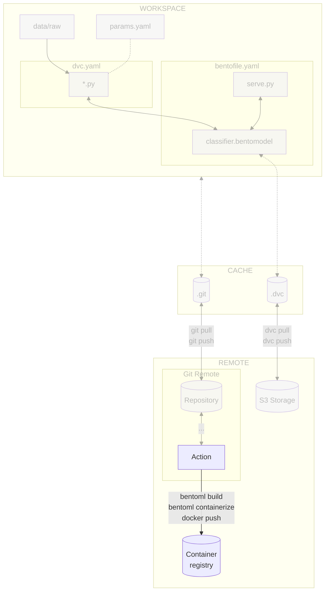

# Chapter 3.4 - Build and publish the model with BentoML and Docker in the CI/CD pipeline

## Introduction

In this chapter, you will containerize and push the model to the container
registry with the help of the CI/CD pipeline. You will use
[:simple-bentoml: BentoML](../tools.md) and
[:simple-docker: Docker](../tools.md) to containerize and publish the model and
the pipeline to trigger the publishing.

The steps will be similar to the last chapter, but we will use the pipeline to
automate the process.

In this chapter, you will learn how to:

1. Grant access to the container registry on the cloud provider for the CI/CD
   pipeline
2. Store the container registry credentials in the CI/CD configuration
3. Create the CI/CD pipeline for publishing the model to the container registry

The following diagram illustrates the control flow of the experiment at the end
of this chapter:



## Steps

### Set up access to the container registry of the cloud provider

The container registry will need to be accessed inside the CI/CD pipeline to
push the Docker image.

This is the same process you did for DVC as described in
[Chapter 8 - Reproduce the ML experiment in a CI/CD pipeline](../part-2-move-the-model-to-the-cloud/chapter-23-reproduce-the-ml-experiment-in-a-cicd-pipeline.md)
but this time for the container registry.

=== ":simple-googlecloud: Google Cloud"

    Update the Google Service Account and its associated Google Service Account Key
    to access Google Cloud from the CI/CD pipeline without your own credentials.

    ```sh title="Execute the following command(s) in a terminal"
    # Set the Cloud Storage permissions for the Google Service Account
    gcloud projects add-iam-policy-binding $GCP_PROJECT_ID \
        --member="serviceAccount:google-service-account@${GCP_PROJECT_ID}.iam.gserviceaccount.com" \
        --role="roles/storage.objectAdmin"

    # Set the Artifact Registry permissions for the Google Service Account
    gcloud projects add-iam-policy-binding $GCP_PROJECT_ID \
        --member="serviceAccount:google-service-account@${GCP_PROJECT_ID}.iam.gserviceaccount.com" \
        --role="roles/artifactregistry.createOnPushWriter"
    ```

    !!! tip

        There is no need to update the value in the CI/CD pipeline configuration.

        All changes are made at the Google Cloud level and the key file is not changed.

=== ":material-cloud: Using another cloud provider? Read this!"

    This guide has been written with Google Cloud in mind. We are open to
    contributions to add support for other cloud providers such as
    [:simple-amazonwebservices: Amazon Web Services](https://aws.amazon.com),
    [:simple-exoscale: Exoscale](https://www.exoscale.com),
    [:material-microsoft-azure: Microsoft Azure](https://azure.microsoft.com) or
    [:simple-kubernetes: Self-hosted Kubernetes](https://kubernetes.io) but we might
    not officially support them.

    If you want to contribute, please open an issue or a pull request on the
    [GitHub repository](https://github.com/swiss-ai-center/a-guide-to-mlops). Your
    help is greatly appreciated!

### Add container registry CI/CD secrets

Add the container registry secret to access the container registry from the
CI/CD pipeline. Depending on the CI/CD platform you are using, the process will
be different:

=== ":simple-googlecloud: Google Cloud"

    === ":simple-github: GitHub"

        Create the following new variables by going to the **Settings** section from the
        top header of your GitHub repository. Select **Secrets and variables > Actions**
        and select **New repository secret**:

        - `GCP_CONTAINER_REGISTRY_HOST`: The host of the container registry (ex:
          `europe-west6-docker.pkg.dev/mlops-surname-project/mlops-surname-registry`, from
          the variable `GCP_CONTAINER_REGISTRY_HOST` in the previous chapter)

        Save the variables by selecting **Add secret**.

    === ":simple-gitlab: GitLab"

        Create the following new variables by going to **Settings > CI/CD** from the
        left sidebar of your GitLab project. Select **Variables** and select
        **Add variable**:

        - `GCP_CONTAINER_REGISTRY_HOST`: The host of the container registry (ex:
          `europe-west6-docker.pkg.dev/mlops-surname-project/mlops-surname-registry`, from
          the variable `GCP_CONTAINER_REGISTRY_HOST` in the previous chapter)
            - **Protect variable**: _Unchecked_
            - **Mask variable**: _Checked_
            - **Expand variable reference**: _Unchecked_

        Save the variables by selecting **Add secret**.

=== ":material-cloud: Using another cloud provider? Read this!"

    This guide has been written with Google Cloud in mind. We are open to
    contributions to add support for other cloud providers such as
    [:simple-amazonwebservices: Amazon Web Services](https://aws.amazon.com),
    [:simple-exoscale: Exoscale](https://www.exoscale.com),
    [:material-microsoft-azure: Microsoft Azure](https://azure.microsoft.com) or
    [:simple-kubernetes: Self-hosted Kubernetes](https://kubernetes.io) but we might
    not officially support them.

    If you want to contribute, please open an issue or a pull request on the
    [GitHub repository](https://github.com/swiss-ai-center/a-guide-to-mlops). Your
    help is greatly appreciated!

### Update the CI/CD pipeline configuration file

You will adjust the pipeline to build and push the the docker image to the
container registry. The following steps will be performed:

1. Detect a new commit on the `main` branch
2. Authenticate to the cloud provider
3. Build the Docker image
4. Push the Docker image to the container registry

=== ":simple-github: GitHub"

    Update the `.github/workflows/mlops.yaml` file with the following content.

    Take some time to understand the deploy job and its steps:

    ```yaml title=".github/workflows/mlops.yaml" hl_lines="16 88-133"
    name: MLOps

    on:
      # Runs on pushes targeting main branch
      push:
        branches:
          - main

      # Runs on pull requests
      pull_request:

      # Allows you to run this workflow manually from the Actions tab
      workflow_dispatch:

    jobs:
      train-report-and-publish:
        permissions: write-all
        runs-on: ubuntu-latest
        steps:
          - name: Checkout repository
            uses: actions/checkout@v5
          - name: Setup Python
            uses: actions/setup-python@v6
            with:
              python-version: '3.13'
              cache: pip
          - name: Install dependencies
            run: pip install --requirement requirements-freeze.txt
          - name: Login to Google Cloud
            uses: google-github-actions/auth@v3
            with:
              credentials_json: '${{ secrets.GOOGLE_SERVICE_ACCOUNT_KEY }}'
          - name: Train model
            run: dvc repro --pull
          - name: Setup CML
            if: github.event_name == 'pull_request'
            uses: iterative/setup-cml@v2
            with:
              version: '0.20.6'
          - name: Create CML report
            if: github.event_name == 'pull_request'
            env:
              REPO_TOKEN: ${{ secrets.GITHUB_TOKEN }}
            run: |
              # Fetch all other Git branches
              git fetch --depth=1 origin main:main

              # Add title to the report
              echo "# Experiment Report (${{ github.sha }})" >> report.md

              # Compare parameters to main branch
              echo "## Params workflow vs. main" >> report.md
              dvc params diff main --md >> report.md

              # Compare metrics to main branch
              echo "## Metrics workflow vs. main" >> report.md
              dvc metrics diff main --md >> report.md

              # Compare plots (images) to main branch
              dvc plots diff main

              # Create plots
              echo "## Plots" >> report.md

              # Create training history plot
              echo "### Training History" >> report.md
              echo "#### main" >> report.md
              echo '' >> report.md
              echo "#### workspace" >> report.md
              echo '' >> report.md

              # Create predictions preview
              echo "### Predictions Preview" >> report.md
              echo "#### main" >> report.md
              echo '' >> report.md
              echo "#### workspace" >> report.md
              echo '' >> report.md

              # Create confusion matrix
              echo "### Confusion Matrix" >> report.md
              echo "#### main" >> report.md
              echo '' >> report.md
              echo "#### workspace" >> report.md
              echo '' >> report.md

              # Publish the CML report
              cml comment update --target=pr --publish report.md
          - name: Log in to the Container registry
            uses: docker/login-action@v3
            with:
              registry: ${{ secrets.GCP_CONTAINER_REGISTRY_HOST }}
              username: _json_key
              password: ${{ secrets.GOOGLE_SERVICE_ACCOUNT_KEY }}
          - name: Import the BentoML model
            if: github.ref == 'refs/heads/main'
            run: bentoml models import model/celestial_bodies_classifier_model.bentomodel
          - name: Build the BentoML model artifact
            if: github.ref == 'refs/heads/main'
            run: bentoml build src
          - name: Containerize and publish the BentoML model artifact Docker image
            if: github.ref == 'refs/heads/main'
            run: |
              # Containerize the Bento
              bentoml containerize celestial_bodies_classifier:latest \
                --image-tag ${{ secrets.GCP_CONTAINER_REGISTRY_HOST }}/celestial-bodies-classifier:latest \
                --image-tag ${{ secrets.GCP_CONTAINER_REGISTRY_HOST }}/celestial-bodies-classifier:${{ github.sha }}
              # Push the container to the Container Registry
              docker push --all-tags ${{ secrets.GCP_CONTAINER_REGISTRY_HOST }}/celestial-bodies-classifier
    ```

    Check the differences with Git to validate the changes.

    ```sh title="Execute the following command(s) in a terminal"
    # Show the differences with Git
    git diff .github/workflows/mlops.yaml
    ```

    The output should be similar to this:

    ```diff
    diff --git a/.github/workflows/mlops.yaml b/.github/workflows/mlops.yaml
    index 1fa989b..6d479ef 100644
    --- a/.github/workflows/mlops.yaml
    +++ b/.github/workflows/mlops.yaml
    @@ -13,7 +13,7 @@ on:
       workflow_dispatch:

     jobs:
    -  train-and-report:
    +  train-report-and-publish:
         permissions: write-all
         runs-on: ubuntu-latest
         steps:
    @@ -85,3 +85,43 @@ jobs:

               # Publish the CML report
               cml comment update --target=pr --publish report.md
    +      - name: Log in to the Container registry
    +        uses: docker/login-action@v3
    +        with:
    +          registry: ${{ secrets.GCP_CONTAINER_REGISTRY_HOST }}
    +          username: _json_key
    +          password: ${{ secrets.GOOGLE_SERVICE_ACCOUNT_KEY }}
    +      - name: Import the BentoML model
    +        if: github.ref == 'refs/heads/main'
    +        run: bentoml models import model/celestial_bodies_classifier_model.bentomodel
    +      - name: Build the BentoML model artifact
    +        if: github.ref == 'refs/heads/main'
    +        run: bentoml build src
    +      - name: Containerize and publish the BentoML model artifact Docker image
    +        if: github.ref == 'refs/heads/main'
    +        run: |
    +          # Containerize the Bento
    +          bentoml containerize celestial_bodies_classifier:latest \
    +            --image-tag ${{ secrets.GCP_CONTAINER_REGISTRY_HOST }}/celestial-bodies-classifier:latest \
    +            --image-tag ${{ secrets.GCP_CONTAINER_REGISTRY_HOST }}/celestial-bodies-classifier:${{ github.sha }}
    +          # Push the container to the Container Registry
    +          docker push --all-tags ${{ secrets.GCP_CONTAINER_REGISTRY_HOST }}/celestial-bodies-classifier
    ```

=== ":simple-gitlab: GitLab"

    **Update the CI/CD pipeline configuration file**

    Update the `.gitlab-ci.yml` file to add a new stage to deploy the model on the
    Kubernetes cluster.

    Take some time to understand the publish and deploy job and its steps.

    ```yaml title=".gitlab-ci.yml" hl_lines="4-5 101-169"
    stages:
      - train
      - report
      - publish
      - deploy

    variables:
      # Change pip's cache directory to be inside the project directory since we can
      # only cache local items.
      PIP_CACHE_DIR: "$CI_PROJECT_DIR/.cache/pip"
      # https://dvc.org/doc/user-guide/troubleshooting?tab=GitLab-CI-CD#git-shallow
      GIT_DEPTH: "0"
      # Set the path to Google Service Account key for DVC - https://dvc.org/doc/command-reference/remote/add#google-cloud-storage
      GOOGLE_APPLICATION_CREDENTIALS: "${CI_PROJECT_DIR}/google-service-account-key.json"
      # Environment variable for CML
      REPO_TOKEN: $GITLAB_PAT

    train:
      stage: train
      image: python:3.13
      rules:
        - if: $CI_COMMIT_BRANCH == "main"
        - if: $CI_PIPELINE_SOURCE == "merge_request_event"
      before_script:
        # Set the Google Service Account key
        - echo "${GOOGLE_SERVICE_ACCOUNT_KEY}" | base64 -d > $GOOGLE_APPLICATION_CREDENTIALS
        # Create the virtual environment for caching
        - python3.13 -m venv .venv
        - source .venv/bin/activate
      script:
        # Install dependencies
        - pip install --requirement requirements-freeze.txt
        # Run the experiment
        - dvc repro --pull
      cache:
        paths:
          # Pip's cache doesn't store the Python packages
          # https://pip.pypa.io/en/stable/reference/pip_install/#caching
          - .cache/pip
          - .venv/

    report:
      stage: report
      image: iterativeai/cml:0-dvc3-base1
      needs:
        - train
      rules:
        - if: $CI_PIPELINE_SOURCE == "merge_request_event"
      before_script:
        # Set the Google Service Account key
        - echo "${GOOGLE_SERVICE_ACCOUNT_KEY}" | base64 -d > $GOOGLE_APPLICATION_CREDENTIALS
      script:
        - |
          # Fetch the experiment changes
          dvc pull

          # Fetch all other Git branches
          git fetch --depth=1 origin main:main

          # Add title to the report
          echo "# Experiment Report (${CI_COMMIT_SHA})" >> report.md

          # Compare parameters to main branch
          echo "## Params workflow vs. main" >> report.md
          dvc params diff main --md >> report.md

          # Compare metrics to main branch
          echo "## Metrics workflow vs. main" >> report.md
          dvc metrics diff main --md >> report.md

          # Compare plots (images) to main branch
          dvc plots diff main

          # Create plots
          echo "## Plots" >> report.md

          # Create training history plot
          echo "### Training History" >> report.md
          echo "#### main" >> report.md
          echo '' >> report.md
          echo "#### workspace" >> report.md
          echo '' >> report.md

          # Create predictions preview
          echo "### Predictions Preview" >> report.md
          echo "#### main" >> report.md
          echo '' >> report.md
          echo "#### workspace" >> report.md
          echo '' >> report.md

          # Create confusion matrix
          echo "### Confusion Matrix" >> report.md
          echo "#### main" >> report.md
          echo '' >> report.md
          echo "#### workspace" >> report.md
          echo '' >> report.md

          # Publish the CML report
          cml comment update --target=pr --publish report.md

    publish:
      stage: publish
      image: python:3.13
      needs:
        - train
      rules:
        - if: $CI_COMMIT_BRANCH == "main"
      services:
        - docker:25.0.3-dind
      variables:
        DOCKER_HOST: "tcp://docker:2375"
      before_script:
        # Install Docker
        - apt-get update
        - apt-get install --yes ca-certificates curl
        - install -m 0755 -d /etc/apt/keyrings
        - curl -fsSL https://download.docker.com/linux/debian/gpg -o /etc/apt/keyrings/docker.asc
        - chmod a+r /etc/apt/keyrings/docker.asc
        - echo "deb [arch=$(dpkg --print-architecture) signed-by=/etc/apt/keyrings/docker.asc] https://download.docker.com/linux/debian $(. /etc/os-release && echo "$VERSION_CODENAME") stable" | tee /etc/apt/sources.list.d/docker.list > /dev/null
        - apt-get update
        - apt-get install --yes docker-ce docker-ce-cli containerd.io docker-buildx-plugin docker-compose-plugin
        # Set the Google Service Account key
        - echo "${GOOGLE_SERVICE_ACCOUNT_KEY}" | base64 -d > $GOOGLE_APPLICATION_CREDENTIALS
        # Login to the Google Container Registry
        - cat "${GOOGLE_APPLICATION_CREDENTIALS}" | docker login -u _json_key --password-stdin "${GCP_CONTAINER_REGISTRY_HOST}"
        # Create the virtual environment for caching
        - python3.13 -m venv .venv
        - source .venv/bin/activate
      script:
        # Install dependencies
        - pip install --requirement requirements-freeze.txt
        # Pull the BentoML model artifact
        - dvc pull model/celestial_bodies_classifier_model.bentomodel
        # Import the BentoML model
        - bentoml models import model/celestial_bodies_classifier_model.bentomodel
        # Build the BentoML model artifact
        - bentoml build src
        # Containerize and publish the BentoML model artifact Docker image
        - |
          bentoml containerize celestial_bodies_classifier:latest \
            --image-tag $GCP_CONTAINER_REGISTRY_HOST/celestial-bodies-classifier:latest \
            --image-tag $GCP_CONTAINER_REGISTRY_HOST/celestial-bodies-classifier:${CI_COMMIT_SHA}
        # Push the container to the Container Registry
        - docker push --all-tags $GCP_CONTAINER_REGISTRY_HOST/celestial-bodies-classifier
      cache:
        paths:
          # Pip's cache doesn't store the Python packages
          # https://pip.pypa.io/en/stable/reference/pip_install/#caching
          - .cache/pip
          - .venv/
    ```

    Check the differences with Git to validate the changes.

    ```sh title="Execute the following command(s) in a terminal"
    # Show the differences with Git
    git diff .gitlab-ci.yml
    ```

    The output should be similar to this:

    ```diff
    diff --git a/.gitlab-ci.yml b/.gitlab-ci.yml
    index dbf3b25..7dcdfe7 100644
    --- a/.gitlab-ci.yml
    +++ b/.gitlab-ci.yml
    @@ -1,6 +1,8 @@
     stages:
       - train
       - report
    +  - publish

     variables:
       # Change pip's cache directory to be inside the project directory since we can
    @@ -95,3 +97,73 @@ report:

           # Publish the CML report
           cml comment update --target=pr --publish report.md
    +
    +publish:
    +  stage: publish
    +  image: python:3.13
    +  needs:
    +    - train
    +  rules:
    +    - if: $CI_COMMIT_BRANCH == "main"
    +  services:
    +    - docker:25.0.3-dind
    +  variables:
    +    DOCKER_HOST: "tcp://docker:2375"
    +  before_script:
    +    # Install Docker
    +    - apt-get update
    +    - apt-get install --yes ca-certificates curl
    +    - install -m 0755 -d /etc/apt/keyrings
    +    - curl -fsSL https://download.docker.com/linux/debian/gpg -o /etc/apt/keyrings/docker.asc
    +    - chmod a+r /etc/apt/keyrings/docker.asc
    +    - echo "deb [arch=$(dpkg --print-architecture) signed-by=/etc/apt/keyrings/docker.asc] https://download.docker.com/linux/debian $(. /etc/os-release && echo "$VERSION_CODENAME") stable" | tee /etc/apt/sources.list.d/docker.list > /dev/null
    +    - apt-get update
    +    - apt-get install --yes docker-ce docker-ce-cli containerd.io docker-buildx-plugin docker-compose-plugin
    +    # Set the Google Service Account key
    +    - echo "${GOOGLE_SERVICE_ACCOUNT_KEY}" | base64 -d > $GOOGLE_APPLICATION_CREDENTIALS
    +    # Login to the Google Container Registry
    +    - cat "${GOOGLE_APPLICATION_CREDENTIALS}" | docker login -u _json_key --password-stdin "${GCP_CONTAINER_REGISTRY_HOST}"
    +    # Create the virtual environment for caching
    +    - python3.13 -m venv .venv
    +    - source .venv/bin/activate
    +  script:
    +    # Install dependencies
    +    - pip install --requirement requirements-freeze.txt
    +    # Pull the BentoML model artifact
    +    - dvc pull model/celestial_bodies_classifier_model.bentomodel
    +    # Import the BentoML model
    +    - bentoml models import model/celestial_bodies_classifier_model.bentomodel
    +    # Build the BentoML model artifact
    +    - bentoml build src
    +    # Containerize and publish the BentoML model artifact Docker image
    +    - |
    +      bentoml containerize celestial_bodies_classifier:latest \
    +        --image-tag $GCP_CONTAINER_REGISTRY_HOST/celestial-bodies-classifier:latest \
    +        --image-tag $GCP_CONTAINER_REGISTRY_HOST/celestial-bodies-classifier:${CI_COMMIT_SHA}
    +    # Push the container to the Container Registry
    +    - docker push --all-tags $GCP_CONTAINER_REGISTRY_HOST/celestial-bodies-classifier
    +  cache:
    +    paths:
    +      # Pip's cache doesn't store the Python packages
    +      # https://pip.pypa.io/en/stable/reference/pip_install/#caching
    +      - .cache/pip
    +      - .venv/
    ```

### Check the changes

Check the changes with Git to ensure that all the necessary files are tracked:

```sh title="Execute the following command(s) in a terminal"
# Add all the files
git add .

# Check the changes
git status
```

The output should look similar to this:

```text
On branch main
Your branch is up to date with 'origin/main'.

Changes to be committed:
(use "git restore --staged <file>..." to unstage)
    modified:   .github/workflows/mlops.yaml
```

### Commit the changes to Git

Commit the changes to Git.

```sh title="Execute the following command(s) in a terminal"
# Commit the changes
git commit -m "Use the pipeline to containerize and publish the model artifact to the model registry"

# Push the changes
git push
```

## Summary

Congratulations! You have successfully prepared the model for automated
deployment in a production environment with the CI/CD pipeline!

New versions of the model will be published to the artifact registry
automatically as soon as they are pushed to the main branch.

In this chapter, you have successfully:

1. Automated the containerization and publication of the BentoML model artifact
   to the container registry

!!! abstract "Take away"

    - **Automation prevents deployment drift**: By building and publishing models
      automatically in the CI/CD pipeline, you ensure that every model version that
      reaches production follows the exact same build process, eliminating manual
      steps that can introduce errors.
    - **Service accounts enable secure automation**: Using cloud service accounts
      with minimal required permissions (rather than personal credentials) follows the
      principle of least privilege and allows CI/CD pipelines to authenticate securely
      without exposing sensitive credentials.
    - **Secrets management is critical for cloud integration**: Properly storing
      credentials as CI/CD secrets (masked, encrypted, and access-controlled) prevents
      accidental exposure while allowing automated workflows to interact with cloud
      resources like container registries.
    - **Automated publication shortens the deployment cycle**: Automatically
      publishing new model versions to the container registry on every merge to main
      enables rapid iteration and reduces the time from model improvement to
      production deployment.

## State of the MLOps process

- [x] Notebook has been transformed into scripts for production
- [x] Codebase and dataset are versioned
- [x] Steps used to create the model are documented and can be re-executed
- [x] Changes done to a model can be visualized with parameters, metrics and
      plots to identify differences between iterations
- [x] Codebase can be shared and improved by multiple developers
- [x] Dataset can be shared among the developers and is placed in the right
      directory in order to run the experiment
- [x] Experiment can be executed on a clean machine with the help of a CI/CD
      pipeline
- [x] CI/CD pipeline is triggered on pull requests and reports the results of
      the experiment
- [x] Changes to model can be thoroughly reviewed and discussed before
      integrating them into the codebase
- [x] Model can be saved and loaded with all required artifacts for future usage
- [x] Model can be easily used outside of the experiment context
- [x] Model publication to the artifact registry is automated
- [ ] Model is accessible from the Internet and can be used anywhere
- [ ] Model requires manual deployment on the cluster
- [ ] Model cannot be trained on hardware other than the local machine
- [ ] Model cannot be trained on custom hardware for specific use-cases

You will address these issues in the next chapters for improved efficiency and
collaboration. Continue the guide to learn how.

## Sources

Highly inspired by:

- [_Connecting a repository to a package_ - docs.github.com](https://docs.github.com/en/packages/learn-github-packages/connecting-a-repository-to-a-package)
- [_Working with the Container registry_ - docs.github.com](https://docs.github.com/en/packages/working-with-a-github-packages-registry/working-with-the-container-registry)
- [_Containerization_ - docs.bentoml.com](https://docs.bentoml.com/en/latest/guides/containerization.html)
- [_Build options_ - docs.bentoml.com](https://docs.bentoml.com/en/latest/guides/build-options.html)
