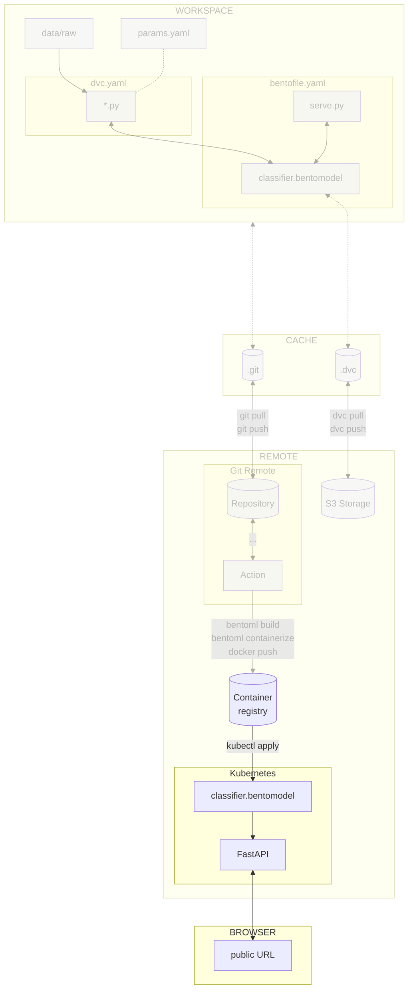

# Chapter 3.5: Deploy and access the model on Kubernetes

## Introduction

In this chapter, you will learn how to deploy the model on Kubernetes and access
it from a Kubernetes pod using the previous Docker image.

This will allow the model to be used by other applications and services on a
public endpoint accessible from anywhere.

In this chapter, you will learn how to:

1. Create the Kubernetes cluster
2. Validate kubectl can access the Kubernetes cluster
3. Create the Kubernetes configuration files
4. Deploy the Docker image on Kubernetes
5. Access the model

!!! danger

    The following steps will create resources on the cloud provider. These resources
    will be deleted at the end of the guide, but you might be charged for them.
    Kubernetes clusters are not free on most cloud providers and can be expensive.
    Make sure to delete the resources at the end of the guide.

The following diagram illustrates the control flow of the experiment at the end
of this chapter:



## Steps

### Install the Kubernetes CLI

Install the Kubernetes CLI (kubectl) on your machine.

=== ":simple-googlecloud: Google Cloud"

    Install kubectl with the
    [Google Cloud CLI](https://cloud.google.com/sdk/docs/install). You might need to
    follow the instructions in the terminal and the related documentation.

    ```sh title="Execute the following command(s) in a terminal"
    # Install kubectl with gcloud
    gcloud components install kubectl
    ```

    As per the instructions, you will need to install the `gke-gcloud-auth-plugin`
    authentication plugin as well.

=== ":material-cloud: Using another cloud provider? Read this!"

    This guide has been written with Google Cloud in mind. We are open to
    contributions to add support for other cloud providers such as
    [:simple-amazonwebservices: Amazon Web Services](https://aws.amazon.com),
    [:simple-exoscale: Exoscale](https://www.exoscale.com),
    [:material-microsoft-azure: Microsoft Azure](https://azure.microsoft.com) or
    [:simple-kubernetes: Self-hosted Kubernetes](https://kubernetes.io) but we might
    not officially support them.

    If you want to contribute, please open an issue or a pull request on the
    [GitHub repository](https://github.com/swiss-ai-center/a-guide-to-mlops). Your
    help is greatly appreciated!

### Create the Kubernetes cluster

In order to deploy the model on Kubernetes, you will need a Kubernetes cluster.

Follow the steps below to create one.

=== ":simple-googlecloud: Google Cloud"

    **Enable the Google Kubernetes Engine API**

    You must enable the Google Kubernetes Engine API to create Kubernetes clusters
    on Google Cloud with the following command:

    !!! tip

        You can display the available services in your project with the following
        command:

        ```sh title="Execute the following command(s) in a terminal"
        # List the services
        gcloud services list
        ```

    ```sh title="Execute the following command(s) in a terminal"
    # Enable the Google Kubernetes Engine API
    gcloud services enable container.googleapis.com
    ```

    **Create the Kubernetes cluster**

    Create the Google Kubernetes cluster with the Google Cloud CLI.

    Export the cluster name as an environment variable. Replace `<my_cluster_name>`
    with a cluster name of your choice. It has to be lowercase and words separated
    by hyphens.

    !!! warning

        The cluster name must be **unique** across all Google Cloud projects and users.
        For example, use `mlops-<surname>-cluster`, where `surname` is based on your
        name. Change the cluster name if the command fails.

    ```sh title="Execute the following command(s) in a terminal"
    export GCP_K8S_CLUSTER_NAME=<my_cluster_name>
    ```

    Export the cluster zone as an environment variable. You can view the available
    zones at
    [Regions and zones](https://cloud.google.com/compute/docs/regions-zones#available).
    You should ideally select a zone close to where most of the expected traffic
    will come from. Replace `<my_cluster_zone>` with your own zone (ex:
    `europe-west6-a` for Zurich, Switzerland).

    ```sh title="Execute the following command(s) in a terminal"
    export GCP_K8S_CLUSTER_ZONE=<my_cluster_zone>
    ```

    Create the Kubernetes cluster. You can also view the available types of machine
    with the `gcloud compute machine-types list` command.

    !!! info

         This can take several minutes. Please be patient.

    ```sh title="Execute the following command(s) in a terminal"
    # Create the Kubernetes cluster
    gcloud container clusters create \
        --machine-type=e2-standard-2 \
        --num-nodes=2 \
        --zone=$GCP_K8S_CLUSTER_ZONE \
        $GCP_K8S_CLUSTER_NAME
    ```

    The output should be similar to this:

    ```text
    Note: The Kubelet readonly port (10255) is now deprecated. Please update your workloads to use the recommended alternatives. See https://cloud.google.com/kubernetes-engine/docs/how-to/disable-kubelet-readonly-port for ways to check usage and for migration instructions.
    Note: Your Pod address range (`--cluster-ipv4-cidr`) can accommodate at most 1008 node(s).
    Creating cluster mlops-surname-cluster in europe-west6-a... Cluster is being health-checked (Kubernetes Control Plane is healthy)...done.
    Created [https://container.googleapis.com/v1/projects/mlops-surname-project/zones/europe-west6-a/clusters/mlops-surname-cluster].
    To inspect the contents of your cluster, go to: https://console.cloud.google.com/kubernetes/workload_/gcloud/europe-west6-a/mlops-surname-cluster?project=mlops-surname-cluster
    kubeconfig entry generated for mlops-surname-cluster.
    NAME                   LOCATION        MASTER_VERSION      MASTER_IP      MACHINE_TYPE   NODE_VERSION        NUM_NODES  STATUS
    mlops-surname-cluster  europe-west6-a  1.30.5-gke.1014001  34.65.137.236  e2-standard-2  1.30.5-gke.1014001  2          RUNNING
    ```

=== ":material-cloud: Using another cloud provider? Read this!"

    This guide has been written with Google Cloud in mind. We are open to
    contributions to add support for other cloud providers such as
    [:simple-amazonwebservices: Amazon Web Services](https://aws.amazon.com),
    [:simple-exoscale: Exoscale](https://www.exoscale.com),
    [:material-microsoft-azure: Microsoft Azure](https://azure.microsoft.com) or
    [:simple-kubernetes: Self-hosted Kubernetes](https://kubernetes.io) but we might
    not officially support them.

    If you want to contribute, please open an issue or a pull request on the
    [GitHub repository](https://github.com/swiss-ai-center/a-guide-to-mlops). Your
    help is greatly appreciated!

### Validate kubectl can access the Kubernetes cluster

Validate kubectl can access the Kubernetes cluster:

```sh title="Execute the following command(s) in a terminal"
# Get namespaces
kubectl get namespaces
```

The output should be similar to this:

```text
NAME              STATUS   AGE
NAME                 STATUS   AGE
default              Active   2m45s
gke-managed-cim      Active   2m15s
gke-managed-system   Active   2m4s
gmp-public           Active   109s
gmp-system           Active   109s
kube-node-lease      Active   2m45s
kube-public          Active   2m45s
kube-system          Active   2m45s
```

### Create the Kubernetes configuration files

In order to deploy the model on Kubernetes, you will need to create the
Kubernetes configuration files. These files describe the deployment and service
of the model.

Create a new directory called `kubernetes` in the root of the project.

Create a new file called `deployment.yaml` in the `kubernetes` directory with
the following content. Replace `<docker_image>` with the Docker image you have
created in the previous steps:

!!! tip

    You can find the Docker image with the following command:

    ```sh title="Execute the following command(s) in a terminal"
    # Get the Docker image
    echo $GCP_CONTAINER_REGISTRY_HOST/celestial-bodies-classifier:latest
    ```

```yaml title="kubernetes/deployment.yaml" hl_lines="19"
apiVersion: apps/v1
kind: Deployment
metadata:
  name: celestial-bodies-classifier-deployment
  labels:
    app: celestial-bodies-classifier
spec:
  replicas: 1
  selector:
    matchLabels:
      app: celestial-bodies-classifier
  template:
    metadata:
      labels:
        app: celestial-bodies-classifier
    spec:
      containers:
      - name: celestial-bodies-classifier
        image: <docker_image>
```

Create a new file called `service.yaml` in the `kubernetes` directory with the
following content:

```yaml title="kubernetes/service.yaml"
apiVersion: v1
kind: Service
metadata:
  name: celestial-bodies-classifier-service
spec:
  type: LoadBalancer
  ports:
    - name: http
      port: 80
      targetPort: 3000
      protocol: TCP
  selector:
    app: celestial-bodies-classifier
```

The `deployment.yaml` file describes the deployment of the model. It contains
the number of replicas, the image to use, and the labels to use.

The `service.yaml` file describes the service of the model. It contains the type
of service, the ports to use, and the labels to use.

### Deploy the containerised model on Kubernetes

To deploy the containerised Bento model artifact on Kubernetes, you will need to
apply the Kubernetes configuration files.

Apply the Kubernetes configuration files with the following commands:

```sh title="Execute the following command(s) in a terminal"
# Apply the deployment
kubectl apply -f kubernetes/deployment.yaml

# Apply the service
kubectl apply -f kubernetes/service.yaml
```

The output should be similar to this:

```text
deployment.apps/celestial-bodies-classifier-deployment created
service/celestial-bodies-classifier-service created
```

Open the cluster interface on the cloud provider and check that the model has
been deployed.

=== ":simple-googlecloud: Google Cloud"

    Open the [Kubernetes Engine](https://console.cloud.google.com/kubernetes) on the
    Google cloud interface and click on your cluster to access the details.

=== ":material-cloud: Using another cloud provider? Read this!"

    This guide has been written with Google Cloud in mind. We are open to
    contributions to add support for other cloud providers such as
    [:simple-amazonwebservices: Amazon Web Services](https://aws.amazon.com),
    [:simple-exoscale: Exoscale](https://www.exoscale.com),
    [:material-microsoft-azure: Microsoft Azure](https://azure.microsoft.com) or
    [:simple-kubernetes: Self-hosted Kubernetes](https://kubernetes.io) but we might
    not officially support them.

    If you want to contribute, please open an issue or a pull request on the
    [GitHub repository](https://github.com/swiss-ai-center/a-guide-to-mlops). Your
    help is greatly appreciated!

### Access the model

To access the model, you will need to find the external IP address of the
service. You can do so with the following command:

!!! info

    The external IP address of the service can take a few minutes to be available.

```sh title="Execute the following command(s) in a terminal"
# Get the description of the service
kubectl describe services celestial-bodies-classifier
```

The output should be similar to this:

```text hl_lines="11"
Name:                     celestial-bodies-classifier-service
Namespace:                default
Labels:                   <none>
Annotations:              cloud.google.com/neg: {"ingress":true}
Selector:                 app=celestial-bodies-classifier
Type:                     LoadBalancer
IP Family Policy:         SingleStack
IP Families:              IPv4
IP:                       34.118.228.127
IPs:                      34.118.228.127
LoadBalancer Ingress:     34.65.255.92 (VIP)
Port:                     http  80/TCP
TargetPort:               3000/TCP
NodePort:                 http  30773/TCP
Endpoints:
Session Affinity:         None
External Traffic Policy:  Cluster
Internal Traffic Policy:  Cluster
Events:
  Type    Reason                Age   From                Message
  ----    ------                ----  ----                -------
  Normal  EnsuringLoadBalancer  91s   service-controller  Ensuring load balancer
  Normal  EnsuredLoadBalancer   56s   service-controller  Ensured load balancer
```

The `LoadBalancer Ingress` field contains the external IP address of the
service. In this case, it is `34.65.255.92`.

Try to access the model at the port `80` using the external IP address of the
service. You should be able to access the FastAPI documentation page at
`http://<load balancer ingress ip>:80`. In this case, it is
`http://34.65.255.92:80`.

### Check the changes

Check the changes with Git to ensure that all the necessary files are tracked:

```sh title="Execute the following command(s) in a terminal"
# Add all the files
git add .

# Check the changes
git status
```

The output should look similar to this:

```text
On branch main
Your branch is up to date with 'origin/main'.

Changes to be committed:
(use "git restore --staged <file>..." to unstage)
    new file:   kubernetes/deployment.yaml
    new file:   kubernetes/service.yaml
```

### Commit the changes to Git

Commit the changes to Git.

```sh title="Execute the following command(s) in a terminal"
# Commit the changes
git commit -m "Use Kubernetes to deploy the model"

# Push the changes
git push
```

## Summary

Congratulations! You have successfully deployed the model on Kubernetes with
BentoML and Docker, accessed it from an external IP address.

You can now use the model from anywhere.

In this chapter, you have successfully:

1. Created the Kubernetes configuration files and deployed the BentoML model
   artifact on Kubernetes
2. Accessed the model

## State of the MLOps process

- [x] Notebook has been transformed into scripts for production
- [x] Codebase and dataset are versioned
- [x] Steps used to create the model are documented and can be re-executed
- [x] Changes done to a model can be visualized with parameters, metrics and
      plots to identify differences between iterations
- [x] Codebase can be shared and improved by multiple developers
- [x] Dataset can be shared among the developers and is placed in the right
      directory in order to run the experiment
- [x] Experiment can be executed on a clean machine with the help of a CI/CD
      pipeline
- [x] CI/CD pipeline is triggered on pull requests and reports the results of
      the experiment
- [x] Changes to model can be thoroughly reviewed and discussed before
      integrating them into the codebase
- [x] Model can be saved and loaded with all required artifacts for future usage
- [x] Model can be easily used outside of the experiment context
- [x] Model publication to the artifact registry is automated
- [x] Model is accessible from the Internet and can be used anywhere
- [ ] Model requires manual deployment on the cluster
- [ ] Model cannot be trained on hardware other than the local machine
- [ ] Model cannot be trained on custom hardware for specific use-cases

You will address these issues in the next chapters for improved efficiency and
collaboration. Continue the guide to learn how.

## Sources

Highly inspired by:

- [_Connecting a repository to a package_ - docs.github.com](https://docs.github.com/en/packages/learn-github-packages/connecting-a-repository-to-a-package)
- [_Working with the Container registry_ - docs.github.com](https://docs.github.com/en/packages/working-with-a-github-packages-registry/working-with-the-container-registry)
- [_Containerization_ - docs.bentoml.com](https://docs.bentoml.com/en/latest/guides/containerization.html)
- [_Build options_ - docs.bentoml.com](https://docs.bentoml.com/en/latest/guides/build-options.html)
