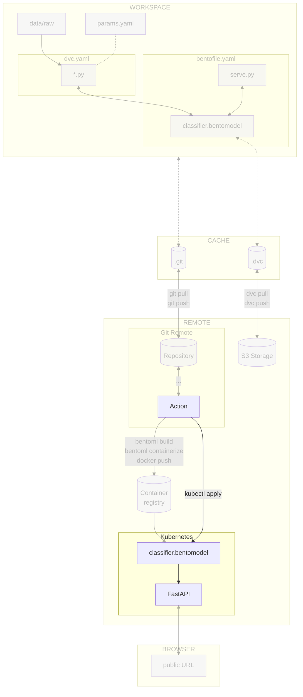

# Chapter 3.6 - Continuous deployment of the model with the CI/CD pipeline

## Introduction

In this chapter, you will deploy the model to the Kubernetes cluster with the
help of the CI/CD pipeline. You will use [Kubernetes](../tools.md) to deploy the
model to the cluster and the pipeline to trigger the deployment.

The steps will be similar to the last chapter, but we will use the pipeline to
automate the process.

In this chapter, you will learn how to:

1. Grant access to the Kubernetes cluster on the cloud provider for the CI/CD
   pipeline
2. Store the cloud provider credentials in the CI/CD configuration
3. Create the CI/CD pipeline for deploying the model to the Kubernetes cluster
4. Push the CI/CD pipeline configuration file to [:simple-git: Git](../tools.md)
5. Visualize the execution of the CI/CD pipeline

The following diagram illustrates the control flow of the experiment at the end
of this chapter:



## Steps

### Set up access to the Kubernetes cluster of the cloud provider

The Kubernetes cluster will need to be accessed inside the CI/CD pipeline to
deploy the Docker image.

This is the same process you did for the container registry as described in
[Chapter 3.4 - Build and publish the model with BentoML and Docker in the CI/CD pipeline](../part-3-serve-and-deploy-the-model/chapter-34-build-and-publish-the-model-with-bentoml-and-docker-with-the-cicd-pipeline.md)
but this time for the Kubernetes cluster.

Update the Google Service Account and its associated Google Service Account Key
to access Google Cloud from the CI/CD pipeline without your own credentials.

```sh title="Execute the following command(s) in a terminal"
# Set the Kubernetes Cluster permissions for the Google Service Account
gcloud projects add-iam-policy-binding $GCP_PROJECT_ID \
    --member="serviceAccount:google-service-account@${GCP_PROJECT_ID}.iam.gserviceaccount.com" \
    --role="roles/container.developer"
```

!!! tip

    There is no need to update the value in the CI/CD pipeline configuration.

    All changes are made at the Google Cloud level and the key file is not changed.

### Add Kubernetes CI/CD secrets

Add the Kubernetes secrets to access the Kubernetes cluster from the CI/CD
pipeline. Depending on the CI/CD platform you are using, the process will be
different:

Create the following new variables by going to the **Settings** section from the
top header of your GitHub repository. Select **Secrets and variables > Actions**
and select **New repository secret**:

- `GCP_K8S_CLUSTER_NAME`: The name of the Kubernetes cluster (ex:
  `mlops-surname-cluster`, from the variable `GCP_K8S_CLUSTER_NAME` in the
  previous chapters)
- `GCP_K8S_CLUSTER_ZONE`: The zone of the Kubernetes cluster (ex:
  `europe-west6-a` for Zurich, Switzerland, from the variable
  `GCP_K8S_CLUSTER_ZONE` in the previous chapters)

Save the variables by selecting **Add secret**.

### Update the CI/CD pipeline configuration file

You will adjust the pipeline to deploy the model to the Kubernetes cluster. The
following steps will be performed:

1. Detect a new commit on the `main` branch
2. Authenticate to the cloud provider
3. Build the Docker image
4. Push the Docker image to the container registry
5. Deploy the model on the Kubernetes cluster

Update the `.github/workflows/mlops.yaml` file with the following content.

Take some time to understand the deploy job and its steps:

```yaml title=".github/workflows/mlops.yaml" hl_lines="16 109-133"
name: MLOps

on:
  # Runs on pushes targeting main branch
  push:
    branches:
      - main

  # Runs on pull requests
  pull_request:

  # Allows you to run this workflow manually from the Actions tab
  workflow_dispatch:

jobs:
  train-report-publish-and-deploy:
    permissions: write-all
    runs-on: ubuntu-latest
    steps:
      - name: Checkout repository
        uses: actions/checkout@v5
      - name: Setup Python
        uses: actions/setup-python@v6
        with:
          python-version: '3.13'
          cache: pip
      - name: Install dependencies
        run: pip install --requirement requirements-freeze.txt
      - name: Login to Google Cloud
        uses: google-github-actions/auth@v3
        with:
          credentials_json: '${{ secrets.GOOGLE_SERVICE_ACCOUNT_KEY }}'
      - name: Train model
        run: dvc repro --pull
      - name: Setup CML
        if: github.event_name == 'pull_request'
        uses: iterative/setup-cml@v2
        with:
          version: '0.20.6'
      - name: Create CML report
        if: github.event_name == 'pull_request'
        env:
          REPO_TOKEN: ${{ secrets.GITHUB_TOKEN }}
        run: |
          # Fetch all other Git branches
          git fetch --depth=1 origin main:main

          # Add title to the report
          echo "# Experiment Report (${{ github.sha }})" >> report.md

          # Compare parameters to main branch
          echo "## Params workflow vs. main" >> report.md
          dvc params diff main --md >> report.md

          # Compare metrics to main branch
          echo "## Metrics workflow vs. main" >> report.md
          dvc metrics diff main --md >> report.md

          # Compare plots (images) to main branch
          dvc plots diff main

          # Create plots
          echo "## Plots" >> report.md

          # Create training history plot
          echo "### Training History" >> report.md
          echo "#### main" >> report.md
          echo '' >> report.md
          echo "#### workspace" >> report.md
          echo '' >> report.md

          # Create predictions preview
          echo "### Predictions Preview" >> report.md
          echo "#### main" >> report.md
          echo '' >> report.md
          echo "#### workspace" >> report.md
          echo '' >> report.md

          # Create confusion matrix
          echo "### Confusion Matrix" >> report.md
          echo "#### main" >> report.md
          echo '' >> report.md
          echo "#### workspace" >> report.md
          echo '' >> report.md

          # Publish the CML report
          cml comment update --target=pr --publish report.md
      - name: Log in to the Container registry
        uses: docker/login-action@v3
        with:
          registry: ${{ secrets.GCP_CONTAINER_REGISTRY_HOST }}
          username: _json_key
          password: ${{ secrets.GOOGLE_SERVICE_ACCOUNT_KEY }}
      - name: Import the BentoML model
        if: github.ref == 'refs/heads/main'
        run: bentoml models import model/celestial_bodies_classifier_model.bentomodel
      - name: Build the BentoML model artifact
        if: github.ref == 'refs/heads/main'
        run: bentoml build src
      - name: Containerize and publish the BentoML model artifact Docker image
        if: github.ref == 'refs/heads/main'
        run: |
          # Containerize the Bento
          bentoml containerize celestial_bodies_classifier:latest \
            --image-tag ${{ secrets.GCP_CONTAINER_REGISTRY_HOST }}/celestial-bodies-classifier:latest \
            --image-tag ${{ secrets.GCP_CONTAINER_REGISTRY_HOST }}/celestial-bodies-classifier:${{ github.sha }}
          # Push the container to the Container Registry
          docker push --all-tags ${{ secrets.GCP_CONTAINER_REGISTRY_HOST }}/celestial-bodies-classifier
      - name: Get Google Cloud's Kubernetes credentials
        if: github.ref == 'refs/heads/main'
        uses: google-github-actions/get-gke-credentials@v3
        with:
          cluster_name: ${{ secrets.GCP_K8S_CLUSTER_NAME }}
          location: ${{ secrets.GCP_K8S_CLUSTER_ZONE }}
      - name: Update the Kubernetes deployment
        if: github.ref == 'refs/heads/main'
        run: |
          yq -i '.spec.template.spec.containers[0].image = "${{ secrets.GCP_CONTAINER_REGISTRY_HOST }}/celestial-bodies-classifier:${{ github.sha }}"' kubernetes/deployment.yaml
      - name: Deploy the model on Kubernetes
        if: github.ref == 'refs/heads/main'
        run: |
          kubectl apply \
            -f kubernetes/deployment.yaml \
            -f kubernetes/service.yaml
```

Check the differences with Git to validate the changes.

```sh title="Execute the following command(s) in a terminal"
# Show the differences with Git
git diff .github/workflows/mlops.yaml
```

The output should be similar to this:

```diff
diff --git a/.github/workflows/mlops.yaml b/.github/workflows/mlops.yaml
index 1fa989b..6d479ef 100644
--- a/.github/workflows/mlops.yaml
+++ b/.github/workflows/mlops.yaml
@@ -13,7 +13,7 @@ on:
   workflow_dispatch:

 jobs:
-  train-report-and-publish:
+  train-report-publish-and-deploy:
     permissions: write-all
     runs-on: ubuntu-latest
     steps:
@@ -106,3 +106,43 @@ jobs:

           # Push the container to the Container Registry
           docker push --all-tags ${{ secrets.GCP_CONTAINER_REGISTRY_HOST }}/celestial-bodies-classifier
+      - name: Get Google Cloud's Kubernetes credentials
+        if: github.ref == 'refs/heads/main'
+        uses: google-github-actions/get-gke-credentials@v3
+        with:
+          cluster_name: ${{ secrets.GCP_K8S_CLUSTER_NAME }}
+          location: ${{ secrets.GCP_K8S_CLUSTER_ZONE }}
+      - name: Update the Kubernetes deployment
+        if: github.ref == 'refs/heads/main'
+        run: |
+          yq -i '.spec.template.spec.containers[0].image = "${{ secrets.GCP_CONTAINER_REGISTRY_HOST }}/celestial-bodies-classifier:${{ github.sha }}"' kubernetes/deployment.yaml
+      - name: Deploy the model on Kubernetes
+        if: github.ref == 'refs/heads/main'
+        run: |
+          kubectl apply \
+            -f kubernetes/deployment.yaml \
+            -f kubernetes/service.yaml
```

### Check the changes

Check the changes with Git to ensure that all the necessary files are tracked:

```sh title="Execute the following command(s) in a terminal"
# Add all the files
git add .

# Check the changes
git status
```

The output should look like this:

```text
On branch main
Your branch is up to date with 'origin/main'.

Changes to be committed:
(use "git restore --staged <file>..." to unstage)
    modified:   .github/workflows/mlops.yaml
```

### Commit the changes to Git

Push the CI/CD pipeline configuration file to Git:

```sh title="Execute the following command(s) in a terminal"
# Commit the changes
git commit -m "Use the pipeline to deploy the model on the Kubernetes cluster"

# Push the changes
git push
```

### Check the results

With the new configuration in place, each and every commit that makes its way to
the main branch will serve as a trigger for the pipeline, which will
automatically set in motion the deployment of the model, ensuring that the
latest version is consistently available on the Kubernetes server for use.

In the **Actions** tab, click on the **MLOps** workflow.

The output should look like this:

```text
Run kubectl apply \
deployment.apps/celestial-bodies-classifier-deployment configured
service/celestial-bodies-classifier-service configured
```

If you execute the pipeline a second time, you should see the following output:

```text
Run kubectl apply \
deployment.apps/celestial-bodies-classifier-deployment configured
service/celestial-bodies-classifier-service unchanged
```

As you can see, the deployment was successful and the service was unchanged.

### Access the model

You can access the new model at the same URL as before. The model should be
updated with the latest version.

!!! tip

    To get the external IP of the service, you can use the Google Cloud CLI.

    ```sh title="Execute the following command(s) in a terminal"
    # Get the description of the service
    kubectl describe services celestial-bodies-classifier
    ```

## Summary

Congratulations! You have successfully deployed the model on the Kubernetes
cluster automatically with the CI/CD pipeline!

New versions of the model will be deployed automatically as soon as they are
pushed to the main branch.

!!! abstract "Take away"

    - **Continuous deployment closes the MLOps loop**: Automatically deploying every
      model that reaches the main branch means improvements flow from experimentation
      to production without manual intervention, enabling rapid iteration and reducing
      time-to-value.
    - **Dynamic image tag updates ensure version traceability**: Using commit SHAs
      as Docker image tags and updating Kubernetes deployments to reference specific
      versions creates an audit trail from code changes to deployed models, critical
      for debugging and rollback.
    - **GitOps principles apply to ML deployments**: Storing Kubernetes
      configuration in Git and using CI/CD to apply changes treats infrastructure as
      code, enabling peer review of deployment changes and providing a history of what
      was deployed when.
    - **Automated deployment reduces human error**: Removing manual kubectl commands
      from the deployment process eliminates typos, forgotten steps, and configuration
      drift, ensuring every deployment follows the same tested procedure.

## State of the MLOps process

- [x] Notebook has been transformed into scripts for production
- [x] Codebase and dataset are versioned
- [x] Steps used to create the model are documented and can be re-executed
- [x] Changes done to a model can be visualized with parameters, metrics and
      plots to identify differences between iterations
- [x] Codebase can be shared and improved by multiple developers
- [x] Dataset can be shared among the developers and is placed in the right
      directory in order to run the experiment
- [x] Experiment can be executed on a clean machine with the help of a CI/CD
      pipeline
- [x] CI/CD pipeline is triggered on pull requests and reports the results of
      the experiment
- [x] Changes to model can be thoroughly reviewed and discussed before
      integrating them into the codebase
- [x] Model can be saved and loaded with all required artifacts for future usage
- [x] Model can be easily used outside of the experiment context
- [x] Model publication to the artifact registry is automated
- [x] Model can be accessed from a Kubernetes cluster
- [x] Model is continuously deployed with the CI/CD
- [ ] Model cannot be trained on hardware other than the local machine
- [ ] Model cannot be trained on custom hardware for specific use-cases

You can now safely continue to the next chapter of this guide concluding your
journey and the next things you could do with your model.

## Sources

Highly inspired by:

- [_Deploying to Google Kubernetes Engine_ - github.com](https://docs.github.com/en/actions/how-tos/deploy/deploy-to-third-party-platforms/google-kubernetes-engine)
