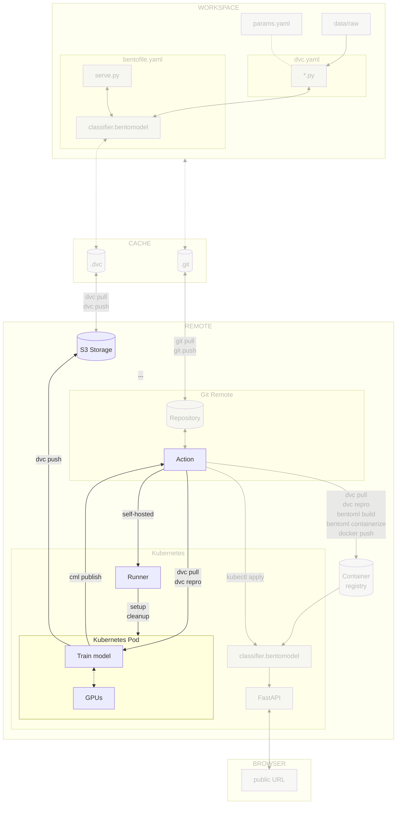

# Chapter 3.8 - Train the model on a Kubernetes pod

## Introduction

!!! warning

    This chapter is a work in progress. It focuses for now solely on :simple-github:
    GitHub. Please check back later for updates specific to using :simple-gitlab:
    GitLab.

    Thank you!

You can now train your model on the cluster. However, some experiments may
require specific hardware to run. For instance, training a deep learning model
might require a GPU. This GPU could be shared among multiple teams for different
purposes, so it is important to avoid monopolizong its use.

In such situation, you can use a specialized Kubernetes pod for on-demand model
training.

In this chapter, you will learn how to:

1. Adjust the self-hosted runner to create a specialized on-demand pod within
   the Kubernetes cluster
2. Start the model training from your CI/CD pipeline using the specialized pod
   in the Kubernetes cluster

The following diagram illustrates the control flow of the experiment at the end
of this chapter:



## Steps

### Identify the specialized node

The cluster consists of two nodes. For demonstration purposes, let's assume that
one node is equipped with a GPU while the other is not. You will need to
identify which node has the specialized hardware required for training the
model. This can be achieved by assigning a label to the nodes.

!!! note

    For our small experiment, there is actually no need to have a GPU to train the
    model. This is done solely for demonstration purposes. In a real-life production
    setup with a larger machine learning experiment, however, training with a GPU is
    likely to be a strong requirement due to the increased computational demands and
    the need for faster processing times.

#### Display the nodes names and labels

Display the nodes with the following command.

```sh title="Execute the following command(s) in a terminal"
# Display the nodes
kubectl get nodes --show-labels
```

The output should be similar to this: As noticed, you have two nodes in your
cluster with their labels.

```
NAME                                                   STATUS   ROLES    AGE   VERSION               LABELS
gke-mlops-surname-cluster-default-pool-d4f966ea-8rbn   Ready    <none>   49s   v1.30.3-gke.1969001   beta.kubernetes.io/arch=amd64,[...]
gke-mlops-surname-cluster-default-pool-d4f966ea-p7qm   Ready    <none>   50s   v1.30.3-gke.1969001   beta.kubernetes.io/arch=amd64,[...]
```

Export the name of the two nodes as environment variables. Replace the
`<my_node_1_name>` and `<my_node_2_name>` placeholders with the names of your
nodes (`gke-mlops-surname-cluster-default-pool-d4f966ea-8rbn` and
`gke-mlops-surname-cluster-default-pool-d4f966ea-p7qm` in this example).

```sh title="Execute the following command(s) in a terminal"
export K8S_NODE_1_NAME=<my_node_1_name>
```

```sh title="Execute the following command(s) in a terminal"
export K8S_NODE_2_NAME=<my_node_2_name>
```

#### Labelize the nodes

You can now labelize the nodes to be able to use the GPU node for the training
of the model.

```sh title="Execute the following command(s) in a terminal"
# Labelize the nodes
kubectl label nodes $K8S_NODE_1_NAME gpu=true
kubectl label nodes $K8S_NODE_2_NAME gpu=false
```

You can check the labels with the `kubectl get nodes --show-labels` command. You
should see the node with the `gpu=true`/ `gpu=false` labels.

### Adjust the self-hosted runner label

The existing self-hosted runner will not be used for model training. Instead, it
will function as a "base runner," dedicated to monitoring jobs and creating
on-demand specialized pods for training the model with GPU support.

To ensure the base runner operates effectively in this role, update its YAML
configuration to prevent it from using the GPU-enabled node, as this is not
required for its purpose. This change will also help keep the hardware resources
available for the training job.

```diff
diff --git a/kubernetes/runner.yaml b/kubernetes/runner.yaml
index 5a8dbb6..59b79f1 100644
--- a/kubernetes/runner.yaml
+++ b/kubernetes/runner.yaml
@@ -25,3 +25,5 @@ spec:
         requests:
           cpu: "1"
           memory: "4Gi"
+  nodeSelector:
+    gpu: "false"
```

Note the `nodeSelector ` field that will select a node with a `gpu=false `
label.

To update the runner on the Kubernetes cluster, run the following command:

```sh title="Execute the following command(s) in a terminal"
kubectl apply -f kubernetes/runner.yaml
```

The existing pod will be terminated, and a new one will be created with the
updated configuration.

### Set self-hosted GPU runner

We will now create a similar configuration file for the GPU runner, which is
used exclusively during the *train* and *report* steps of the workflow to create
a self-hosted GPU runner specifically for executing this step.

The runner will use the same custom Docker image that we pushed to the GitHub
Container Registry. This image is identified by the label `GITHUB_RUNNER_LABEL`
which is set to the value `gpu-runner`.

Create a new file called `runner-gpu.yaml` in the `kubernetes` directory with
the following content. Replace `<my_username>` and `<my_repository_name>` with
your own GitHub username and repository name.

```txt title="kubernetes/runner-gpu.yaml"
apiVersion: v1
kind: Pod
metadata:
  name: github-runner-gpu-${GITHUB_RUN_ID}
  labels:
    app: github-runner-gpu-${GITHUB_RUN_ID}
spec:
  volumes:
    - name: dshm
      emptyDir:
        medium: Memory
        sizeLimit: 4Gi
  containers:
    - name: github-runner-gpu-${GITHUB_RUN_ID}
      image: ghcr.io/<my_username>/<my_repository_name>/github-runner:latest
      # We mount a shared memory volume for training
      volumeMounts:
        - name: dshm
          mountPath: /dev/shm
      env:
        - name: GITHUB_RUNNER_LABEL
          value: "gpu-runner"
        - name: GITHUB_RUNNER_PAT
          valueFrom:
            secretKeyRef:
              name: github-runner-pat
              key: token
      securityContext:
        runAsUser: 1000
      resources:
        limits:
          cpu: "1"
          memory: "4Gi"
        requests:
          cpu: "1"
          memory: "4Gi"
  nodeSelector:
    gpu: "true"
```

Note the `nodeSelector` field that will select a node with a `gpu=true` label.

#### Add Kubeconfig secret

To enable the GPU runner to access the cluster, authentication is required. To
obtain the credentials for your Google Cloud Kubernetes cluster, you can execute
the following command to set up your kubeconfig file (`~/.kube/config`) with the
necessary credentials:

```sh title="Execute the following command(s) in a terminal"
# Get Kubernetes cluster credentials
gcloud container clusters get-credentials $GCP_K8S_CLUSTER_NAME --zone $GCP_K8S_CLUSTER_ZONE
```

This updates the kubeconfig file (`~/.kube/config`) used by `kubectl` with the
necessary information to connect to your Google Cloud Kubernetes cluster.

The relevant section of the kubeconfig file will look something like this:

```yaml title=".kube/config"
apiVersion: v1
clusters:
- cluster:
    certificate-authority-data: <REDACTED>
    server: https://<YOUR_CLUSTER_ENDPOINT>
  name: gke_<YOUR_PROJECT_ID_YOUR_ZONE_YOUR_CLUSTER_NAME>
contexts:
- context:
    cluster: gke_<YOUR_PROJECT_ID_YOUR_ZONE_YOUR_CLUSTER_NAME>
    user: gke_<YOUR_PROJECT_ID_YOUR_ZONE_YOUR_CLUSTER_NAME>
  name: gke_<YOUR_PROJECT_ID_YOUR_ZONE_YOUR_CLUSTER_NAME>
current-context: gke_<YOUR_PROJECT_ID_YOUR_ZONE_YOUR_CLUSTER_NAME>
kind: Config
preferences: {}
users:
- name: gke_<YOUR_PROJECT_ID_YOUR_ZONE_YOUR_CLUSTER_NAME>
  user:
    exec:
      apiVersion: client.authentication.k8s.io/v1beta1
      command: gke-gcloud-auth-plugin
      installHint: Install gke-gcloud-auth-plugin for use with kubectl by following
        https://cloud.google.com/kubernetes-engine/docs/how-to/cluster-access-for-kubectl#install_plugin
      provideClusterInfo: true
```

!!! info

    If using macOS, make sure the `users.user.exec.command` parameter is set to
    `gke-gcloud-auth-plugin`. The kubeconfig file is generated locally and may point
    to the Homebrew installation path. However, this configuration will be used in a
    standard Linux environment when accessing the Kubernetes cluster from the CI/CD
    pipeline.

#### Add Kubernetes CI/CD secrets

Add the Kubernetes secrets to access the Kubernetes cluster from the CI/CD
pipeline. Depending on the CI/CD platform you are using, the process will be
different:

=== ":simple-googlecloud: Google Cloud"

    === ":simple-github: GitHub"

        Create the following new variable by going to the **Settings** section from the
        top header of your GitHub repository. Select **Secrets and variables > Actions**
        and select **New repository secret**:

        - `GCP_K8S_KUBECONFIG`: The content of the kubeconfig file of the Kubernetes
          cluster.

        Save the variables by selecting **Add secret**.

    === ":simple-gitlab: GitLab"

        No additional secret variables are necessary for the GitLab CI/CD.

=== ":material-cloud: Using another cloud provider? Read this!"

    This guide has been written with Google Cloud in mind. We are open to
    contributions to add support for other cloud providers such as
    [:simple-amazonwebservices: Amazon Web Services](https://aws.amazon.com),
    [:simple-exoscale: Exoscale](https://www.exoscale.com),
    [:material-microsoft-azure: Microsoft Azure](https://azure.microsoft.com) or
    [:simple-kubernetes: Self-hosted Kubernetes](https://kubernetes.io) but we might
    not officially support them.

    If you want to contribute, please open an issue or a pull request on the
    [GitHub repository](https://github.com/swiss-ai-center/a-guide-to-mlops). Your
    help is greatly appreciated!

### Update the CI/CD configuration file

You'll now update the CI/CD configuration file to start a runner on the
Kubernetes cluster. Using the labels defined previously, you'll be able to start
the training of the model on the node with the GPU.

Update the `.github/workflows/mlops.yaml` file.

Take some time to understand the new steps:

```yaml title=".github/workflows/mlops.yaml" hl_lines="15-19 21-54 57-58 179-202"
name: MLOps

on:
  # Runs on pushes targeting main branch
  push:
    branches:
      - main

  # Runs on pull requests
  pull_request:

  # Allows you to run this workflow manually from the Actions tab
  workflow_dispatch:

# Allow the creation and usage of self-hosted runners
permissions:
  contents: read
  id-token: write

jobs:
  setup-runner:
    runs-on: [self-hosted, base-runner]
    if: github.event_name == 'pull_request'
    steps:
      - name: Checkout repository
        uses: actions/checkout@v4
      - name: Login to Google Cloud
        uses: google-github-actions/auth@v2 with:
          credentials_json: '${{ secrets.GOOGLE_SERVICE_ACCOUNT_KEY }}'
      - name: Get Google Cloud's Kubernetes credentials
        uses: google-github-actions/get-gke-credentials@v2 with:
          cluster_name: ${{ secrets.GCP_K8S _CLUSTER_NAME }} location: ${{
          secrets.GCP_K8S_CLUSTER _ZONE }}
      - name: Set up GCloud SDK
        uses: google-github-actions/setup-gcloud@v2 with:
          version: '>= 494.0.0'
      - name: Install kubectl
        run: |
          gcloud components install kubectl
      - name: Install gke-gcloud-auth-plugin
        run: |
          gcloud components install gke-gcloud-auth-plugin
      - name: Initialize runner on Kubernetes
        env:
          KUBECONFIG_DATA: ${{ secrets.GCP_K8S_KUBECONFIG }}
        # We use envsubst to replace variables in runner-gpu.yaml
        # in order to create a unique runner name with the
        # GitHub run ID. This prevents conflicts when multiple
        # runners are created at the same time.
        run: |
          echo "$KUBECONFIG_DATA" > kubeconfig export KUBECONFIG=kubeconfig
          # We use run_id to make the runner name unique
          export GITHUB_RUN_ID="${{ github.run_id }}" envsubst <
          kubernetes/runner-gpu.yaml | kubectl apply -f -
  train-and-report:
    permissions: write-all
    needs: setup-runner
    runs-on: [self-hosted, gpu-runner]
    if: github.event_name == 'pull_request' steps:
      - name: Checkout repository
        uses: actions/checkout@v4
      - name: Setup Python
        uses: actions/setup-python@v5 with:
          python-version: '3.12' cache: pip
      - name: Install dependencies
        run: pip install --requirement requirements-freeze.txt
      - name: Login to Google Cloud
        uses: google-github-actions/auth@v2 with:
          credentials_json: '${{ secrets.GOOGLE_SERVICE_ACCOUNT_KEY }}'
      - name: Train model
        run: dvc repro --pull
      - name: Push the outcomes to DVC remote storage
        run: dvc push
      - name: Commit changes in dvc.lock
        uses: stefanzweifel/git-auto-commit-action@v5 with:
          commit_message: Commit changes in dvc.lock file_pattern: dvc.lock
      - name: Setup Node
        uses: actions/setup-node@v4 with:
          node-version: 20
      - name: Setup CML
        uses: iterative/setup-cml@v2 with:
          version: '0.20.6'
      - name: Create CML report
        env:
          REPO_TOKEN: ${{ secrets.GITHUB_TOKEN }}
        run: |
          # Fetch all other Git branches
          git fetch --depth=1 origin main:main

          # Add title to the report
          echo "# Experiment Report (${{ github.sha }})" >> report.md

          # Compare parameters to main branch
          echo "## Params workflow vs. main" >> report.md dvc params diff main --md >>
          report.md

          # Compare metrics to main branch
          echo "## Metrics workflow vs. main" >> report.md dvc metrics diff main --md >>
          report.md

          # Compare plots (images) to main branch
          dvc plots diff main

          # Create plots
          echo "## Plots" >> report.md

          # Create training history plot
          echo "### Training History" >> report.md echo "#### main" >> report.md echo
          ''
          >> report.md echo "#### workspace" >> report.md echo
          ''
          >> report.md

          # Create predictions preview
          echo "### Predictions Preview" >> report.md echo "#### main" >> report.md echo
          ''
          >> report.md echo "#### workspace" >> report.md echo
          ''
          >> report.md

          # Create confusion matrix
          echo "### Confusion Matrix" >> report.md echo "#### main" >> report.md echo
          ''
          >> report.md echo "#### workspace" >> report.md echo
          ''
          >> report.md

          # Publish the CML report
          cml comment update --target=pr --publish report.md
  publish-and-deploy:
    runs-on: ubuntu-latest
    if: github.ref == 'refs/heads/main' steps:
      - name: Checkout repository
        uses: actions/checkout@v4
      - name: Setup Python
        uses: actions/setup-python@v5 with:
          python-version: '3.12' cache: pip
      - name: Install dependencies
        run: pip install --requirement requirements-freeze.txt
      - name: Login to Google Cloud
        uses: google-github-actions/auth@v2 with:
          credentials_json: '${{ secrets.GOOGLE_SERVICE_ACCOUNT_KEY }}'
      - name: Check model
        run: dvc repro --pull
      - name: Log in to the Container registry
        uses: docker/login-action@v3 with:
          registry:
          ${{ secrets.GCP_CONTAINER_REGISTRY_HOST }} username: _json_key password: ${{
          secrets.GOOGLE_SERVICE_ACCOUNT _KEY }}
      - name: Import the BentoML model
        run: bentoml models import model/celestial_bodies_classifier _model.bentomodel
      - name: Build the BentoML model artifact
        run: bentoml build src
      - name: Containerize and publish the BentoML model artifact Docker image
        run: |
          # Containerize the Bento
          bentoml containerize celestial_bodies_classifier:latest \
            --image-tag
            ${{ secrets.GCP_CONTAINER_REGISTRY _HOST }}/celestial-bodies-classifier:latest \ --image-tag ${{
            secrets.GCP_CONTAINER_REGISTRY _HOST }}/celestial-bodies-classifier:${{
            github.sha }}
          # Push the container to the Container Registry
          docker push --all-tags ${{ secrets.GCP_CONTAINER_REGISTRY _HOST
          }}/celestial-bodies-classifier
      - name: Get Google Cloud's Kubernetes credentials
        uses: google-github-actions/get-gke-credentials@v2 with:
          cluster_name: ${{ secrets.GCP_K8S _CLUSTER_NAME }} location: ${{
          secrets.GCP_K8S_CLUSTER _ZONE }}
      - name: Update the Kubernetes deployment
        run: |
          yq -i '.spec.template.spec.containers[0].image =
          "${{ secrets.GCP_CONTAINER_REGISTRY_HOST }}/celestial-bodies-classifier:${{
          github.sha }}"' kubernetes/deployment.yaml
      - name: Deploy the model on Kubernetes
        run: |
          kubectl apply \
            -f kubernetes/deployment.yaml \
            -f kubernetes/service.yaml
  cleanup-runner:
    needs: train-and-report
    runs-on: [self-hosted, base-runner]
    # Run this job if the event is a pull request and regardless of whether the previous job failed or was cancelled
    if: github.event_name == 'pull_request' && (success() || failure() || cancelled())
    steps:
      - name: Checkout repository
        uses: actions/checkout@v4
      - name: Set up GCloud SDK
        uses: google-github-actions/setup-gcloud@v2 with:
          version: '>= 494.0.0'
      - name: Install kubectl
        run: |
          gcloud components install kubectl
      - name: Install gke-gcloud-auth-plugin
        run: |
          gcloud components install gke-gcloud-auth-plugin
      - name: Cleanup runner on Kubernetes
        env:
          KUBECONFIG_DATA: ${{ secrets.GCP_K8S_KUBECONFIG }}
        run: |
          echo
          "$KUBECONFIG_DATA" > kubeconfig export KUBECONFIG=kubeconfig export GITHUB_RUN_ID="${{
          github.run_id }}" envsubst < kubernetes/runner-gpu.yaml | kubectl delete --wait=false -f -
```

Here, the following should be noted:

When creating pull requests:

* the `setup-runner` job creates a self-hosted GPU runner.
* the `train-report` job runs on the self-hosted GPU runner. It trains the model
  and pushes the trained model to the remote bucket with DVC.
* the `cleanup-runner` job destroys the self-hosted GPU runner that was created.
  It also guarantees that the GPU runner pod is removed, even when if the previous
  step failed or was manually cancelled.

When merging pull requests:

* the `publish-and-deploy` runs on the main runner when merging pull requests.
  It retrieves the model with DVC, containerizes then deploys the model artifact.

Check the differences with Git to validate the changes.

```sh title="Execute the following command(s) in a terminal"
# Show the differences with Git
git diff .github/workflows/mlops.yaml
```

The output should be similar to this:

```diff
diff --git a/.github/workflows/mlops.yaml b/.github/workflows/mlops.yaml
index 5a8d863..ad093ef 100644
--- a/.github/workflows/mlops.yaml
+++ b/.github/workflows/mlops.yaml
@@ -18,9 +18,47 @@ permissions:
   id-token: write

 jobs:
+  setup-runner:
+    runs-on: [self-hosted, base-runner]
+    if: github.event_name == 'pull_request'
+    steps:
+      - name: Checkout repository
+        uses: actions/checkout@v4
+      - name: Login to Google Cloud
+        uses: google-github-actions/auth@v2
+        with:
+          credentials_json: '${{ secrets.GOOGLE_SERVICE_ACCOUNT_KEY }}'
+      - name: Get Google Cloud's Kubernetes credentials
+        uses: google-github-actions/get-gke-credentials@v2
+        with:
+          cluster_name: ${{ secrets.GCP_K8S_CLUSTER_NAME }}
+          location: ${{ secrets.GCP_K8S_CLUSTER_ZONE }}
+      - name: Set up GCloud SDK
+        uses: google-github-actions/setup-gcloud@v2
+        with:
+          version: '>= 494.0.0'
+      - name: Install kubectl
+        run: |
+          gcloud components install kubectl
+      - name: Install gke-gcloud-auth-plugin
+        run: |
+          gcloud components install gke-gcloud-auth-plugin
+      - name: Initialize runner on Kubernetes
+        env:
+          KUBECONFIG_DATA: ${{ secrets.GCP_K8S_KUBECONFIG }}
+        # We use envsubst to replace variables in runner-gpu.yaml
+        # in order to create a unique runner name with the
+        # GitHub run ID. This prevents conflicts when multiple
+        # runners are created at the same time.
+        run: |
+          echo "$KUBECONFIG_DATA" > kubeconfig
+          export KUBECONFIG=kubeconfig
+          # We use run_id to make the runner name unique
+          export GITHUB_RUN_ID="${{ github.run_id }}"
+          envsubst < kubernetes/runner-gpu.yaml | kubectl apply -f -
   train-and-report:
     permissions: write-all
-    runs-on: [self-hosted]
+    needs: setup-runner
+    runs-on: [self-hosted, gpu-runner]
     if: github.event_name == 'pull_request'
     steps:
       - name: Checkout repository
@@ -150,4 +186,30 @@ jobs:
           kubectl apply \
             -f kubernetes/deployment.yaml \
             -f kubernetes/service.yaml
+  cleanup-runner:
+    needs: train-and-report
+    runs-on: [self-hosted, base-runner]
+    # Run this job if the event is a pull request and regardless of whether the previous job failed or was canceled
+    if: github.event_name == 'pull_request' && (success() || failure() || cancelled())
+    steps:
+      - name: Checkout repository
+        uses: actions/checkout@v4
+      - name: Set up GCloud SDK
+        uses: google-github-actions/setup-gcloud@v2
+        with:
+          version: '>= 494.0.0'
+      - name: Install kubectl
+        run: |
+          gcloud components install kubectl
+      - name: Install gke-gcloud-auth-plugin
+        run: |
+          gcloud components install gke-gcloud-auth-plugin
+      - name: Cleanup runner on Kubernetes
+        env:
+          KUBECONFIG_DATA: ${{ secrets.GCP_K8S_KUBECONFIG }}
+        run: |
+          echo "$KUBECONFIG_DATA" > kubeconfig
+          export KUBECONFIG=kubeconfig
+          export GITHUB_RUN_ID="${{ github.run_id }}"
+ envsubst < kubernetes/runner-gpu.yaml | kubectl delete --wait=false -f -
```

Take some time to understand the changes made to the file.

### Check the changes

Check the changes with Git to ensure that all the necessary files are tracked.

```sh title="Execute the following command(s) in a terminal"
# Add all the files
git add .

# Check the changes
git status
```

The output should look like this.

```text
Changes to be committed:
  (use "git restore --staged <file>..." to unstage)
        modified:   .github/workflows/mlops.yaml
        new file:   kubernetes/runner-gpu.yaml
        modified:   kubernetes/runner.yaml
```

### Push the CI/CD pipeline configuration file to Git

Push the CI/CD pipeline configuration file to Git.

```sh title="Execute the following command(s) in a terminal"
# Commit the changes
git commit -m "Use the pipeline to run my experiment on a specialized Kubernetes pod on each push"

# Push the changes
git push
```

### Check the results

On GitHub, you can see the pipeline running on the **Actions** page.

On GitLab, you can see the pipeline running on the **CI/CD > Pipelines** page.

The pod should be created on the Kubernetes Cluster.

=== ":simple-googlecloud: Google Cloud"

    On Google Cloud Console, you can see the pod that has been created on the
    **Kubernetes Engine > Workloads** page. Open the pod and go to the **YAML** tab
    to see the configuration of the pod. You should notice that the pod has been
    created with the node selector `gpu=true` and that it has been created on the
    right node.

=== ":material-cloud: Using another cloud provider? Read this!"

    This guide has been written with Google Cloud in mind. We are open to
    contributions to add support for other cloud providers such as
    [:simple-amazonwebservices: Amazon Web Services](https://aws.amazon.com),
    [:simple-exoscale: Exoscale](https://www.exoscale.com),
    [:material-microsoft-azure: Microsoft Azure](https://azure.microsoft.com) or
    [:simple-kubernetes: Self-hosted Kubernetes](https://kubernetes.io) but we might
    not officially support them.

    If you want to contribute, please open an issue or a pull request on the
    [GitHub repository](https://github.com/swiss-ai-center/a-guide-to-mlops). Your
    help is greatly appreciated!

This chapter is done, you can check the summary.

## Summary

Congratulations! You now can train your model on on a custom infrastructure with
custom hardware for specific use-cases.

In this chapter, you have successfully:

1. Set up an specialized on-demand runner on a pod in Kubernetes
2. Trained the model on a specialized pod on the Kubernetes cluster

### Destroy the Kubernetes cluster

When you are done with the chapter, you can destroy the Kubernetes cluster.

```sh title="Execute the following command(s) in a terminal"
# Destroy the Kubernetes cluster
gcloud container clusters delete --zone $GCP_K8S_CLUSTER_ZONE $GCP_K8S_CLUSTER_NAME
```

!!! tip

    If you need to quickly recreate the cluster after destroying it, here are the
    steps involved:

    * Create the Kubernetes cluster.
    * Deploy the containerized model on Kubernetes.
    * Identify the specialized node.
    * Label the nodes.
    * Create the Kubernetes secret for the base runner registration.
    * Deploy the base runner.
    * Retrieve the Kubernetes cluster credentials.
    * Update the Kubernetes `GCP_K8S_KUBECONFIG` CI/CD secret.

    Refer to the previous chapters for the specific commands. Additionally, ensure
    that all necessary environment variables are correctly defined.

## State of the MLOps process

- [x] Notebook has been transformed into scripts for production
- [x] Codebase and dataset are versioned
- [x] Steps used to create the model are documented and can be re-executed
- [x] Changes done to a model can be visualized with parameters, metrics and
      plots to identify differences between iterations
- [x] Codebase can be shared and improved by multiple developers
- [x] Dataset can be shared among the developers and is placed in the right
      directory in order to run the experiment
- [x] Experiment can be executed on a clean machine with the help of a CI/CD
      pipeline
- [x] CI/CD pipeline is triggered on pull requests and reports the results of
      the experiment
- [x] Changes to model can be thoroughly reviewed and discussed before
      integrating them into the codebase
- [x] Model can be saved and loaded with all required artifacts for future usage
- [x] Model can be easily used outside of the experiment context
- [x] Model publication to the artifact registry is automated
- [x] Model can be accessed from a Kubernetes cluster
- [x] Model is continuously deployed with the CI/CD
- [x] Model can be trained on a custom infrastructure
- [x] Model can be trained on a custom infrastructure with custom hardware for
      specific use-cases

You can now safely continue to the next chapter of this guide concluding your
journey and the next things you could do with your model.

## Sources

Highly inspired by:

- [_Install kubectl and configure cluster access_ - cloud.google.com](https://cloud.google.com/kubernetes-engine/docs/how-to/cluster-access-for-kubectl)
- [_Deploying to Google Kubernetes Engine_ - GitHub docs](https://docs.github.com/en/actions/use-cases-and-examples/deploying/deploying-to-google-kubernetes-engine)
- [_gcloud container clusters create_ - cloud.google.com](https://cloud.google.com/sdk/gcloud/reference/container/clusters/create)
- [_Install Tools_ - kubernetes.io](https://kubernetes.io/docs/tasks/tools/)
- [_Assigning Pods to Nodes_ - kubernetes.io](https://kubernetes.io/docs/concepts/scheduling-eviction/assign-pod-node/#nodeselector)
- [_Assign Pods to Nodes_ - kubernetes.io](https://kubernetes.io/docs/tasks/configure-pod-container/assign-pods-nodes/)

