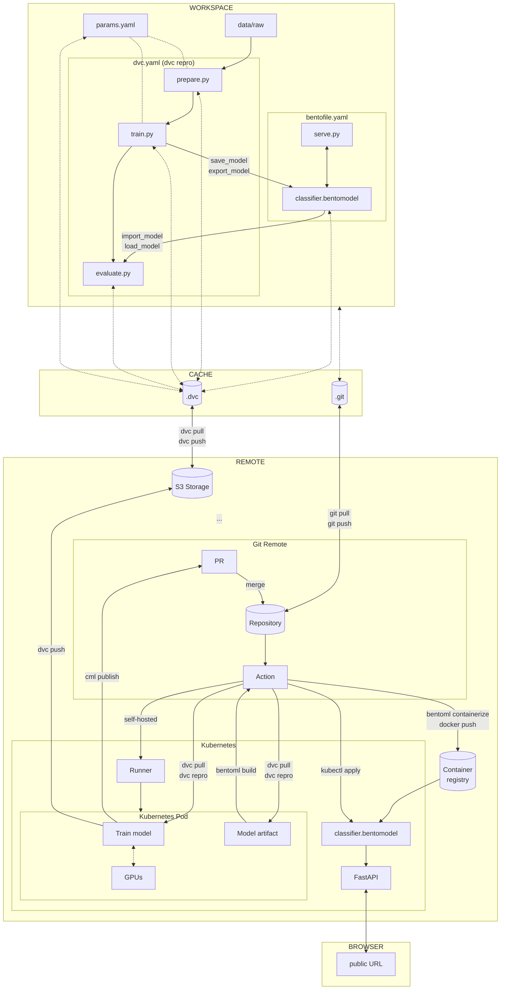

# Conclusion

Congratulations! You did it!

In this third part, you were able to move the model outside of the experiment
context. The model is now saved and loaded with BentoML. You can serve the model
locally and deploy it on Kubernetes. The model is also retrained on a Kubernetes
pod.

The model is now ready to be used in production.

The following diagram illustrates the bricks you set up at the end of this part:

The main goal of the MLOps process is to ensure that the model is reproducible,
reliable and can be used in production. This goal is now achieved.

The next part is an improvement of the MLOps process. You will learn how to
label new data and retrain the model using Label Studio.

Do not forget to [Clean up](./clean-up.md) if you want to stop here or continue
with
[Part 4 - Labeling the data and retrain](../part-4-labeling-the-data-and-retrain/introduction.md)
of the MLOps guide!
