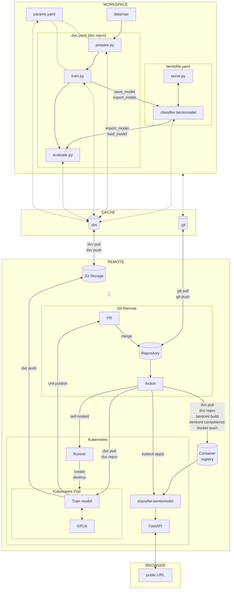

# Conclusion

Congratulations! You did it!

In this third part, you were able to move the model outside of the experiment
context. The model is now saved and loaded with BentoML. You can serve the model
locally and deploy it on Kubernetes. The model is also retrained on a Kubernetes
pod.

The model is now ready to be used in production.

The following diagram illustrates the bricks you set up at the end of this part:

The main goal of the MLOps process is to ensure that the model is reproducible,
reliable and can be used in production. This goal is now achieved.

The next part is an improvement of the MLOps process. You will learn how to
label new data and retrain the model using Label Studio.

## Next steps

**Ready to continue?**

Proceed to
[Part 4 - Labeling the data and retrain](../part-4-labeling-the-data-and-retrain/introduction.md)
to learn how to systematically label new data and continuously improve your
model.

**Stopping here?**

If you decide to conclude your progress at this point, see the
[Clean up guide](../clean-up.md) for instructions on removing the resources you
created:

- Local Git repository and DVC cache
- Python virtual environment
- Cloud storage bucket (S3/GCS)
- Container registry and Docker images
- Kubernetes cluster and deployments
- CI/CD pipeline configurations
- Self-hosted runners (if configured)

This is necessary to return to a clean state on your computer, avoid unnecessary
incurring costs, and address potential security concerns when using cloud
services.

!!! note

    Part 4 (data labeling) works entirely locally and doesn't require cloud
    infrastructure. If you're continuing to Part 4, you can
    **Clean up cloud resources** (delete your Kubernetes cluster, container
    registry, and cloud storage) to avoid costs but keep your local resources (local
    Git repository, DVC cache, and data files) as they are needed for the next
    section.

    You can safely skip cleanup if you plan to continue with the next part
    immediately, but we strongly recommend stopping the **Kubernetes cluster** to
    avoid unnecessary costs.
