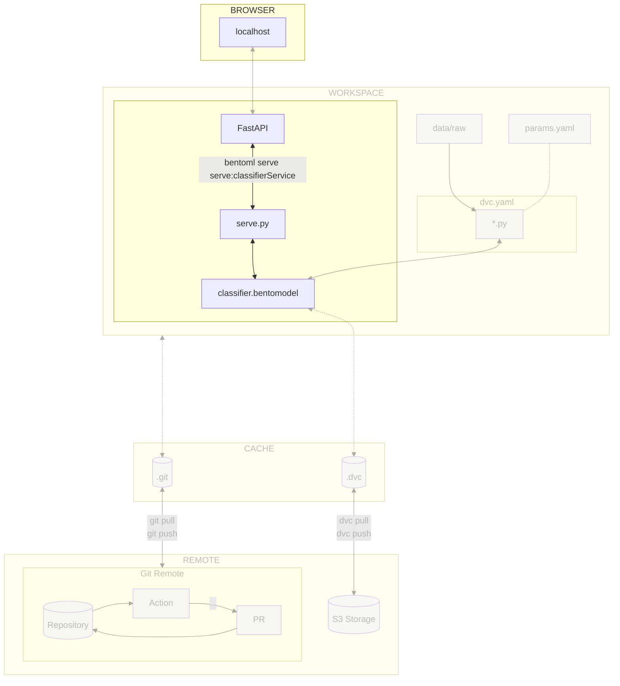

# Chapter 3.2 - Serve the model locally with BentoML

## Introduction

Now that the model is using [:simple-bentoml: BentoML](../tools.md), enabling
the extraction of metadata upon saving, you will serve the model with the help
of [:simple-fastapi: FastAPI](https://fastapi.tiangolo.com/) to create local
endpoints for interacting with the model.

In this chapter, you will learn how to:

1. Serve the model with BentoML and FastAPI
2. Push the changes to DVC and Git

The following diagram illustrates the control flow of the experiment at the end
of this chapter:



## Steps

### Create the BentoML service

BentoML services allow to define the serving logic of machine learning models.

A BentoML service is a class that defines all the endpoints and the logic to
serve the model using FastAPI.

Create a new file `src/serve.py` and add the following code:

```py title="src/serve.py"
from __future__ import annotations

import json
from typing import Annotated

import bentoml
from bentoml.validators import ContentType
from PIL.Image import Image
from pydantic import Field


@bentoml.service(name="celestial_bodies_classifier")
class CelestialBodiesClassifierService:
    bento_model = bentoml.keras.get("celestial_bodies_classifier_model")

    def __init__(self) -> None:
        self.preprocess = self.bento_model.custom_objects["preprocess"]
        self.postprocess = self.bento_model.custom_objects["postprocess"]
        self.model = self.bento_model.load_model()

    @bentoml.api()
    def predict(
        self,
        image: Annotated[Image, ContentType("image/jpeg")] = Field(
            description="Planet image to analyze"
        ),
    ) -> Annotated[str, ContentType("application/json")]:
        image = self.preprocess(image)
        predictions = self.model.predict(image)
        result = self.postprocess(predictions)
        return json.dumps(result)
```

This service will be used to serve the model with FastAPI and will do the
following:

1. The model is loaded from the BentoML model store
2. The `preprocess` function is loaded from the model's custom objects
3. The `postprocess` function is loaded from the model's custom objects
4. The `predict` method is decorated with `@bentoml.api()` to create an endpoint
5. The endpoint accepts an image as input
6. The endpoint returns a JSON response
7. The image is pre-processed
8. The predictions are made from the model
9. The predictions are post-processed and returned as a JSON string

### Serve the model

Serve the model with the following command:

```sh title="Execute the following command(s) in a terminal"
# Serve the model
bentoml serve --working-dir ./src serve:CelestialBodiesClassifierService
```

BentoML will load the model, create the FastAPI app and start it. You can then
access the auto-generated model documentation on
<http://localhost:3000>{:target="\_blank"}.

The following endpoint has been created:

- `/predict`: Upload a `png` or `jpg` image and get a prediction from the model.

You can try out predictions by inputing some images to the model through the
REST API!

### Try out the prediction endpoint

Here are some example you can use.

!!! note

    These images come from the
    [`extra-data`](https://github.com/swiss-ai-center/a-guide-to-mlops/tree/extra-data/extra)
    branch and were not used during training. They are genuine inference examples.

#### Pluto example

Download the following image of Pluto on your computer.

<figure markdown>
  
</figure>

Upload it to the `/predict` endpoint and check the prediction.

The output should be similar to this:

```json
{
  "prediction": "Pluto",
  "probabilities": {
    "Earth": 3.9665835060986865e-8,
    "Jupiter": 0.000007319120868487516,
    "Mars": 0.000011797979823313653,
    "Mercury": 0.003945174627006054,
    "Moon": 0.18518146872520447,
    "Neptune": 4.69246620726782e-11,
    "Pluto": 0.8090870976448059,
    "Saturn": 1.059590566329649e-12,
    "Uranus": 9.789555832639962e-10,
    "Venus": 0.001767155365087092
  }
}
```

#### Venus example

Download the following image of Venus on your computer.

<figure markdown>
  
</figure>

Upload it to the `/predict` endpoint and check the prediction.

The output should be similar to this:

```json
{
  "prediction": "Venus",
  "probabilities": {
    "Earth": 1.6945933255466798e-18,
    "Jupiter": 0.000021891426513320766,
    "Mars": 3.007734848941429e-13,
    "Mercury": 0.000006280910838540876,
    "Moon": 0.03219161927700043,
    "Neptune": 3.6837984330747675e-16,
    "Pluto": 0.0001897746551549062,
    "Saturn": 2.616885428368629e-21,
    "Uranus": 0.016079600900411606,
    "Venus": 0.9515108466148376
  }
}
```

#### Earth example

Download the following image of the Earth on your computer.

<figure markdown>
  
</figure>

Upload it to the `/predict` endpoint and check the prediction.

The output should be similar to this: You may notice the model got it wrong and
predicted Mars instead!

```json
{
  "prediction": "Mars",
  "probabilities": {
    "Earth": 0.180137038230896,
    "Jupiter": 0.0011938593816012144,
    "Mars": 0.6449322700500488,
    "Mercury": 0.0004260640707798302,
    "Moon": 0.0007392166880890727,
    "Neptune": 0.1704942286014557,
    "Pluto": 0.000048285317461704835,
    "Saturn": 0.002029117662459612,
    "Uranus": 1.8419001133335167e-12,
    "Venus": 1.9787622651534775e-9
  }
}
```

### Check the changes

Check the changes with Git to ensure that all the necessary files are tracked:

```sh title="Execute the following command(s) in a terminal"
# Add all the files
git add .

# Check the changes
git status
```

The output should look like this:

```text
On branch main
Changes to be committed:
  (use "git restore --staged <file>..." to unstage)
    new file:   src/serve.py
```

### Commit the changes to Git

Commit the changes to Git:

```sh title="Execute the following command(s) in a terminal"
# Commit the changes
git commit -m "Use BentoML to serve the model locally"

# Push the changes
git push
```

### Check the results

Congratulations! You now have a model served over a REST API!

This chapter is done, you can check the summary.

## Summary

In this chapter, you have successfully:

1. Served the model with BentoML and FastAPI
2. Pushed the changes to Git

You fixed some of the previous issues:

- [x] Model can be easily used outside of the experiment context

You could serve this model from anywhere. Additional services could submit
predictions to your model. The usage of FastAPI creates endpoints that are
automatically documented to interact with the model.

!!! abstract "Take away"

    - **BentoML services define your serving contract**: A BentoML service class
      specifies exactly how your model will be exposed as an API, including
      input/output types and validation, creating a clear contract between your ML
      model and consuming applications.
    - **FastAPI integration provides production-grade APIs automatically**: BentoML
      leverages FastAPI to generate interactive documentation, input validation, and
      type safety out of the box, eliminating the need to manually build REST APIs
      around your models.
    - **Local serving enables rapid iteration**: Being able to serve your model
      locally with a single command (`bentoml serve`) allows you to test API behavior,
      debug preprocessing logic, and validate predictions before investing time in
      containerization and deployment.
    - **Custom objects from training flow directly into serving**: The preprocessing
      and postprocessing functions saved with your model in Chapter 3.1 are
      automatically available in the service, ensuring consistency between how data is
      handled during training and inference.

## State of the MLOps process

- [x] Model can be saved and loaded with all required artifacts for future usage
- [x] Model can be easily used outside of the experiment context
- [ ] Model requires manual publication to the artifact registry
- [ ] Model is not accessible on the Internet and cannot be used anywhere
- [ ] Model requires manual deployment on the cluster
- [ ] Model cannot be trained on hardware other than the local machine
- [ ] Model cannot be trained on custom hardware for specific use-cases

Continue to the next chapters to address the remaining items.

## Sources

Highly inspired by:

- [_Services_ - docs.bentoml.com](https://docs.bentoml.com/en/latest/guides/services.html)
- [_Input and output types_ - docs.bentoml.com](https://docs.bentoml.com/en/latest/guides/iotypes.html)
- [_Containerization_ - docs.bentoml.com](https://docs.bentoml.com/en/latest/guides/containerization.html)
- [_Build options_ - docs.bentoml.com](https://docs.bentoml.com/en/latest/guides/build-options.html)
