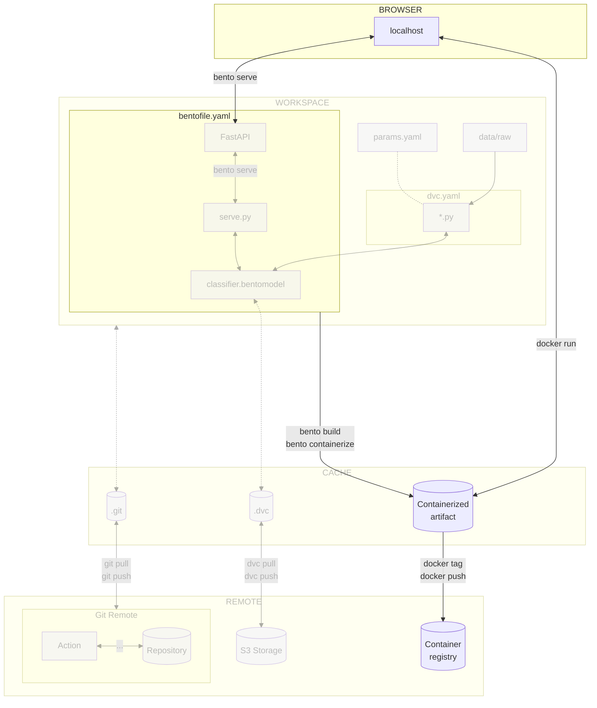

# Chapter 3.3 - Build and publish the model with BentoML and Docker locally

## Introduction

Serving the model locally is great for testing purposes, but it is not
sufficient for production. In this chapter, you will learn how to build and
publish the model with [:simple-bentoml: BentoML](../tools.md) and
[:simple-docker: Docker](../tools.md).

This will allow you to share the model with others and deploy it on a Kubernetes
cluster in a later chapter.

In this chapter, you will learn how to:

1. Create a BentoML model artifact
2. Containerize the model artifact with BentoML and Docker
3. Test the containerized model artifact by serving it locally with Docker
4. Create a container registry that will serve as your model registry
5. Publish the containerized model artifact Docker image to the container
   registry

The following diagram illustrates the control flow of the experiment at the end
of this chapter:



## Steps

### Create a BentoML model artifact

A BentoML model artifact (called "Bento" in the documentation) packages your
model, code, and environment dependencies into a single file. It is the standard
format for saving and sharing ML models.

The BentoML model artifact is described in a `bentofile.yaml` file. It contains
the following information:

- The service filename and class name
- The Python packages required to run the service
- The Docker configuration, such as the Python version to use

Create a new `bentofile.yaml` file in the `src` directory with the following
content:

```yaml title="src/bentofile.yaml"
service: 'serve:CelestialBodiesClassifierService'
include:
  - serve.py
python:
  packages:
    - "tensorflow==2.21.0"
    - "pillow==12.3.0"
docker:
    python_version: "3.13"
```

Do not forget to include the `serve.py` file in the BentoML model artifact. This
file contains the code to serve the model with FastAPI as you have seen in the
previous chapter.

The `python` section contains the Python packages required to run the service.
It does not contain DVC and other packages to build the model, as they are not
required to run the service.

The `docker` section contains the Python version to use. It is important to
specify the Python version to ensure the service runs correctly.

Now that the `bentofile.yaml` file is created, you can serve the model with the
following command:

```sh title="Execute the following command(s) in a terminal"
# Serve the model
bentoml serve --working-dir src
```

### Build the BentoML model artifact

Before containerizing the BentoML model artifact with Docker, you need to build
it.

A BentoML model artifact can be built with the following command:

```sh title="Execute the following command(s) in a terminal"
# Build the BentoML model artifact
bentoml build src
```

The output should be similar to this:

```text
INFO: Adding current BentoML version to requirements.txt: bentoml==1.4.29
INFO: Locking PyPI package versions.

██████╗ ███████╗███╗   ██╗████████╗ ██████╗ ███╗   ███╗██╗
██╔══██╗██╔════╝████╗  ██║╚══██╔══╝██╔═══██╗████╗ ████║██║
██████╔╝█████╗  ██╔██╗ ██║   ██║   ██║   ██║██╔████╔██║██║
██╔══██╗██╔══╝  ██║╚██╗██║   ██║   ██║   ██║██║╚██╔╝██║██║
██████╔╝███████╗██║ ╚████║   ██║   ╚██████╔╝██║ ╚═╝ ██║███████╗
╚═════╝ ╚══════╝╚═╝  ╚═══╝   ╚═╝    ╚═════╝ ╚═╝     ╚═╝╚══════╝

Successfully built Bento(tag="celestial_bodies_classifier:l6s3zhdzjgaptp35").

Next steps:

* Deploy to BentoCloud:
    $ bentoml deploy celestial_bodies_classifier:l6s3zhdzjgaptp35 -n ${DEPLOYMENT_NAME}

* Update an existing deployment on BentoCloud:
    $ bentoml deployment update --bento celestial_bodies_classifier:l6s3zhdzjgaptp35 ${DEPLOYMENT_NAME}

* Containerize your Bento with `bentoml containerize`:
    $ bentoml containerize celestial_bodies_classifier:l6s3zhdzjgaptp35

* Push to BentoCloud with `bentoml push`:
    $ bentoml push celestial_bodies_classifier:l6s3zhdzjgaptp35
```

All Bentos can be listed with the following command:

```sh title="Execute the following command(s) in a terminal"
# List all BentoML model artifacts
bentoml list
```

The output should be similar to this:

```text
 Tag                                           Size       Model Size  Creation Time
 celestial_bodies_classifier:l6s3zhdzjgaptp35  19.27 KiB  9.43 MiB    2026-07-06 16:45:47
```

### Containerize the BentoML model artifact with Docker

Now that the BentoML model artifact is built, you can containerize it with the
following command:

```sh title="Execute the following command(s) in a terminal"
# Containerize the BentoML model artifact with Docker
bentoml containerize celestial_bodies_classifier:latest --image-tag celestial-bodies-classifier:latest
```

The first `:latest` is the tag of the BentoML model artifact. It is a symlink to
the latest version of the BentoML model artifact.

The output should be similar to this:

```text
INFO: Building OCI-compliant image for celestial_bodies_classifier:l6s3zhdzjgaptp35 with docker

[+] Building 1.2s (17/17) FINISHED                                                        docker:default
 => [internal] load build definition from Dockerfile                                                0.0s
 => => transferring dockerfile: 2.04kB                                                              0.0s
 => [internal] load metadata for docker.io/library/python:3.13-slim                                 0.8s
 => [internal] load .dockerignore                                                                   0.1s
 => => transferring context: 2B                                                                     0.0s
 => [base-container  1/12] FROM docker.io/library/python:3.13-slim@sha256:eb43ff125d8d58d7449dcba7  0.0s
 => [internal] load build context                                                                   0.1s
 => => transferring context: 9.91MB                                                                 0.1s
 => CACHED [base-container  2/12] RUN if command -v groupadd &>/dev/null; then     groupadd -g 103  0.0s
 => CACHED [base-container  3/12] RUN mkdir /home/bentoml/bento && chown bentoml:bentoml /home/ben  0.0s
 => CACHED [base-container  4/12] WORKDIR /home/bentoml/bento                                       0.0s
 => CACHED [base-container  5/12] COPY --chown=bentoml:bentoml ./env/docker ./env/docker/           0.0s
 => CACHED [base-container  6/12] RUN  apt-get update && apt-get install -q -y --no-install-recomm  0.0s
 => CACHED [base-container  7/12] RUN  command -v uv >/dev/null || pip install uv                   0.0s
 => CACHED [base-container  8/12] RUN  UV_PYTHON_INSTALL_DIR=/app/python/ uv venv --python 3.13 /a  0.0s
 => CACHED [base-container  9/12] COPY --chown=bentoml:bentoml ./env/python ./env/python/           0.0s
 => CACHED [base-container 10/12] RUN  --mount=type=cache,sharing=locked,target=/root/.cache/ if [  0.0s
 => CACHED [base-container 11/12] COPY --chown=bentoml:bentoml . ./                                 0.0s
 => CACHED [base-container 12/12] RUN chmod +x /home/bentoml/bento/env/docker/entrypoint.sh         0.0s
 => exporting to image                                                                              0.0s
 => => exporting layers                                                                             0.0s
 => => writing image sha256:a2bff6f059d438224a79209daeea2d9a4db7a35c5b29c2d71e2d649986e336aa        0.0s
 => => naming to docker.io/library/celestial-bodies-classifier:latest                               0.0s
Successfully built Bento container for "celestial_bodies_classifier:latest" with tag(s)
"celestial-bodies-classifier:latest"
To run your newly built Bento container, run:
    docker run --rm -p 3000:3000 celestial-bodies-classifier:latest
```

!!! note "BentoML uses uv internally"

    You might have noticed that BentoML uses `uv` internally during the
    containerization process. This is because BentoML uses `uv` for fast package
    installation inside the Docker image. This is independent of whether you use
    `uv` or `pip` on your local machine.

### Test the containerized BentoML model artifact locally

The BentoML model artifact is now containerized. To verify its behavior, serve
the model artifact locally by running the Docker image:

```sh title="Execute the following command(s) in a terminal"
# Run the Docker image
docker run --rm -p 3000:3000 celestial-bodies-classifier:latest
```

Congrats! You have successfully containerized the BentoML model artifact using
Docker. You have also tested the container by running it locally. The model is
now ready to be shared on a container registry.

### Create a container registry

A container registry is a crucial component that provides a centralized system
to manage Docker images. It serves as a repository for storing, versioning, and
tracking Docker models built with BentoML, as each version comes with essential
metadata, including training data, hyperparameters, and performance metrics.

This comprehensive information ensures reproducibility by preserving historical
model versions, which aids in debugging and auditing. Additionally, it promotes
transparency and simplifies model comparison and selection for deployment,
allowing for seamless integration into production environments.

The model registry also facilitates collaboration among team members, enabling
standardized model formats and easy sharing of access. Its support for automated
deployment pipelines ensures consistent and reliable model deployment, allowing
for an efficient models management.

To improve the deployment process on the Kubernetes server, you will use Google
Artifact Registry as the ML model registry to publish and pull Docker images.

**Enable the Google Artifact Registry API**

You must enable the Google Artifact Registry API to create a container registry
on Google Cloud with the following command:

!!! tip

    You can display the available services in your project with the following
    command:

    ```sh title="Execute the following command(s) in a terminal"
    # List the services
    gcloud services list
    ```

```sh title="Execute the following command(s) in a terminal"
# Enable the Google Artifact Registry API
gcloud services enable artifactregistry.googleapis.com
```

**Create the Google Container Registry**

Export the repository name as an environment variable. Replace
`<my_repository_name>` with a registy name of your choice. It has to be
lowercase and words separated by hyphens.

!!! warning

    The container registry name must be **unique** across all Google Cloud projects
    and users. For example, use `mlops-<surname>-registry`, where `surname` is based
    on your name. Change the container registry name if the command fails.

```sh title="Execute the following command(s) in a terminal"
export GCP_CONTAINER_REGISTRY_NAME=<my_repository_name>
```

Export the repository location as an environment variable. You can view the
available locations at
[Cloud locations](https://cloud.google.com/about/locations). You should ideally
select a location close to where most of the expected traffic will come from.
Replace `<my_repository_location>` with your own zone. For example, use
`europe-west6` for Switzerland (Zurich):

```sh title="Execute the following command(s) in a terminal"
export GCP_CONTAINER_REGISTRY_LOCATION=<my_repository_location>
```

Lastly, when creating the repository, remember to specify the repository format
as `docker`.

```sh title="Execute the following command(s) in a terminal"
# Create the Google Container Registry
gcloud artifacts repositories create $GCP_CONTAINER_REGISTRY_NAME \
    --repository-format=docker \
    --location=$GCP_CONTAINER_REGISTRY_LOCATION
```

The output should be similar to this:

```text
Create request issued for: [mlops-surname-registry]
Waiting for operation [projects/mlops-surname-project/locations/europe-west6/operations/be8b09fa-279c-468
5-b451-1f3c900d4a36] to complete...done.
Created repository [mlops-surname-registry].
```

### Login to the remote Container Registry

**Authenticate with the Google Container Registry**

Configure gcloud to use the Google Container Registry as a Docker credential
helper.

```sh title="Execute the following command(s) in a terminal"
# Authenticate with the Google Container Registry
gcloud auth configure-docker ${GCP_CONTAINER_REGISTRY_LOCATION}-docker.pkg.dev
```

Ensure your `GCP_PROJECT_ID` variable is still correctly exported:

```sh title="Execute the following command(s) in a terminal"
# Check the exported project ID
echo $GCP_PROJECT_ID
```

The output should be similar to this:

```text
mlops-<surname>-project
```

??? tip "Is the `GCP_PROJECT_ID` variable empty? Read this!"

    If the `GCP_PROJECT_ID` variable is empty, you need to export your Google Cloud
    Project ID again.

    To get the ID of your project, you can use the Google Cloud CLI.

    ```sh title="Execute the following command(s) in a terminal"
    # List the projects
    gcloud projects list
    ```

    The output should be similar to this:

    ```text
    PROJECT_ID             NAME                   PROJECT_NUMBER
    mlops-surname-project  mlops-surname-project  123456789012
    ```

    Ensure to copy the `PROJECT_ID` value (**not** the `PROJECT_NUMBER` value) and
    export it as an environment variable. Replace `<my_project_id>` with your own
    project ID:

    ```sh title="Execute the following command(s) in a terminal"
    export GCP_PROJECT_ID=<my_project_id>
    ```

Export the container registry host:

```sh title="Execute the following command(s) in a terminal"
export GCP_CONTAINER_REGISTRY_HOST=${GCP_CONTAINER_REGISTRY_LOCATION}-docker.pkg.dev/${GCP_PROJECT_ID}/${GCP_CONTAINER_REGISTRY_NAME}
```

### Publish the BentoML model artifact Docker image to the container registry

The BentoML model artifact Docker image can be published to the container
registry with the following commands:

```sh title="Execute the following command(s) in a terminal"
# Tag the local BentoML model artifact Docker image with the remote container registry host
docker tag celestial-bodies-classifier:latest $GCP_CONTAINER_REGISTRY_HOST/celestial-bodies-classifier:latest

# Push the BentoML model artifact Docker image to the container registry
docker push $GCP_CONTAINER_REGISTRY_HOST/celestial-bodies-classifier:latest
```

The image is now available in the container registry. You can use it from
anywhere using Docker or Kubernetes.

Open the container registry interface on the cloud provider and check that the
artifact files have been uploaded.

Open the [Artifact Registry](https://console.cloud.google.com/artifacts) on the
Google cloud interface and click on your registry to access the details.

### Check the changes

Check the changes with Git to ensure that all the necessary files are tracked:

```sh title="Execute the following command(s) in a terminal"
# Add all the files
git add .

# Check the changes
git status
```

The output should look similar to this:

```text
On branch main
Your branch is up to date with 'origin/main'.

Changes to be committed:
(use "git restore --staged <file>..." to unstage)
    new file:   src/bentofile.yaml
```

### Commit the changes to Git

Commit the changes to Git.

```sh title="Execute the following command(s) in a terminal"
# Commit the changes
git commit -m "Use BentoML to containerize the model artifact"

# Push the changes
git push
```

## Summary

Congratulations! You have successfully prepared the model for deployment in a
production environment.

In this chapter, you have successfully:

1. Created and containerized a BentoML model artifact
2. Published the BentoML model artifact Docker image to the container registry

!!! abstract "Take away"

    - **Bentofiles define reproducible deployment environments**: The
      `bentofile.yaml` specifies exactly which code, dependencies, and Python version
      are needed to run your service, making deployments reproducible across
      environments and preventing "works on my machine" issues.
    - **Containerization makes models portable and scalable**: By packaging your
      BentoML service as a Docker container, you create a self-contained unit that can
      run anywhere Docker is supported, from local machines to cloud platforms to
      Kubernetes clusters.
    - **Container registries serve as model deployment hubs**: Publishing
      containerized models to a registry (Google Artifact Registry, Docker Hub, etc.)
      creates a centralized, versioned repository where deployment systems can pull
      production-ready model images.
    - **Separation of concerns improves the build process**: BentoML handles
      ML-specific concerns (model loading, inference logic) while Docker handles
      deployment concerns (environment isolation, portability), allowing each tool to
      excel at what it does best.

## State of the MLOps process

- [x] Model can be saved and loaded with all required artifacts for future usage
- [x] Model can be easily used outside of the experiment context
- [ ] Model requires manual publication to the artifact registry
- [ ] Model is not accessible on the Internet and cannot be used anywhere
- [ ] Model requires manual deployment on the cluster
- [ ] Model cannot be trained on hardware other than the local machine
- [ ] Model cannot be trained on custom hardware for specific use-cases

Continue to the next chapters to address the remaining items.

## Sources

Highly inspired by:

- [_Connecting a repository to a package_ - docs.github.com](https://docs.github.com/en/packages/learn-github-packages/connecting-a-repository-to-a-package)
- [_Working with the Container registry_ - docs.github.com](https://docs.github.com/en/packages/working-with-a-github-packages-registry/working-with-the-container-registry)
- [_Containerization_ - docs.bentoml.com](https://docs.bentoml.com/en/latest/guides/containerization.html)
- [_Build options_ - docs.bentoml.com](https://docs.bentoml.com/en/latest/guides/build-options.html)
