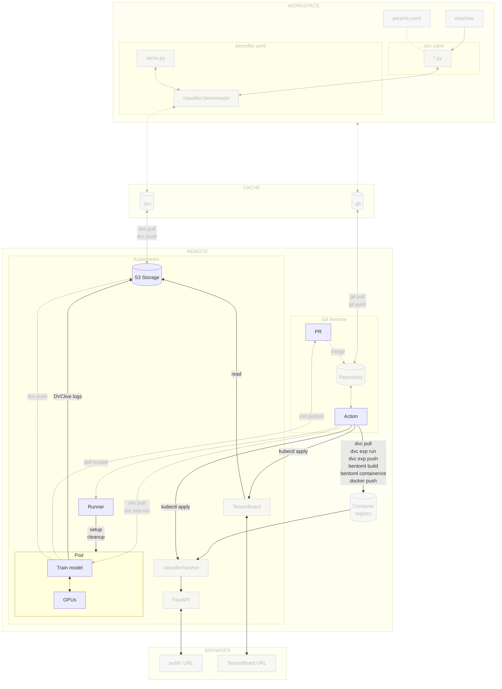

# Chapter 3.8 - Train the model on a Kubernetes pod

## Introduction

You can now train your model on the cluster. However, some experiments may
require specific hardware to run. For instance, training a deep learning model
might require a GPU. This GPU could be shared among multiple teams for different
purposes, so it is important to avoid monopolizing its use.

In such situation, you can use a specialized Kubernetes pod for on-demand model
training. Because the cluster is now available, you can also run DVC experiments
on it and share the live metrics through a persistent TensorBoard dashboard
accessible to the whole team.

In this chapter, you will learn how to:

1. Adjust the self-hosted runner to create a specialized on-demand pod within
   the Kubernetes cluster
2. Run DVC experiments from your CI/CD pipeline using the specialized pod
3. Log live metrics with DVClive to cloud storage
4. Deploy a TensorBoard pod on Kubernetes to visualize shared experiment metrics
5. Have CML report experiment results on the pull request
6. Promote the best experiment to the PR branch and merge it manually

The following diagram illustrates the control flow of the experiment at the end
of this chapter:



## Steps

### Update the project dependencies and training script

Before running experiments on the cluster, make sure `dvclive` and `tensorboard`
are installed in the environment that will run on the GPU pod.

Add them to `requirements.txt`:

```txt title="requirements.txt" hl_lines="6-7"
matplotlib==3.10.9
scikit-learn==1.9.0
tensorflow==2.21.0
pyyaml==6.0.3
dvc==3.67.1
dvclive==3.48.1
tensorboard==2.21.0
```

If you already added them in
[Chapter 1.7](../part-1-local-training-and-evaluation/chapter-17-visualize-live-metrics-with-dvclive-and-tensorboard.md),
no change is needed.

Next, update `src/train.py` so DVClive can write to a configurable directory.
This lets the training pod write logs to a cloud storage path while keeping the
local `dvclive/` default for development.

```py title="src/train.py" hl_lines="1 5"
import os
from dvclive import Live

# ... existing imports ...

live_dir = os.environ.get("DVCLIVE_DIR", "dvclive")
live = Live(dir=live_dir)
```

For the full training loop, refer to
[Chapter 1.7](../part-1-local-training-and-evaluation/chapter-17-visualize-live-metrics-with-dvclive-and-tensorboard.md).
The only change for the cloud is the `DVCLIVE_DIR` environment variable.

### Identify the specialized node

The cluster consists of two nodes. For demonstration purposes, let's assume that
one node is equipped with a GPU while the other is not. You will need to
identify which node has the specialized hardware required for training the
model. This can be achieved by assigning a label to the nodes.

!!! note

    For our small experiment, there is actually no need to have a GPU to train the
    model. This is done solely for demonstration purposes. In a real-life production
    setup with a larger machine learning experiment, however, training with a GPU is
    likely to be a strong requirement due to the increased computational demands and
    the need for faster processing times.

#### Display the nodes names and labels

Display the nodes with the following command.

```sh title="Execute the following command(s) in a terminal"
# Display the nodes
kubectl get nodes --show-labels
```

The output should be similar to this: As noticed, you have two nodes in your
cluster with their labels.

```
NAME                                                   STATUS   ROLES    AGE   VERSION               LABELS
gke-mlops-surname-cluster-default-pool-d4f966ea-8rbn   Ready    <none>   49s   v1.30.3-gke.1969001   beta.kubernetes.io/arch=amd64,[...]
gke-mlops-surname-cluster-default-pool-d4f966ea-p7qm   Ready    <none>   50s   v1.30.3-gke.1969001   beta.kubernetes.io/arch=amd64,[...]
```

Export the name of the two nodes as environment variables. Replace the
`<my_node_1_name>` and `<my_node_2_name>` placeholders with the names of your
nodes (`gke-mlops-surname-cluster-default-pool-d4f966ea-8rbn` and
`gke-mlops-surname-cluster-default-pool-d4f966ea-p7qm` in this example).

```sh title="Execute the following command(s) in a terminal"
export K8S_NODE_1_NAME=<my_node_1_name>
```

```sh title="Execute the following command(s) in a terminal"
export K8S_NODE_2_NAME=<my_node_2_name>
```

#### Labelize the nodes

You can now labelize the nodes to be able to use the GPU node for the training
of the model.

```sh title="Execute the following command(s) in a terminal"
# Labelize the nodes
kubectl label nodes $K8S_NODE_1_NAME gpu=true
kubectl label nodes $K8S_NODE_2_NAME gpu=false
```

You can check the labels with the `kubectl get nodes --show-labels` command. You
should see the node with the `gpu=true`/ `gpu=false` labels.

### Adjust the self-hosted runner label

The existing self-hosted runner will not be used for model training. Instead, it
will function as a "base runner," dedicated to monitoring jobs and creating
on-demand specialized pods for training the model with GPU support.

To ensure the base runner operates effectively in this role, update its YAML
configuration to prevent it from using the GPU-enabled node, as this is not
required for its purpose. This change will also help keep the hardware resources
available for the training job.

Replace also `<my_username>` and `<my_repository_name>` with your own GitHub
username and repository name.

??? warning "Using uppercase letters in your username or repository name? Read this!"

    Docker requires the use of only lowercase characters for the image tag. If you
    have uppercase letters in your username or repository name, simply convert them
    to lowercase.

```txt title="kubernetes/runner.yaml" hl_lines="12 30-31"
apiVersion: v1
kind: Pod
metadata:
  name: github-runner
  labels:
    app: github-runner
spec:
  imagePullSecrets:
    - name: ghcr-pull-secret
  containers:
    - name: github-runner
      image: ghcr.io/<my_username>/<my_repository_name>/github-runner:latest
      env:
        - name: GITHUB_RUNNER_LABEL
          value: "base-runner"
        - name: GITHUB_RUNNER_PAT
          valueFrom:
            secretKeyRef:
              name: github-runner-pat
              key: token
      securityContext:
        runAsUser: 1000
      resources:
        limits:
          cpu: "1"
          memory: "4Gi"
        requests:
          cpu: "1"
          memory: "4Gi"
  nodeSelector:
    gpu: "false"
```

Check the differences with Git to validate the changes:

```sh title="Execute the following command(s) in a terminal"
# Show the differences with Git
git diff kubernetes/runner.yaml
```

The output should be similar to this:

```diff
diff --git a/kubernetes/runner.yaml b/kubernetes/runner.yaml
index 5a8dbb6..59b79f1 100644
--- a/kubernetes/runner.yaml
+++ b/kubernetes/runner.yaml
@@ -25,3 +25,5 @@ spec:
         requests:
           cpu: "1"
           memory: "4Gi"
+  nodeSelector:
+    gpu: "false"
```

Note the `nodeSelector ` field that will select a node with a `gpu=false `
label.

To update the runner on the Kubernetes cluster, run the following commands:

```sh title="Execute the following command(s) in a terminal"
kubectl delete pod github-runner
kubectl apply -f kubernetes/runner.yaml
```

The existing pod will be terminated, and a new one will be created with the
updated configuration.

### Set self-hosted GPU runner

We will now create a similar configuration file for the GPU runner, which is
used exclusively during the *train* and *report* steps of the workflow to create
a self-hosted GPU runner specifically for executing this step.

The runner will use the same custom Docker image that we pushed to the GitHub
Container Registry. This image is identified by the label `GITHUB_RUNNER_LABEL`
which is set to the value `gpu-runner`.

Create a new file called `runner-gpu.yaml` in the `kubernetes` directory with
the following content. Replace `<my_username>` and `<my_repository_name>` with
your own GitHub username and repository name.

??? warning "Using uppercase letters in your username or repository name? Read this!"

    Docker requires the use of only lowercase characters for the image tag. If you
    have uppercase letters in your username or repository name, simply convert them
    to lowercase.

```txt title="kubernetes/runner-gpu.yaml" hl_lines="17"
apiVersion: v1
kind: Pod
metadata:
  name: github-runner-gpu-${GITHUB_RUN_ID}
  labels:
    app: github-runner-gpu-${GITHUB_RUN_ID}
spec:
  volumes:
    - name: dshm
      emptyDir:
        medium: Memory
        sizeLimit: 4Gi
  imagePullSecrets:
    - name: ghcr-pull-secret
  containers:
    - name: github-runner-gpu-${GITHUB_RUN_ID}
      image: ghcr.io/<my_username>/<my_repository_name>/github-runner:latest
      # We mount a shared memory volume for training
      volumeMounts:
        - name: dshm
          mountPath: /dev/shm
      env:
        - name: GITHUB_RUNNER_LABEL
          value: "gpu-runner"
        - name: GITHUB_RUNNER_PAT
          valueFrom:
            secretKeyRef:
              name: github-runner-pat
              key: token
      securityContext:
        runAsUser: 1000
      resources:
        limits:
          cpu: "1"
          memory: "4Gi"
        requests:
          cpu: "1"
          memory: "4Gi"
  nodeSelector:
    gpu: "true"
```

Note the `nodeSelector` field that will select a node with a `gpu=true` label.

#### Add Kubeconfig secret

To enable the GPU runner to access the cluster, authentication is required. To
obtain the credentials for your Google Cloud Kubernetes cluster, you can execute
the following command to set up your kubeconfig file (`~/.kube/config`) with the
necessary credentials:

```sh title="Execute the following command(s) in a terminal"
# Get Kubernetes cluster credentials
gcloud container clusters get-credentials $GCP_K8S_CLUSTER_NAME --zone $GCP_K8S_CLUSTER_ZONE
```

This updates the kubeconfig file (`~/.kube/config`) used by `kubectl` with the
necessary information to connect to your Google Cloud Kubernetes cluster.

Display the content of the `~/.kube/config` file:

```sh title="Execute the following command(s) in a terminal"
# Display the kubeconfig file
cat ~/.kube/config
```

The relevant section of the kubeconfig file will look something like this:

```yaml title="~/.kube/config"
apiVersion: v1
clusters:
- cluster:
    certificate-authority-data: <REDACTED>
    server: https://<YOUR_CLUSTER_ENDPOINT>
  name: gke_<YOUR_PROJECT_ID_YOUR_ZONE_YOUR_CLUSTER_NAME>
contexts:
- context:
    cluster: gke_<YOUR_PROJECT_ID_YOUR_ZONE_YOUR_CLUSTER_NAME>
    user: gke_<YOUR_PROJECT_ID_YOUR_ZONE_YOUR_CLUSTER_NAME>
  name: gke_<YOUR_PROJECT_ID_YOUR_ZONE_YOUR_CLUSTER_NAME>
current-context: gke_<YOUR_PROJECT_ID_YOUR_ZONE_YOUR_CLUSTER_NAME>
kind: Config
preferences: {}
users:
- name: gke_<YOUR_PROJECT_ID_YOUR_ZONE_YOUR_CLUSTER_NAME>
  user:
    exec:
      apiVersion: client.authentication.k8s.io/v1beta1
      command: gke-gcloud-auth-plugin
      installHint: Install gke-gcloud-auth-plugin for use with kubectl by following
        https://cloud.google.com/kubernetes-engine/docs/how-to/cluster-access-for-kubectl#install_plugin
      provideClusterInfo: true
```

!!! info

    If using macOS, make sure the `users.user.exec.command` parameter is set to
    `gke-gcloud-auth-plugin`. The kubeconfig file is generated locally and may point
    to the Homebrew installation path. However, this configuration will be used in a
    standard Linux environment when accessing the Kubernetes cluster from the CI/CD
    pipeline.

#### Add Kubernetes CI/CD secrets

Add the Kubernetes secrets to access the Kubernetes cluster from the CI/CD
pipeline. Depending on the CI/CD platform you are using, the process will be
different:

Create the following new variable by going to the **Settings** section from the
top header of your GitHub repository. Select **Secrets and variables > Actions**
and select **New repository secret**:

- `GCP_K8S_KUBECONFIG`: The content of the `~/.kube/config` file of the
  Kubernetes cluster.

Save the variables by selecting **Add secret**.

### Deploy a TensorBoard pod on Kubernetes

Create a Kubernetes manifest for a persistent TensorBoard pod. The pod reads
DVClive logs from the same cloud storage bucket used by DVC, so the team can
open a single URL to visualize every experiment run on the cluster.

Create `kubernetes/tensorboard.yaml` with the following content. Replace
`<my_bucket>` with the name of your cloud storage bucket:

```txt title="kubernetes/tensorboard.yaml"
apiVersion: apps/v1
kind: Deployment
metadata:
  name: tensorboard
  labels:
    app: tensorboard
spec:
  replicas: 1
  selector:
    matchLabels:
      app: tensorboard
  template:
    metadata:
      labels:
        app: tensorboard
    spec:
      containers:
        - name: tensorboard
          image: tensorflow/tensorflow:2.21.0
          command:
            - /bin/sh
            - -c
            - |
              mkdir -p /logs &&
              gsutil -m rsync -r gs://<my_bucket>/tensorboard /logs &&
              tensorboard --logdir /logs --host 0.0.0.0 --port 6006
          ports:
            - containerPort: 6006
          resources:
            limits:
              cpu: "1"
              memory: "4Gi"
            requests:
              cpu: "0.5"
              memory: "2Gi"
---
apiVersion: v1
kind: Service
metadata:
  name: tensorboard
spec:
  selector:
    app: tensorboard
  ports:
    - protocol: TCP
      port: 80
      targetPort: 6006
  type: LoadBalancer
```

!!! info

    The manifest above uses `gsutil` because the guide uses Google Cloud Storage. If
    you use another S3-compatible storage, replace `gsutil` with the appropriate
    sync command and ensure the pod has the necessary credentials.

Apply the manifest:

```sh title="Execute the following command(s) in a terminal"
# Deploy TensorBoard on the cluster
kubectl apply -f kubernetes/tensorboard.yaml
```

Retrieve the external IP:

```sh title="Execute the following command(s) in a terminal"
# Wait for the LoadBalancer IP
kubectl get service tensorboard --watch
```

Once the `EXTERNAL-IP` field shows an address, open `http://<EXTERNAL-IP>` in
your browser. The dashboard will be empty until the first training run uploads
DVClive logs.

### Save the TensorBoard IP as a GitHub secret

The CI/CD pipeline needs the TensorBoard URL to include it in CML reports. Save
the external IP as a GitHub secret:

Create the following variable by going to the **Settings** section from the top
header of your GitHub repository. Select **Secrets and variables > Actions** and
select **New repository secret**:

- `GCP_TENSORBOARD_IP`: The `EXTERNAL-IP` value displayed by the previous
  command (for example, `34.65.23.10`).

Save the variable by selecting **Add secret**. The workflow constructs the
dashboard link as `http://${{ secrets.GCP_TENSORBOARD_IP }}`.

### Update the CI/CD configuration file

You'll now update the CI/CD configuration file to start a runner on the
Kubernetes cluster. Using the labels defined previously, you'll be able to start
the training of the model on the node with the GPU.

Update the `.github/workflows/mlops.yaml` file.

Take some time to understand the new steps:

```yaml title=".github/workflows/mlops.yaml" hl_lines="21-57 60-61 191-216"
name: MLOps

on:
  # Runs on pushes targeting main branch
  push:
    branches:
      - main

  # Runs on pull requests
  pull_request:

  # Allows you to run this workflow manually from the Actions tab
  workflow_dispatch:

# Allow the creation and usage of self-hosted runners
permissions:
  contents: read
  id-token: write

env:
  DVCLIVE_BASE_DIR: gs://${{ secrets.GCP_BUCKET_NAME }}/tensorboard/pr-${{ github.event.number }}

jobs:
  setup-runner:
    runs-on: [self-hosted, base-runner]
    if: github.event_name == 'pull_request'
    steps:
      - name: Checkout repository
        uses: actions/checkout@v7
      - name: Login to Google Cloud
        uses: google-github-actions/auth@v3
        with:
          credentials_json: '${{ secrets.GOOGLE_SERVICE_ACCOUNT_KEY }}'
      - name: Get Google Cloud's Kubernetes credentials
        uses: google-github-actions/get-gke-credentials@v3
        with:
          cluster_name: ${{ secrets.GCP_K8S_CLUSTER_NAME }}
          location: ${{ secrets.GCP_K8S_CLUSTER_ZONE }}
      - name: Set up GCloud SDK
        uses: google-github-actions/setup-gcloud@v3
        with:
          version: '>= 568.0.0'
      - name: Install kubectl
        run: |
          gcloud components install kubectl
      - name: Install gke-gcloud-auth-plugin
        run: |
          gcloud components install gke-gcloud-auth-plugin
      - name: Initialize runner on Kubernetes
        env:
          KUBECONFIG_DATA: ${{ secrets.GCP_K8S_KUBECONFIG }}
        # We use envsubst to replace variables in runner-gpu.yaml
        # in order to create a unique runner name with the
        # GitHub run ID. This prevents conflicts when multiple
        # runners are created at the same time.
        run: |
          echo "$KUBECONFIG_DATA" > kubeconfig export KUBECONFIG=kubeconfig
          # We use run_id to make the runner name unique
          export GITHUB_RUN_ID="${{ github.run_id }}"
          envsubst < kubernetes/runner-gpu.yaml | kubectl apply -f -
  train-and-report:
    permissions: write-all
    needs: setup-runner
    runs-on: [self-hosted, gpu-runner]
    if: github.event_name == 'pull_request'
    steps:
      - name: Checkout repository
        uses: actions/checkout@v7
      - name: Setup Python
        uses: actions/setup-python@v6
        with:
          python-version: '3.13'
          cache: pip
      - name: Install dependencies
        run: pip install -r requirements-freeze.txt
      - name: Login to Google Cloud
        uses: google-github-actions/auth@v3
        with:
          credentials_json: '${{ secrets.GOOGLE_SERVICE_ACCOUNT_KEY }}'
      - name: Run experiments
        env:
          DVCLIVE_DIR: ${{ env.DVCLIVE_BASE_DIR }}/run-${{ github.run_id }}
        run: |
          dvc exp run --pull -S train.lr=0.001
          dvc exp run --pull -S train.lr=0.01
      - name: Push experiment refs
        run: dvc exp push origin
      - name: Push DVClive logs to cloud storage
        run: |
          gsutil -m cp -r dvclive/* ${{ env.DVCLIVE_BASE_DIR }}/run-${{ github.run_id }}/
      - name: Push the outcomes to DVC remote storage
        run: dvc push
      - name: Commit changes in dvc.lock
        uses: stefanzweifel/git-auto-commit-action@v7
        with:
          commit_message: Commit changes in dvc.lock [skip ci]
          file_pattern: dvc.lock
      - name: Setup Node
        uses: actions/setup-node@v7
        with:
          node-version: 24
      - name: Setup CML
        uses: iterative/setup-cml@v2
        with:
          version: '0.20.6'
      - name: Create CML report
        env:
          REPO_TOKEN: ${{ secrets.GITHUB_TOKEN }}
          TENSORBOARD_URL: http://${{ secrets.GCP_TENSORBOARD_IP }}
        run: |
          # Fetch experiment refs
          git fetch origin 'refs/exps/*:refs/exps/*'

          # Add title to the report
          echo "# Experiment Report (${{ github.sha }})" >> report.md

          # Compare parameters to main branch
          echo "## Params workflow vs. main" >> report.md
          dvc params diff main --md >> report.md

          # Compare metrics to main branch
          echo "## Metrics workflow vs. main" >> report.md
          dvc metrics diff main --md >> report.md

          # List experiments sorted by best metric
          echo "## Experiments" >> report.md
          dvc exp show --sort-by metrics.json:f1_score --sort-order desc --md >> report.md

          # Compare plots (images) to main branch
          dvc plots diff main

          # Create plots
          echo "## Plots" >> report.md

          # Create training history plot
          echo "### Training History" >> report.md
          echo "#### main" >> report.md
          echo '' >> report.md
          echo "#### workspace" >> report.md
          echo '' >> report.md

          # Create predictions preview
          echo "### Predictions Preview" >> report.md
          echo "#### main" >> report.md
          echo '' >> report.md
          echo "#### workspace" >> report.md
          echo '' >> report.md

          # Create confusion matrix
          echo "### Confusion Matrix" >> report.md
          echo "#### main" >> report.md
          echo '' >> report.md
          echo "#### workspace" >> report.md
          echo '' >> report.md

          # Link to the shared TensorBoard dashboard
          echo "## Live dashboard" >> report.md
          echo "[Open TensorBoard]($TENSORBOARD_URL)" >> report.md

          # Publish the CML report
          cml comment update --target=pr --publish report.md
  publish-and-deploy:
    runs-on: ubuntu-latest
    if: github.ref == 'refs/heads/main'
    steps:
      - name: Checkout repository
        uses: actions/checkout@v7
      - name: Setup Python
        uses: actions/setup-python@v6
        with:
          python-version: '3.13'
          cache: pip
      - name: Install dependencies
        run: pip install -r requirements-freeze.txt
      - name: Login to Google Cloud
        uses: google-github-actions/auth@v3
        with:
          credentials_json: '${{ secrets.GOOGLE_SERVICE_ACCOUNT_KEY }}'
      - name: Check model
        run: dvc repro --pull
      - name: Log in to the Container registry
        uses: docker/login-action@v4
        with:
          registry: ${{ secrets.GCP_CONTAINER_REGISTRY_HOST }}
          username: _json_key
          password: ${{ secrets.GOOGLE_SERVICE_ACCOUNT_KEY }}
      - name: Import the BentoML model
        run: bentoml models import model/celestial_bodies_classifier_model.bentomodel
      - name: Build the BentoML model artifact
        run: bentoml build src
      - name: Containerize and publish the BentoML model artifact Docker image
        run: |
          # Containerize the Bento
          bentoml containerize celestial_bodies_classifier:latest \
            --image-tag ${{ secrets.GCP_CONTAINER_REGISTRY_HOST }}/celestial-bodies-classifier:latest \
            --image-tag ${{ secrets.GCP_CONTAINER_REGISTRY_HOST }}/celestial-bodies-classifier:${{ github.sha }}
          # Push the container to the Container Registry
          docker push --all-tags ${{ secrets.GCP_CONTAINER_REGISTRY_HOST }}/celestial-bodies-classifier
      - name: Get Google Cloud's Kubernetes credentials
        uses: google-github-actions/get-gke-credentials@v3
        with:
          cluster_name: ${{ secrets.GCP_K8S_CLUSTER_NAME }}
          location: ${{ secrets.GCP_K8S_CLUSTER_ZONE }}
      - name: Update the Kubernetes deployment
        run: |
          yq -i '.spec.template.spec.containers[0].image = "${{ secrets.GCP_CONTAINER_REGISTRY_HOST }}/celestial-bodies-classifier:${{ github.sha }}"' kubernetes/deployment.yaml
      - name: Deploy the model on Kubernetes
        run: |
          kubectl apply \
            -f kubernetes/deployment.yaml \
            -f kubernetes/service.yaml
  cleanup-runner:
    needs: train-and-report
    runs-on: [self-hosted, base-runner]
    # Run this job if the event is a pull request and regardless of whether the previous job failed or was cancelled
    if: github.event_name == 'pull_request' && (success() || failure() || cancelled())
    steps:
      - name: Checkout repository
        uses: actions/checkout@v7
      - name: Set up GCloud SDK
        uses: google-github-actions/setup-gcloud@v3
        with:
          version: '>= 568.0.0'
      - name: Install kubectl
        run: |
          gcloud components install kubectl
      - name: Install gke-gcloud-auth-plugin
        run: |
          gcloud components install gke-gcloud-auth-plugin
      - name: Cleanup runner on Kubernetes
        env:
          KUBECONFIG_DATA: ${{ secrets.GCP_K8S_KUBECONFIG }}
        run: |
          echo "$KUBECONFIG_DATA" > kubeconfig
          export KUBECONFIG=kubeconfig
          export GITHUB_RUN_ID="${{ github.run_id }}"
          envsubst < kubernetes/runner-gpu.yaml | kubectl delete --wait=false -f -
```

Here, the following should be noted:

When creating pull requests:

* the `setup-runner` job creates a self-hosted GPU runner.
* the `train-and-report` job runs on the self-hosted GPU runner. It runs two DVC
  experiments with different learning rates, pushes the experiment refs to GitHub,
  uploads DVClive logs to cloud storage, and pushes the trained model to the
  remote bucket with DVC.

    !!! warning "TODO"

        Review the workspace isolation between the two `dvc exp run` calls. The second
        experiment currently runs on top of the first experiment's workspace, so it is
        not derived from the same PR branch baseline. Decide whether to switch to the
        experiments queue (`--queue` / `dvc queue start`), add explicit workspace resets
        between runs, or keep the current simplified behaviour. Also confirm how to
        collect DVClive logs from every experiment so that the shared TensorBoard
        dashboard compares all curves, not only the last run.

* the `cleanup-runner` job destroys the self-hosted GPU runner that was created.
  It also guarantees that the GPU runner pod is removed, even when if the previous
  step failed or was manually cancelled.

The TensorBoard pod was deployed separately and reads DVClive logs from the same
cloud storage bucket. The CML report includes a link to the TensorBoard
dashboard so reviewers can explore the live metrics.

When merging pull requests:

* the `publish-and-deploy` runs on the main runner when merging pull requests.
  It retrieves the model with DVC, containerizes then deploys the model artifact.

!!! info

    The workflow uses `dvc exp run` to create experiments on the cluster. The
    experiments are pushed back to the repository as Git refs. After the run, the
    best experiment must be promoted manually into the PR branch before merging.
    This is explained in the next section.

Check the differences with Git to validate the changes.

```sh title="Execute the following command(s) in a terminal"
# Show the differences with Git
git diff .github/workflows/mlops.yaml
```

The output should be similar to this:

```diff
diff --git a/.github/workflows/mlops.yaml b/.github/workflows/mlops.yaml
index 5a8d863..ad093ef 100644
--- a/.github/workflows/mlops.yaml
+++ b/.github/workflows/mlops.yaml
@@ -15,6 +15,9 @@ on:
 permissions:
   contents: read
   id-token: write
+
+env:
+  DVCLIVE_BASE_DIR: gs://${{ secrets.GCP_BUCKET_NAME }}/tensorboard/pr-${{ github.event.number }}

 jobs:
   setup-runner:
@@ -49,8 +52,15 @@ jobs:
       - name: Install dependencies
         run: pip install -r requirements-freeze.txt
-      - name: Train model
-        run: dvc repro --pull
+      - name: Run experiments
+        env:
+          DVCLIVE_DIR: ${{ env.DVCLIVE_BASE_DIR }}/run-${{ github.run_id }}
+        run: |
+          dvc exp run --pull -S train.lr=0.001
+          dvc exp run --pull -S train.lr=0.01
+      - name: Push experiment refs
+        run: dvc exp push origin
+      - name: Push DVClive logs to cloud storage
+        run: |
+          gsutil -m cp -r dvclive/* ${{ env.DVCLIVE_BASE_DIR }}/run-${{ github.run_id }}/
       - name: Push the outcomes to DVC remote storage
         run: dvc push
```

The diff above highlights the most important changes. The full diff also
includes the CML report updates (experiment table and TensorBoard link).

Take some time to understand the changes made to the file.

### Check the changes

Check the changes with Git to ensure that all the necessary files are tracked:

```sh title="Execute the following command(s) in a terminal"
# Add all the files
git add .

# Check the changes
git status
```

The output should look like this:

```text
Changes to be committed:
  (use "git restore --staged <file>..." to unstage)
        modified:   .github/workflows/mlops.yaml
        new file:   kubernetes/runner-gpu.yaml
        modified:   kubernetes/runner.yaml
        new file:   kubernetes/tensorboard.yaml
```

### Push the CI/CD pipeline configuration file to Git

Push the CI/CD pipeline configuration file to Git:

```sh title="Execute the following command(s) in a terminal"
# Commit the changes
git commit -m "Use the pipeline to run my experiment on a specialized Kubernetes pod on each push"

# Push the changes
git push
```

### Try it out one final time

Finally, try to run experiments on the Kubernetes specialized pod.

Similarly to what you have done in
[Chapter 2.5: Work efficiently and collaboratively with Git](../part-2-move-to-the-cloud/chapter-25-work-efficiently-and-collaboratively-with-git.md),
create an issue **Demonstrate model training on kubernetes pod** and a new
branch for the issue. Use a branch name like `experiment/tune-lr`.

On your machine, check out the new branch.

You do **not** need to commit a specific parameter guess. The CI/CD pipeline
will run experiments with the learning rates defined in the workflow. However,
you can still edit `params.yaml` if you want to set a baseline. For example:

```yaml title="params.yaml" hl_lines="11"
prepare:
  seed: 5241
  split: 0.2
  image_size: [32, 32]
  grayscale: True
  batch_size: 32

train:
  seed: 5241
  lr: 0.001
  epochs: 20
  conv_size: 64
  dense_size: 128
  output_classes: 10
```

You can now commit and push the above changes to trigger the pipeline on the
remote repository.

This time, **do not** execute `dvc repro` or `dvc exp run` locally. Let the
cluster pod handle the experiments for you.

```sh title="Execute the following command(s) in a terminal"
# Add all the files
git add .

# Check the status
git status

# Commit the changes
git commit -m "Tune learning rate on Kubernetes"

# Push the changes
git push -u origin experiment/tune-lr
```

### Promote the best experiment

After the CI/CD pipeline finishes, the CML report on the pull request lists the
experiments sorted by `f1_score`. Suppose the best experiment is named
`exp-ghi56`. Promote it into the PR branch with a fast-forward merge:

```sh title="Execute the following command(s) in a terminal"
# Fetch experiment refs from the remote
git fetch origin 'refs/exps/*:refs/exps/*'

# Show the experiments and confirm the best one
dvc exp show

# Create a branch from the best experiment
dvc exp branch exp-ghi56 experiment/tune-lr-best

# Fast-forward the PR branch to the promoted experiment
git checkout experiment/tune-lr
git merge --ff-only experiment/tune-lr-best

# Push the updated PR branch
git push origin experiment/tune-lr
```

!!! warning

    Pushing the promoted experiment updates the PR branch tip. To avoid re-running
    the expensive GPU training workflow, add `[skip ci]` to the merge commit before
    pushing, or configure the workflow to skip on promoted experiment commits.

    ```sh
    git merge --ff-only experiment/tune-lr-best
    git commit --amend -m "Promote best experiment [skip ci]"
    git push --force-with-lease origin experiment/tune-lr
    ```

    The `--amend` rewrites the experiment commit hash, which is acceptable because
    the experiment was ephemeral until you promoted it.

### Check the results

Go back to your GitHub repository.

* Create a pull request from `experiment/tune-lr` and visualize the execution of
  the CI/CD pipeline on the **Actions** page. The `train-and-report` job will run
  on a pod created by the self-hosted runner on the Kubernetes cluster. It runs
  DVC experiments, uploads DVClive logs to cloud storage, and pushes the trained
  model to the remote bucket with DVC.
* Open the CML report on the pull request. It contains a metrics comparison, an
  experiments table sorted by `f1_score`, static plots, and a link to the
  TensorBoard dashboard.
* Open the TensorBoard URL. After the training pods finish, you should see the
  experiment curves in the dashboard.
* Once you have identified the best experiment, promote it into the PR branch as
  shown above, then merge the pull request.
* Switch back to the `main` branch and pull the latest changes. The
  `publish-and-deploy` job will run on the main runner, retrieve the model with
  DVC, containerize it, and deploy the model artifact.

On Google Cloud Console, you can see the pods that have been created on the
[Kubernetes Engine Workloads](https://console.cloud.google.com/kubernetes/workload/)
page. Open the GPU training pod and go to the **YAML** tab to see the
configuration of the pod. You should notice that the pod has been created with
the node selector `gpu=true` and that it has been created on the right node.

This chapter is done, you can check the summary.

## Summary

Congratulations! You now can train your model on a custom infrastructure with
custom hardware, run DVC experiments on the cluster, visualize live metrics on a
shared TensorBoard dashboard, and promote the best experiment before merging.

In this chapter, you have successfully:

1. Set up a specialized on-demand runner on a pod in Kubernetes
2. Deployed a persistent TensorBoard pod on Kubernetes
3. Run DVC experiments from the CI/CD pipeline using the specialized GPU pod
4. Uploaded DVClive logs to cloud storage for shared visualization
5. Enriched the CML report with an experiments table and a TensorBoard link
6. Promoted the best experiment to the PR branch and merged it manually

You fixed some of the previous issues:

- [x] Model can be trained on a custom infrastructure with custom hardware for
      specific use-cases
- [x] Experiments can be run on shared hardware and visualized on a shared
      TensorBoard dashboard
- [x] The best experiment can be selected and promoted before merging to `main`

!!! abstract "Take away"

    - **Node selection enables hardware-specific workloads**: Kubernetes
      nodeSelector and labels allow you to route compute-intensive jobs (like model
      training) to nodes with specialized hardware (GPUs, high-memory instances),
      ensuring workloads run on appropriate infrastructure.
    - **On-demand pods optimize expensive resource usage**: Creating specialized
      training pods only when needed (and cleaning them up afterwards) prevents
      monopolizing shared GPU resources and reduces costs compared to always-running
      infrastructure.
    - **The cluster is the right place for heavy experimentation**: Running DVC
      experiments on Kubernetes lets you use shared hardware while keeping the
      experiment versioning and promotion workflow unchanged.
    - **Shared dashboards require shared storage**: Writing DVClive logs to the
      same cloud storage bucket used by DVC lets a persistent TensorBoard pod display
      every experiment run by every team member.
    - **Promotion keeps humans in the loop**: The CI/CD pipeline produces
      experiments and reports, but a person decides which experiment is merged. This
      balances automation with accountability.

## State of the MLOps process

- [x] Model can be saved and loaded with all required artifacts for future usage
- [x] Model can be easily used outside of the experiment context
- [x] Model publication to the artifact registry is automated
- [x] Model is accessible from the Internet and can be used anywhere
- [x] Model is continuously deployed with the CI/CD
- [x] Model can be trained on a custom infrastructure
- [x] Model can be trained on a custom infrastructure with custom hardware for
      specific use-cases
- [x] Experiments can be run on shared hardware and visualized on a shared
      TensorBoard dashboard
- [x] The best experiment can be selected and promoted before merging to `main`

Continue to the conclusion to review what you have learned.

## Sources

Highly inspired by:

- [_Install kubectl and configure cluster access_ - cloud.google.com](https://cloud.google.com/kubernetes-engine/docs/how-to/cluster-access-for-kubectl)
- [_Deploying to Google Kubernetes Engine_ - GitHub docs](https://docs.github.com/en/actions/use-cases-and-examples/deploying/deploying-to-google-kubernetes-engine)
- [_gcloud container clusters create_ - cloud.google.com](https://cloud.google.com/sdk/gcloud/reference/container/clusters/create)
- [_Install Tools_ - kubernetes.io](https://kubernetes.io/docs/tasks/tools/)
- [_Assigning Pods to Nodes_ - kubernetes.io](https://kubernetes.io/docs/concepts/scheduling-eviction/assign-pod-node/#nodeselector)
- [_Assign Pods to Nodes_ - kubernetes.io](https://kubernetes.io/docs/tasks/configure-pod-container/assign-pods-nodes/)
