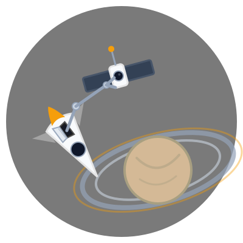

# Introduction

<figure markdown="span">
  { width="200" }
</figure>

Learn how to serve and deploy the model using
[:simple-bentoml: BentoML](../tools.md) and
[:simple-docker: Docker](../tools.md).

## Environment

This guide has been written with :simple-apple: macOS and :simple-linux: Linux
operating systems in mind. If you use :fontawesome-brands-windows: Windows, you
might encounter issues. Please use the
[Windows Subsystem for Linux](https://learn.microsoft.com/en-us/windows/wsl/)
(WSL 2) for optimal results.

For this part, you also need to have
[:simple-docker: Docker](https://www.docker.com/) installed. Docker will be
utilized for setting up and managing the container registry.

## Requirements

The following requirements are necessary to follow this part in addition to
those described in the
[first part](../part-1-local-training-and-evaluation/introduction.md#requirements):

- A [:simple-github: GitHub](https://github.com) account
- A [:simple-googlecloud: Google Cloud](https://cloud.google.com) account
- [:simple-docker: Docker](https://www.docker.com/) must be installed to set up
  and manage the container registry

??? info "Using different platforms? Read this!"

    While this guide uses GitHub and Google Cloud for examples, the core MLOps
    principles and architecture patterns apply to other platforms with some
    adjustments:

    - **Development platforms**: Works with on-premise solutions like
      [GitLab](https://about.gitlab.com/) (comprehensive built-in CI/CD system) and
      [Gitea](https://about.gitea.com/) (largely compatible with GitHub Actions
      syntax).
    - **Cloud providers**: Adaptable to other cloud platforms with appropriate
      service mappings.

!!! note

    **A credit card might be necessary to use cloud services.**

    Before proceeding with this section, please ensure that you have a valid payment
    method, as it may be required to utilize cloud services. It is important to note
    that at the conclusion of this section, you will need to
    [delete the cloud resources](../clean-up.md) that were created to avoid any
    potential charges.

    While the costs associated with this section are **expected to be free**, it is
    recommended to review the pricing details of cloud services before initiating
    this part.

## State of the MLOps process

With the experiment versioned and reproducible, the model is ready to be served
and deployed. In this part, you will address the following issues:

- [ ] Model may have required artifacts that are forgotten or omitted in
      saved/loaded state
- [ ] Model cannot be easily used from outside of the experiment context
- [ ] Model requires manual publication to the artifact registry
- [ ] Model is not accessible on the Internet and cannot be used anywhere
- [ ] Model requires manual deployment on the cluster
- [ ] Model cannot be trained on hardware other than the local machine
- [ ] Model cannot be trained on custom hardware for specific use-cases
