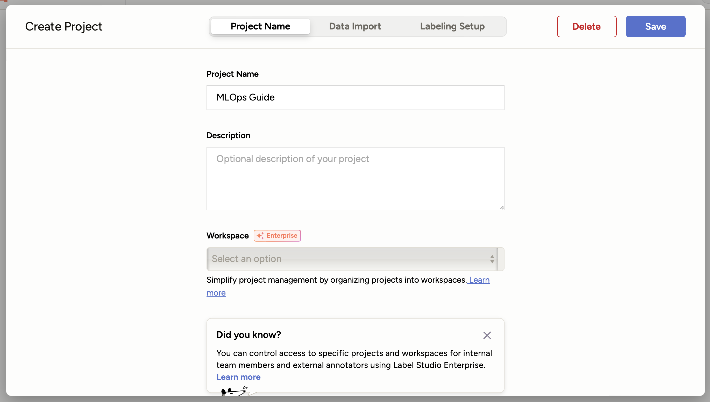
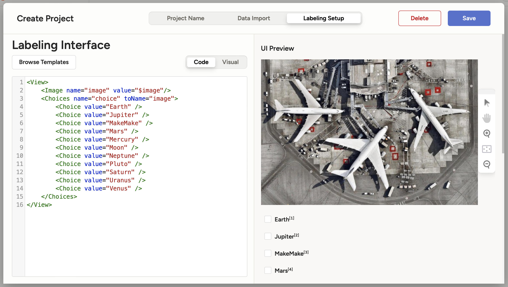

# Chapter 18 - Setup Label Studio

## Introduction

In the previous chapters, we have successfully deployed and accessed our model
on Kubernetes, set up continuous deployment with a CI/CD pipeline, and trained
the model on a Kubernetes pod. Now, we will focus on labeling new data to
further improve our model's performance.

[Label Studio](https://labelstud.io) is an open-source data labeling tool that
supports various data types, including text, images, audio, and video. In this
chapter, we will guide you through the process of setting up Label Studio in
your environment. This includes installing the necessary dependencies,
configuring the tool, and preparing it for data labeling tasks.

By the end of this chapter, you will have a fully functional Label Studio
instance ready to label new data, which will be used in subsequent chapters to
retrain and enhance your model.

## Steps

### Download the Data

Before configuring Label Studio, you will need to download additional data used
for labeling.

```sh title="Execute the following command(s) in a terminal"
# Download the archive containing the extra data
wget https://github.com/swiss-ai-center/a-guide-to-mlops/archive/refs/heads/extra-data.zip -O extra-data.zip
```

The downloaded archive must be decompressed and renamed:

```sh title="Execute the following command(s) in a terminal"
# Extract the dataset
unzip extra-data.zip

# Rename to the folder to `extra-data`
mv a-guide-to-mlops-extra-data/ extra-data/

# Remove the archive and the directory
rm extra-data.zip
```

Finally, add the `extra-data` folder to the `.gitignore` file:

```sh title="Execute the following command(s) in a terminal"
# Add the `extra-data` folder to the `.gitignore` file
echo "\n# Label Studio\nextra-data/" >> .gitignore
```

Check the differences with Git to validate the changes:

```sh title="Execute the following command(s) in a terminal"
# Show the differences with Git
git diff requirements.txt
```

The output should be similar to this:

```diff
diff --git a/.gitignore b/.gitignore
index dee3012..cbfa93b 100644
--- a/.gitignore
+++ b/.gitignore
@@ -11,6 +11,3 @@ dvc_plots
 
 # DVC will add new files after this line
 /model
-
-# Label Studio
-extra-data/
```

### Install Label Studio

Next, we will install Label Studio in our environment. Add the main
`label-studio` dependency to the `requirements.txt` file:

```txt title="requirements.txt" hl_lines="7"
tensorflow==2.17.0
matplotlib==3.9.2
pyyaml==6.0.2
dvc[gs]==3.53.2
bentoml==1.3.7
pillow==10.4.0
label-studio==1.13.1
```

Check the differences with Git to validate the changes:

```sh title="Execute the following command(s) in a terminal"
# Show the differences with Git
git diff requirements.txt
```

The output should be similar to this:

```diff
diff --git a/requirements.txt b/requirements.txt
index 4b8d3d9..d584cca 100644
--- a/requirements.txt
+++ b/requirements.txt
@@ -4,3 +4,4 @@ pyyaml==6.0.2
 dvc[gs]==3.53.2
 bentoml==1.3.7
 pillow==10.4.0
+label-studio==1.13.1
```

Install the package and update the freeze file.

!!! warning

    Prior to running any pip commands, it is crucial to ensure the virtual
    environment is activated to avoid potential conflicts with system-wide Python
    packages.

    To check its status, simply run `pip -V`. If the virtual environment is active,
    the output will show the path to the virtual environment's Python executable. If
    it is not, you can activate it with `source .venv/bin/activate`.

```sh title="Execute the following command(s) in a terminal"
# Install the dependencies
pip install --requirement requirements.txt

# Freeze the dependencies
pip freeze --local --all > requirements-freeze.txt
```

### Start Label Studio

You can now start label studio with the following command:

```sh title="Execute the following command(s) in a terminal"
label-studio start
```

Label Studio will start on <http://localhost:8080>. Open the URL in your browser
and sign up for an account.

### Create a New Project

Once you have signed up, you can create a new project in Label Studio:

1. Click `Create Project` to create a project.
2. Give your project a name (ex: `MLOps Guide`).

    

3. Select the `Data Import` tab and click on the `Upload File` button. Select
   all the images from the `extra-data/extra_data` folder you downloaded earlier.

    

4. Select the `Labeling Setup` tab and choose `Image Classification` under the
   `Computer Vision` menu.

    

5. Under `Labeling Interface` select `Code` and paste the following
   configuration:

    ```xml
    <View>
        <Image name="image" value="$image"/>
        <Choices name="choice" toName="image">
            <Choice value="Earth" />
            <Choice value="Jupiter" />
            <Choice value="MakeMake" />
            <Choice value="Mars" />
            <Choice value="Mercury" />
            <Choice value="Moon" />
            <Choice value="Neptune" />
            <Choice value="Pluto" />
            <Choice value="Saturn" />
            <Choice value="Uranus" />
            <Choice value="Venus" />
        </Choices>
    </View>
    ```

    Here we simply define the choices for the image classification task.

    !!! info

        You can read more about the Label Studio configuration in the
        [official documentation](https://labelstud.io/guide/setup).

    The configuration should look like this:

    

6. Click `Save` to create the project.

## Summary

Congratulations! You have successfully set up Label Studio in your environment.

You are now ready to start labeling your data!

## Sources

- [_Label Studio Documentation_](https://labelstud.io/guide/)
