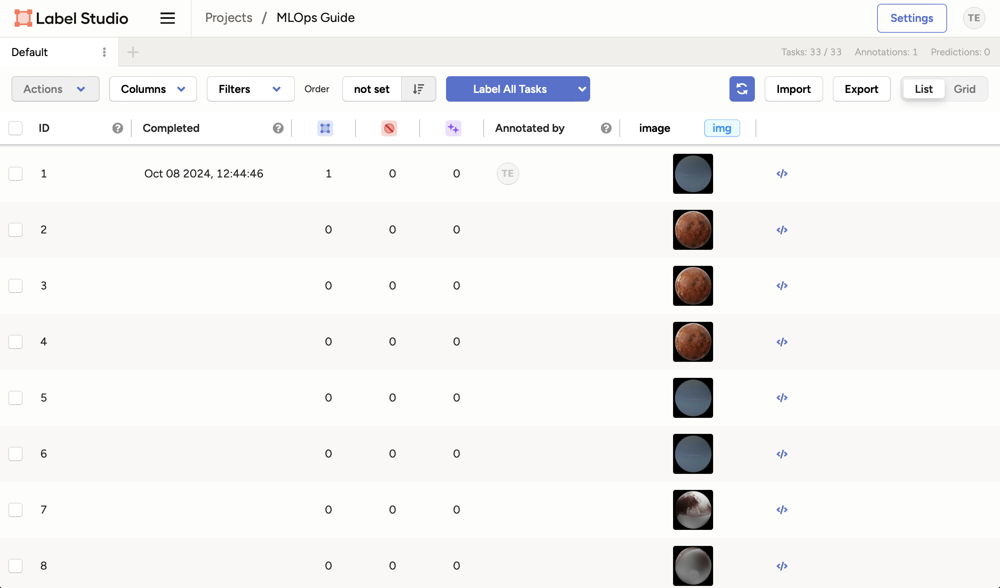

# Chapter 19 - Label new data with Label Studio

## Introduction

In this chapter, we will use Label Studio to label an image.

## Steps

### Start the Labeling Interface

Make sure Label Studio is running at <http://localhost:8080>.

Click on the `Label All Tasks` button to start labeling the images. The images
will be displayed one by one in sequential order.

### Label an Image

You will be presented with the image and the choices you defined earlier.

Next to each label, you will see a number or letter in brackets. This is the
keyboard shortcut for the label. You can use this to quickly label the image by
pressing the corresponding key on your keyboard.

1. Select the correct label for the image. In this case, the image is of the
   planet Uranus.
2. Click `Submit` to save the label.
3. The next image will be displayed for labeling. We will not be labeling more
   images, so you can go back to the project view by
   **clicking on your project name** on the top navigation bar.

### Project View

In the project view, you can see the progress of the labeling task.

Label Studio provides a lot of information such as the date and annotation
author. This allows to have multiple annotations for the same data, which is a
must for larger datasets as it helps to reduce bias.

You can also import additional data and export the labels. 

Currently, we have labeled one image but in the next chapter, we will learning
how to use the model we trained earlier to label the images automatically.

## Summary

That concludes this chapter. We have labeled new data using Label Studio.

## Souces

- [_Label Studio Labeling Guide_](https://labelstud.io/guide/labeling)
